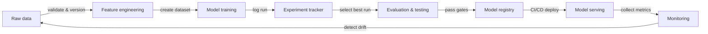

# MLOps

## Definición

MLOps — Machine Learning Operations — es la disciplina de aplicar los principios y prácticas de DevOps al ciclo de vida del aprendizaje automático. Proporciona las herramientas, los procesos y las normas culturales necesarias para desarrollar, desplegar y mantener modelos de ML de forma fiable en producción. Sin MLOps, los equipos frecuentemente entregan modelos que funcionan en notebooks pero que se degradan silenciosamente en producción, no pueden reproducirse seis meses después o tardan semanas en actualizarse.

Los principios fundamentales de MLOps son la **reproducibilidad** (cada experimento y despliegue puede recrearse exactamente), la **automatización** (los pipelines de datos, el entrenamiento, la evaluación y el despliegue se activan mediante código, no por pasos manuales), el **monitoreo** (el rendimiento del modelo se rastrea continuamente en producción) y la **colaboración** (los científicos de datos, los ingenieros de ML y los equipos de plataforma comparten herramientas, estándares y responsabilidades). Estos principios se corresponden directamente con los pilares de DevOps — integración continua, entrega y retroalimentación — aplicados a los datos y artefactos de modelos, no solo al código.

MLOps surgió cuando los equipos descubrieron que las prácticas de ingeniería de software que dominan la complejidad del software no se transfieren automáticamente al ML. El código es solo una entrada: las distribuciones de datos cambian, la precisión del modelo decae, los experimentos proliferan, y un modelo que funcionó bien en un conjunto de validación en enero puede comportarse de forma impredecible en julio. MLOps proporciona el andamiaje para detectar y responder a estos problemas de forma sistemática.

## Cómo funciona

### Gestión de datos

Los datos crudos se ingieren, validan, versionan y almacenan en un feature store o data lake. La validación de datos detecta la deriva del esquema y los cambios de distribución antes de que corrompan una ejecución de entrenamiento. El versionado garantiza que los modelos puedan reentrenarse con exactamente los datos que produjeron una versión anterior.

### Experimentación y entrenamiento

Los científicos de datos ejecutan experimentos — variando hiperparámetros, arquitecturas y conjuntos de características — y todas las ejecuciones se registran en un rastreador de experimentos. La mejor ejecución se promueve para una evaluación adicional. Los pipelines de entrenamiento automatizados (activados por nuevos datos o un commit de código) eliminan los pasos manuales y permiten el reentrenamiento continuo.

### Evaluación y validación

Los modelos candidatos se evalúan contra conjuntos de prueba retenidos, verificaciones de equidad y presupuestos de latencia antes de su promoción. Las compuertas de evaluación previenen que las regresiones lleguen a producción. Las pruebas A/B o los despliegues sombra pueden comparar modelos candidatos y de producción con tráfico real.

### Despliegue y serving

Los modelos aprobados se empaquetan, se registran en un registro de modelos y se despliegan mediante pipelines CI/CD en la infraestructura de serving. Los despliegues canary y los mecanismos de rollback reducen el riesgo. La infraestructura como código garantiza que los entornos de serving sean reproducibles.

### Monitoreo y retroalimentación

Las métricas de producción — distribuciones de predicciones, deriva de datos, latencia, tasas de error — se recopilan y retroalimentan al equipo. Las alertas activan pipelines de reentrenamiento o rollbacks de modelos. Los bucles de retroalimentación cierran el ciclo de vida del ML, convirtiendo las señales de producción en nuevos datos de entrenamiento.



## Cuándo usar / Cuándo NO usar

| Usar cuando | Evitar cuando |
|----------|------------|
| Los modelos se despliegan en producción y sirven a usuarios reales | El proyecto es un análisis puntual o un prototipo de investigación |
| Varios miembros del equipo colaboran en los mismos modelos | El equipo tiene menos de dos personas y un único modelo |
| Los modelos requieren reentrenamiento periódico cuando los datos derivan | El modelo es estático y nunca se actualizará |
| Los requisitos regulatorios o de auditoría exigen reproducibilidad | La velocidad de exploración es la única prioridad y no se planea ningún despliegue en producción |
| Se tiene más de un modelo en producción para gestionar | La sobrecarga de las herramientas supera la vida útil esperada del proyecto |

## Ejemplos de código

```python
# mlflow_quickstart.py
# Demonstrates basic MLflow experiment tracking for a simple classifier.
# Run: pip install mlflow scikit-learn

import mlflow
import mlflow.sklearn
from sklearn.datasets import load_iris
from sklearn.ensemble import RandomForestClassifier
from sklearn.model_selection import train_test_split
from sklearn.metrics import accuracy_score, f1_score

# Load data
X, y = load_iris(return_X_y=True)
X_train, X_test, y_train, y_test = train_test_split(
    X, y, test_size=0.2, random_state=42
)

# Define hyperparameters to log
params = {
    "n_estimators": 100,
    "max_depth": 5,
    "random_state": 42,
}

# Start an MLflow experiment run
mlflow.set_experiment("iris-classification")

with mlflow.start_run(run_name="random-forest-baseline"):
    # Log hyperparameters
    mlflow.log_params(params)

    # Train the model
    clf = RandomForestClassifier(**params)
    clf.fit(X_train, y_train)

    # Evaluate
    y_pred = clf.predict(X_test)
    accuracy = accuracy_score(y_test, y_pred)
    f1 = f1_score(y_test, y_pred, average="weighted")

    # Log metrics
    mlflow.log_metric("accuracy", accuracy)
    mlflow.log_metric("f1_score", f1)

    # Log the trained model with a registered name
    mlflow.sklearn.log_model(
        clf,
        artifact_path="model",
        registered_model_name="iris-random-forest",
    )

    print(f"Accuracy: {accuracy:.4f} | F1: {f1:.4f}")
    print(f"Run ID: {mlflow.active_run().info.run_id}")
```

## Recursos prácticos

- [Google – Practitioners Guide to MLOps](https://services.google.com/fh/files/misc/practitioners_guide_to_mlops_whitepaper.pdf) — Documento técnico completo que cubre los niveles de madurez de MLOps, las elecciones de herramientas y los patrones organizativos de Google Cloud.
- [MLflow Documentation](https://mlflow.org/docs/latest/index.html) — Documentación oficial de la plataforma MLOps de código abierto más adoptada, que cubre tracking, registry, proyectos y despliegue.
- [Made With ML – MLOps Course](https://madewithml.com/) — Curso de MLOps gratuito y basado en proyectos que recorre todo el ciclo de vida con código real.
- [Chip Huyen – Designing Machine Learning Systems](https://www.oreilly.com/library/view/designing-machine-learning/9781098107956/) — Libro de O'Reilly que cubre el diseño de sistemas de ML en producción, pipelines de datos, feature stores y monitoreo.
- [CD Foundation – MLOps SIG](https://github.com/cdfoundation/sig-mlops) — Definiciones impulsadas por la comunidad, panorama y mejores prácticas para MLOps.

## Ver también

- [Experiment tracking](/docs/mlops/experiment-tracking)
- [MLflow](/docs/mlops/mlflow)
- [Weights & Biases](/docs/mlops/wandb)
- [Feature stores](/docs/mlops/feature-stores)
