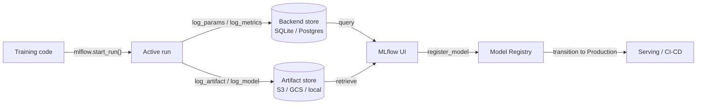

# MLflow

## Definición

MLflow es una plataforma de código abierto diseñada para gestionar el ciclo de vida completo del aprendizaje automático. Lanzada originalmente por Databricks en 2018, se ha convertido en una de las herramientas MLOps más ampliamente adoptadas gracias a su simplicidad, independencia de framework y al hecho de que puede ejecutarse completamente on-premise sin ninguna dependencia de la nube. Un simple `pip install mlflow` y un cambio de dos líneas de código es suficiente para comenzar a rastrear experimentos.

MLflow organiza su funcionalidad en cuatro componentes estrechamente integrados. **Tracking** registra parámetros, métricas y artefactos para cada ejecución de entrenamiento. **Projects** empaqueta código ML en unidades reproducibles y ejecutables definidas por un archivo `MLproject`. **Models** proporciona un formato estándar para empaquetar modelos que pueden ser servidos por cualquier destino de despliegue compatible. **Model Registry** proporciona un almacén de modelos centralizado con gestión del ciclo de vida (estados de Staging, Production, Archived) e historial de versiones. Juntos, estos componentes cubren el camino desde el experimento bruto hasta el despliegue en producción.

MLflow puede ejecutarse localmente (backend SQLite, artefactos en sistema de archivos local), en un servidor autogestionado (PostgreSQL + S3) o como servicio completamente administrado a través de Databricks Managed MLflow. El núcleo de código abierto tiene licencia Apache 2.0, lo que lo hace adecuado para industrias reguladas donde los datos no pueden salir de la infraestructura propia.

## Cómo funciona

### Servidor de tracking

Cuando se llama a `mlflow.start_run()`, el cliente abre una ejecución en el servidor de tracking y comienza a almacenar logs en búfer. Los parámetros (`log_param`, `log_params`) y las métricas (`log_metric`, `log_metrics`) se escriben en el almacén backend (SQLite o PostgreSQL). Los artefactos se cargan en el almacén de artefactos (sistema de archivos local, S3, GCS, Azure Blob, HDFS). El servidor expone una API REST consumida por el SDK del cliente y la interfaz web.

### MLflow Projects

Un proyecto es un directorio (o repositorio git) con un archivo YAML `MLproject` que declara los puntos de entrada, parámetros y el entorno conda/pip. Ejecutar `mlflow run . -P lr=0.01` resuelve el entorno, establece los parámetros y lanza el punto de entrada — produciendo automáticamente una ejecución rastreada. Esto hace que los experimentos sean reproducibles para cualquiera con acceso al repositorio.

### MLflow Models

Un modelo guardado con `mlflow.<flavor>.log_model()` se almacena en el formato MLmodel: un directorio que contiene el modelo serializado, un descriptor YAML `MLmodel` y un `conda.yaml` / `requirements.txt`. El sabor `pyfunc` proporciona una interfaz uniforme `model.predict(data)` independientemente del framework subyacente, lo que permite que el mismo modelo sea cargado por diferentes backends de serving.

### Model Registry

El registro almacena versiones de modelos con nombre y estados de transición. Los sistemas CI/CD automatizados consultan el registro para obtener la última versión de `Production` para desplegar. Los aprobadores humanos o los trabajos de validación automatizados hacen transitar las versiones entre estados. Cada versión enlaza de vuelta a su ejecución de origen, preservando la procedencia completa.



## Cuándo usar / Cuándo NO usar

| Usar cuando | Evitar cuando |
|----------|------------|
| Se necesita una plataforma MLOps completamente autoalojada y de código abierto | El equipo necesita funciones colaborativas enriquecidas (informes compartidos, notificaciones de Slack) de forma nativa |
| Los datos no pueden salir de la infraestructura propia (industrias reguladas) | Se prefiere un producto SaaS sin infraestructura que gestionar |
| Ya se usa Databricks y se desea integración nativa | El flujo de trabajo es solo de notebooks sin despliegue en producción planeado |
| La independencia del framework es importante (sklearn, XGBoost, PyTorch, TF, etc.) | Se necesita optimización avanzada de hiperparámetros incorporada |
| El control de costos es crítico y se requiere licencia de código abierto | El equipo carece del ancho de banda de ingeniería para gestionar un servidor y almacén de artefactos |

## Comparaciones

| Criterio | MLflow | Weights & Biases (W&B) |
|-----------|--------|------------------------|
| Facilidad de configuración | Autoalojable con un comando; no se requiere cuenta | SaaS; se requiere cuenta gratuita; sin infraestructura que gestionar |
| Calidad de la UI | Limpia pero básica; enfocada en métricas tabulares y comparación de ejecuciones | Muy pulida; excelente registro de medios, gráficos personalizados, informes |
| Colaboración | Se requiere servidor compartido; sin RBAC integrado en OSS | Espacios de trabajo de equipo integrados, enlaces de compartición y acceso basado en roles |
| Precio | Gratuito y de código abierto; Databricks Managed MLflow tiene costo adicional | Gratuito para individuos; planes de pago para equipos |
| Optimización de hiperparámetros | Se integra con Optuna, Ray Tune externamente | Sweeps integrados con búsqueda Bayesiana/grid/aleatoria |

## Ejemplos de código

```python
# mlflow_full_example.py
# Full MLflow tracking example: logs params, metrics, a custom artifact,
# and registers the model in the Model Registry.
# pip install mlflow scikit-learn matplotlib

import mlflow
import mlflow.sklearn
import matplotlib.pyplot as plt
import numpy as np
from sklearn.ensemble import GradientBoostingClassifier
from sklearn.datasets import load_breast_cancer
from sklearn.model_selection import train_test_split, cross_val_score
from sklearn.metrics import (
    accuracy_score, roc_auc_score, classification_report
)
import os, tempfile, json

# ── 1. Data ──────────────────────────────────────────────────────────────────
X, y = load_breast_cancer(return_X_y=True)
X_train, X_test, y_train, y_test = train_test_split(
    X, y, test_size=0.2, stratify=y, random_state=0
)

# ── 2. Hyperparameters ────────────────────────────────────────────────────────
params = {
    "n_estimators": 200,
    "learning_rate": 0.05,
    "max_depth": 4,
    "subsample": 0.8,
    "random_state": 0,
}

# ── 3. MLflow run ─────────────────────────────────────────────────────────────
mlflow.set_experiment("breast-cancer-gbt")

with mlflow.start_run(run_name="gbt-tuned") as run:

    mlflow.log_params(params)

    clf = GradientBoostingClassifier(**params)
    clf.fit(X_train, y_train)

    y_pred = clf.predict(X_test)
    y_prob = clf.predict_proba(X_test)[:, 1]
    cv_scores = cross_val_score(clf, X_train, y_train, cv=5, scoring="roc_auc")

    metrics = {
        "accuracy": accuracy_score(y_test, y_pred),
        "roc_auc": roc_auc_score(y_test, y_prob),
        "cv_roc_auc_mean": cv_scores.mean(),
        "cv_roc_auc_std": cv_scores.std(),
    }
    mlflow.log_metrics(metrics)

    with tempfile.TemporaryDirectory() as tmp:
        fig, ax = plt.subplots(figsize=(8, 5))
        feat_imp = clf.feature_importances_
        top_idx = np.argsort(feat_imp)[-10:]
        ax.barh(range(10), feat_imp[top_idx])
        ax.set_title("Top 10 feature importances")
        fig.tight_layout()
        plot_path = os.path.join(tmp, "feature_importance.png")
        fig.savefig(plot_path)
        plt.close(fig)
        mlflow.log_artifact(plot_path, artifact_path="plots")

        report = classification_report(y_test, y_pred, output_dict=True)
        report_path = os.path.join(tmp, "classification_report.json")
        with open(report_path, "w") as f:
            json.dump(report, f, indent=2)
        mlflow.log_artifact(report_path, artifact_path="evaluation")

    mlflow.sklearn.log_model(
        clf,
        artifact_path="model",
        registered_model_name="breast-cancer-gbt",
    )

    print(f"Run ID  : {run.info.run_id}")
    for k, v in metrics.items():
        print(f"  {k}: {v:.4f}")
```

## Recursos prácticos

- [MLflow Official Documentation](https://mlflow.org/docs/latest/index.html) — Referencia completa de los cuatro componentes, la API REST y los destinos de despliegue.
- [MLflow GitHub Repository](https://github.com/mlflow/mlflow) — Código fuente, rastreador de incidencias y ejemplos; útil para entender los internos y contribuir.
- [Databricks – MLflow Tutorials](https://docs.databricks.com/en/mlflow/index.html) — Uso de MLflow en producción en Databricks con integración de Unity Catalog.
- [Towards Data Science – MLflow in Production](https://towardsdatascience.com/deploy-mlflow-with-docker-compose-8059f16b6039) — Tutorial comunitario para desplegar un servidor MLflow autoalojado con Docker Compose, PostgreSQL y MinIO.

## Ver también

- [Experiment tracking](/docs/mlops/experiment-tracking)
- [Weights & Biases](/docs/mlops/wandb)
- [MLOps](/docs/mlops)
