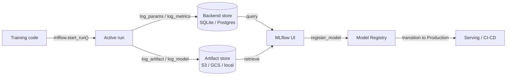

# MLflow

## Definición

MLflow es una plataforma de código abierto diseñada para gestionar el ciclo de vida de extremo a extremo del aprendizaje automático. Originalmente lanzada por Databricks en 2018, se ha convertido en una de las herramientas de MLOps más adoptadas debido a su simplicidad, agnóstica respecto al framework y al hecho de que puede ejecutarse completamente on-premise sin ninguna dependencia de la nube. Un solo `pip install mlflow` y un cambio de dos líneas de código es suficiente para comenzar a rastrear experimentos.

MLflow organiza la funcionalidad en cuatro componentes estrechamente integrados. **Tracking** registra parámetros, métricas y artefactos para cada ejecución de entrenamiento. **Projects** empaqueta el código de ML en unidades reproducibles y ejecutables definidas por un archivo `MLproject`. **Models** proporciona un formato estándar para empaquetar modelos que pueden ser servidos por cualquier destino de despliegue compatible. **Model Registry** proporciona un almacén de modelos centralizado con gestión del ciclo de vida (estados Staging, Production, Archived) e historial de versiones. Juntos, estos componentes cubren el recorrido desde el experimento bruto hasta el despliegue en producción.

MLflow puede ejecutarse localmente (backend SQLite, artefactos en sistema de archivos local), en un servidor auto-gestionado (PostgreSQL + S3), o como un servicio completamente gestionado vía Databricks Managed MLflow. El núcleo de código abierto tiene licencia Apache 2.0, lo que lo hace adecuado para industrias reguladas donde los datos no pueden salir de la infraestructura on-premise.

## Cómo funciona

### Servidor de tracking

Cuando llamas a `mlflow.start_run()`, el cliente abre una ejecución en el servidor de tracking y comienza a almacenar logs en buffer. Los parámetros (`log_param`, `log_params`) y las métricas (`log_metric`, `log_metrics`) se escriben en el almacén backend (SQLite o PostgreSQL). Los artefactos se cargan en el almacén de artefactos (sistema de archivos local, S3, GCS, Azure Blob, HDFS). El servidor expone una API REST consumida por el SDK del cliente y la interfaz web.

### MLflow Projects

Un proyecto es un directorio (o repositorio git) con un archivo YAML `MLproject` que declara los puntos de entrada, parámetros y entorno conda/pip. Ejecutar `mlflow run . -P lr=0.01` resuelve el entorno, establece parámetros y lanza el punto de entrada — produciendo automáticamente una ejecución rastreada. Esto hace que los experimentos sean reproducibles por cualquier persona con acceso al repositorio.

### MLflow Models

Un modelo guardado con `mlflow.<flavor>.log_model()` se almacena en el formato MLmodel: un directorio que contiene el modelo serializado, un descriptor YAML `MLmodel` y un `conda.yaml` / `requirements.txt`. El sabor `pyfunc` proporciona una interfaz uniforme `model.predict(data)` independientemente del framework subyacente, lo que permite que el mismo modelo sea cargado por diferentes backends de servicio.

### Model Registry

El registro almacena versiones de modelos con nombre y estados de transición. Los sistemas de CI/CD automatizados consultan el registro para conocer la última versión en `Production` a desplegar. Los aprobadores humanos o los trabajos de validación automatizados hacen la transición de versiones entre estados. Cada versión se vincula de nuevo a su ejecución de origen, preservando la procedencia completa.



## Cuándo usar / Cuándo NO usar

| Usar cuando | Evitar cuando |
|----------|------------|
| Necesitas una plataforma MLOps completamente auto-hospedada y de código abierto | Tu equipo necesita características colaborativas ricas (informes compartidos, notificaciones de Slack) listas para usar |
| Los datos no pueden salir de tu infraestructura (industrias reguladas) | Prefieres un producto SaaS sin infraestructura que gestionar |
| Ya usas Databricks y quieres integración nativa | Tu flujo de trabajo es solo de notebooks sin despliegue en producción planificado |
| El agnósticismo del framework es importante (sklearn, XGBoost, PyTorch, TF, etc.) | Necesitas optimización avanzada de sweeps/hiperparámetros integrada |
| El control de costos es crítico; se requiere licencia de código abierto | Tu equipo carece del ancho de banda de ingeniería para gestionar un servidor y un almacén de artefactos |

## Comparaciones

| Criterio | MLflow | Weights & Biases (W&B) |
|-----------|--------|------------------------|
| Facilidad de configuración | Auto-hospedable con un comando; no requiere cuenta | SaaS; requiere cuenta gratuita; sin infraestructura que gestionar |
| Calidad de la interfaz | Limpia pero básica; centrada en métricas tabulares y comparación de ejecuciones | Muy pulida; excelente registro de medios, gráficos personalizados, informes |
| Colaboración | Requiere servidor compartido; sin RBAC integrado en OSS | Espacios de trabajo en equipo integrados, enlaces de compartición y acceso basado en roles |
| Precio | Gratuito y de código abierto; Databricks Managed MLflow cuesta extra | Gratis para individuos; planes de pago para equipos |
| Optimización de hiperparámetros | Se integra externamente con Optuna, Ray Tune | Sweeps integrados con búsqueda Bayesiana/cuadrícula/aleatoria |

## Ejemplos de código

```python
# mlflow_full_example.py
# Full MLflow tracking example: logs params, metrics, a custom artifact,
# and registers the model in the Model Registry.
# pip install mlflow scikit-learn matplotlib

import mlflow
import mlflow.sklearn
import matplotlib.pyplot as plt
import numpy as np
from sklearn.ensemble import GradientBoostingClassifier
from sklearn.datasets import load_breast_cancer
from sklearn.model_selection import train_test_split, cross_val_score
from sklearn.metrics import (
    accuracy_score, roc_auc_score, classification_report
)
import os, tempfile, json

# ── 1. Data ──────────────────────────────────────────────────────────────────
X, y = load_breast_cancer(return_X_y=True)
X_train, X_test, y_train, y_test = train_test_split(
    X, y, test_size=0.2, stratify=y, random_state=0
)

# ── 2. Hyperparameters ────────────────────────────────────────────────────────
params = {
    "n_estimators": 200,
    "learning_rate": 0.05,
    "max_depth": 4,
    "subsample": 0.8,
    "random_state": 0,
}

# ── 3. MLflow run ─────────────────────────────────────────────────────────────
mlflow.set_experiment("breast-cancer-gbt")

with mlflow.start_run(run_name="gbt-tuned") as run:

    # Log hyperparameters
    mlflow.log_params(params)

    # Train
    clf = GradientBoostingClassifier(**params)
    clf.fit(X_train, y_train)

    # Evaluate
    y_pred = clf.predict(X_test)
    y_prob = clf.predict_proba(X_test)[:, 1]
    cv_scores = cross_val_score(clf, X_train, y_train, cv=5, scoring="roc_auc")

    metrics = {
        "accuracy": accuracy_score(y_test, y_pred),
        "roc_auc": roc_auc_score(y_test, y_prob),
        "cv_roc_auc_mean": cv_scores.mean(),
        "cv_roc_auc_std": cv_scores.std(),
    }
    mlflow.log_metrics(metrics)

    # Log a feature importance plot as an artifact
    with tempfile.TemporaryDirectory() as tmp:
        fig, ax = plt.subplots(figsize=(8, 5))
        feat_imp = clf.feature_importances_
        top_idx = np.argsort(feat_imp)[-10:]
        ax.barh(range(10), feat_imp[top_idx])
        ax.set_title("Top 10 feature importances")
        fig.tight_layout()
        plot_path = os.path.join(tmp, "feature_importance.png")
        fig.savefig(plot_path)
        plt.close(fig)
        mlflow.log_artifact(plot_path, artifact_path="plots")

        # Log classification report as JSON
        report = classification_report(y_test, y_pred, output_dict=True)
        report_path = os.path.join(tmp, "classification_report.json")
        with open(report_path, "w") as f:
            json.dump(report, f, indent=2)
        mlflow.log_artifact(report_path, artifact_path="evaluation")

    # Log and register the model
    mlflow.sklearn.log_model(
        clf,
        artifact_path="model",
        registered_model_name="breast-cancer-gbt",  # creates registry entry
    )

    print(f"Run ID  : {run.info.run_id}")
    for k, v in metrics.items():
        print(f"  {k}: {v:.4f}")

# ── 4. Load a registered model (simulates downstream serving) ─────────────────
# model_uri = "models:/breast-cancer-gbt/1"
# loaded = mlflow.sklearn.load_model(model_uri)
# print(loaded.predict(X_test[:3]))
```

## Recursos prácticos

- [Documentación oficial de MLflow](https://mlflow.org/docs/latest/index.html) — Referencia completa que cubre los cuatro componentes, la API REST y los destinos de despliegue.
- [Repositorio de MLflow en GitHub](https://github.com/mlflow/mlflow) — Código fuente, rastreador de problemas y ejemplos; útil para entender los internos y contribuir.
- [Databricks – Tutoriales de MLflow](https://docs.databricks.com/en/mlflow/index.html) — Uso de MLflow de grado producción en Databricks con integración de Unity Catalog.
- [Towards Data Science – MLflow en producción](https://towardsdatascience.com/deploy-mlflow-with-docker-compose-8059f16b6039) — Tutorial comunitario para desplegar un servidor MLflow auto-hospedado con Docker Compose, PostgreSQL y MinIO.

## Ver también

- [Seguimiento de experimentos](/docs/mlops/experiment-tracking)
- [Weights & Biases](/docs/mlops/wandb)
- [MLOps](/docs/mlops)
