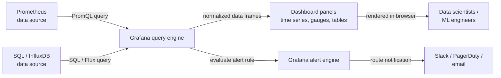

# Grafana

## Definición

Grafana es una plataforma de análisis y visualización interactiva de código abierto que se conecta a una amplia gama de fuentes de datos — [Prometheus](/docs/mlops/monitoring/prometheus), InfluxDB, Elasticsearch, Loki, PostgreSQL, APIs de monitoreo nativas de la nube y docenas más — y representa los datos como dashboards interactivos y compartibles. No proporciona almacenamiento propio; es puramente una capa de consulta y visualización que se sitúa delante de la infraestructura de datos existente. Este diseño hace que Grafana sea complementario a todos los sistemas de almacenamiento de series temporales o logs en lugar de reemplazar alguno de ellos.

En contextos de ML y MLOps, Grafana sirve como interfaz de observabilidad unificada. Los científicos de datos y los ingenieros de ML la usan para rastrear métricas de rendimiento del modelo (precisión, F1, AUC) a medida que cambian con el tiempo, visualizar la latencia de predicción y el rendimiento junto con el uso de recursos de infraestructura, y monitorear señales de calidad de datos como puntuaciones de deriva de características. Dado que Grafana admite múltiples fuentes de datos simultáneamente, un único dashboard puede combinar métricas de Prometheus, logs de aplicaciones de Loki y KPIs de negocio de una base de datos SQL — ofreciendo una vista completa y contextualizada del comportamiento de un modelo en producción.

Grafana está disponible como distribución de código abierto auto-hospedada, como Grafana Cloud (una oferta SaaS gestionada) y como Grafana Enterprise con características empresariales adicionales. La distribución de código abierto es completamente funcional y es la elección más común para los equipos que ya operan Kubernetes o tienen flujos de trabajo de infraestructura como código, ya que los dashboards de Grafana, las configuraciones de fuentes de datos y las reglas de alertas pueden gestionarse como JSON o a través de proveedores de Terraform.

## Cómo funciona

### Configuración de fuentes de datos

Grafana se conecta a las fuentes de datos a través de plugins. Un plugin de fuente de datos traduce el modelo de consulta interno de Grafana al lenguaje de consulta nativo del backend (PromQL para Prometheus, SQL para bases de datos relacionales, Lucene para Elasticsearch, etc.) y devuelve datos en un formato normalizado. Las fuentes de datos se configuran en la interfaz de usuario de Grafana o a través de archivos de aprovisionamiento (YAML), lo que permite gestionar las configuraciones como código en un repositorio Git. La autenticación, TLS y los ajustes de tiempo de espera son configurables por fuente de datos.

### Composición de dashboards y paneles

Un dashboard de Grafana es un documento JSON que contiene una lista ordenada de paneles. Cada panel define una consulta contra una fuente de datos, un tipo de visualización (serie temporal, gauge, gráfico de barras, tabla, mapa de calor, stat, etc.) y opciones de visualización (ejes, umbrales, leyendas, anulaciones). Los paneles pueden vincularse a otros dashboards, admiten variables (las variables de plantilla permiten que un único dashboard cambie entre entornos, versiones de modelos o servicios mediante un menú desplegable) y pueden hacer referencia a anotaciones — eventos superpuestos en gráficos de series temporales para marcar despliegues, ejecuciones de reentrenamiento o inicios de incidentes.

### Variables y plantillas

Las variables de plantilla transforman un dashboard estático en uno dinámico. Una variable consulta la fuente de datos para obtener una lista de valores (p. ej., todos los valores de etiqueta `model_version` distintos de Prometheus) e inserta el valor seleccionado en cada consulta de panel del dashboard. Esto hace posible construir un único dashboard de modelo de ML que funcione para todos los modelos y versiones en lugar de mantener un dashboard por modelo.

### Alertas

Las alertas de Grafana (introducidas en Grafana 8+) proporcionan reglas de alerta unificadas con múltiples fuentes de datos que evalúan las consultas de panel en un programa y enrutan las alertas disparadas a puntos de contacto (Slack, PagerDuty, correo electrónico, webhooks). Las reglas de alerta se agrupan en políticas de notificación que determinan el comportamiento de enrutamiento, agrupamiento y silenciamiento. Las alertas de Grafana pueden coexistir con el Alertmanager de Prometheus o reemplazarlo completamente, según la preferencia del equipo.

### Aprovisionamiento e infraestructura como código

Grafana admite el aprovisionamiento declarativo de fuentes de datos, dashboards y reglas de alerta a través de archivos YAML y JSON cargados al inicio. Combinado con el proveedor de Terraform de Grafana, toda la configuración de Grafana puede versionarse y desplegarse a través de pipelines de CI/CD — una capacidad crítica para los equipos que gestionan múltiples entornos o quieren una infraestructura de monitoreo reproducible.



## Cuándo usar / Cuándo NO usar

| Usar cuando | Evitar cuando |
|----------|------------|
| Se necesitan dashboards interactivos y compartibles sobre Prometheus u otros datos de series temporales | Se necesita una interfaz completa de seguimiento de experimentos de ML (usar MLflow o W&B en su lugar) |
| Se quiere correlacionar métricas de infraestructura con el rendimiento del modelo en una vista | El equipo no tiene ninguna fuente de datos de series temporales existente a la que conectar Grafana |
| Se tienen múltiples fuentes de datos (Prometheus, SQL, Loki) para unificar en un dashboard | Un resumen simple de texto o tabular es suficiente y un dashboard no añade valor |
| Se quieren gestionar los dashboards como código vía JSON o Terraform | La organización ya está estandarizada en una plataforma de observabilidad propietaria |
| Se necesitan alertas que abarquen múltiples fuentes de datos | Se necesita almacenar o analizar logs de predicción brutos (Grafana consulta, no almacena) |

## Comparaciones

Grafana y Prometheus son complementarios — Prometheus recopila y almacena métricas; Grafana las visualiza. La tabla a continuación los compara para aclarar sus roles distintos.

| Criterio | Grafana | Prometheus |
|-----------|---------|-----------|
| Rol principal | Visualización y creación de dashboards | Recopilación, almacenamiento y alertas de métricas |
| Almacenamiento de datos | Ninguno — consulta backends externos | TSDB local (scraping basado en pull) |
| Lenguaje de consulta | Depende de la fuente de datos (PromQL, SQL, etc.) | PromQL |
| Alertas | Alertas unificadas con múltiples fuentes de datos (Grafana 8+) | Reglas basadas en PromQL + Alertmanager |
| Fuentes de datos | Más de 50 plugins (Prometheus, SQL, Loki, nube, etc.) | Solo propio (TSDB) |
| Cuándo usar juntos | Siempre — Grafana es la interfaz para los datos de Prometheus | Siempre — Prometheus es el backend para los dashboards de Grafana |

## Ventajas y desventajas

| Aspecto | Ventajas | Desventajas |
|--------|------|------|
| Múltiples fuentes de datos | Unifica métricas, logs y SQL en un dashboard | La complejidad de configuración crece con el número de fuentes de datos |
| Dashboard como código | La exportación JSON y el proveedor de Terraform habilitan flujos de trabajo GitOps | Los dashboards JSON son verbosos y difíciles de comparar manualmente |
| Variables de plantilla | Un dashboard cubre todos los modelos, entornos y versiones | Las consultas de variables añaden latencia al cargar el dashboard |
| Biblioteca de visualización | Tipos de paneles ricos y personalizables | Algunos tipos de gráficos avanzados requieren plugins o Grafana Enterprise |
| Alertas | Reglas de alerta unificadas con múltiples fuentes de datos | Curva de aprendizaje para las políticas de notificación y los árboles de enrutamiento |
| Opción auto-hospedada | Control total, ningún dato sale de su infraestructura | Requiere esfuerzo operativo: actualizaciones, copias de seguridad, gestión de plugins |

## Ejemplos de código

```json
// grafana_ml_dashboard.json
// Grafana dashboard definition for monitoring an ML model serving endpoint.
// Import this JSON via Grafana UI: Dashboards → Import → Upload JSON file.
// Prerequisites: Prometheus data source named "Prometheus" with ml_* metrics.
{
  "title": "ML Model Monitoring",
  "description": "Dashboard for monitoring ML model latency, throughput, confidence distribution, and data drift.",
  "uid": "ml-model-monitoring-v1",
  "schemaVersion": 36,
  "version": 1,
  "refresh": "30s",
  "time": { "from": "now-3h", "to": "now" },
  "templating": {
    "list": [
      {
        "name": "model_name",
        "label": "Model",
        "type": "query",
        "datasource": { "type": "prometheus", "uid": "Prometheus" },
        "query": "label_values(ml_predictions_total, model_name)",
        "includeAll": false,
        "multi": false,
        "current": {}
      },
      {
        "name": "model_version",
        "label": "Version",
        "type": "query",
        "datasource": { "type": "prometheus", "uid": "Prometheus" },
        "query": "label_values(ml_predictions_total{model_name=\"$model_name\"}, model_version)",
        "includeAll": true,
        "multi": true,
        "current": {}
      }
    ]
  },
  "panels": [
    {
      "id": 1,
      "title": "Prediction Throughput (req/s)",
      "type": "timeseries",
      "gridPos": { "x": 0, "y": 0, "w": 12, "h": 8 },
      "datasource": { "type": "prometheus", "uid": "Prometheus" },
      "targets": [
        {
          "expr": "sum(rate(ml_predictions_total{model_name=\"$model_name\", status=\"success\"}[2m])) by (model_version)",
          "legendFormat": "{{model_version}} — success",
          "refId": "A"
        },
        {
          "expr": "sum(rate(ml_predictions_total{model_name=\"$model_name\", status=\"error\"}[2m])) by (model_version)",
          "legendFormat": "{{model_version}} — error",
          "refId": "B"
        }
      ],
      "fieldConfig": {
        "defaults": {
          "unit": "reqps",
          "custom": { "lineWidth": 2, "fillOpacity": 10 }
        }
      }
    },
    {
      "id": 2,
      "title": "P50 / P95 / P99 Prediction Latency",
      "type": "timeseries",
      "gridPos": { "x": 12, "y": 0, "w": 12, "h": 8 },
      "datasource": { "type": "prometheus", "uid": "Prometheus" },
      "targets": [
        {
          "expr": "histogram_quantile(0.50, sum(rate(ml_prediction_latency_seconds_bucket{model_name=\"$model_name\"}[2m])) by (le, model_version))",
          "legendFormat": "p50 {{model_version}}",
          "refId": "A"
        },
        {
          "expr": "histogram_quantile(0.95, sum(rate(ml_prediction_latency_seconds_bucket{model_name=\"$model_name\"}[2m])) by (le, model_version))",
          "legendFormat": "p95 {{model_version}}",
          "refId": "B"
        },
        {
          "expr": "histogram_quantile(0.99, sum(rate(ml_prediction_latency_seconds_bucket{model_name=\"$model_name\"}[2m])) by (le, model_version))",
          "legendFormat": "p99 {{model_version}}",
          "refId": "C"
        }
      ],
      "fieldConfig": {
        "defaults": {
          "unit": "s",
          "thresholds": {
            "mode": "absolute",
            "steps": [
              { "color": "green", "value": null },
              { "color": "yellow", "value": 0.1 },
              { "color": "red", "value": 0.5 }
            ]
          }
        }
      }
    },
    {
      "id": 3,
      "title": "Data Drift Score",
      "type": "gauge",
      "gridPos": { "x": 0, "y": 8, "w": 8, "h": 6 },
      "datasource": { "type": "prometheus", "uid": "Prometheus" },
      "targets": [
        {
          "expr": "ml_data_drift_score{model_name=\"$model_name\"}",
          "legendFormat": "{{feature_set}}",
          "refId": "A"
        }
      ],
      "fieldConfig": {
        "defaults": {
          "unit": "none",
          "min": 0,
          "max": 1,
          "thresholds": {
            "mode": "absolute",
            "steps": [
              { "color": "green", "value": null },
              { "color": "yellow", "value": 0.1 },
              { "color": "red", "value": 0.25 }
            ]
          }
        }
      }
    },
    {
      "id": 4,
      "title": "Prediction Confidence Distribution (heatmap)",
      "type": "heatmap",
      "gridPos": { "x": 8, "y": 8, "w": 16, "h": 6 },
      "datasource": { "type": "prometheus", "uid": "Prometheus" },
      "targets": [
        {
          "expr": "sum(rate(ml_prediction_confidence_bucket{model_name=\"$model_name\"}[5m])) by (le)",
          "legendFormat": "{{le}}",
          "refId": "A",
          "format": "heatmap"
        }
      ]
    }
  ]
}
```

## Recursos prácticos

- [Documentación de Grafana](https://grafana.com/docs/grafana/latest/) — Documentación oficial que cubre instalación, fuentes de datos, dashboards, alertas y aprovisionamiento.
- [Mejores prácticas de dashboards de Grafana](https://grafana.com/docs/grafana/latest/dashboards/build-dashboards/best-practices/) — Guía oficial sobre cómo estructurar dashboards efectivos, usar variables de plantilla y organizar paneles.
- [Proveedor de Terraform de Grafana](https://registry.terraform.io/providers/grafana/grafana/latest/docs) — Gestionar fuentes de datos, dashboards y reglas de alerta de Grafana como infraestructura como código.
- [Awesome Grafana](https://github.com/monitoringartist/grafana-aws-cloudwatch-dashboards) — Colección curada por la comunidad de dashboards de Grafana prefabricados para stacks de infraestructura comunes.
- [Blog de Grafana Labs — Observabilidad de ML](https://grafana.com/blog/2021/08/09/how-to-monitor-machine-learning-models-with-grafana/) — Guía práctica para configurar dashboards de monitoreo de modelos de ML con Grafana y Prometheus.

## Ver también

- [Prometheus](/docs/mlops/monitoring/prometheus)
- [Monitoreo de ML](/docs/mlops/monitoring)
- [MLOps](/docs/mlops)
