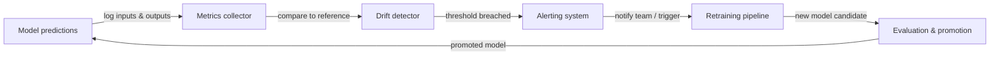

# Monitoreo de ML

## Definición

El monitoreo de ML es la práctica de observar continuamente los modelos de machine learning y los datos sobre los que operan después del despliegue. A diferencia del software tradicional, que funciona o lanza un error, un modelo puede degradarse silenciosamente: sigue produciendo salidas, pero esas salidas son cada vez más incorrectas a medida que el mundo cambia. El monitoreo de ML proporciona los sistemas de alerta temprana que detectan esta degradación antes de que cause daño al negocio.

Tres fenómenos impulsan la mayor parte de la degradación del modelo en producción. El **concept drift** ocurre cuando la relación estadística entre las características de entrada y la variable objetivo cambia — por ejemplo, un modelo de detección de fraude entrenado antes de que aparezca un nuevo vector de ataque pasará por alto sistemáticamente el nuevo patrón. El **data drift** (también llamado desplazamiento de covariables) ocurre cuando la distribución de las características de entrada cambia sin un cambio correspondiente en la relación objetivo — los patrones estacionales, los cambios demográficos y los cambios en el pipeline de datos upstream todos causan data drift. La **degradación del modelo** es la pérdida de rendimiento acumulada que resulta de uno o ambos de estos drifts; si no se controla, se manifiesta como tasas de error crecientes, ingresos en declive y experiencias de usuario deterioradas.

El monitoreo efectivo de ML abarca tres capas: **monitoreo de calidad de datos** (esquema, tasas de valores nulos, rangos de valores), **monitoreo de distribución** (pruebas estadísticas para drift en características y predicciones) y **monitoreo de rendimiento del modelo** (métricas de negocio y ML calculadas contra la verdad fundamental cuando las etiquetas están disponibles). La combinación de las tres capas proporciona defensa en profundidad — detectando problemas temprano, en su origen y en su efecto downstream.

## Cómo funciona

### Recopilación de datos y predicciones

Cada solicitud de predicción pasa por una capa de servicio instrumentada que registra entradas, salidas, marcas de tiempo y metadatos en un almacén centralizado (almacenamiento de objetos, un almacén de datos o una plataforma de streaming como Kafka). Los conjuntos de datos de referencia — típicamente el conjunto de datos de entrenamiento o validación — se almacenan junto con los logs de producción para servir como base estadística para los cálculos de drift. Los pipelines de etiquetas incorporan la verdad fundamental con retraso (las etiquetas a menudo llegan horas o semanas después de la predicción) y las unen de vuelta a las predicciones registradas.

### Detección de drift

Los detectores de drift comparan la distribución de producción actual con la base de referencia usando pruebas estadísticas. Para características continuas, el Índice de Estabilidad de Población (PSI), la prueba de Kolmogorov-Smirnov o la distancia de Wasserstein miden el cambio distribucional. Para características categóricas, son comunes las pruebas chi-cuadrado o la divergencia Jensen-Shannon. Las predicciones en sí mismas se tratan como una característica: un cambio en la distribución de predicciones (p. ej., un clasificador que de repente genera "positivo" el 80 % del tiempo cuando la base de referencia era el 30 %) es una señal temprana poderosa antes de que lleguen las etiquetas de verdad fundamental.

### Cálculo de métricas de rendimiento

Cuando las etiquetas de verdad fundamental están disponibles, las métricas de rendimiento se calculan sobre ventanas deslizantes o cohortes basadas en tiempo. La precisión, la exactitud, la recuperación, F1, RMSE y AUC-ROC son métricas de ML comunes. Las métricas de negocio — ingresos atribuidos a decisiones impulsadas por el modelo, tasa de deflección de llamadas, tasa de clics en recomendaciones — suelen ser más accionables. La latencia, el rendimiento y las tasas de error son métricas de infraestructura que indican el estado del servicio y deben monitorearse junto con la calidad del modelo.

### Alertas y escalamiento

Los umbrales y las reglas de detección de anomalías disparan alertas cuando una métrica cruza un límite. Los umbrales estáticos son simples pero frágiles; el control estadístico de procesos (p. ej., gráficos de control) y la detección de anomalías basada en ML se adaptan a la estacionalidad. Las alertas se enrutan a PagerDuty, Slack o correo electrónico según la gravedad. Las jerarquías de alertas bien diseñadas distinguen entre eventos informativos (solo registrar), advertencias (notificar al equipo de ML) y eventos críticos (llamar al turno de guardia, activar reversión automática o reentrenamiento).

### Ciclo de retroalimentación de reentrenamiento

El monitoreo es la entrada al ciclo de reentrenamiento. Cuando se detecta drift o el rendimiento se degrada por debajo de un umbral, un pipeline automatizado (o una decisión humana) activa un trabajo de reentrenamiento con datos frescos. Después del reentrenamiento, el nuevo modelo candidato pasa por puertas de evaluación antes de su promoción, cerrando el ciclo.



## Cuándo usar / Cuándo NO usar

| Usar cuando | Evitar cuando |
|----------|------------|
| Un modelo está desplegado en producción y sirve a usuarios reales | El modelo es un análisis único que nunca se volverá a usar |
| Las decisiones del modelo tienen un impacto medible en el negocio | El volumen de predicciones es tan bajo que las pruebas estadísticas carecen de potencia |
| Las etiquetas de verdad fundamental están disponibles eventualmente | No hay mecanismo de retroalimentación para recopilar etiquetas o resultados de negocio |
| Los requisitos regulatorios exigen un rendimiento del modelo auditable | El costo de las herramientas de monitoreo supera el valor esperado del modelo desplegado |
| Se sabe que el proceso generador de datos cambia con el tiempo | El modelo se reentrana continuamente de todas formas y el drift se maneja implícitamente |
| Hay múltiples modelos en producción simultáneamente | Un humano revisa cada predicción individualmente, haciendo redundante el monitoreo automatizado |

## Comparaciones

| Herramienta | Enfoque principal | Detección de drift | Seguimiento de rendimiento | Alojamiento |
|------|--------------|-----------------|---------------------|---------|
| Evidently AI | Informes de calidad de datos y modelos | Sí (más de 30 pruebas) | Sí | Auto-hospedado / Nube |
| WhyLabs | Observabilidad de LLM y ML | Sí (estadístico) | Sí | SaaS |
| Arize AI | Plataforma de observabilidad de ML | Sí | Sí | SaaS |
| Dashboards personalizados | Completamente adaptado | Implementación manual | Implementación manual | Auto-hospedado |
| MLflow | Seguimiento de experimentos + monitoreo básico | Limitado | Sí (offline) | Auto-hospedado / Nube |

## Ventajas y desventajas

| Aspecto | Ventajas | Desventajas |
|--------|------|------|
| Detección de concept drift | Detecta la degradación del modelo antes del impacto en el negocio | Requiere etiquetas de verdad fundamental, que llegan con retraso |
| Detección de data drift | Funciona sin etiquetas — detecta problemas temprano | Puede producir falsos positivos en cambios de distribución benignos |
| Alertas automatizadas | Reduce el tiempo de detección de semanas a minutos | Los umbrales mal ajustados causan fatiga de alertas |
| Ecosistema de herramientas | Opciones ricas de código abierto y SaaS | Añade complejidad de infraestructura y carga de mantenimiento |
| Activadores de reentrenamiento | Cierra el ciclo automáticamente | Riesgo de inestabilidad en el entrenamiento si el reentrenamiento se activa con demasiada frecuencia |

## Ejemplos de código

```python
# drift_detection.py
# Demonstrates concept and data drift detection using Evidently AI.
# Run: pip install evidently scikit-learn pandas numpy

import numpy as np
import pandas as pd
from sklearn.datasets import make_classification
from sklearn.ensemble import RandomForestClassifier
from sklearn.model_selection import train_test_split

from evidently.report import Report
from evidently.metric_preset import DataDriftPreset, ClassificationPreset
from evidently import ColumnMapping

# --- 1. Simulate reference (training) data ---
X, y = make_classification(
    n_samples=1000,
    n_features=10,
    n_informative=5,
    random_state=42,
)
feature_names = [f"feature_{i}" for i in range(10)]
df = pd.DataFrame(X, columns=feature_names)
df["target"] = y

X_train, X_test, y_train, y_test = train_test_split(
    df[feature_names], df["target"], test_size=0.2, random_state=42
)

# --- 2. Train a simple classifier ---
clf = RandomForestClassifier(n_estimators=100, random_state=42)
clf.fit(X_train, y_train)

# Build reference DataFrame with predictions
reference = X_test.copy()
reference["target"] = y_test.values
reference["prediction"] = clf.predict(X_test)

# --- 3. Simulate production data with drift ---
# Introduce feature shift: scale feature_0 to simulate distribution change
X_prod, y_prod = make_classification(
    n_samples=500,
    n_features=10,
    n_informative=5,
    random_state=99,  # Different seed = different distribution
)
df_prod = pd.DataFrame(X_prod, columns=feature_names)
df_prod["feature_0"] = df_prod["feature_0"] * 3.0  # Artificial drift on feature_0
df_prod["target"] = y_prod

production = df_prod[feature_names].copy()
production["target"] = df_prod["target"].values
production["prediction"] = clf.predict(df_prod[feature_names])

# --- 4. Run Evidently drift + performance report ---
column_mapping = ColumnMapping(
    target="target",
    prediction="prediction",
    numerical_features=feature_names,
)

report = Report(metrics=[DataDriftPreset(), ClassificationPreset()])
report.run(
    reference_data=reference,
    current_data=production,
    column_mapping=column_mapping,
)

# Save HTML report for inspection
report.save_html("drift_report.html")
print("Drift report saved to drift_report.html")

# --- 5. Extract drift results programmatically ---
result = report.as_dict()
drift_summary = result["metrics"][0]["result"]
n_drifted = drift_summary.get("number_of_drifted_columns", 0)
total = drift_summary.get("number_of_columns", 0)
share = drift_summary.get("share_of_drifted_columns", 0)

print(f"Drifted columns: {n_drifted}/{total} ({share:.1%})")
if share > 0.3:
    print("WARNING: Significant drift detected — consider retraining.")
else:
    print("Drift within acceptable bounds.")
```

## Recursos prácticos

- [Documentación de Evidently AI](https://docs.evidentlyai.com/) — Documentación oficial de la biblioteca de monitoreo de ML de código abierto líder, que cubre pruebas de drift, informes y monitoreo en tiempo real.
- [Plataforma de observabilidad de ML de WhyLabs](https://whylabs.ai/docs) — Documentación de la plataforma SaaS para monitorear modelos de LLM y ML con perfiles estadísticos y alertas.
- [Chip Huyen — Monitoreo de modelos de ML en producción](https://huyenchip.com/2022/02/07/data-distribution-shifts-and-monitoring.html) — Publicación de blog detallada que cubre los cambios de distribución de datos, las estrategias de monitoreo y las compensaciones prácticas.
- [Google — Rules of Machine Learning: sección de monitoreo](https://developers.google.com/machine-learning/guides/rules-of-ml#monitoring) — Orientación de ingeniería de Google sobre qué monitorear y cómo configurar alertas para ML en producción.
- [Arize AI — Guía de observabilidad de ML](https://arize.com/ml-observability/) — Guía para profesionales que cubre drift, monitoreo de embeddings y el stack de observabilidad para ML.

## Ver también

- [Prometheus](/docs/mlops/monitoring/prometheus)
- [Grafana](/docs/mlops/monitoring/grafana)
- [Servicio de modelos](/docs/mlops/deployment/model-serving)
