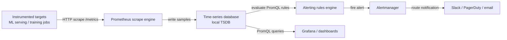

# Prometheus

## Definición

Prometheus es un toolkit de monitoreo y alertas de código abierto originalmente construido en SoundCloud y ahora un proyecto graduado de CNCF. Almacena todos los datos como series temporales: flujos de valores de punto flotante con marca de tiempo identificados por un nombre de métrica y un conjunto de etiquetas clave-valor. Este modelo es una buena opción para datos operativos — uso de CPU, recuentos de solicitudes, tasas de error — y para señales específicas de ML como la latencia de predicción, el rendimiento y las distribuciones de valores de características a lo largo del tiempo.

La elección arquitectónica definitoria en Prometheus es su **modelo de scraping basado en pull**. En lugar de requerir que las aplicaciones instrumentadas envíen métricas a un recopilador central, Prometheus raspa periódicamente endpoints HTTP (por defecto `/metrics`) expuestos por los objetivos. Esta inversión del control hace que el descubrimiento de servicios, el control de acceso y la depuración sean significativamente más simples: se puede usar curl en el endpoint de métricas de cualquier objetivo directamente para ver lo que Prometheus recopilará. Los objetivos se descubren mediante configuración estática o descubrimiento de servicios dinámico (Kubernetes, Consul, EC2, etc.).

Prometheus no es una solución de almacenamiento a largo plazo por diseño. Su base de datos de series temporales local (TSDB) está optimizada para la ingesta rápida y la consulta de datos recientes, reteniendo típicamente 15 días. Para el almacenamiento a largo plazo, Prometheus puede escribir de forma remota en sistemas como Thanos, Cortex o VictoriaMetrics. En contextos de ML, Prometheus es la capa de recopilación y alertas; [Grafana](/docs/mlops/monitoring/grafana) proporciona la capa de visualización y dashboards encima.

## Cómo funciona

### Instrumentación de objetivos

Las aplicaciones exponen métricas a través de un endpoint HTTP `/metrics` en el formato de exposición de Prometheus — un formato de texto plano de líneas `nombre_métrica{etiqueta="valor"} valor_numérico marca_de_tiempo`. En Python, la biblioteca `prometheus_client` proporciona tipos Counter, Gauge, Histogram y Summary que manejan el formato de exposición automáticamente. Un proceso de servicio de ML típicamente expone contadores para el total de solicitudes de predicción, histogramas para la latencia de solicitudes y gauges para las versiones del modelo actualmente cargadas y la utilización de recursos.

### Scraping y almacenamiento

Prometheus evalúa su archivo de configuración para determinar qué objetivos raspar y a qué intervalo (por defecto: 15 segundos). En cada raspado obtiene el endpoint `/metrics`, analiza el formato de exposición y escribe las muestras en su TSDB local en fragmentos comprimidos. La TSDB usa un registro de escritura anticipada (WAL) para la durabilidad y compacta los datos en bloques a lo largo del tiempo. La cardinalidad de etiquetas es el principal mecanismo de rendimiento: cada combinación única de valores de etiqueta crea una serie temporal separada, por lo que se deben evitar las etiquetas no acotadas (p. ej., los IDs de usuario).

### Consultas PromQL y alertas

PromQL (Lenguaje de Consulta de Prometheus) es un lenguaje de consulta funcional para seleccionar y agregar datos de series temporales. Los vectores instantáneos seleccionan el valor actual de un conjunto de series; los vectores de rango seleccionan una ventana de muestras; las funciones calculan tasas, promedios, cuantiles y predicciones sobre esos vectores. Las reglas de alerta son expresiones PromQL evaluadas a un intervalo configurable; cuando una expresión devuelve un resultado no vacío, la alerta se dispara y se envía al Alertmanager.

### Alertmanager

Alertmanager recibe alertas de Prometheus (y otras fuentes), las deduplica, aplica reglas de agrupamiento y enrutamiento, y envía notificaciones a los receptores (PagerDuty, Slack, correo electrónico, webhooks). Los silencios y las reglas de inhibición evitan las tormentas de alertas durante las ventanas de mantenimiento conocidas o los fallos en cascada. En los sistemas de ML, Alertmanager enruta las alertas de degradación del modelo al canal de Slack del equipo de ML mientras las alertas de infraestructura (alta CPU, muertes por OOM) van al equipo de plataforma.

### Almacenamiento remoto y federación

Para escenarios multi-clúster o de retención prolongada, Prometheus escribe de forma remota muestras en un backend duradero. La federación permite que un Prometheus global raspe métricas agregadas de instancias de Prometheus regionales. Ambos patrones son comunes en grandes plataformas de ML donde los clústeres de entrenamiento y servicio ejecutan cada uno su propio Prometheus, y una instancia central agrega métricas a nivel de servicio.



## Cuándo usar / Cuándo NO usar

| Usar cuando | Evitar cuando |
|----------|------------|
| Se necesitan métricas operativas para la infraestructura de servicio de ML (latencia, rendimiento, tasa de error) | Se necesita almacenar logs de predicción brutos o datos de eventos de alta cardinalidad |
| Se quiere un stack de monitoreo basado en pull y auto-hospedado sin dependencia de proveedor | El equipo carece de experiencia en infraestructura para operar y ajustar un stack de Prometheus |
| Se ejecuta en Kubernetes y se quiere descubrimiento de servicios nativo | Se necesita retención a largo plazo (\>15 días) sin configuración adicional de almacenamiento remoto |
| Se necesitan alertas potentes con deduplicación y enrutamiento vía Alertmanager | Se necesitan intervalos de scraping inferiores a un segundo; Prometheus está diseñado para intervalos de 10-60 segundos |
| Se quiere un backend estándar para los dashboards de Grafana | La aplicación genera cardinalidad de etiquetas no acotada, lo que degradará el rendimiento de la TSDB |

## Comparaciones

Prometheus y Grafana son herramientas complementarias, no competidoras. La tabla a continuación describe cuándo usarlas juntas versus alternativas.

| Criterio | Prometheus | Grafana |
|-----------|-----------|---------|
| Rol | Recopilar, almacenar y alertar sobre métricas | Visualizar y explorar métricas desde cualquier fuente de datos |
| Lenguaje de consulta | PromQL (lenguaje funcional optimizado para métricas) | Por fuente de datos (PromQL para Prometheus, SQL para otros) |
| Alertas | Reglas de alerta integradas + Alertmanager | Alertas de Grafana (unificadas, múltiples fuentes de datos) |
| Fuentes de datos | Propio (TSDB) | Prometheus, InfluxDB, Loki, Elasticsearch, bases de datos, etc. |
| Almacenamiento | TSDB local, escritura remota para retención a largo plazo | Sin almacenamiento — puramente una capa de consulta y visualización |
| Cuándo usar juntos | Siempre — Prometheus recopila, Grafana muestra | Siempre — usar Grafana como interfaz para los datos de Prometheus |

## Ventajas y desventajas

| Aspecto | Ventajas | Desventajas |
|--------|------|------|
| Arquitectura basada en pull | Depuración simple, control de acceso a nivel de objetivo | Requiere que los objetivos expongan endpoints HTTP |
| PromQL | Expresivo, componible, creado para métricas | Curva de aprendizaje pronunciada en comparación con SQL |
| TSDB local | Ingesta y consulta rápidas para datos recientes | Retención limitada; necesita almacenamiento remoto para largo plazo |
| Modelo de etiquetas | Filtrado y agregación multidimensional flexible | Las etiquetas de alta cardinalidad causan problemas de memoria y rendimiento de consultas |
| Alertmanager | Enrutamiento, agrupamiento y silenciamiento enriquecidos | Componente separado a operar; la configuración puede volverse compleja |
| Ecosistema | Gran biblioteca de exportadores y bibliotecas cliente | Sobrecarga operativa para despliegues auto-hospedados |

## Ejemplos de código

```python
# ml_metrics_server.py
# Exposes ML model metrics via prometheus_client for Prometheus scraping.
# Run: pip install prometheus_client flask scikit-learn numpy
# Then configure Prometheus to scrape localhost:8000

import time
import threading
import random
import numpy as np
from prometheus_client import (
    Counter,
    Histogram,
    Gauge,
    start_http_server,
    REGISTRY,
)
from sklearn.datasets import load_iris
from sklearn.ensemble import RandomForestClassifier

# --- Define metrics ---

PREDICTION_COUNTER = Counter(
    "ml_predictions_total",
    "Total number of prediction requests",
    ["model_name", "model_version", "status"],  # labels
)

PREDICTION_LATENCY = Histogram(
    "ml_prediction_latency_seconds",
    "Prediction request latency in seconds",
    ["model_name", "model_version"],
    buckets=[0.005, 0.01, 0.025, 0.05, 0.1, 0.25, 0.5, 1.0, 2.5],
)

MODEL_CONFIDENCE = Histogram(
    "ml_prediction_confidence",
    "Distribution of model prediction confidence scores",
    ["model_name", "model_version"],
    buckets=[0.1, 0.2, 0.3, 0.4, 0.5, 0.6, 0.7, 0.8, 0.9, 1.0],
)

ACTIVE_MODEL_VERSION = Gauge(
    "ml_active_model_version",
    "Currently active model version (encoded as numeric)",
    ["model_name"],
)

DATA_DRIFT_SCORE = Gauge(
    "ml_data_drift_score",
    "Current data drift score (PSI) for the primary feature set",
    ["model_name", "feature_set"],
)

# --- Load and train a simple model ---
X, y = load_iris(return_X_y=True)
clf = RandomForestClassifier(n_estimators=50, random_state=42)
clf.fit(X, y)

MODEL_NAME = "iris-classifier"
MODEL_VERSION = "1.0.0"
ACTIVE_MODEL_VERSION.labels(model_name=MODEL_NAME).set(1)


def simulate_prediction(features: np.ndarray) -> dict:
    """Run a prediction and record Prometheus metrics."""
    start = time.time()
    try:
        proba = clf.predict_proba(features.reshape(1, -1))[0]
        predicted_class = int(np.argmax(proba))
        confidence = float(np.max(proba))

        # Record latency and confidence
        duration = time.time() - start
        PREDICTION_LATENCY.labels(
            model_name=MODEL_NAME, model_version=MODEL_VERSION
        ).observe(duration)
        MODEL_CONFIDENCE.labels(
            model_name=MODEL_NAME, model_version=MODEL_VERSION
        ).observe(confidence)
        PREDICTION_COUNTER.labels(
            model_name=MODEL_NAME,
            model_version=MODEL_VERSION,
            status="success",
        ).inc()

        return {"class": predicted_class, "confidence": confidence}
    except Exception as exc:
        PREDICTION_COUNTER.labels(
            model_name=MODEL_NAME,
            model_version=MODEL_VERSION,
            status="error",
        ).inc()
        raise exc


def simulate_drift_monitoring():
    """Periodically update a synthetic drift score gauge."""
    while True:
        # In production this would run a real PSI/KS test
        drift_score = random.uniform(0.01, 0.35)
        DATA_DRIFT_SCORE.labels(
            model_name=MODEL_NAME, feature_set="sepal"
        ).set(drift_score)
        time.sleep(30)


def simulate_traffic():
    """Generate synthetic prediction traffic for demonstration."""
    samples = X[np.random.choice(len(X), size=10)]
    for sample in samples:
        simulate_prediction(sample)
        time.sleep(random.uniform(0.05, 0.3))


if __name__ == "__main__":
    # Start Prometheus metrics HTTP server on port 8000
    start_http_server(8000)
    print("Prometheus metrics server running on http://localhost:8000/metrics")
    print("Configure Prometheus to scrape this endpoint.")

    # Start background drift monitor
    drift_thread = threading.Thread(target=simulate_drift_monitoring, daemon=True)
    drift_thread.start()

    # Simulate continuous prediction traffic
    print("Simulating prediction traffic...")
    while True:
        simulate_traffic()
        time.sleep(1)
```

## Recursos prácticos

- [Documentación de Prometheus](https://prometheus.io/docs/introduction/overview/) — Documentación oficial que cubre arquitectura, configuración, PromQL, alertas y mejores prácticas.
- [Biblioteca Python prometheus_client](https://github.com/prometheus/client_python) — Cliente Python oficial para instrumentar aplicaciones; cubre todos los tipos de métricas y el formato de exposición.
- [Hoja de trucos de PromQL](https://promlabs.com/promql-cheat-sheet/) — Referencia concisa de operadores, funciones y patrones comunes de PromQL.
- [Robust Perception — Monitoreo con Prometheus](https://www.robustperception.io/blog/) — Blog detallado de Brian Brazil que cubre los internos de Prometheus, patrones de PromQL y consejos operativos.
- [Awesome Prometheus](https://github.com/roaldnefs/awesome-prometheus) — Lista curada de exportadores, dashboards y recursos de la comunidad de Prometheus.

## Ver también

- [Grafana](/docs/mlops/monitoring/grafana)
- [Monitoreo de ML](/docs/mlops/monitoring)
- [Servicio de modelos](/docs/mlops/deployment/model-serving)
