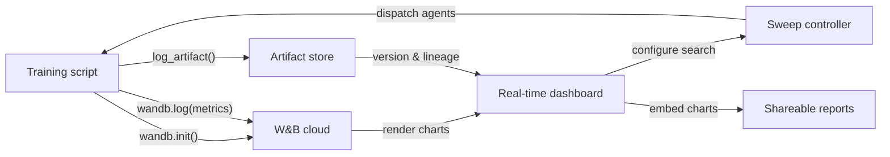

# Weights & Biases (W&B)

## Definición

Weights & Biases (comúnmente abreviado W&B o wandb) es una plataforma de MLOps nativa en la nube que proporciona seguimiento de experimentos, versionado de conjuntos de datos y modelos, optimización de hiperparámetros e informes interactivos en un único producto integrado. Fundada en 2017 y adoptada ampliamente tanto en investigación académica como en la industria, W&B es particularmente popular entre los equipos que entrenan modelos de deep learning que producen salidas de medios enriquecidos — imágenes, audio, video, nubes de puntos — que se benefician de la inspección visual durante el entrenamiento.

La propuesta de valor central de W&B es que requiere casi ninguna infraestructura para comenzar: te registras en una cuenta gratuita, instalas el paquete Python `wandb`, añades `wandb.init()` a tu script y todo se registra automáticamente en la nube de W&B. La plataforma está organizada en **proyectos** (colecciones de ejecuciones relacionadas), **ejecuciones** (ejecuciones de entrenamiento individuales), **artefactos** (conjuntos de datos y archivos de modelos versionados), **sweeps** (búsqueda automatizada de hiperparámetros) e **informes** (documentos narrativos compartibles que incorporan gráficos en vivo).

A diferencia de las soluciones auto-hospedadas como MLflow, W&B gestiona toda la infraestructura backend. Esto elimina la carga operacional pero significa que los datos salen de tus instalaciones — una consideración relevante para las industrias reguladas. W&B ofrece opciones de nube privada y despliegue on-premise para clientes empresariales que necesitan garantías de residencia de datos, aunque estas requieren un plan de pago.

## Cómo funciona

### Inicialización y auto-registro

Llamar a `wandb.init(project="...", config={...})` inicia una ejecución, envía la configuración a W&B y devuelve un objeto de ejecución. Muchos frameworks populares (PyTorch Lightning, Hugging Face Trainer, Keras, XGBoost, scikit-learn) ofrecen callbacks o integraciones W&B que registran automáticamente gradientes, programas de tasa de aprendizaje y métricas de evaluación sin código adicional. Internamente, un hilo en segundo plano agrupa y comprime los datos de registro antes de enviarlos por HTTPS, minimizando la sobrecarga de entrenamiento.

### Dashboards en tiempo real

La interfaz de W&B renderiza curvas de métricas, utilización del sistema (GPU/CPU/memoria) y medios a medida que avanza la ejecución. Múltiples ejecuciones pueden superponerse en el mismo gráfico con codificación de colores automática. Las ejecuciones pueden filtrarse y agruparse por cualquier dimensión de configuración (p. ej., agrupar por tasa de aprendizaje para ver su efecto en todos los experimentos a la vez), lo que permite un diagnóstico visual rápido.

### Sweeps

Un sweep se define mediante un YAML o un dict de Python que especifica el espacio de búsqueda, la estrategia de búsqueda (cuadrícula, aleatoria o Bayesiana) y los criterios de parada (p. ej., terminación anticipada de ejecuciones con bajo rendimiento). El controlador de sweep de W&B coordina múltiples agentes que se ejecutan en paralelo, cada uno tomando combinaciones de hiperparámetros del controlador y registrando los resultados. La búsqueda Bayesiana se adapta en función de los resultados observados, convergiendo más rápido que la búsqueda en cuadrícula.

### Artefactos

W&B Artifacts versiona conjuntos de datos, checkpoints de modelos y salidas de evaluación como objetos direccionados por contenido. Un artefacto está vinculado a la ejecución que lo produjo y a las ejecuciones que lo consumieron, creando un gráfico de linaje de datos. Puedes descargar una versión específica de un artefacto con dos líneas de Python, haciendo que la reproducibilidad de conjuntos de datos y modelos sea tan simple como especificar una cadena de versión.

### Informes

Los informes son documentos interactivos que incorporan gráficos W&B en vivo, comparaciones de ejecuciones y narrativa en markdown. Son la superficie de colaboración principal: un investigador puede enlazar un informe en un mensaje de Slack o en un PR de GitHub para compartir evidencia experimental reproducible sin exportar imágenes estáticas.



## Cuándo usar / Cuándo NO usar

| Usar cuando | Evitar cuando |
|----------|------------|
| Entrenas modelos de deep learning y necesitas registro enriquecido de medios (imágenes, audio, embeddings) | Los datos no pueden salir de tus instalaciones y no puedes pagar el plan enterprise on-premise |
| La colaboración en equipo, compartir resultados e informes narrativos son importantes | Necesitas una solución completamente de código abierto y auto-hospedada sin dependencia SaaS |
| Quieres optimización de hiperparámetros integrada sin herramientas adicionales | Tus experimentos son simples y la sobrecarga de una cuenta SaaS no está justificada |
| Tu equipo trabaja en investigación o academia y se beneficia del acceso al nivel gratuito | Tienes un presupuesto ajustado y las características del nivel de pago son necesarias para el tamaño de tu equipo |

## Comparaciones

| Criterio | W&B | MLflow |
|-----------|-----|--------|
| Facilidad de configuración | Cuenta SaaS gratuita; sin infra; `wandb login` + dos líneas de código | Auto-hospedable localmente; sin cuenta necesaria; `mlflow ui` para iniciar |
| Calidad de la interfaz | Pulida, interactiva; construida para cargas de trabajo visuales y ricas en medios | Limpia y funcional; mejor para comparación de métricas tabulares |
| Colaboración | Espacios de trabajo de equipo nativos, informes, enlaces de compartición, integración con Slack | Requiere servidor compartido; sin características de colaboración integradas en OSS |
| Precio | Gratis para individuos; de pago para equipos más grandes; enterprise para on-prem | Gratuito y de código abierto; Databricks Managed MLflow cuesta extra |
| Optimización de hiperparámetros | Sweeps integrados con Bayesiana/cuadrícula/aleatoria + parada anticipada | Requiere herramientas externas (Optuna, Ray Tune) |

## Ejemplos de código

```python
# wandb_tracking_example.py
# W&B experiment tracking: logs config, metrics, images, and registers a model artifact.
# pip install wandb scikit-learn matplotlib Pillow

import wandb
import numpy as np
import matplotlib.pyplot as plt
from sklearn.ensemble import RandomForestClassifier
from sklearn.datasets import load_digits
from sklearn.model_selection import train_test_split
from sklearn.metrics import (
    accuracy_score, f1_score, confusion_matrix, ConfusionMatrixDisplay
)
import os, tempfile

# ── 1. Initialize the W&B run ─────────────────────────────────────────────────
run = wandb.init(
    project="digits-classification",
    name="random-forest-v1",
    config={                         # All hyperparameters go here
        "n_estimators": 150,
        "max_depth": 12,
        "min_samples_split": 4,
        "random_state": 7,
        "dataset": "sklearn-digits",
    },
)
cfg = wandb.config  # Access config values through this proxy

# ── 2. Data ───────────────────────────────────────────────────────────────────
X, y = load_digits(return_X_y=True)
X_train, X_test, y_train, y_test = train_test_split(
    X, y, test_size=0.2, stratify=y, random_state=cfg.random_state
)

# ── 3. Train ──────────────────────────────────────────────────────────────────
clf = RandomForestClassifier(
    n_estimators=cfg.n_estimators,
    max_depth=cfg.max_depth,
    min_samples_split=cfg.min_samples_split,
    random_state=cfg.random_state,
)
clf.fit(X_train, y_train)

# ── 4. Evaluate and log metrics ───────────────────────────────────────────────
y_pred = clf.predict(X_test)
metrics = {
    "accuracy": accuracy_score(y_test, y_pred),
    "f1_macro": f1_score(y_test, y_pred, average="macro"),
    "n_train": len(X_train),
    "n_test": len(X_test),
}
wandb.log(metrics)

# ── 5. Log a confusion matrix image ──────────────────────────────────────────
cm = confusion_matrix(y_test, y_pred)
fig, ax = plt.subplots(figsize=(8, 8))
ConfusionMatrixDisplay(cm).plot(ax=ax)
ax.set_title("Confusion Matrix – digits RF")
wandb.log({"confusion_matrix": wandb.Image(fig)})
plt.close(fig)

# ── 6. Save model as a versioned W&B Artifact ─────────────────────────────────
import joblib

with tempfile.TemporaryDirectory() as tmp:
    model_path = os.path.join(tmp, "model.joblib")
    joblib.dump(clf, model_path)

    artifact = wandb.Artifact(
        name="digits-rf-model",
        type="model",
        description="Random Forest trained on sklearn digits dataset",
        metadata=dict(metrics),
    )
    artifact.add_file(model_path)
    run.log_artifact(artifact)

# ── 7. Finish the run ─────────────────────────────────────────────────────────
run.finish()
print(f"Accuracy: {metrics['accuracy']:.4f} | F1 macro: {metrics['f1_macro']:.4f}")
print(f"View run at: {run.url}")
```

## Recursos prácticos

- [Documentación oficial de W&B](https://docs.wandb.ai/) — Referencia completa que cubre el SDK de Python, integraciones, sweeps, artefactos e informes.
- [Inicio rápido de W&B](https://docs.wandb.ai/quickstart) — Registra tu primera ejecución W&B en menos de cinco minutos con un ejemplo mínimo.
- [Documentación de Sweeps de W&B](https://docs.wandb.ai/guides/sweeps) — Guía completa para configurar y ejecutar búsquedas distribuidas de hiperparámetros.
- [Blog W&B Fully Connected](https://wandb.ai/fully-connected) — Blog para profesionales con tutoriales en profundidad, informes de benchmarks y artículos de ingeniería de ML.
- [Integración Hugging Face + W&B](https://docs.wandb.ai/guides/integrations/huggingface) — Guía para registrar automáticamente todas las métricas del Hugging Face Trainer con un solo argumento `report_to="wandb"`.

## Ver también

- [Seguimiento de experimentos](/docs/mlops/experiment-tracking)
- [MLflow](/docs/mlops/mlflow)
- [MLOps](/docs/mlops)
