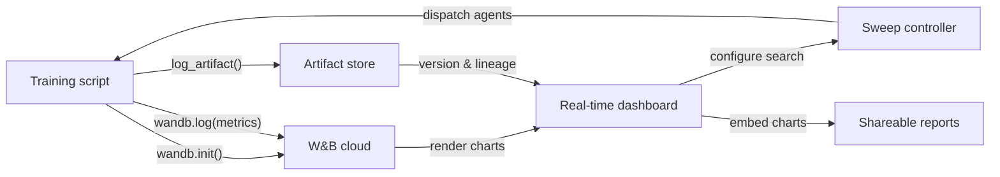

# Weights & Biases (W&B)

## Definición

Weights & Biases (comúnmente abreviado W&B o wandb) es una plataforma MLOps nativa en la nube que proporciona seguimiento de experimentos, versionado de datasets y modelos, optimización de hiperparámetros e informes interactivos en un único producto integrado. Fundada en 2017 y ampliamente adoptada tanto en la investigación académica como en la industria, W&B es especialmente popular entre los equipos que entrenan modelos de aprendizaje profundo que producen ricas salidas multimedia — imágenes, audio, video, nubes de puntos — que se benefician de la inspección visual durante el entrenamiento.

La propuesta de valor central de W&B es que requiere casi ninguna infraestructura para comenzar: se crea una cuenta gratuita, se instala el paquete Python `wandb`, se agrega `wandb.init()` al script y todo se registra automáticamente en la nube de W&B. La plataforma está organizada en **proyectos** (colecciones de ejecuciones relacionadas), **runs** (ejecuciones individuales de entrenamiento), **artifacts** (datasets y archivos de modelos versionados), **sweeps** (búsqueda automatizada de hiperparámetros) y **reports** (documentos narrativos compartibles que incorporan gráficos en vivo).

A diferencia de las soluciones autoalojadas como MLflow, W&B gestiona toda la infraestructura backend. Esto elimina la carga operativa, pero significa que los datos salen de las instalaciones propias — una consideración relevante para las industrias reguladas. W&B ofrece opciones de despliegue en nube privada y on-premise para clientes empresariales que necesitan garantías de residencia de datos, aunque estos requieren un plan de pago.

## Cómo funciona

### Inicialización y auto-logging

Llamar a `wandb.init(project="...", config={...})` inicia una ejecución, envía la configuración a W&B y devuelve un objeto de ejecución. Muchos frameworks populares (PyTorch Lightning, Hugging Face Trainer, Keras, XGBoost, scikit-learn) ofrecen callbacks o integraciones de W&B que registran automáticamente gradientes, programaciones de tasa de aprendizaje y métricas de evaluación sin código adicional. Internamente, un hilo en segundo plano agrupa y comprime los datos de log antes de enviarlos por HTTPS, minimizando la sobrecarga de entrenamiento.

### Dashboards en tiempo real

La UI de W&B renderiza curvas de métricas, utilización del sistema (GPU/CPU/memoria) y medios a medida que la ejecución progresa. Múltiples ejecuciones pueden superponerse en el mismo gráfico con codificación de colores automática. Las ejecuciones pueden filtrarse y agruparse por cualquier dimensión de configuración, lo que permite un diagnóstico visual rápido.

### Sweeps

Un sweep se define mediante un YAML o dict de Python que especifica el espacio de búsqueda, la estrategia de búsqueda (grid, aleatoria o bayesiana) y los criterios de parada. El controlador de sweep de W&B coordina múltiples agentes que se ejecutan en paralelo, cada uno seleccionando combinaciones de hiperparámetros del controlador y registrando los resultados de vuelta. La búsqueda bayesiana se adapta basándose en los resultados observados, convergiendo más rápido que la búsqueda en grid.

### Artifacts

W&B Artifacts versiona datasets, checkpoints de modelos y salidas de evaluación como objetos con dirección de contenido. Un artifact se vincula a la ejecución que lo produjo y a las ejecuciones que lo consumieron, creando un grafo de linaje de datos. Se puede descargar una versión específica de artifact con dos líneas de Python, haciendo que la reproducibilidad de datasets y modelos sea tan simple como especificar una cadena de versión.

### Reports

Los reports son documentos interactivos que incorporan gráficos en vivo de W&B, comparaciones de ejecuciones y narrativa en markdown. Son la principal superficie de colaboración: un investigador puede enlazar un report en un mensaje de Slack o en un PR de GitHub para compartir evidencia experimental reproducible sin exportar imágenes estáticas.



## Cuándo usar / Cuándo NO usar

| Usar cuando | Evitar cuando |
|----------|------------|
| Se entrenan modelos de aprendizaje profundo y se necesita registro multimedia enriquecido | Los datos no pueden salir de las instalaciones y no se puede costear el plan enterprise on-premise |
| La colaboración en equipo, compartir resultados e informes narrativos son importantes | Se necesita una solución completamente de código abierto y autoalojada sin dependencia SaaS |
| Se desea optimización de hiperparámetros incorporada sin herramientas adicionales | Los experimentos son simples y la sobrecarga de una cuenta SaaS no está justificada |
| El equipo trabaja en investigación o academia y se beneficia del acceso al nivel gratuito | El presupuesto es ajustado y las funciones del nivel de pago son necesarias para el tamaño del equipo |

## Comparaciones

| Criterio | W&B | MLflow |
|-----------|-----|--------|
| Facilidad de configuración | Cuenta SaaS gratuita; sin infra; `wandb login` + dos líneas de código | Autoalojable localmente; sin cuenta; `mlflow ui` para iniciar |
| Calidad de la UI | Pulida, interactiva; diseñada para cargas de trabajo visuales y multimedia | Limpia y funcional; mejor para comparación de métricas tabulares |
| Colaboración | Espacios de trabajo de equipo nativos, informes, enlaces de compartición, integración con Slack | Requiere servidor compartido; sin características de colaboración integradas en OSS |
| Precio | Gratuito para individuos; de pago para equipos más grandes; enterprise para on-prem | Gratuito y de código abierto; Databricks Managed MLflow tiene costo adicional |
| Optimización de hiperparámetros | Sweeps integrados con Bayesian/grid/aleatorio + parada temprana | Requiere herramientas externas (Optuna, Ray Tune) |

## Ejemplos de código

```python
# wandb_tracking_example.py
# W&B experiment tracking: logs config, metrics, images, and registers a model artifact.
# pip install wandb scikit-learn matplotlib Pillow

import wandb
import numpy as np
import matplotlib.pyplot as plt
from sklearn.ensemble import RandomForestClassifier
from sklearn.datasets import load_digits
from sklearn.model_selection import train_test_split
from sklearn.metrics import (
    accuracy_score, f1_score, confusion_matrix, ConfusionMatrixDisplay
)
import os, tempfile

run = wandb.init(
    project="digits-classification",
    name="random-forest-v1",
    config={
        "n_estimators": 150,
        "max_depth": 12,
        "min_samples_split": 4,
        "random_state": 7,
        "dataset": "sklearn-digits",
    },
)
cfg = wandb.config

X, y = load_digits(return_X_y=True)
X_train, X_test, y_train, y_test = train_test_split(
    X, y, test_size=0.2, stratify=y, random_state=cfg.random_state
)

clf = RandomForestClassifier(
    n_estimators=cfg.n_estimators,
    max_depth=cfg.max_depth,
    min_samples_split=cfg.min_samples_split,
    random_state=cfg.random_state,
)
clf.fit(X_train, y_train)

y_pred = clf.predict(X_test)
metrics = {
    "accuracy": accuracy_score(y_test, y_pred),
    "f1_macro": f1_score(y_test, y_pred, average="macro"),
    "n_train": len(X_train),
    "n_test": len(X_test),
}
wandb.log(metrics)

run.finish()
print(f"Accuracy: {metrics['accuracy']:.4f} | F1 macro: {metrics['f1_macro']:.4f}")
```

## Recursos prácticos

- [W&B Official Documentation](https://docs.wandb.ai/) — Referencia completa del SDK de Python, integraciones, sweeps, artifacts e informes.
- [W&B Quickstart](https://docs.wandb.ai/quickstart) — Registre su primera ejecución de W&B en menos de cinco minutos con un ejemplo mínimo.
- [W&B Sweeps Documentation](https://docs.wandb.ai/guides/sweeps) — Guía completa para configurar y ejecutar búsquedas de hiperparámetros distribuidas.
- [W&B Fully Connected Blog](https://wandb.ai/fully-connected) — Blog para profesionales con tutoriales en profundidad, informes de benchmarks y artículos de ingeniería de ML.
- [Hugging Face + W&B Integration](https://docs.wandb.ai/guides/integrations/huggingface) — Guía para registrar automáticamente todas las métricas del Hugging Face Trainer con un único argumento `report_to="wandb"`.

## Ver también

- [Experiment tracking](/docs/mlops/experiment-tracking)
- [MLflow](/docs/mlops/mlflow)
- [MLOps](/docs/mlops)
