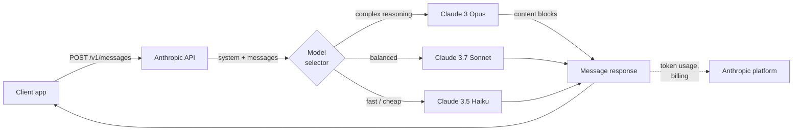
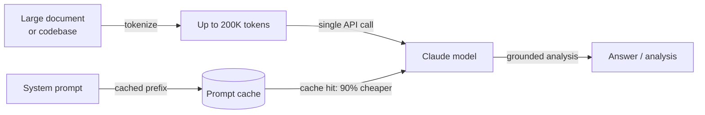

# Anthropic

## Definición

**Anthropic** es una empresa de seguridad en IA y proveedor de modelos fundada en 2021 por ex investigadores de OpenAI. Su tesis central es que construir modelos de IA capaces y resolver el problema de alineación son objetivos inseparables — la empresa persigue capacidades de vanguardia junto con investigación en seguridad como Constitutional AI, interpretabilidad y comprensión mecanística de los internos del modelo. El producto comercial de esa investigación es la familia de modelos **Claude**, disponible a través de la API de Anthropic y productos empresariales.

La línea de modelos Claude sigue una convención de nomenclatura de tres niveles que refleja los compromisos entre capacidad y costo: **Opus** (mayor calidad, razonamiento complejo), **Sonnet** (calidad y velocidad equilibradas) y **Haiku** (más rápido y rentable). A partir de 2025, la generación actual es **Claude 3.7 Sonnet** — el modelo insignia con capacidades de pensamiento extendido — junto con **Claude 3 Opus**, **Claude 3.5 Sonnet** y **Claude 3.5 Haiku**. Todos los modelos Claude 3+ admiten entrada de imágenes, y toda la familia está diseñada en torno a una ventana de contexto de 200K tokens que puede manejar libros, grandes bases de código e historiales de conversación largos sin truncamiento.

Desde una perspectiva de plataforma, la API de Anthropic se centra en la **Messages API** — una interfaz limpia y de propósito específico para conversaciones de múltiples turnos. La plataforma incluye uso de herramientas (el término de Anthropic para llamadas a funciones), pensamiento extendido (razonamiento de cadena de pensamiento visible), caché de prompts (reduce costos y latencia para contextos repetidos grandes) y procesamiento por lotes. El SDK de Python (`anthropic`) y el SDK de TypeScript son las bibliotecas cliente principales. Los modelos Claude también están disponibles a través de Amazon Bedrock, Google Cloud Vertex AI y contratos empresariales con opciones de residencia de datos.

## Cómo funciona

### Messages API

La Messages API (`POST /v1/messages`) es la interfaz principal de Anthropic. A diferencia de algunas APIs que usan una cadena `prompt` plana, la Messages API es conversacional: usted envía un array `messages` de turnos alternos `user` y `assistant`, con un parámetro `system` opcional para contexto y persona. El modelo devuelve un objeto `Message` que contiene una lista `content` — bloques de texto por defecto, bloques de uso de herramientas cuando el modelo decide llamar a una herramienta. La transmisión en streaming es compatible y recomendada para uso interactivo; el SDK proporciona tanto asistentes de streaming como acceso SSE sin procesar.



### Uso de herramientas

El uso de herramientas permite a Claude llamar a funciones externas emitiendo bloques de contenido `tool_use` estructurados. Usted declara herramientas como esquemas JSON en el parámetro `tools`. Cuando Claude decide que se necesita una herramienta, la respuesta contiene un bloque `tool_use` con el nombre de la herramienta y la entrada; su código ejecuta la función y devuelve un `tool_result` en el siguiente turno de usuario. Claude luego usa el resultado para completar su respuesta. Este patrón habilita agentes, entornos de ejecución de código, consultas de bases de datos e integraciones de API sin que el modelo necesite acceso directo a ningún sistema.


### Pensamiento extendido

El pensamiento extendido es un modo disponible en Claude 3.7 Sonnet que permite al modelo razonar extensamente antes de producir su respuesta final. Cuando establece `thinking: {type: "enabled", budget_tokens: N}`, el modelo emite bloques de contenido `thinking` que contienen su bloc de notas interno — similar a la cadena de pensamiento pero nativo y estructurado. El pensamiento extendido mejora significativamente el rendimiento en competencias de matemáticas, código complejo, razonamiento de múltiples pasos y tareas que requieren análisis cuidadoso paso a paso. Los tokens de pensamiento cuentan para el presupuesto de tokens pero son visibles en la respuesta, dándole transparencia sobre cómo el modelo llegó a su respuesta.

### Caché de prompts

La caché de prompts reduce drásticamente el costo y la latencia para cargas de trabajo que usan repetidamente prompts de sistema grandes o contextos de documentos. Usted marca secciones de prefijo de su solicitud con `cache_control: {type: "ephemeral"}`. En la primera llamada, Anthropic almacena en caché el prefijo del prompt en su infraestructura; las llamadas posteriores que coinciden con el prefijo se sirven desde la caché con un 90% menos de costo de tokens de entrada y un tiempo hasta el primer token significativamente reducido. Esto es especialmente valioso para pipelines de RAG (contexto grande pasado con cada consulta), bucles de agentes (prompts de sistema grandes repetidos en cada turno) y procesamiento de documentos por lotes.

### Contexto largo (200K tokens)

Todos los modelos Claude 3 y posteriores admiten una ventana de contexto de 200K tokens — equivalente a aproximadamente 150.000 palabras o ~500 páginas de texto. El contexto largo permite procesar bases de código completas, documentos legales, trabajos de investigación o historiales de conversación completos en una sola llamada sin fragmentación. La investigación de Anthropic sobre rendimiento de contexto largo (evaluaciones de "aguja en un pajar") muestra que Claude mantiene una fuerte precisión de recuperación en todo el rango de 200K, haciéndolo confiable para preguntas y respuestas sobre documentos, análisis de contratos y revisión de código en repositorios grandes. Este es uno de los diferenciadores más claros de Anthropic en relación con la ventana de 128K de GPT-4o.



## Cuándo usar / Cuándo NO usar

| Usar Anthropic cuando | Evitar o considerar alternativas cuando |
|-----------------------|-----------------------------------------|
| Necesita una ventana de contexto de 200K para procesar documentos largos, bases de código o conversaciones extendidas sin fragmentación | Su carga de trabajo requiere generación de imágenes, transcripción de audio o texto a voz — Claude es solo texto/visión; OpenAI cubre audio |
| Las restricciones de seguridad y el comportamiento de rechazo predecible son críticos (cumplimiento normativo, salud, finanzas) | Necesita modelos de pesos abiertos para autoalojamiento, ajuste fino o residencia de datos — Anthropic no ofrece opción de pesos abiertos |
| Quiere pensamiento extendido para tareas de razonamiento profundo (matemáticas, código complejo, análisis de múltiples pasos) | Su caso de uso principal es la generación de embeddings en alto volumen — Anthropic no ofrece una API de embeddings |
| La caché de prompts reducirá significativamente los costos (contextos repetidos grandes, prompts de sistema de agentes) | Depende en gran medida de las herramientas específicas de OpenAI (Assistants API, DALL-E, Whisper) que no tienen equivalente en Anthropic |
| Está construyendo flujos de trabajo de uso de herramientas o uso de computadora y quiere un modelo bien calibrado para salidas estructuradas | Necesita el menor costo por token absoluto a escala — Claude Haiku compite en precio pero GPT-4o-mini y los modelos abiertos son más baratos |

## Comparaciones

| Criterio | Anthropic | OpenAI | Google Gemini |
|----------|-----------|--------|---------------|
| Modelo insignia | Claude 3.7 Sonnet | GPT-4o | Gemini 2.5 Pro |
| Ventana de contexto | 200K (todos Claude 3+) | 128K (GPT-4o) | Hasta 1M (Gemini 1.5 Pro) |
| Razonamiento / pensamiento | Pensamiento extendido (CoT nativo) | Serie o1, o3 | Pensamiento de Gemini 2.5 Pro |
| Entrada multimodal | Texto, imagen | Texto, imagen, audio, video | Texto, imagen, audio, video |
| Audio / voz | No | Sí (Whisper, TTS) | Sí (Gemini) |
| Generación de imágenes | No | Sí (DALL-E 3) | Sí (Imagen) |
| API de embeddings | No | Sí | Sí |
| Pesos abiertos | No | No | Gemma (parcial) |
| Caché de prompts | Sí (nativo, 90% de descuento) | Almacenamiento en caché de contexto (limitado) | Sí (Gemini) |
| Uso de herramientas / llamada a funciones | Maduro, soporte de uso de computadora | Maduro, ampliamente adoptado | Maduro |
| Filosofía de seguridad | Constitutional AI, ajustado para rechazos | API de moderación, política de uso | Directrices de IA responsable |
| Opciones de residencia de datos | Contrato empresarial | Contrato empresarial | Regiones de Google Cloud |

## Pros y contras

| Pros | Contras |
|------|---------|
| Ventana de contexto de 200K en todos los modelos — mejor en su clase para documentos largos | Sin APIs de audio, voz o generación de imágenes |
| El pensamiento extendido ofrece cadena de pensamiento transparente para tareas de razonamiento difícil | Sin API de embeddings — necesita un segundo proveedor para RAG |
| La caché de prompts reduce significativamente el costo para contextos grandes repetidos | Modelo cerrado sin opción de pesos abiertos |
| Diseño centrado en la seguridad con calibración cuidadosa de rechazos y Constitutional AI | Ecosistema más pequeño que OpenAI — menos tutoriales e integraciones de terceros |
| Computer use (beta) permite control agéntico de GUIs de escritorio | Los precios pueden ser más altos que GPT-4o-mini o alternativas de pesos abiertos para tareas simples |

## Ejemplos de código

### Messages API — finalización básica y prompt de sistema

```python
import anthropic

client = anthropic.Anthropic(api_key="sk-ant-...")  # or set ANTHROPIC_API_KEY env var

# Basic message
message = client.messages.create(
    model="claude-3-7-sonnet-20250219",
    max_tokens=1024,
    system="You are a concise technical assistant. Answer in plain English.",
    messages=[
        {"role": "user", "content": "What is the Anthropic Messages API?"}
    ],
)
print(message.content[0].text)

# Multi-turn conversation
messages = [
    {"role": "user", "content": "What is prompt caching?"},
    {"role": "assistant", "content": "Prompt caching stores repeated large context..."},
    {"role": "user", "content": "How much does it save?"},
]
response = client.messages.create(
    model="claude-3-5-haiku-20241022",
    max_tokens=512,
    messages=messages,
)
print(response.content[0].text)
```

### Uso de herramientas

```python
import json
import anthropic

client = anthropic.Anthropic()

# Define tools as JSON schemas
tools = [
    {
        "name": "search_docs",
        "description": "Search the documentation for a given query and return relevant passages.",
        "input_schema": {
            "type": "object",
            "properties": {
                "query": {"type": "string", "description": "Search query"},
                "max_results": {"type": "integer", "default": 3},
            },
            "required": ["query"],
        },
    }
]

messages = [{"role": "user", "content": "How do I enable prompt caching?"}]

# First call — Claude may request a tool
response = client.messages.create(
    model="claude-3-7-sonnet-20250219",
    max_tokens=1024,
    tools=tools,
    messages=messages,
)

# Process tool calls
if response.stop_reason == "tool_use":
    messages.append({"role": "assistant", "content": response.content})

    tool_results = []
    for block in response.content:
        if block.type == "tool_use":
            # Simulated tool execution
            result = f"Prompt caching docs for '{block.input['query']}': use cache_control param..."
            tool_results.append({
                "type": "tool_result",
                "tool_use_id": block.id,
                "content": result,
            })

    messages.append({"role": "user", "content": tool_results})

    # Final call with tool result
    final = client.messages.create(
        model="claude-3-7-sonnet-20250219",
        max_tokens=1024,
        tools=tools,
        messages=messages,
    )
    print(final.content[0].text)
```

### Pensamiento extendido

```python
import anthropic

client = anthropic.Anthropic()

response = client.messages.create(
    model="claude-3-7-sonnet-20250219",
    max_tokens=16000,
    thinking={
        "type": "enabled",
        "budget_tokens": 10000,  # tokens allocated for internal reasoning
    },
    messages=[{
        "role": "user",
        "content": (
            "A train leaves city A at 9am traveling at 80 km/h. "
            "Another train leaves city B (320 km away) at 10am traveling at 100 km/h. "
            "At what time do they meet, and how far from city A?"
        ),
    }],
)

for block in response.content:
    if block.type == "thinking":
        print("=== Model's internal reasoning ===")
        print(block.thinking[:500], "...")  # first 500 chars for brevity
    elif block.type == "text":
        print("=== Final answer ===")
        print(block.text)
```

### Caché de prompts para contexto grande repetido

```python
import anthropic

client = anthropic.Anthropic()

# Large document loaded once — cached after first call
large_document = open("contract.txt").read()  # e.g., 50K tokens

response = client.messages.create(
    model="claude-3-5-sonnet-20241022",
    max_tokens=1024,
    system=[
        {
            "type": "text",
            "text": "You are a legal document analyst. Answer questions based solely on the document provided.",
        },
        {
            "type": "text",
            "text": large_document,
            "cache_control": {"type": "ephemeral"},  # mark for caching
        },
    ],
    messages=[{"role": "user", "content": "What are the termination clauses?"}],
)

print(response.content[0].text)
# usage.cache_creation_input_tokens — tokens cached this call (full price)
# usage.cache_read_input_tokens — tokens served from cache (10% price)
print(response.usage)
```

## Recursos prácticos

- [Referencia de la API de Anthropic](https://docs.anthropic.com/en/api/getting-started) — Documentación completa de endpoints con esquemas de solicitud/respuesta y referencia de parámetros
- [Guía de ingeniería de prompts de Anthropic](https://docs.anthropic.com/en/docs/build-with-claude/prompt-engineering/overview) — Mejores prácticas oficiales para prompts de sistema, cadena de pensamiento y técnicas específicas de tareas
- [Anthropic Cookbook](https://github.com/anthropics/anthropic-cookbook) — Notebooks ejecutables que cubren uso de herramientas, RAG, multimodal, caché de prompts y agentes
- [Descripción general del modelo Claude](https://docs.anthropic.com/en/docs/about-claude/models) — IDs de modelos actuales, ventanas de contexto, comparación de capacidades y calendario de obsolescencia
- [SDK de Python de Anthropic en GitHub](https://github.com/anthropics/anthropic-sdk-python) — Código fuente, registro de cambios, stubs de tipos y guías de migración

## Ver también

- [Proveedores de modelos](/docs/model-providers) — Descripción general y comparación de todos los proveedores
- [Caso de estudio: Claude](/docs/case-studies/claude) — Para una mirada más profunda a la arquitectura del modelo y la metodología de entrenamiento
- [OpenAI](/docs/model-providers/openai) — GPT-4o, razonamiento de la serie o, llamada a funciones, DALL-E, Whisper
- [Ingeniería de prompts](/docs/prompt-engineering) — Técnicas aplicables a todos los modelos Claude
- [Herramientas](/docs/tools/claude-code) — Claude Code, el agente de codificación de IA de Anthropic
- [Agentes](/docs/agents) — Construcción de flujos de trabajo agénticos con uso de herramientas de Claude
