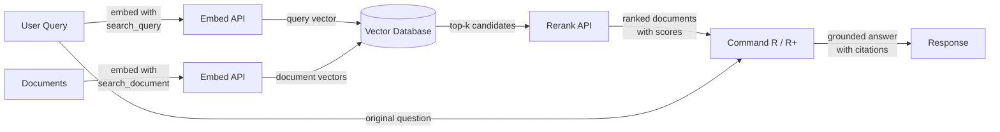

# Cohere

## Definición

**Cohere** es una empresa de IA empresarial que construye modelos de lenguaje y APIs específicamente diseñadas para aplicaciones de negocio, con un enfoque distintivo en búsqueda, recuperación de información y generación aumentada por recuperación (RAG). A diferencia de los proveedores de propósito general que ofrecen una amplia gama de características para consumidores y desarrolladores, Cohere apunta a clientes empresariales que necesitan infraestructura NLP confiable y lista para producción — particularmente para casos de uso donde *encontrar y presentar la información correcta* es el problema central.

La línea de modelos de Cohere refleja este enfoque. **Command R** y **Command R+** son modelos conversacionales y de seguimiento de instrucciones optimizados específicamente para flujos de trabajo de RAG — soportan ventanas de contexto largas y están entrenados para seguir prompts fundamentados en recuperación de manera confiable. **Embed** proporciona embeddings de vectores densos multilingües de última generación en más de 100 idiomas, convirtiéndolo en la opción predilecta para aplicaciones de búsqueda empresarial global. **Rerank** es un modelo cross-encoder que toma un conjunto inicial de documentos recuperados y los vuelve a puntuar frente a la consulta original para lograr una precisión que la recuperación dispersa y densa por sí sola no puede alcanzar.

Lo que diferencia a Cohere de los proveedores de propósito general como OpenAI es que toda su suite de productos está diseñada alrededor del pipeline de recuperación como flujo de trabajo de primera clase. Los modelos Embed, Rerank y Command R están construidos para trabajar juntos como una pila cohesiva, y Cohere ofrece opciones de despliegue en las instalaciones y en nube privada que cumplen con estrictos requisitos de gobernanza de datos empresariales y de cumplimiento — una distinción crítica para industrias reguladas como finanzas, salud y gobierno.

## Cómo funciona

### Chat y Generate API

Los modelos Command R y Command R+ se acceden a través de la Chat API de Cohere y soportan tanto interacciones conversacionales de múltiples turnos como tareas de generación de un solo turno. Command R+ es la variante más grande y capaz, adecuada para razonamiento complejo y RAG con muchos documentos, mientras que Command R está optimizado para menor latencia y costo en pipelines de producción de alto rendimiento. Ambos modelos aceptan un parámetro `documents` que te permite pasar contexto recuperado directamente al prompt, habilitando un modo RAG nativo donde el modelo está instruido para basar su respuesta en el contenido suministrado y citar fuentes.

### Embed API (embeddings multilingües)

La Embed API convierte texto en representaciones de vectores densos adecuadas para búsqueda de similitud semántica. Los modelos de embedding de Cohere soportan más de 100 idiomas en un solo modelo, haciendo posible la búsqueda interlingüística y la recuperación de documentos multilingüe sin modelos específicos para cada idioma. Los embeddings pueden generarse con diferentes valores de `input_type` — `search_document` para indexar contenido en reposo y `search_query` para codificar consultas en tiempo de ejecución — una distinción que aplica señales de entrenamiento asimétricas y típicamente mejora la precisión de recuperación en comparación con esquemas de embedding simétrico.

### Rerank API

La Rerank API acepta una consulta y una lista de documentos candidatos (generalmente los k mejores resultados de una búsqueda vectorial o por palabras clave) y devuelve cada documento con una puntuación de relevancia calculada por un cross-encoder. Los cross-encoders evalúan la consulta y el documento conjuntamente en un solo paso hacia adelante, dando una precisión mucho mayor que los bi-encoders que codifican la consulta y el documento por separado. El reranking es un paso ligero pero muy efectivo que mejora drásticamente la precisión@k — es más valioso cuando la recuperación inicial es relativamente económica (búsqueda BM25 o ANN) pero la precisión necesita maximizarse antes de pasar el contexto a un LLM.

### Integración RAG

La integración RAG de Cohere une Embed, Rerank y Command R en un pipeline unificado. El flujo típico es: embeber la consulta, ejecutar búsqueda de vecino más próximo aproximado en una base de datos vectorial, hacer reranking de los mejores candidatos para obtener los documentos más relevantes, luego pasar esos documentos a Command R con la consulta original para generación fundamentada. El modelo devuelve una respuesta junto con objetos de cita que hacen referencia a pasajes específicos en los documentos recuperados, facilitando la construcción de aplicaciones de IA auditables y con fuentes citadas.



## Cuándo usar / Cuándo NO usar

| Usar cuando | Evitar cuando |
|----------|------------|
| Construyes búsqueda empresarial o preguntas y respuestas sobre base de conocimientos donde la precisión de recuperación es crítica | Necesitas asistencia de chat de propósito general sin componente de recuperación |
| Tu contenido abarca múltiples idiomas y necesitas un solo modelo de embedding para todos ellos | Tu caso de uso es principalmente imagen, audio o multimodal — Cohere es solo texto |
| Quieres agregar un paso de reranking para mejorar la precisión después de una búsqueda vectorial o BM25 inicial | Necesitas razonamiento, matemáticas o codificación muy capaces para tareas independientes (GPT-4o o Claude pueden superar el rendimiento) |
| Los requisitos de gobernanza de datos exigen despliegue en las instalaciones o en nube privada | Tu proyecto es un prototipo rápido y quieres el ecosistema más amplio de integraciones |
| Necesitas citas de fuentes y fundamentación en documentos de forma nativa en la salida del modelo | El presupuesto es extremadamente ajustado — los precios empresariales de Cohere son más altos que algunas alternativas |

## Comparaciones

| Criterio | Cohere | OpenAI | Mistral |
|----------|--------|--------|---------|
| Calidad de embedding (MTEB) | Nivel superior multilingüe, 100+ idiomas | Fuerte en inglés primero (text-embedding-3-large) | Competitivo; mistral-embed disponible |
| Reranking | Rerank API nativa (cross-encoder) | Sin endpoint de reranking nativo | Sin endpoint de reranking nativo |
| Modelos nativos para RAG | Command R/R+ diseñados para RAG con citas | GPT-4o funciona bien con prompts de RAG pero no es RAG-nativo | Mixtral/Mistral funcionan con prompts de RAG |
| Pesos abiertos | No (solo API propietaria) | No (solo API propietaria) | Sí (modelos Mistral en Hugging Face) |
| En las instalaciones / nube privada | Sí (contratos empresariales) | Azure OpenAI (limitado) | Sí (auto-alojar pesos abiertos) |
| Embedding multilingüe | Modelo único, 100+ idiomas | Soporte multilingüe separado o limitado | Soporte de embedding multilingüe limitado |
| Modelo de precios | Empresa / pago por token | Pago por token, bien documentado | Pago por token; opción de auto-alojamiento gratuita |

## Pros y contras

| Pros | Contras |
|------|------|
| Mejores embeddings multilingües en su clase en un solo modelo | Ecosistema general más pequeño comparado con OpenAI |
| La Rerank API nativa mejora significativamente la precisión de recuperación | Sin opción de pesos abiertos para auto-alojamiento |
| Command R/R+ están específicamente diseñados para RAG fundamentado y citado | Menos capaz que GPT-4o / Claude para razonamiento independiente complejo |
| Opciones de despliegue de nivel empresarial incluyendo nube privada | Documentación y recursos de la comunidad más escasos que OpenAI |
| Los componentes del pipeline RAG (Embed + Rerank + Command R) funcionan como una pila coherente | Los precios pueden ser más altos para experimentos a pequeña escala |

## Ejemplos de código

### Chat con Command R

```python
import cohere

co = cohere.Client("YOUR_COHERE_API_KEY")

response = co.chat(
    model="command-r-plus",
    message="Explain retrieval-augmented generation in plain English.",
)
print(response.text)
```

### Embeddings para búsqueda semántica

```python
import cohere

co = cohere.Client("YOUR_COHERE_API_KEY")

# Embed documents at indexing time
documents = [
    "Cohere specializes in enterprise NLP and semantic search.",
    "RAG combines retrieval with language model generation.",
    "Multilingual embeddings support over 100 languages.",
]
doc_embeddings = co.embed(
    texts=documents,
    model="embed-multilingual-v3.0",
    input_type="search_document",
).embeddings

# Embed a query at search time
query_embedding = co.embed(
    texts=["What does Cohere specialize in?"],
    model="embed-multilingual-v3.0",
    input_type="search_query",
).embeddings[0]

# Compute cosine similarity (or use a vector DB)
import numpy as np

doc_array = np.array(doc_embeddings)
query_array = np.array(query_embedding)
scores = doc_array @ query_array / (
    np.linalg.norm(doc_array, axis=1) * np.linalg.norm(query_array)
)
top_idx = int(np.argmax(scores))
print(f"Most relevant: '{documents[top_idx]}' (score: {scores[top_idx]:.4f})")
```

### Reranking de candidatos recuperados

```python
import cohere

co = cohere.Client("YOUR_COHERE_API_KEY")

query = "How does multilingual embedding work?"
candidates = [
    "Cohere Embed supports over 100 languages in a single model.",
    "Command R+ is optimized for RAG workflows with long context.",
    "Rerank re-scores retrieved documents with a cross-encoder.",
    "BM25 is a classic keyword-based retrieval algorithm.",
]

results = co.rerank(
    model="rerank-multilingual-v3.0",
    query=query,
    documents=candidates,
    top_n=3,
)

for hit in results.results:
    print(f"[{hit.relevance_score:.4f}] {candidates[hit.index]}")
```

### Pipeline RAG completo con citas de Command R+

```python
import cohere

co = cohere.Client("YOUR_COHERE_API_KEY")

# Documents retrieved from your vector store (simplified)
retrieved_docs = [
    {"id": "doc1", "text": "Cohere Embed supports 100+ languages for multilingual search."},
    {"id": "doc2", "text": "Command R+ is designed for grounded generation with source citations."},
    {"id": "doc3", "text": "Rerank improves precision by re-scoring candidates with a cross-encoder."},
]

response = co.chat(
    model="command-r-plus",
    message="How does Cohere's pipeline improve search quality?",
    documents=retrieved_docs,
)

print(response.text)
print("\n--- Citations ---")
for citation in response.citations:
    print(f"  [{citation.start}:{citation.end}] → {[doc['id'] for doc in citation.documents]}")
```

## Recursos prácticos

- [Documentación de la API de Cohere](https://docs.cohere.com/) — Referencia completa de todas las APIs de Cohere incluyendo Chat, Embed y Rerank
- [Documentación de Cohere Embed](https://docs.cohere.com/docs/embeddings) — Guía detallada sobre modelos de embedding, tipos de entrada y soporte multilingüe
- [Documentación de Cohere Rerank](https://docs.cohere.com/docs/reranking) — Guía de la Rerank API con ejemplos y consejos para la selección de modelos
- [Guía de RAG de Cohere](https://docs.cohere.com/docs/retrieval-augmented-generation-rag) — Recorrido completo de la construcción de un pipeline RAG con Command R
- [MTEB Leaderboard](https://huggingface.co/spaces/mteb/leaderboard) — Benchmark independiente que compara modelos de embedding incluyendo Cohere Embed

## Ver también

- [Proveedores de modelos](/docs/model-providers)
- [RAG](/docs/rag)
- [Embeddings](/docs/rag/embeddings)
- [Búsqueda semántica](/docs/semantic-search)
