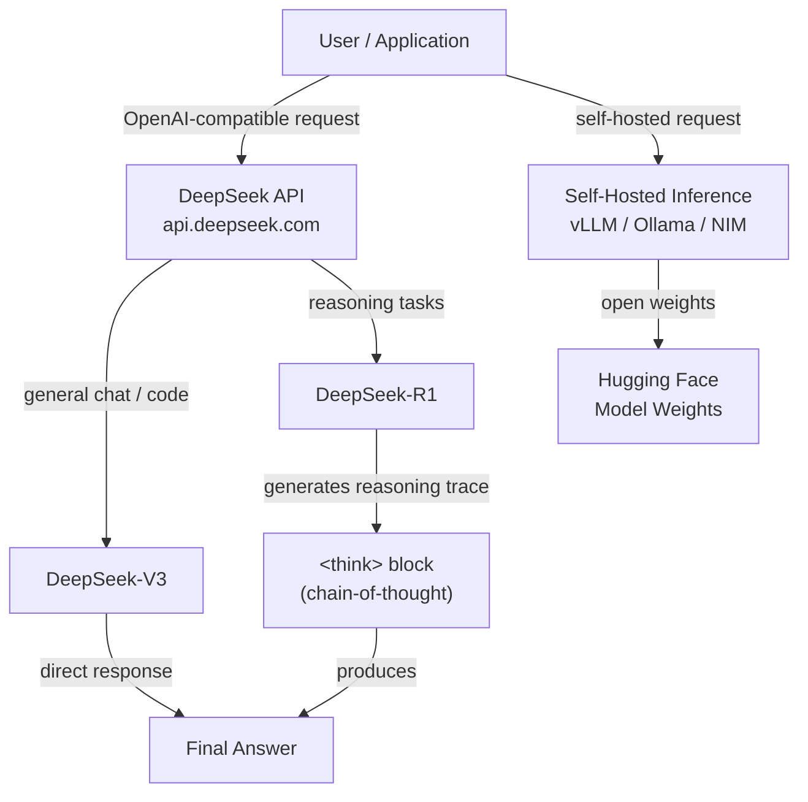

# DeepSeek

## Definición

**DeepSeek** es un laboratorio de investigación de IA chino y plataforma comercial que ha ganado considerable atención internacional por producir modelos que alcanzan un rendimiento competitivo con los mejores modelos propietarios, a la vez que publica los pesos de forma abierta y opera a una fracción del costo. Fundada en 2023 como subsidiaria de High-Flyer (un fondo de cobertura cuantitativo), el enfoque de DeepSeek se caracteriza por una investigación rigurosa sobre eficiencia en el entrenamiento — incluyendo innovaciones en arquitecturas de mezcla de expertos (MoE), aprendizaje por refuerzo a partir de retroalimentación humana y enfoques novedosos para el razonamiento que no dependen de presupuestos de cómputo masivos.

La línea de modelos abarca tres áreas principales de capacidad. **DeepSeek-V3** es un modelo de chat e instrucciones de propósito general que rivaliza con GPT-4o y Claude 3.5 Sonnet en benchmarks estándar, siendo dramáticamente más económico de acceder a través de API. **DeepSeek-R1** es un modelo de razonamiento dedicado que usa cadena de pensamiento extendida (CoT) — el modelo genera trazas de razonamiento explícitas antes de producir una respuesta final — lo que lo hace especialmente fuerte en matemáticas, deducción lógica y resolución de problemas de múltiples pasos. **DeepSeek-Coder** (y sus variantes sucesoras integradas en V3/R1) se especializa en generación de código, autocompletado y depuración en una amplia gama de lenguajes de programación.

El enfoque de pesos abiertos de DeepSeek significa que todos los modelos principales están disponibles en Hugging Face y pueden ser auto-alojados en tu propia infraestructura — una capacidad crítica para organizaciones con requisitos de soberanía de datos o aquellas que buscan evitar costos de API por token a escala. La plataforma DeepSeek también expone una API compatible con el formato de la API de OpenAI, lo que significa que cualquier aplicación construida con el SDK de Python de OpenAI puede cambiar a modelos DeepSeek modificando únicamente `base_url` y la clave de API sin otros cambios de código.

## Cómo funciona

### Plataforma de API

DeepSeek aloja una API de inferencia en la nube en `api.deepseek.com` que acepta solicitudes en el formato OpenAI Chat Completions. Esta capa de compatibilidad significa que la sobrecarga de integración es mínima — los desarrolladores familiarizados con el SDK de OpenAI pueden migrar o probar modelos DeepSeek en minutos. La plataforma soporta respuestas en streaming, llamadas a funciones y prompts de sistema. Los precios son por token y están listados públicamente, con tarifas que típicamente son un 90-95% más bajas que los modelos de nivel equivalente de OpenAI, lo que hace que los despliegues de producción a alto volumen sean sustancialmente más económicos.

### Modelos de razonamiento (DeepSeek-R1)

DeepSeek-R1 está entrenado usando un proceso de múltiples etapas que incorpora aprendizaje por refuerzo para recompensar al modelo por producir respuestas finales correctas — crucialmente, sin depender de datos de cadena de pensamiento supervisados en la etapa central de entrenamiento. El modelo genera un bloque `<think>` que contiene su traza de razonamiento antes de la respuesta final. Este bloc de notas explícito permite al modelo realizar deducciones de múltiples pasos, verificar su trabajo y retroceder desde caminos incorrectos — comportamientos que mejoran drásticamente el rendimiento en problemas de olimpiadas de matemáticas, lógica formal y tareas de codificación complejas que requieren planificación en muchos pasos.

### Modelos de código y DeepSeek-Coder

Los modelos especializados en código de DeepSeek están pre-entrenados en grandes corpus de código fuente (GitHub, plataformas de programación competitiva, documentación) y ajustados para seguir instrucciones en tareas de codificación. Soportan completado fill-in-the-middle (FIM), que es el formato estándar utilizado por las herramientas de autocompletado de IDE como Copilot. DeepSeek-Coder logra el mejor rendimiento en HumanEval, MBPP y SWE-bench, frecuentemente superando modelos varias veces más grandes de otros proveedores. Las capacidades de codificación también están integradas en DeepSeek-V3 y R1, por lo que los modelos de propósito general también rinden bien en tareas de código.

### Despliegue de pesos abiertos

Todos los modelos principales de DeepSeek tienen sus pesos publicados en Hugging Face bajo licencias permisivas, lo que permite la inferencia auto-alojada en hardware GPU de consumo o empresarial. DeepSeek-V3 usa una arquitectura de mezcla de expertos donde solo un subconjunto de parámetros se activa por token, reduciendo el costo de inferencia significativamente en comparación con modelos densos de capacidad comparable. Las opciones de despliegue populares incluyen vLLM, Ollama (para versiones cuantizadas) y contenedores NVIDIA NIM. El despliegue auto-alojado es particularmente atractivo para cargas de trabajo de procesamiento por lotes a gran escala, ajuste fino de datos propietarios o escenarios donde todos los datos deben permanecer en las instalaciones.



## Cuándo usar / Cuándo NO usar

| Usar cuando | Evitar cuando |
|----------|------------|
| El costo es una restricción principal — la API de DeepSeek es más de 90% más barata que GPT-4o con calidad comparable | Necesitas un proveedor con SLA empresarial establecido, certificaciones de cumplimiento (SOC 2, HIPAA) o procesamiento de datos en EE. UU. |
| Las tareas requieren razonamiento profundo de múltiples pasos: matemáticas, lógica, pruebas formales, codificación compleja | Tu tarea es principalmente multimodal — DeepSeek-V3/R1 son modelos solo de texto |
| Quieres auto-alojar modelos de pesos abiertos para soberanía de datos o ajuste fino personalizado | Necesitas el ecosistema de plugins/herramientas más amplio posible e integraciones de terceros |
| Construyes pipelines de procesamiento por lotes de alto volumen donde la reducción del costo por token se acumula significativamente | Aplicaciones de consumidor donde la latencia es crítica, ya que la traza de razonamiento de R1 agrega tiempo de respuesta |
| La generación de código, revisión de código o depuración son tus casos de uso principales | Estás en una jurisdicción con requisitos regulatorios sobre el origen de los modelos de IA |

## Comparaciones

| Criterio | DeepSeek (V3 / R1) | OpenAI (GPT-4o / o1) | Meta / Llama |
|----------|--------------------|----------------------|--------------|
| Rendimiento de razonamiento | R1 competitivo con o1 en benchmarks de matemáticas/lógica | o1 es de primer nivel; GPT-4o fuerte en razonamiento general | Llama 3.x competitivo pero por debajo de R1/o1 en razonamiento difícil |
| Calidad de chat general | V3 competitivo con GPT-4o | GPT-4o mejor en su clase en calidad general | Llama 3.3 70B competitivo para su tamaño |
| Pesos abiertos | Sí (todos los modelos en Hugging Face) | No (solo propietario) | Sí (Meta hace open-source de Llama) |
| Costo de API | Muy bajo (~$0.27/M tokens de entrada para V3) | Alto (~$2.50/M para entrada de GPT-4o) | Gratis (auto-alojado); API de Fireworks/Together asequible |
| Ecosistema e integraciones | En crecimiento; la API compatible con OpenAI facilita la adopción | Mayor ecosistema, más integraciones | Gran ecosistema de código abierto |
| Soberanía de datos | Auto-alojamiento posible; datos de API procesados en China | Azure OpenAI para procesamiento en región de EE. UU. | Auto-alojamiento completo posible |
| Multimodal | Solo texto (V3/R1) | Sí (GPT-4o, DALL-E) | Llama 3.2 tiene capacidades de visión |

## Pros y contras

| Pros | Contras |
|------|------|
| Costo de API dramáticamente más bajo que OpenAI/Anthropic | Los datos de API se enrutan a través de servidores chinos — preocupación para algunas industrias reguladas |
| R1 ofrece rendimiento de razonamiento de nivel frontera | Las trazas de razonamiento de R1 agregan latencia y uso de tokens |
| API compatible con OpenAI — costo de cambio casi nulo | Menor reconocimiento de confianza/marca en ciclos de ventas empresariales occidentales |
| Los pesos abiertos permiten auto-alojamiento y ajuste fino | V3/R1 son solo texto; sin capacidades nativas de imagen o audio |
| Fuerte generación de código en la mayoría de los lenguajes convencionales | La comunidad y documentación principalmente en chino; los recursos en inglés aún se están desarrollando |

## Ejemplos de código

### Completado de chat con DeepSeek-V3 (compatible con OpenAI)

```python
from openai import OpenAI

# DeepSeek uses the OpenAI SDK with a custom base_url
client = OpenAI(
    api_key="YOUR_DEEPSEEK_API_KEY",
    base_url="https://api.deepseek.com",
)

response = client.chat.completions.create(
    model="deepseek-chat",  # maps to DeepSeek-V3
    messages=[
        {"role": "system", "content": "You are a helpful AI assistant."},
        {"role": "user", "content": "Explain the difference between MoE and dense transformer architectures."},
    ],
    temperature=0.7,
    max_tokens=1024,
)

print(response.choices[0].message.content)
```

### Razonamiento con DeepSeek-R1 (cadena de pensamiento)

```python
from openai import OpenAI

client = OpenAI(
    api_key="YOUR_DEEPSEEK_API_KEY",
    base_url="https://api.deepseek.com",
)

response = client.chat.completions.create(
    model="deepseek-reasoner",  # maps to DeepSeek-R1
    messages=[
        {
            "role": "user",
            "content": (
                "A train leaves City A at 08:00 and travels at 120 km/h. "
                "Another train leaves City B (300 km away) at 09:00 and travels "
                "toward City A at 80 km/h. At what time do they meet?"
            ),
        }
    ],
)

# R1 exposes the reasoning trace in reasoning_content
message = response.choices[0].message
if hasattr(message, "reasoning_content") and message.reasoning_content:
    print("=== Reasoning trace ===")
    print(message.reasoning_content)
    print()

print("=== Final answer ===")
print(message.content)
```

### Respuesta en streaming con DeepSeek-V3

```python
from openai import OpenAI

client = OpenAI(
    api_key="YOUR_DEEPSEEK_API_KEY",
    base_url="https://api.deepseek.com",
)

stream = client.chat.completions.create(
    model="deepseek-chat",
    messages=[
        {"role": "user", "content": "Write a Python function that implements binary search."},
    ],
    stream=True,
)

for chunk in stream:
    delta = chunk.choices[0].delta
    if delta.content:
        print(delta.content, end="", flush=True)
print()
```

### Inferencia auto-alojada con vLLM

```python
# Start vLLM server (run in terminal):
# vllm serve deepseek-ai/DeepSeek-V3 --tensor-parallel-size 4 --port 8000

from openai import OpenAI

# Point to your local vLLM server instead of DeepSeek cloud
client = OpenAI(
    api_key="not-needed",  # vLLM does not require a real key
    base_url="http://localhost:8000/v1",
)

response = client.chat.completions.create(
    model="deepseek-ai/DeepSeek-V3",
    messages=[
        {"role": "user", "content": "Summarize the key advantages of mixture-of-experts models."},
    ],
)

print(response.choices[0].message.content)
```

## Recursos prácticos

- [Documentación de la API de DeepSeek](https://platform.deepseek.com/api-docs/) — Referencia oficial de la API de la plataforma DeepSeek incluyendo modelos, parámetros y precios
- [GitHub de DeepSeek](https://github.com/deepseek-ai) — Repositorios de código abierto para modelos DeepSeek, código de entrenamiento e investigaciones
- [DeepSeek-R1 en Hugging Face](https://huggingface.co/deepseek-ai/DeepSeek-R1) — Ficha del modelo con pesos, resultados de benchmarks e instrucciones de despliegue
- [Informe técnico de DeepSeek-V3](https://arxiv.org/abs/2412.19437) — Artículo de investigación que detalla la arquitectura V3, el enfoque de entrenamiento y las comparaciones de benchmarks
- [Guía de despliegue de DeepSeek con vLLM](https://docs.vllm.ai/en/latest/models/supported_models.html) — Instrucciones para auto-alojar modelos DeepSeek con vLLM para inferencia en producción

## Ver también

- [Proveedores de modelos](/docs/model-providers)
- [Caso de estudio DeepSeek](/docs/case-studies/deepseek)
- [Patrones de razonamiento](/docs/reasoning-patterns)
