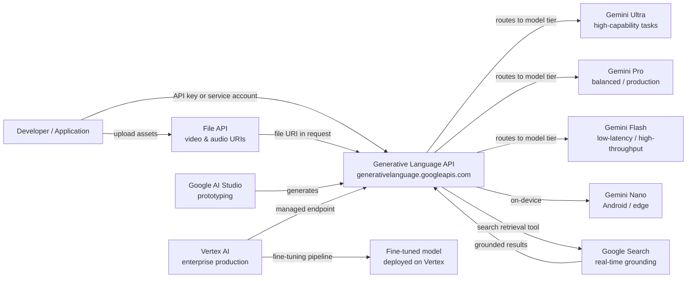

# Google Gemini

## Definición

Google Gemini es la familia insignia de modelos de lenguaje grande multimodales de Google y la plataforma que los rodea. Anunciado a finales de 2023 y sucesor de la familia PaLM 2, Gemini fue diseñado desde cero para razonar sobre texto, imágenes, video, audio y código dentro de una única arquitectura de modelo unificada. A diferencia de los sistemas que agregan visión a través de pipelines separados, la multimodalidad nativa de Gemini significa que el modelo procesa todas las modalidades de forma conjunta durante el entrenamiento y la inferencia, permitiendo un razonamiento inter-modal más rico.

La familia Gemini abarca cuatro niveles ajustados para diferentes casos de uso: **Gemini Ultra** (el más capaz, orientado a tareas empresariales e investigación complejas), **Gemini Pro** (el motor equilibrado para uso comercial amplio), **Gemini Flash** (optimizado para aplicaciones de baja latencia y alto rendimiento a costo reducido) y **Gemini Nano** (inferencia en dispositivo para Android y hardware de borde). Cada nivel tiene versiones (por ejemplo, Gemini 1.5 Pro, Gemini 2.0 Flash), y Google lanza nuevas versiones de forma continua.

Los desarrolladores acceden a Gemini a través de dos superficies complementarias. **Google AI Studio** es un entorno de prototipado gratuito basado en navegador que proporciona claves de API y permite experimentar con prompts, instrucciones de sistema y entradas multimodales sin configuración de infraestructura. **Vertex AI** es la plataforma ML gestionada de Google Cloud y el camino recomendado para cargas de trabajo en producción — agrega controles empresariales como VPC Service Controls, IAM, registro de auditoría, pipelines de ajuste fino y endpoints con SLA respaldado. Ambas superficies consumen los mismos modelos Gemini subyacentes a través de la API de Lenguaje Generativo.

## Cómo funciona

### API de Lenguaje Generativo

La API de Lenguaje Generativo (`generativelanguage.googleapis.com`) es la interfaz REST unificada para todos los modelos Gemini. Las solicitudes se estructuran como un array `contents` — cada elemento tiene un `role` (`user` o `model`) y una o más `parts` (texto, datos en línea o URIs de archivos). La API devuelve un array `candidates` con `content`, `finishReason` y `safetyRatings`. Los recuentos de tokens, los metadatos de fundamentación y las respuestas de llamadas a funciones se devuelven en el mismo envelope. Las claves de API de AI Studio funcionan para desarrollo; las cargas de trabajo en producción usan credenciales de cuenta de servicio a través de Vertex AI.

### Entradas multimodales — imagen, video y audio

Gemini acepta imágenes (JPEG, PNG, WebP, HEIC), video (MP4, MOV, AVI de hasta varias horas) y audio (MP3, WAV, FLAC) directamente junto con texto en una sola solicitud. Las imágenes pueden enviarse como datos base64 en línea o a través de URIs de Cloud Storage. Para videos largos, la File API carga el activo de forma asíncrona y devuelve un URI de archivo que puede referenciarse en llamadas subsiguientes a `generateContent`. El modelo tokeniza internamente las modalidades no textuales, por lo que los mismos mecanismos de contabilidad de ventana de contexto y atención se aplican de manera uniforme, habilitando tareas como "resumir la pista de audio de este video e identificar cuándo el hablante cambia de tema".

### Fundamentación con Google Search

Gemini soporta generación fundamentada por recuperación a través de un parámetro `tools` opcional que habilita `google_search_retrieval`. Cuando esta herramienta está activa, el modelo puede emitir consultas de búsqueda durante la generación, recuperar resultados web en tiempo real y sintetizarlos en su respuesta — devolviendo citas junto con el texto generado. Esto es especialmente valioso para consultas factualmente densas o con sensibilidad temporal donde un modelo paramétrico estático alucinaria o devolvería información desactualizada. La fundamentación está disponible tanto en AI Studio como en Vertex AI y puede combinarse con otras herramientas.

### Integración con Vertex AI

En Vertex AI, se accede a Gemini a través del SDK de Python `vertexai` (`aiplatform`). Vertex agrega ajuste fino (pipelines de ajuste fino supervisado y RLHF), conjuntos de datos de evaluación de modelos, jardines de modelos para comparar modelos, despliegue en endpoints dedicados con autoescalado y Vertex AI Pipelines para orquestar flujos de trabajo ML de extremo a extremo. Los clientes empresariales se benefician de garantías de residencia de datos, redes privadas a través de VPC Service Controls y Cloud Audit Logs para cada llamada a la API — características no disponibles en AI Studio.



## Cuándo usar / Cuándo NO usar

| Usar cuando | Evitar cuando |
|----------|------------|
| Necesitas razonamiento multimodal nativo sobre imágenes, video o audio junto con texto | Tu carga de trabajo es solo texto y prefieres un proveedor con un historial más largo de API pública |
| Ya estás en Google Cloud y quieres una integración profunda con Vertex AI / GCP (IAM, VPC, Audit Logs) | Tienes estrictos requisitos de residencia de datos en regiones donde Vertex AI aún no está disponible |
| Requieres fundamentación en tiempo real a través de Google Search | Tu aplicación necesita salidas deterministas y reproducibles (la fundamentación introduce variabilidad de la búsqueda en vivo) |
| La eficiencia de costos a escala importa — Gemini Flash es muy competitivo en precio por token | Necesitas un modelo de pesos abiertos extensamente documentado que puedas ejecutar en las instalaciones |
| Quieres un entorno de prototipado gratuito y sin fricción sin tarjeta de crédito (nivel gratuito de AI Studio) | Tu equipo ya está profundamente invertido en la superficie de la API de OpenAI y el costo de migración es alto |

## Comparaciones

| Criterio | Google Gemini | OpenAI GPT-4o | Anthropic Claude 3.5 |
|-----------|--------------|--------------|----------------------|
| Capacidad multimodal | Nativa — texto, imagen, video, audio en un modelo | Texto + imagen (GPT-4V); audio a través de APIs separadas Whisper/TTS | Texto + imagen (Claude 3); sin video/audio nativo |
| Integración empresarial / nube | Integración profunda con GCP a través de Vertex AI — IAM, VPC, Audit Logs, ajuste fino | Azure OpenAI Service para empresas; portabilidad de nube limitada fuera de Azure | AWS Bedrock y API directa; sin integración nativa con GCP |
| Fundamentación / recuperación en tiempo real | Herramienta de fundamentación con Google Search integrada | Plugin de navegación web (ChatGPT); sin fundamentación nativa de API | Sin búsqueda integrada; depende del RAG proporcionado por el usuario |
| Ventana de contexto | Hasta 1M tokens (Gemini 1.5 Pro) | 128k tokens (GPT-4o) | 200k tokens (Claude 3.5 Sonnet) |
| Disponibilidad de pesos abiertos | Solo API cerrada | Solo API cerrada | Solo API cerrada |
| Modelo de precios | Por token; nivel Flash muy competitivo | Por token; GPT-4o de rango medio | Por token; comparable a GPT-4o |
| Ajuste fino | Ajuste fino supervisado en Vertex AI | API de ajuste fino para GPT-3.5/4o-mini | Sin API de ajuste fino pública |

## Ejemplos de código

```python
# google_gemini_examples.py
# Demonstrates text generation, multimodal image input, and embeddings
# using the google-generativeai SDK.
# pip install google-generativeai pillow

import google.generativeai as genai
import pathlib

# ── Configuration ─────────────────────────────────────────────────────────────
# Set your API key from https://aistudio.google.com/app/apikey
genai.configure(api_key="YOUR_API_KEY")


# ── 1. Text generation ────────────────────────────────────────────────────────
def text_generation_example():
    """Simple single-turn text completion with Gemini Flash."""
    model = genai.GenerativeModel(
        model_name="gemini-1.5-flash",
        system_instruction="You are a concise technical writer.",
    )

    response = model.generate_content(
        "Explain the difference between supervised and unsupervised learning "
        "in three sentences.",
        generation_config=genai.GenerationConfig(
            temperature=0.4,
            max_output_tokens=256,
        ),
    )

    print("=== Text Generation ===")
    print(response.text)
    print(f"Finish reason : {response.candidates[0].finish_reason}")
    print(f"Total tokens  : {response.usage_metadata.total_token_count}")


# ── 2. Multimodal — image input ───────────────────────────────────────────────
def multimodal_image_example(image_path: str):
    """
    Send a local image alongside a text prompt to Gemini Pro.
    The model reasons over both modalities jointly.
    """
    model = genai.GenerativeModel("gemini-1.5-pro")

    image_data = pathlib.Path(image_path).read_bytes()
    # Inline image part
    image_part = {
        "mime_type": "image/jpeg",  # adjust to image/png, image/webp as needed
        "data": image_data,
    }

    response = model.generate_content(
        [image_part, "Describe this image and identify any text present in it."]
    )

    print("\n=== Multimodal Image Input ===")
    print(response.text)


# ── 3. Embeddings ─────────────────────────────────────────────────────────────
def embeddings_example(texts: list[str]):
    """
    Generate text embeddings using the text-embedding-004 model.
    Embeddings can be used for semantic search, clustering, and classification.
    """
    result = genai.embed_content(
        model="models/text-embedding-004",
        content=texts,
        task_type="retrieval_document",  # or retrieval_query, semantic_similarity
    )

    print("\n=== Embeddings ===")
    for text, embedding in zip(texts, result["embedding"]):
        print(f"Text    : {text[:60]}...")
        print(f"Dims    : {len(embedding)}")
        print(f"First 5 : {embedding[:5]}\n")


# ── 4. Multi-turn chat ────────────────────────────────────────────────────────
def multi_turn_chat_example():
    """Maintain conversational context using the chat interface."""
    model = genai.GenerativeModel("gemini-1.5-flash")
    chat = model.start_chat(history=[])

    turns = [
        "What is gradient descent?",
        "How does the learning rate affect it?",
        "What is Adam optimizer and how does it improve on basic gradient descent?",
    ]

    print("\n=== Multi-turn Chat ===")
    for user_message in turns:
        response = chat.send_message(user_message)
        print(f"User  : {user_message}")
        print(f"Model : {response.text}\n")


# ── Entry point ───────────────────────────────────────────────────────────────
if __name__ == "__main__":
    text_generation_example()

    # Provide a path to a local JPEG/PNG for multimodal demo
    # multimodal_image_example("path/to/your/image.jpg")

    embeddings_example([
        "Machine learning is a subset of artificial intelligence.",
        "Deep learning uses neural networks with many layers.",
        "Reinforcement learning trains agents through reward signals.",
    ])

    multi_turn_chat_example()
```

## Recursos prácticos

- [Google AI Studio](https://aistudio.google.com/) — Entorno gratuito basado en navegador para prototipado con Gemini; genera claves de API y permite ajustar prompts de forma interactiva sin infraestructura requerida.
- [Documentación de la API de Gemini](https://ai.google.dev/gemini-api/docs) — Referencia oficial que cubre todos los modelos, endpoints, formatos de entrada multimodal, fundamentación, llamada a funciones y la File API.
- [Vertex AI — Documentación de IA generativa](https://cloud.google.com/vertex-ai/generative-ai/docs/overview) — Ruta empresarial: ajuste fino, evaluación de modelos, despliegue y controles de seguridad de GCP.
- [SDK de Python google-generativeai en PyPI](https://pypi.org/project/google-generativeai/) — Fuente del SDK, registro de cambios y ejemplos de uso.

## Ver también

- [Proveedores de modelos](/docs/model-providers)
- [IA multimodal](/docs/multimodal-ai)
- [Casos de estudio — Gemini](/docs/case-studies/gemini)
