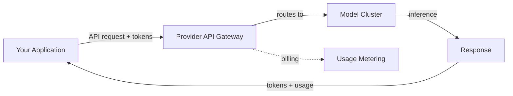
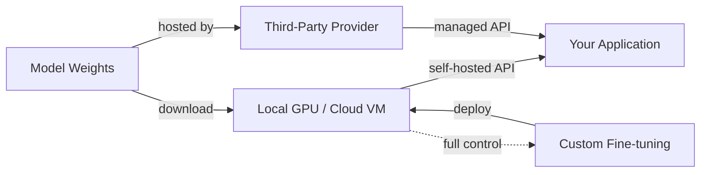

# Proveedores de modelos

## Definición

Un proveedor de modelos es una organización que ofrece acceso a modelos de lenguaje de gran escala, ya sea a través de APIs gestionadas, pesos descargables de forma abierta, o ambas opciones. La elección del proveedor determina las capacidades de tu aplicación, la estructura de costos, la postura de privacidad de datos y la flexibilidad de despliegue. Comprender el ecosistema de proveedores es un requisito previo para cualquier sistema de IA en producción.

El mercado se divide en tres categorías. Los **proveedores basados en API** como OpenAI, Anthropic y Google ofrecen modelos exclusivamente a través de APIs gestionadas — tú envías solicitudes y ellos se encargan de la infraestructura de inferencia. Los **proveedores de pesos abiertos** como Meta y Mistral publican pesos de modelos que puedes descargar y ejecutar en tu propio hardware o a través de alojamiento de terceros. Los **proveedores híbridos** como Mistral y DeepSeek ofrecen tanto modelos de pesos abiertos como acceso comercial a través de API, dando a los desarrolladores flexibilidad para elegir según sus necesidades.

Elegir un proveedor implica compromisos en múltiples dimensiones: calidad del modelo, precios, tamaño de la ventana de contexto, capacidades multimodales, privacidad de datos, soporte para ajuste fino y madurez del ecosistema. Ningún proveedor domina en todos los criterios, razón por la cual la mayoría de los sistemas en producción evalúan múltiples opciones y a veces usan diferentes proveedores para distintas tareas dentro de la misma aplicación.

## Cómo funciona

### Proveedores basados en API

Los proveedores de API alojan modelos en su infraestructura y los exponen a través de APIs REST. Te autenticas con una clave de API, envías una solicitud con tu prompt y parámetros de configuración, y recibes una respuesta. El proveedor gestiona el escalado, la asignación de GPU, las actualizaciones del modelo y el tiempo de actividad. Este es el camino más sencillo hacia la producción — sin infraestructura que gestionar — pero envías tus datos a un tercero y pagas por token.



### Proveedores de pesos abiertos

Los proveedores de pesos abiertos publican archivos de modelos (normalmente en Hugging Face) que descargas y ejecutas localmente o en tu infraestructura en la nube. Tú controlas la pila completa: selección de hardware, cuantización, framework de servicio (vLLM, TGI, llama.cpp) y escalado. Esto ofrece máxima privacidad y personalización, pero requiere experiencia en infraestructura de ML. Los proveedores de inferencia de terceros (Together AI, Groq, Fireworks) ofrecen un punto intermedio — alojan modelos abiertos con una interfaz de API.



### Elegir un proveedor

El árbol de decisión depende de tus restricciones. Comienza con tus requisitos — privacidad de datos, presupuesto, latencia, calidad del modelo — y reduce desde ahí. Muchos equipos comienzan con proveedores de API para prototipado y evalúan alternativas de pesos abiertos para optimización de costos en producción o requisitos de soberanía de datos.

## Cuándo usar / Cuándo NO usar

| Usar cuando | Evitar cuando |
|----------|------------|
| **Proveedores de API**: prototipado rápido, sin equipo de infraestructura ML, necesitas modelos de vanguardia de inmediato | Los datos no pueden salir de tu infraestructura (industrias reguladas, PII) |
| **Pesos abiertos**: requisitos de privacidad de datos, necesitas control de ajuste fino, optimización de costos a alto volumen | Carecen de infraestructura GPU y experiencia en operaciones de ML |
| **Modelos abiertos alojados por terceros**: quieres flexibilidad de modelo abierto sin gestionar infraestructura | Necesitas SLAs garantizados y soporte empresarial (usa APIs de primera parte) |
| **Múltiples proveedores**: diferentes tareas tienen diferentes requisitos de calidad/costo | Tu caso de uso es suficientemente simple para que un proveedor cubra todo |

## Comparaciones

| Criterio | OpenAI | Anthropic | Google Gemini | Meta Llama | Mistral | Cohere | DeepSeek |
|----------|--------|-----------|---------------|------------|---------|--------|----------|
| Acceso al modelo | Solo API | Solo API | API + Vertex AI | Pesos abiertos | Abierto + API | Solo API | Abierto + API |
| Modelo de nivel superior | GPT-4o, o3 | Claude Opus/Sonnet | Gemini Ultra/Pro | Llama 3.1 405B | Mistral Large | Command R+ | DeepSeek-V3 |
| Ventana de contexto | 128K | 200K | 1M+ | 128K | 128K | 128K | 128K |
| Multimodal | Visión, audio, generación de imágenes | Visión | Visión, audio, video | Visión (3.2) | Visión | Enfocado en texto | Enfocado en texto |
| Especialidad | De propósito general, ecosistema | Seguridad, contexto largo | Multimodal, búsqueda fundamentada | Pesos abiertos, personalización | Eficiencia, multilingüe | Embeddings, RAG, reranking | Razonamiento, eficiencia en costos |
| Ajuste fino | Ajuste fino por API | No disponible | Ajuste en Vertex AI | Acceso completo a pesos | Ajuste fino por API | No disponible | Acceso completo a pesos |
| Modelo de precios | Por token | Por token | Por token + nivel gratuito | Gratis (auto-alojado) o terceros | Por token + modelos gratuitos | Por token | Por token (costo muy bajo) |

## Ejemplos de código

### Llamadas de API en paralelo (Python)

```python
# OpenAI
from openai import OpenAI

openai_client = OpenAI()
openai_response = openai_client.chat.completions.create(
    model="gpt-4o",
    messages=[{"role": "user", "content": "Explain RAG in one sentence."}],
)
print("OpenAI:", openai_response.choices[0].message.content)
```

```python
# Anthropic
import anthropic

anthropic_client = anthropic.Anthropic()
anthropic_response = anthropic_client.messages.create(
    model="claude-sonnet-4-20250514",
    max_tokens=256,
    messages=[{"role": "user", "content": "Explain RAG in one sentence."}],
)
print("Anthropic:", anthropic_response.content[0].text)
```

```python
# Google Gemini
import google.generativeai as genai

model = genai.GenerativeModel("gemini-1.5-pro")
gemini_response = model.generate_content("Explain RAG in one sentence.")
print("Gemini:", gemini_response.text)
```

### Interfaz unificada con LiteLLM (Python)

```python
from litellm import completion

# Same interface, different providers
providers = {
    "OpenAI": "gpt-4o",
    "Anthropic": "claude-sonnet-4-20250514",
    "Gemini": "gemini/gemini-1.5-pro",
}

for name, model in providers.items():
    response = completion(
        model=model,
        messages=[{"role": "user", "content": "Explain RAG in one sentence."}],
    )
    print(f"{name}: {response.choices[0].message.content}")
```

## Recursos prácticos

- [Artificial Analysis](https://artificialanalysis.ai/) — Benchmarks independientes de LLMs y comparación de precios
- [LiteLLM](https://docs.litellm.ai/) — API unificada para más de 100 proveedores de LLM
- [OpenRouter](https://openrouter.ai/) — Pasarela de API única a múltiples proveedores
- [Hugging Face Open LLM Leaderboard](https://huggingface.co/spaces/open-llm-leaderboard/open_llm_leaderboard) — Benchmarks de modelos abiertos
- [LMSYS Chatbot Arena](https://chat.lmsys.org/) — Rankings de LLMs basados en evaluación humana ciega

## Ver también

- [OpenAI](/docs/model-providers/openai)
- [Anthropic](/docs/model-providers/anthropic)
- [Google Gemini](/docs/model-providers/google-gemini)
- [Meta Llama](/docs/model-providers/meta-llama)
- [Mistral](/docs/model-providers/mistral)
- [Cohere](/docs/model-providers/cohere)
- [DeepSeek](/docs/model-providers/deepseek)
- [LLMs](/docs/llms)
- [Infraestructura](/docs/infrastructure)
- [Inferencia local](/docs/local-inference)
