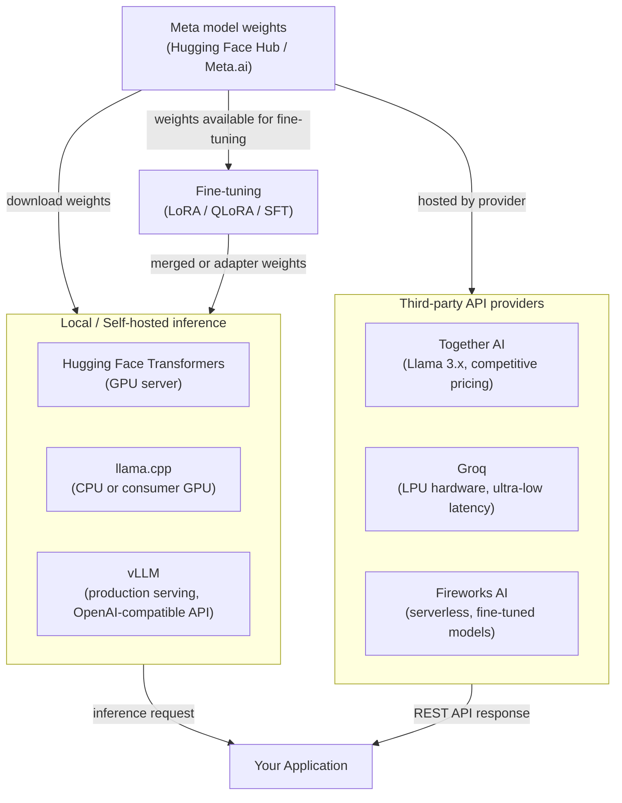

# Meta Llama

## Definición

Llama (Large Language Model Meta AI) de Meta es una familia de grandes modelos de lenguaje de pesos abiertos lanzada por Meta AI Research. A diferencia de los modelos completamente propietarios distribuidos solo a través de una API de pago, los modelos Llama se lanzan con pesos que los desarrolladores pueden descargar, inspeccionar, modificar y redistribuir bajo la licencia de comunidad personalizada de Meta. Esto significa que las organizaciones pueden ejecutar inferencia completamente dentro de su propia infraestructura, sin enrutar datos a través de un servicio de nube de terceros —una ventaja significativa para las cargas de trabajo sensibles a la privacidad. La serie comenzó en 2023 con Llama 1 y Llama 2, y alcanzó un hito importante con la generación **Llama 3**.

La **familia Llama 3** abarca múltiples tamaños y especializaciones. El lanzamiento base de Llama 3 incluyó variantes de instrucción ajustada y base de 8B y 70B parámetros. Los lanzamientos posteriores introdujeron **Llama 3.1** (con 405B parámetros, ventana de contexto extendida de 128k y mejoras multilingües), **Llama 3.2** (modelos ligeros de 1B y 3B para uso en dispositivo, más variantes multimodales de visión de 11B y 90B), y **Llama 3.3** (un modelo de 70B con rendimiento significativamente mejorado en multilingüe y razonamiento). En conjunto, estos cubren un amplio espectro desde el despliegue en el borde hasta el rendimiento cercano a la frontera.

El espacio de modelos de pesos abiertos se sitúa en la intersección de un debate filosófico y práctico: **abierto vs. cerrado**. Los defensores de los pesos abiertos argumentan que la transparencia, la auditabilidad, la innovación comunitaria y el control de costos superan la conveniencia de una API gestionada. Los críticos señalan que los modelos grandes de pesos abiertos son costosos de servir a escala, requieren experiencia en ingeniería para desplegar y asegurar, y que "pesos abiertos" no es lo mismo que "código abierto" —los datos de entrenamiento y la metodología completa permanecen propietarios. En la práctica, la mayoría de las organizaciones terminan en un híbrido: usando modelos de pesos abiertos para cargas de trabajo sensibles o con restricciones de costo mientras siguen dependiendo de proveedores de API cerrados para capacidades de vanguardia.

## Cómo funciona

### Despliegue local — transformers, llama.cpp, vLLM

La forma más directa de ejecutar modelos Llama es localmente usando **Transformers** de Hugging Face, que proporciona una interfaz Python unificada sobre cientos de arquitecturas de modelos. Para modelos más pequeños (7B–13B) en hardware de consumo, **llama.cpp** es el estándar de oro: es un motor de inferencia en C/C++ puro con soporte de cuantización GGUF que puede ejecutar Llama 3 8B en cuantización de 4 bits en una CPU de laptop o GPU modesta con latencia aceptable. Para el servicio en producción a escala, **vLLM** es la solución recomendada —implementa PagedAttention para la gestión eficiente de la caché KV, habilita el procesamiento por lotes continuo y expone una API REST compatible con OpenAI, facilitando el intercambio de Llama por cualquier integración de GPT-4 con cambios mínimos de código. Cada opción ocupa un punto diferente en la curva de compensación de latencia/rendimiento/hardware.

### Proveedores de API de terceros — Together AI, Groq, Fireworks AI

Para los equipos que quieren la flexibilidad de los modelos de pesos abiertos sin la carga de infraestructura, varios proveedores especializados albergan modelos Llama a través de APIs gestionadas. **Together AI** ofrece modelos Llama 3.x con precios competitivos por token y un SDK de Python que refleja la interfaz de OpenAI. **Groq** ejecuta modelos Llama en hardware LPU (Unidad de Procesamiento de Lenguaje) personalizado, entregando latencia extremadamente baja (a menudo milisegundos de un solo dígito por token) adecuada para aplicaciones interactivas. **Fireworks AI** se centra en despliegues de modelos ajustados y sin servidor con un fuerte enfoque en la experiencia del desarrollador. Estos proveedores son particularmente valiosos para el trabajo de prueba de concepto, las cargas de trabajo de ráfaga o los equipos sin infraestructura de GPU.

### Ajuste fino de pesos abiertos

Una de las ventajas más convincentes de los modelos de pesos abiertos es el acceso completo al ajuste fino. Las organizaciones pueden adaptar Llama a tareas específicas del dominio, requisitos de estilo o perfiles de seguridad utilizando el ajuste fino supervisado (SFT) y el aprendizaje por refuerzo con retroalimentación humana (RLHF). En la práctica, la mayoría de los profesionales usan el ajuste fino eficiente en parámetros mediante **LoRA** (Adaptación de Bajo Rango) o **QLoRA** (LoRA sobre pesos cuantizados), lo que reduce los requisitos de memoria de GPU en 4–10x. Los pesos del adaptador ajustado son pequeños en comparación con el modelo base y pueden fusionarse o cargarse por separado. Herramientas como **Hugging Face TRL**, **Axolotl** y **LLaMA-Factory** proporcionan bucles de entrenamiento de alto nivel para el ajuste fino de Llama con el mínimo de código repetitivo.



## Cuándo usar / Cuándo NO usar

| Usar cuando | Evitar cuando |
|-------------|---------------|
| La privacidad de los datos es primordial — industrias reguladas, PII, IP confidencial que no debe salir de tu infraestructura | Necesitas capacidad de frontera de vanguardia (GPT-4o / Claude 3.5 todavía superan a Llama 3 en muchos benchmarks de razonamiento complejo) |
| Control de costos a alto volumen — los costos de la API por token se acumulan rápidamente; el autoalojamiento de modelos grandes puede ser significativamente más barato por encima de ciertos umbrales de QPS | Careces de la capacidad de ingeniería de ML para gestionar la infraestructura de GPU, mantener los modelos actualizados y manejar la aplicación de parches de seguridad |
| Necesitas ajustar fino el modelo con datos propietarios para personalizar profundamente el comportamiento o el estilo | Necesitas una API gestionada lista para producción con SLAs, autoescalado y cero sobrecarga operativa hoy |
| Quieres plena auditabilidad y la capacidad de inspeccionar los pesos del modelo para propósitos de cumplimiento o pruebas de seguridad | Tu carga de trabajo requiere fundamentación web en tiempo real o multimodalidad nativa de video/audio (Llama 3.2 añade visión pero no está a la par con Gemini 1.5) |
| Quieres ejecutar inferencia en el dispositivo sin dependencia de red (Llama 3.2 1B/3B, llama.cpp) | Tu equipo está evaluando modelos rápidamente y la velocidad de iteración importa más que el control de datos |

## Comparaciones

| Criterio | Meta Llama 3.x | OpenAI GPT-4o | Mistral (pesos abiertos) |
|----------|---------------|--------------|--------------------------|
| Disponibilidad de pesos | Descarga de pesos abiertos (licencia de comunidad) | Solo API cerrada | Pesos abiertos para 7B / Mixtral; cerrado para Mistral Large |
| Tamaño del modelo más grande | 405B (Llama 3.1) | No divulgado | ~141B efectivo (Mixtral 8x22B) |
| Autoalojamiento | Totalmente soportado; llama.cpp, vLLM, Transformers | No es posible | Totalmente soportado; mismo conjunto de herramientas que Llama |
| Opciones de API gestionada | Together AI, Groq, Fireworks, AWS Bedrock, Azure AI | OpenAI directo, Azure OpenAI | La Plateforme (mistral.ai), Together AI |
| Ajuste fino | Sí — LoRA, QLoRA, SFT sobre pesos completos | Solo API de ajuste fino para GPT-3.5/4o-mini | Sí — mismo conjunto de herramientas de pesos abiertos |
| Multimodal | Llama 3.2 (visión 11B/90B) | GPT-4o (texto + imagen, audio de forma nativa) | Solo texto para modelos abiertos; Pixtral a través de API |
| Soberanía de datos en Europa | Posible con autoalojamiento en región UE | Limitado (solo regiones de Azure UE) | Proveedor nativo de la UE (sede central en París) |

## Ejemplos de código

```python
# meta_llama_examples.py
# Demonstrates two deployment paths:
#   1. Local inference with Hugging Face Transformers
#   2. Third-party API via Together AI (OpenAI-compatible interface)
#
# pip install transformers accelerate torch together

# ─────────────────────────────────────────────────────────────────────────────
# Path 1: Local inference with Hugging Face Transformers
# Requires a GPU with enough VRAM (e.g. RTX 3090 for 8B in bfloat16,
# or use load_in_4bit=True with bitsandbytes for lower VRAM).
# ─────────────────────────────────────────────────────────────────────────────
from transformers import AutoTokenizer, AutoModelForCausalLM
import torch


def local_llama_inference(prompt: str, model_id: str = "meta-llama/Meta-Llama-3.1-8B-Instruct"):
    """
    Run Llama 3.1 8B Instruct locally.
    Requires a Hugging Face token with access granted at meta-llama/Meta-Llama-3.1-8B-Instruct.
    Set HF_TOKEN environment variable or pass token= to from_pretrained.
    """
    tokenizer = AutoTokenizer.from_pretrained(model_id)
    model = AutoModelForCausalLM.from_pretrained(
        model_id,
        torch_dtype=torch.bfloat16,
        device_map="auto",          # automatically distribute across available GPUs
        # load_in_4bit=True,        # uncomment for QLoRA / low VRAM inference
    )

    # Llama 3 instruct models use a chat template
    messages = [
        {"role": "system", "content": "You are a helpful data science assistant."},
        {"role": "user", "content": prompt},
    ]
    input_ids = tokenizer.apply_chat_template(
        messages,
        add_generation_prompt=True,
        return_tensors="pt",
    ).to(model.device)

    outputs = model.generate(
        input_ids,
        max_new_tokens=512,
        temperature=0.6,
        top_p=0.9,
        do_sample=True,
        eos_token_id=tokenizer.eos_token_id,
    )

    # Decode only the generated tokens (skip the input)
    generated = outputs[0][input_ids.shape[-1]:]
    return tokenizer.decode(generated, skip_special_tokens=True)


# ─────────────────────────────────────────────────────────────────────────────
# Path 2: Together AI — managed Llama API (OpenAI-compatible)
# Requires a Together AI account: https://api.together.ai
# pip install together
# ─────────────────────────────────────────────────────────────────────────────
from together import Together


def together_ai_inference(prompt: str):
    """
    Call Llama 3.1 405B via Together AI's managed inference API.
    Together AI uses an OpenAI-compatible interface, so the openai SDK
    also works — just point base_url at https://api.together.xyz/v1.
    """
    client = Together(api_key="YOUR_TOGETHER_API_KEY")

    response = client.chat.completions.create(
        model="meta-llama/Meta-Llama-3.1-405B-Instruct-Turbo",
        messages=[
            {"role": "system", "content": "You are a helpful data science assistant."},
            {"role": "user", "content": prompt},
        ],
        max_tokens=512,
        temperature=0.6,
        top_p=0.9,
    )

    return response.choices[0].message.content


# ─────────────────────────────────────────────────────────────────────────────
# Path 3: vLLM — production-grade OpenAI-compatible server (run separately)
# Start server: vllm serve meta-llama/Meta-Llama-3.1-8B-Instruct --port 8000
# Then query it as if it were the OpenAI API:
# ─────────────────────────────────────────────────────────────────────────────
from openai import OpenAI


def vllm_server_inference(prompt: str, base_url: str = "http://localhost:8000/v1"):
    """
    Query a locally running vLLM server.
    vLLM exposes an OpenAI-compatible API at /v1/chat/completions.
    """
    client = OpenAI(api_key="not-needed-for-local", base_url=base_url)

    response = client.chat.completions.create(
        model="meta-llama/Meta-Llama-3.1-8B-Instruct",
        messages=[{"role": "user", "content": prompt}],
        max_tokens=256,
        temperature=0.7,
    )
    return response.choices[0].message.content


# ─────────────────────────────────────────────────────────────────────────────
if __name__ == "__main__":
    test_prompt = "Explain the bias-variance tradeoff in machine learning."

    # Uncomment to run local inference (requires GPU + HF access)
    # print("=== Local (Transformers) ===")
    # print(local_llama_inference(test_prompt))

    print("=== Together AI ===")
    print(together_ai_inference(test_prompt))

    # Uncomment if you have a vLLM server running
    # print("=== vLLM Server ===")
    # print(vllm_server_inference(test_prompt))
```

## Recursos prácticos

- [Repositorio GitHub de Llama (Meta)](https://github.com/meta-llama/llama-models) — Tarjetas de modelo oficiales, instrucciones de descarga y la licencia de comunidad para toda la familia Llama 3.
- [Llama 3 en Hugging Face](https://huggingface.co/meta-llama) — Pesos del modelo, archivos del tokenizador y ajustes finos de la comunidad; requiere una cuenta de Hugging Face con acceso concedido.
- [llama.cpp](https://github.com/ggerganov/llama.cpp) — Motor de inferencia ligero en C/C++ con cuantización GGUF; la herramienta de referencia para el despliegue en CPU y GPU de consumo.
- [Documentación de Together AI](https://docs.together.ai/) — Referencia de API de Llama gestionada, precios y guías de ajuste fino para modelos de pesos abiertos alojados.
- [Documentación de vLLM](https://docs.vllm.ai/) — Framework de servicio de producción con PagedAttention, procesamiento por lotes continuo y servidor compatible con OpenAI.

## Ver también

- [Proveedores de modelos](/docs/model-providers)
- [Inferencia local](/docs/local-inference)
- [Infraestructura](/docs/infrastructure)
- [LLMs — Ajuste fino](/docs/llms/fine-tuning)
- [Comparación Meta Llama → Mistral](/docs/model-providers/mistral)
