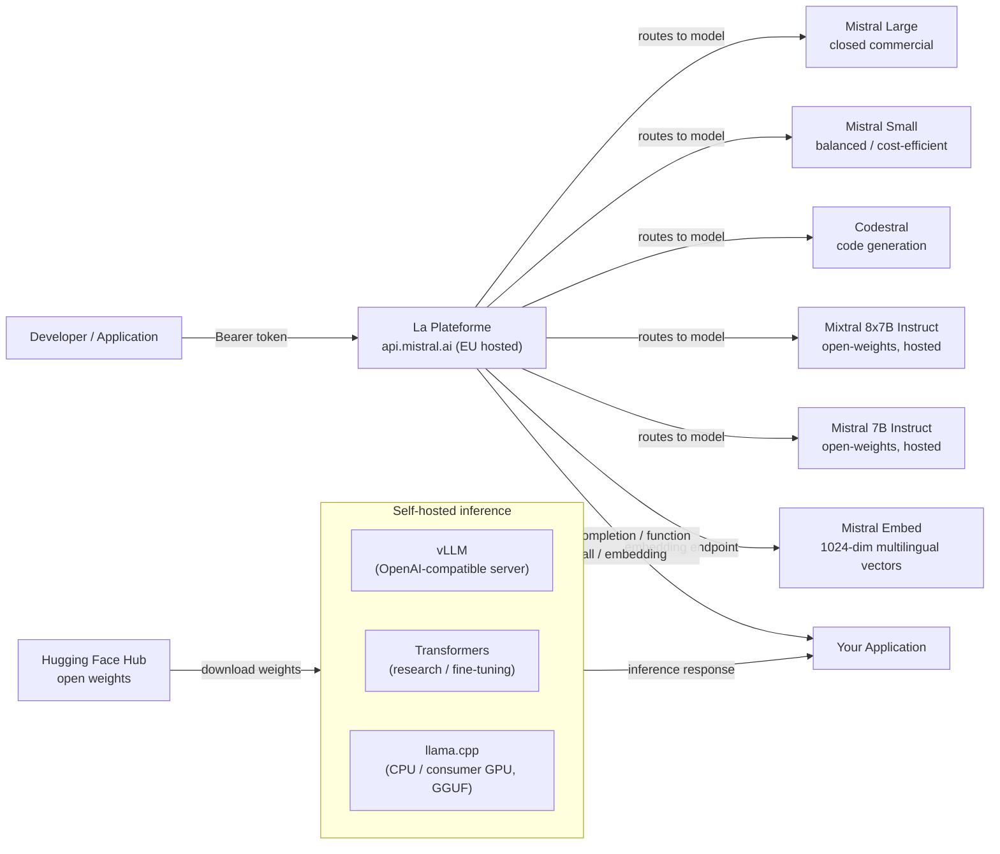

# Mistral AI

## Definición

Mistral AI es una startup francesa de IA fundada en 2023 que rápidamente se ha establecido como uno de los actores más influyentes en el ecosistema europeo de IA. La filosofía definitoria de la empresa es un **enfoque dual**: lanzar modelos eficientes de pesos abiertos para la comunidad de investigación y el ecosistema de desarrolladores, mientras simultáneamente ofrece una plataforma de API comercial (**La Plateforme**) con modelos premium y características empresariales. Esta combinación ha hecho que Mistral sea particularmente popular entre los desarrolladores que quieren experimentar libremente antes de comprometerse con un despliegue de pago, y con las empresas europeas que buscan un proveedor de IA soberano con infraestructura compatible con el RGPD alojada en centros de datos de la UE.

Los lanzamientos de pesos abiertos de Mistral han sido notablemente eficientes para su número de parámetros. **Mistral 7B**, lanzado en septiembre de 2023, superó a Llama 2 13B en la mayoría de los benchmarks a pesar de ser casi la mitad de tamaño —principalmente utilizando Atención de Consulta Agrupada (GQA) para una inferencia rápida y una ventana de contexto de 32k poco común a esa escala. **Mixtral 8x7B** introdujo una arquitectura de Mezcla de Expertos (MoE) con ocho redes de retroalimentación expertas por capa, activando solo dos por token. Esto le da a Mixtral el número efectivo de parámetros de 13B activos durante la inferencia mientras tiene 47B de parámetros totales —ofreciendo una calidad de modelo cercana a 70B a un costo computacional menor. Los lanzamientos posteriores han extendido la línea comercial con **Mistral Small**, **Mistral Medium** y **Mistral Large**, este último compitiendo con los modelos de la clase GPT-4 en tareas complejas de razonamiento y codificación.

Las fortalezas de Mistral se agrupan en torno a la eficiencia, el rendimiento multilingüe (particularmente en idiomas europeos —francés, español, alemán, italiano), y una API amigable para desarrolladores que sigue de cerca la interfaz de OpenAI. La empresa también es notable dentro del panorama de gobernanza de la IA por participar activamente en las discusiones sobre la Ley de IA de la UE y posicionarse como una alternativa responsable y europea a las APIs de laboratorios de frontera con sede en EE. UU.

## Cómo funciona

### API de La Plateforme

La Plateforme (`api.mistral.ai`) es la API de inferencia gestionada de Mistral, construida alrededor de la interfaz de chat completions de OpenAI. Las solicitudes se estructuran como `{"model": "...", "messages": [...]}` —cualquier biblioteca de cliente construida para la API de OpenAI puede redirigirse con un solo cambio de `base_url`. La API sirve tanto los modelos comerciales propietarios de Mistral (Mistral Large, Mistral Small, Mistral Medium, Codestral) como los modelos de pesos abiertos (Mistral 7B Instruct, Mixtral 8x7B Instruct, Mixtral 8x22B Instruct). La autenticación usa tokens Bearer. La Plateforme está alojada en centros de datos europeos, lo que la convierte en una elección natural para las organizaciones con requisitos de residencia de datos en la UE. Los límites de velocidad, la facturación y la gestión de claves de API son accesibles a través de la consola de Mistral en `console.mistral.ai`.

### Modelos de pesos abiertos — Mistral 7B, Mixtral 8x7B, Mistral Large

Los modelos de pesos abiertos insignia se distribuyen a través de Hugging Face y pueden autoalojarse utilizando el conjunto de herramientas estándar de Transformers, vLLM o llama.cpp (formato GGUF). **Mistral 7B** es ideal para experimentos de ajuste fino, despliegue en premisas y entornos con recursos limitados. **Mixtral 8x7B** ofrece una calidad significativamente mayor con solo un costo de parámetros activos marginalmente mayor y es una elección popular para el autoalojamiento en producción. **Mixtral 8x22B** escala más para tareas que requieren un razonamiento más profundo. **Mistral Large** es un modelo comercial cerrado disponible solo a través de La Plateforme y socios de nube seleccionados (Azure AI, AWS Bedrock, Google Cloud). Los modelos de pesos abiertos usan un mecanismo de atención de ventana deslizante con una ventana de contexto de 32k, tokenización BPE con un vocabulario de 32k, y un tokenizador basado en sentencepiece compatible con el SDK oficial de Python de mistralai.

### Llamada a funciones

Mistral soporta la llamada a funciones estructurada (también llamada uso de herramientas) en los modelos instruct de pesos abiertos y en todos los modelos de La Plateforme. La interfaz refleja el parámetro `tools` de OpenAI: pasas una lista de definiciones de herramientas definidas por JSON Schema, el modelo devuelve un array `tool_calls` especificando qué función invocar y con qué argumentos, tu aplicación ejecuta la función, y el resultado se devuelve como un mensaje de rol `tool` para continuar la conversación. La llamada a funciones de Mistral es particularmente útil para construir flujos de trabajo agénticos, pipelines de extracción de datos y capas de orquestación de API sin sobrecarga adicional de ingeniería de prompts.

### Embeddings

La Plateforme proporciona un endpoint de embedding de texto (`/v1/embeddings`) respaldado por Mistral Embed, un modelo de embedding dedicado que produce vectores densos de 1024 dimensiones. El modelo de embedding sobresale en similitud semántica, recuperación y tareas de clasificación en múltiples idiomas europeos. La interfaz es idéntica a la API de embeddings de OpenAI: pasa una cadena o lista de cadenas, recibe vectores de punto flotante. Mistral Embed es uno de los endpoints de embedding más rentables disponibles, lo que lo hace muy adecuado para la indexación de documentos a gran escala en pipelines de RAG multilingüe.



## Cuándo usar / Cuándo NO usar

| Usar cuando | Evitar cuando |
|-------------|---------------|
| Necesitas residencia de datos en la UE e infraestructura de IA compatible con el RGPD desde el primer momento | Necesitas entrada multimodal nativa de imagen/video/audio (Mistral es solo texto, excepto Pixtral que es solo API y está en fase temprana) |
| Quieres una API compatible con OpenAI con un costo de migración mínimo desde integraciones existentes de GPT | Requieres la capacidad absoluta más alta en razonamiento complejo de múltiples pasos — Mistral Large queda por detrás de GPT-4o y Claude 3.5 Sonnet en algunos benchmarks difíciles |
| La eficiencia importa — Mixtral 8x7B ofrece alta calidad a menor costo de cómputo activo que modelos densos de calidad equivalente | Necesitas un extenso ecosistema de ajustes finos de terceros y soporte de la comunidad (Meta Llama tiene una comunidad abierta más grande) |
| Los idiomas europeos multilingües (francés, español, alemán, italiano) son fundamentales para tu caso de uso | Tu carga de trabajo requiere contexto largo de más de 32k tokens en modelos de pesos abiertos (Llama 3.1 ofrece 128k) |
| Quieres autoalojar un modelo de pesos abiertos y potencialmente ajustarlo fino con datos propietarios | Necesitas inferencia en dispositivo / en el borde con modelos de parámetros inferiores a 1B (Llama 3.2 1B/3B llena mejor este nicho) |

## Comparaciones

| Criterio | Mistral AI | Meta Llama 3.x | OpenAI GPT-4o |
|----------|-----------|---------------|--------------|
| Disponibilidad de pesos | Abiertos para 7B, Mixtral 8x7B, 8x22B; cerrado para Mistral Large | Abiertos para todos los tamaños (8B a 405B) | Solo API cerrada |
| Ubicación del proveedor de API | UE (París); nativo RGPD | Hosts de terceros con sede en EE. UU. (Together, Groq) | EE. UU. (regiones de Azure UE disponibles) |
| Arquitectura MoE | Sí (Mixtral 8x7B, 8x22B) | No (transformador denso) | No divulgado |
| Llamada a funciones | Uso completo de herramientas en todos los modelos instruct/API | Sí (Llama 3.x) | Sí (maduro, más documentado) |
| Multilingüe (idiomas UE) | Fuerte — objetivo de diseño central | Bueno pero con énfasis de entrenamiento centrado en EE. UU. | Fuerte en todos los idiomas principales |
| Soporte de ajuste fino | Pesos abiertos: LoRA/QLoRA; beta de ajuste fino por API | Pesos abiertos: ajuste fino completo disponible | Solo API de ajuste fino para modelos más pequeños |
| API de Embedding | Mistral Embed (1024 dimensiones, multilingüe) | No disponible directamente a través de Meta | text-embedding-3-small/large |
| Ventana de contexto (modelos abiertos) | 32k tokens | 128k tokens (Llama 3.1+) | 128k tokens |

## Pros y contras

| Pros | Contras |
|------|---------|
| Fuerte relación eficiencia-calidad, especialmente Mixtral 8x7B vs modelos densos de calidad similar | La ventana de contexto de pesos abiertos (32k) es más corta que los 128k de Llama 3.1 |
| API alojada en la UE con fuerte posicionamiento RGPD; atrae a clientes empresariales europeos | Ecosistema de comunidad más pequeño y menos ajustes finos de la comunidad en comparación con Llama |
| Interfaz compatible con OpenAI minimiza el esfuerzo de migración | Sin capacidad multimodal nativa en modelos de pesos abiertos listos para producción |
| Lanzamientos de pesos abiertos genuinamente útiles que rinden por encima de su clase | Mistral Large todavía queda por detrás de los modelos de primera línea de OpenAI y Anthropic en los benchmarks más difíciles |

## Ejemplos de código

```python
# mistral_examples.py
# Demonstrates chat completion and function calling with the mistralai Python SDK.
# pip install mistralai

from mistralai import Mistral
import json

# ── Configuration ─────────────────────────────────────────────────────────────
# Get your API key at: https://console.mistral.ai/api-keys
client = Mistral(api_key="YOUR_MISTRAL_API_KEY")


# ── 1. Chat completion ─────────────────────────────────────────────────────────
def chat_completion_example():
    """Standard multi-turn chat with Mistral Large."""
    response = client.chat.complete(
        model="mistral-large-latest",
        messages=[
            {
                "role": "system",
                "content": (
                    "You are a senior machine learning engineer. "
                    "Provide concise, technically accurate answers."
                ),
            },
            {
                "role": "user",
                "content": "What are the key differences between MoE and dense transformer architectures?",
            },
        ],
        temperature=0.4,
        max_tokens=512,
    )

    print("=== Chat Completion ===")
    print(response.choices[0].message.content)
    print(f"\nModel : {response.model}")
    print(f"Usage : {response.usage}")


# ── 2. Function calling ────────────────────────────────────────────────────────
def function_calling_example():
    """
    Mistral function calling (tool use).
    The model decides which tool to call and with what arguments.
    Your application executes the function and returns the result.
    """
    # Define available tools with JSON Schema
    tools = [
        {
            "type": "function",
            "function": {
                "name": "get_model_benchmark",
                "description": (
                    "Retrieves benchmark scores for a specified language model "
                    "on a given benchmark suite."
                ),
                "parameters": {
                    "type": "object",
                    "properties": {
                        "model_name": {
                            "type": "string",
                            "description": "The name of the model, e.g. 'mixtral-8x7b'",
                        },
                        "benchmark": {
                            "type": "string",
                            "enum": ["MMLU", "HumanEval", "GSM8K", "HellaSwag"],
                            "description": "The benchmark suite to query.",
                        },
                    },
                    "required": ["model_name", "benchmark"],
                },
            },
        }
    ]

    # First turn — model decides to call a tool
    messages = [
        {
            "role": "user",
            "content": "What is Mixtral 8x7B's score on the MMLU benchmark?",
        }
    ]

    response = client.chat.complete(
        model="mistral-large-latest",
        messages=messages,
        tools=tools,
        tool_choice="auto",
    )

    assistant_message = response.choices[0].message
    print("=== Function Calling — Step 1: model requests tool call ===")
    print(f"Tool calls: {assistant_message.tool_calls}")

    # Simulate executing the tool
    if assistant_message.tool_calls:
        tool_call = assistant_message.tool_calls[0]
        function_args = json.loads(tool_call.function.arguments)
        print(f"\nExecuting: {tool_call.function.name}({function_args})")

        # Simulated function result
        tool_result = {
            "model": function_args["model_name"],
            "benchmark": function_args["benchmark"],
            "score": 70.6,
            "source": "Open LLM Leaderboard (Hugging Face)",
        }

        # Second turn — return the tool result and get the final response
        messages.append({"role": "assistant", "content": None, "tool_calls": assistant_message.tool_calls})
        messages.append({
            "role": "tool",
            "tool_call_id": tool_call.id,
            "content": json.dumps(tool_result),
        })

        final_response = client.chat.complete(
            model="mistral-large-latest",
            messages=messages,
            tools=tools,
        )

        print("\n=== Function Calling — Step 2: final answer ===")
        print(final_response.choices[0].message.content)


# ── 3. Embeddings ──────────────────────────────────────────────────────────────
def embeddings_example(texts: list[str]):
    """
    Generate multilingual embeddings with Mistral Embed.
    Returns 1024-dimensional dense vectors suitable for semantic search and RAG.
    """
    response = client.embeddings.create(
        model="mistral-embed",
        inputs=texts,
    )

    print("\n=== Embeddings ===")
    for i, embedding_obj in enumerate(response.data):
        vec = embedding_obj.embedding
        print(f"Text    : {texts[i][:60]}...")
        print(f"Dims    : {len(vec)}")
        print(f"First 5 : {vec[:5]}\n")


# ── Entry point ────────────────────────────────────────────────────────────────
if __name__ == "__main__":
    chat_completion_example()
    function_calling_example()
    embeddings_example([
        "L'intelligence artificielle transforme l'industrie.",
        "Machine learning models require careful evaluation.",
        "Die Verarbeitung natürlicher Sprache verbessert sich rasant.",
    ])
```

## Recursos prácticos

- [Documentación de Mistral AI](https://docs.mistral.ai/) — Referencia completa de API que cubre chat, embeddings, llamada a funciones, ajuste fino y todos los modelos disponibles.
- [Consola de La Plateforme](https://console.mistral.ai/) — Gestión de claves de API, paneles de uso y campo de juego del modelo para pruebas interactivas.
- [Modelos de Mistral en Hugging Face](https://huggingface.co/mistralai) — Pesos del modelo oficiales para Mistral 7B, Mixtral 8x7B y Mixtral 8x22B con instrucciones de descarga y tarjetas de modelo.
- [SDK de Python de mistralai en PyPI](https://pypi.org/project/mistralai/) — Fuente del SDK, registro de cambios y ejemplos de código para todas las características de la API.

## Ver también

- [Proveedores de modelos](/docs/model-providers)
- [Meta Llama](/docs/model-providers/meta-llama)
- [Inferencia local](/docs/local-inference)
- [RAG — Embeddings](/docs/rag/embeddings)
