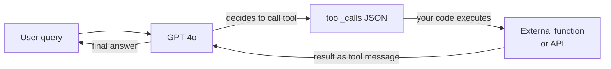

# OpenAI

## Definición

**OpenAI** es una empresa de investigación de IA y plataforma de desarrollo con sede en San Francisco. Fundada en 2015 y ampliamente conocida por lanzar ChatGPT a finales de 2022, OpenAI opera una de las APIs de modelos más utilizadas en la industria. La plataforma proporciona a los desarrolladores acceso programático a una familia de modelos que abarca lenguaje, visión, audio y generación de imágenes — convirtiéndola en una solución única para la mayoría de los casos de uso de IA generativa.

La línea de modelos de OpenAI a partir de 2025 incluye: **GPT-4o** (modelo multimodal insignia que maneja texto, imágenes y audio en un solo modelo), **GPT-4o-mini** (variante optimizada en costo para tareas de alto volumen), los **modelos de razonamiento de la serie o** — **o1**, **o1-mini**, **o3** y **o3-mini** — que usan razonamiento de cadena de pensamiento extendida para matemáticas, codificación y análisis complejo, **DALL-E 3** para generación de imágenes a partir de texto, **Whisper** para transcripción de voz a texto y **TTS** (texto a voz) para síntesis de audio. Los modelos de embeddings (text-embedding-3-small y text-embedding-3-large) potencian las pipelines de búsqueda semántica y RAG.

Desde una perspectiva de plataforma, OpenAI ofrece una API escalonada con precios basados en uso, un Playground para pruebas interactivas, una Batch API para inferencia masiva asíncrona con una reducción del 50% en costos, ajuste fino para GPT-4o-mini y GPT-3.5-turbo, una Assistants API para interacciones de estilo agente con estado y un framework de Evals para evaluación sistemática de modelos. El SDK de Python (`openai`) y un SDK de TypeScript/Node.js son las principales bibliotecas cliente, y el formato de la API se ha convertido en un estándar de facto que otros proveedores (Mistral, Together, Groq) replican parcialmente.

## Cómo funciona

### API de chat completions

El endpoint de chat completions (`POST /v1/chat/completions`) es el núcleo de la plataforma OpenAI. Envías un array de mensajes con roles (`system`, `user`, `assistant`) y recibes un completado. El mensaje `system` establece la persona y restricciones del asistente; los mensajes `user` llevan la entrada del usuario; los mensajes `assistant` representan turnos anteriores del modelo para conversación de múltiples turnos. El streaming está soportado a través de eventos enviados por el servidor para que la respuesta pueda mostrarse token por token. La temperatura y top-p controlan la aleatoriedad de la respuesta; `max_tokens` limita la longitud de salida.

```mermaid
flowchart LR
  Client[Client app] -->|POST messages array| ChatAPI[/v1/chat/completions]
  ChatAPI -->|model routing| Selector{Model\nselector}
  Selector -->|standard| GPT4o[GPT-4o]
  Selector -->|reasoning| O3[o3 / o1]
  Selector -->|budget| Mini[GPT-4o-mini]
  GPT4o -->|stream or complete| Resp[JSON response]
  O3 --> Resp
  Mini --> Resp
  Resp --> Client
```

### Llamada a funciones y herramientas

La llamada a funciones (también llamada "uso de herramientas") permite al modelo invocar herramientas externas emitiendo JSON estructurado en lugar de texto libre. Declaras esquemas de herramientas en la solicitud; el modelo decide cuándo llamar a una herramienta y completa sus argumentos. Tu código ejecuta la función y devuelve el resultado como un mensaje `tool`; el modelo luego usa ese resultado para producir su respuesta final. Esta es la base de la mayoría de los frameworks de agentes: el modelo actúa como una capa de razonamiento y enrutamiento mientras el cómputo real ocurre en tu código.



### API de embeddings

El endpoint de embeddings (`POST /v1/embeddings`) convierte texto en vectores numéricos densos. Estos vectores codifican el significado semántico: textos similares producen vectores similares. `text-embedding-3-large` (3072 dimensiones) ofrece la mejor calidad de recuperación; `text-embedding-3-small` (1536 dimensiones) es más rápido y económico. Los embeddings son la columna vertebral de los pipelines de [RAG](/docs/rag): embedes los documentos en el momento de indexación y embedes las consultas en el momento de búsqueda, luego recuperas documentos por similitud de coseno.

### APIs de imagen y audio

**DALL-E 3** (`POST /v1/images/generations`) genera imágenes a partir de prompts de texto. Especificas el tamaño (1024×1024, 1792×1024 o 1024×1792), la calidad (estándar o HD) y el estilo (vívido o natural). **Whisper** (`POST /v1/audio/transcriptions`) transcribe archivos de audio con alta precisión en más de 57 idiomas. **TTS** (`POST /v1/audio/speech`) convierte texto en voz con sonido natural con seis voces integradas. Estas APIs comparten el mismo modelo de autenticación y facturación que las APIs de texto, lo que facilita la construcción de pipelines multimodales en una sola aplicación.

## Cuándo usar / Cuándo NO usar

| Usar OpenAI cuando | Evitar o considerar alternativas cuando |
|-----------------|--------------------------------------|
| Necesitas el ecosistema más amplio: bibliotecas, tutoriales y soporte comunitario que defaulan a OpenAI | Tu carga de trabajo involucra datos altamente sensibles o regulados y no puedes enviarlos a un proveedor de EE. UU. de terceros |
| Quieres soporte multimodal (texto + imagen + audio) de un solo proveedor | Necesitas ajustar profundamente o controlar cada aspecto del modelo — los modelos de pesos abiertos ofrecen más flexibilidad |
| Necesitas razonamiento avanzado en matemáticas, código o problemas de lógica (series o1, o3) | Los costos a escala son prohibitivos — a muy altos volúmenes de tokens, el alojamiento de pesos abiertos a menudo supera el precio por token |
| Estás construyendo flujos de trabajo de llamada a funciones o agentes — las salidas estructuradas y la llamada a herramientas de OpenAI son maduros | Necesitas una experiencia no centrada en inglés — Qwen o Mistral pueden superar el rendimiento en ciertos idiomas |
| Quieres la Assistants API para agentes con estado y habilitados para archivos sin construir la capa de estado tú mismo | Necesitas salidas deterministas reproducibles de una versión de modelo congelada — OpenAI actualiza los modelos de forma continua |

## Comparaciones

| Criterio | OpenAI | Anthropic | Google Gemini |
|----------|--------|-----------|---------------|
| Modelo insignia | GPT-4o | Claude 3.7 Sonnet / Opus | Gemini 2.5 Pro |
| Modelo de razonamiento | o3, o1 | Pensamiento extendido (Claude 3.7) | Gemini 2.5 Pro (thinking) |
| Ventana de contexto | 128K (GPT-4o), 200K (o1) | 200K | Hasta 1M (Gemini 1.5 Pro) |
| Entrada multimodal | Texto, imagen, audio, video | Texto, imagen | Texto, imagen, audio, video, código |
| Opción de pesos abiertos | No | No | Gemma (parcial) |
| Llamada a funciones / herramientas | Maduro, ampliamente adoptado | Fuerte, con uso de computadora | Maduro, ecosistema Google |
| Precios (insignia) | ~$2.50/1M tokens de entrada (GPT-4o) | ~$3/1M tokens de entrada (Sonnet) | ~$1.25/1M tokens de entrada (Gemini 1.5 Pro) |
| Enfoque de seguridad | API de moderación, políticas de uso | Constitutional AI, ajuste de rechazo | Directrices de IA responsable |
| Residencia de datos | EE. UU. (por defecto), opciones empresariales | EE. UU. (por defecto), opciones empresariales | Multi-región, Google Cloud |
| Mejor para | Mayor ecosistema, herramientas de agentes, razonamiento | Documentos largos, seguridad, instrucción matizada | Contexto largo, multimodal, usuarios de Google Cloud |

## Pros y contras

| Pros | Contras |
|------|------|
| API estándar de la industria adoptada por la mayoría de los frameworks y bibliotecas | Modelo cerrado — sin visibilidad de pesos o datos de entrenamiento |
| Línea de modelos más amplia: lenguaje, visión, audio, imagen en una sola plataforma | Alojado en EE. UU. por defecto; la residencia de datos es limitada |
| Los modelos de razonamiento de la serie o destacan en matemáticas, código y lógica | Los precios pueden ser altos a escala comparados con los modelos abiertos auto-alojados |
| Ecosistema sólido: cookbook, evals, ajuste fino, Batch API | Las versiones de los modelos cambian de forma continua — el comportamiento puede cambiar sin previo aviso |
| Límites de tasa confiables y SLAs empresariales | Sin oferta real de pesos abiertos |

## Ejemplos de código

### Completado de chat con streaming

```python
from openai import OpenAI

client = OpenAI(api_key="sk-...")  # or set OPENAI_API_KEY env var

# Basic completion
response = client.chat.completions.create(
    model="gpt-4o",
    messages=[
        {"role": "system", "content": "You are a concise technical assistant."},
        {"role": "user", "content": "Explain embeddings in two sentences."},
    ],
    temperature=0.2,
    max_tokens=256,
)
print(response.choices[0].message.content)

# Streaming response
with client.chat.completions.stream(
    model="gpt-4o",
    messages=[{"role": "user", "content": "Write a haiku about APIs."}],
) as stream:
    for text in stream.text_stream:
        print(text, end="", flush=True)
```

### Llamada a funciones

```python
import json
from openai import OpenAI

client = OpenAI()

# Define a tool schema
tools = [
    {
        "type": "function",
        "function": {
            "name": "get_weather",
            "description": "Get the current weather for a city",
            "parameters": {
                "type": "object",
                "properties": {
                    "city": {"type": "string", "description": "City name"},
                    "unit": {"type": "string", "enum": ["celsius", "fahrenheit"]},
                },
                "required": ["city"],
            },
        },
    }
]

messages = [{"role": "user", "content": "What's the weather in Tokyo?"}]

# First call — model may decide to call a tool
response = client.chat.completions.create(
    model="gpt-4o",
    messages=messages,
    tools=tools,
    tool_choice="auto",
)

msg = response.choices[0].message
messages.append(msg)

# If the model called a tool, execute it and return the result
if msg.tool_calls:
    for tc in msg.tool_calls:
        args = json.loads(tc.function.arguments)
        # Simulated function execution
        result = {"city": args["city"], "temp": "18°C", "condition": "Partly cloudy"}
        messages.append({
            "role": "tool",
            "tool_call_id": tc.id,
            "content": json.dumps(result),
        })

# Second call — model uses the tool result to answer
final = client.chat.completions.create(model="gpt-4o", messages=messages)
print(final.choices[0].message.content)
```

### Embeddings para búsqueda semántica

```python
from openai import OpenAI
import numpy as np

client = OpenAI()

def embed(texts: list[str], model: str = "text-embedding-3-small") -> list[list[float]]:
    response = client.embeddings.create(input=texts, model=model)
    return [item.embedding for item in response.data]

# Index documents
docs = [
    "Python is a high-level programming language.",
    "OpenAI provides a REST API for language models.",
    "RAG combines retrieval with generation.",
]
doc_vectors = embed(docs)

# Query
query = "How do I call OpenAI from Python?"
query_vector = embed([query])[0]

# Cosine similarity
def cosine_sim(a, b):
    a, b = np.array(a), np.array(b)
    return float(np.dot(a, b) / (np.linalg.norm(a) * np.linalg.norm(b)))

scores = [(cosine_sim(query_vector, dv), doc) for dv, doc in zip(doc_vectors, docs)]
scores.sort(reverse=True)
for score, doc in scores:
    print(f"{score:.3f}  {doc}")
```

## Recursos prácticos

- [Referencia de la API de OpenAI](https://platform.openai.com/docs/api-reference) — Documentación completa de endpoints con esquemas de solicitud/respuesta
- [Precios de OpenAI](https://openai.com/api/pricing/) — Precios por token para todos los modelos incluyendo descuentos por lotes
- [OpenAI Cookbook](https://cookbook.openai.com/) — Ejemplos prácticos que cubren llamada a funciones, RAG, ajuste fino, evals y más
- [Descripción general de modelos de OpenAI](https://platform.openai.com/docs/models) — IDs de modelos, ventanas de contexto, capacidades y calendarios de deprecación
- [SDK de Python de OpenAI en GitHub](https://github.com/openai/openai-python) — Fuente, registro de cambios y guías de migración

## Ver también

- [Proveedores de modelos](/docs/model-providers) — Descripción general y comparación de todos los proveedores
- [Caso de estudio: ChatGPT](/docs/case-studies/chatgpt) — Para una mirada más profunda a la arquitectura del modelo, ver el caso de estudio de ChatGPT
- [Anthropic](/docs/model-providers/anthropic) — Familia de modelos Claude, uso de herramientas, contexto largo
- [Ingeniería de prompts](/docs/prompt-engineering) — Técnicas que se aplican a todos los modelos de OpenAI
- [Agentes](/docs/agents) — Construcción de flujos de trabajo agentes con llamada a funciones
- [RAG](/docs/rag) — Uso de embeddings de OpenAI en generación aumentada por recuperación
