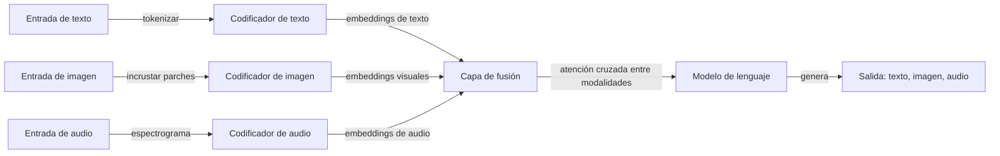

# IA multimodal

## Definición

La IA multimodal se refiere a sistemas que pueden procesar, comprender y generar contenido a través de múltiples modalidades de datos — texto, imágenes, audio, video y más — dentro de un solo modelo o pipeline. A diferencia de los sistemas unimodales que manejan solo un tipo de entrada, los modelos multimodales aprenden a alinear representaciones entre modalidades, habilitando tareas como subtitulado de imágenes, respuesta a preguntas visuales, transcripción de audio y búsqueda cruzada entre modalidades.

El campo ha evolucionado a través de varias fases. Los enfoques tempranos usaban codificadores separados para cada modalidad con una capa de fusión encima (como CLIP alineando embeddings de texto e imagen mediante aprendizaje contrastivo). Las arquitecturas modernas como GPT-4V, Gemini y Claude integran la comprensión multimodal de forma nativa en los modelos de lenguaje grandes — las imágenes, el audio y el video se tokenizan o proyectan en el mismo espacio de representación que los tokens de texto, permitiendo al modelo razonar entre modalidades en una sola pasada hacia adelante.

La IA multimodal es cada vez más importante a medida que las aplicaciones del mundo real demandan interacciones más ricas. La comprensión de documentos requiere procesar texto, tablas y figuras juntos. Los asistentes de voz combinan voz a texto, comprensión del lenguaje y texto a voz. Los sistemas autónomos fusionan cámara, lidar y datos de sensores. A medida que los modelos de fundación se vuelven nativamente multimodales, la frontera entre "modelo de lenguaje" y "modelo de visión" se está disolviendo en sistemas multimodales de propósito general.

## Cómo funciona

### Codificación y alineación

Cada modalidad requiere su propia estrategia de codificación. El texto se tokeniza en tokens de subpalabras. Las imágenes se dividen en parches (como embeddings de parches estilo ViT) o se procesan mediante un codificador convolucional. El audio se convierte en espectrogramas o características de frecuencia mel. El desafío clave es la **alineación** — mapear estas diferentes representaciones en un espacio compartido donde el contenido semánticamente similar entre modalidades esté cerca.



### Estrategias de fusión

Hay tres enfoques principales para combinar modalidades. La **fusión temprana** concatena entradas sin procesar o ligeramente procesadas antes de que un modelo compartido las procese — esto es lo que hacen los VLMs modernos proyectando parches de imagen en el espacio de tokens. La **fusión tardía** procesa cada modalidad de forma independiente y las combina a nivel de decisión — se usa en sistemas de recuperación como CLIP. La **fusión con atención cruzada** usa mecanismos de atención para que una modalidad atienda a otra en capas intermedias — común en arquitecturas codificador-decodificador para subtitulado y traducción.

### Generación entre modalidades

La generación multimodal va más allá de la salida de texto. Los modelos de **generación de imágenes** (DALL-E, Stable Diffusion) producen imágenes a partir de indicaciones de texto usando enfoques de difusión o autorregresivos. Los sistemas de **texto a voz (TTS)** convierten texto en audio de sonido natural. Los modelos de **voz a texto (STT)** como Whisper transcriben audio a texto. Algunos modelos se están volviendo verdaderamente multimodales tanto en entrada como en salida — generando texto, imágenes y audio a partir de cualquier combinación de entradas.

## Cuándo usar / Cuándo NO usar

| Usar cuando | Evitar cuando |
|----------|------------|
| La tarea involucra inherentemente múltiples modalidades (por ejemplo, imagen + texto QA, subtitulado de video) | La tarea es puramente de texto y agregar visión/audio no añade valor |
| Se necesita comprensión cruzada entre modalidades (por ejemplo, "describe esta imagen", "qué muestra este gráfico") | Se necesita rendimiento especializado de una sola modalidad que un modelo dedicado hace mejor |
| Construir una interfaz unificada que maneje texto, imágenes y audio (por ejemplo, un asistente general) | La latencia es crítica y la codificación multimodal agrega una sobrecarga inaceptable |
| La comprensión de documentos requiere procesar texto, tablas, figuras y diseño juntos | Sus datos son estructurados/tabulares — SQL o ML tradicional puede ser más apropiado |
| Las funciones de accesibilidad requieren traducción de modalidades (imagen→texto, texto→voz) | Las restricciones de privacidad impiden enviar imágenes o audio a APIs externas |

## Comparaciones

| Criterio | LLM multimodal (GPT-4V, Gemini) | Estilo CLIP (contrastivo) | Modelos de difusión (DALL-E, SD) |
|----------|----------------------------------|--------------------------|-------------------------------|
| Tarea principal | Comprensión + razonamiento | Recuperación + clasificación | Generación |
| Modalidades de entrada | Texto, imagen, audio, video | Texto + imagen | Texto (indicación) |
| Salida | Texto (análisis, respuestas) | Embeddings (puntuaciones de similitud) | Imágenes |
| Objetivo de entrenamiento | Predicción del siguiente token | Alineación contrastiva | Eliminación de ruido |
| Capacidad zero-shot | Fuerte | Fuerte | N/A (generativo) |
| Costo de cómputo | Alto (modelo grande) | Moderado | Alto (eliminación de ruido iterativa) |

## Ventajas y desventajas

| Ventajas | Desventajas |
|------|------|
| Un solo modelo maneja tipos de entrada diversos sin pipelines separados | Mayor costo de inferencia y latencia que los modelos unimodales |
| Razonamiento cruzado entre modalidades fuerte en zero-shot | El ajuste fino específico de modalidad puede superar a los modelos multimodales generales |
| Habilita interacciones ricas y naturales (voz + visión + texto) | Modos de fallo complejos que son más difíciles de depurar que los errores unimodales |
| Los modelos de fundación se transfieren bien entre tareas multimodales | Las preocupaciones de privacidad y cumplimiento se multiplican entre modalidades |

## Ejemplos de código

### Chat multimodal con OpenAI GPT-4o (Python)

```python
from openai import OpenAI
import base64

client = OpenAI()

# Codificar una imagen local en base64
with open("chart.png", "rb") as f:
    image_data = base64.standard_b64encode(f.read()).decode("utf-8")

response = client.chat.completions.create(
    model="gpt-4o",
    messages=[
        {
            "role": "user",
            "content": [
                {"type": "text", "text": "¿Qué tendencias muestra este gráfico? Resuma los hallazgos clave."},
                {
                    "type": "image_url",
                    "image_url": {"url": f"data:image/png;base64,{image_data}"},
                },
            ],
        }
    ],
    max_tokens=500,
)

print(response.choices[0].message.content)
```

### Multimodal con Anthropic Claude (Python)

```python
import anthropic
import base64

client = anthropic.Anthropic()

with open("diagram.png", "rb") as f:
    image_data = base64.standard_b64encode(f.read()).decode("utf-8")

message = client.messages.create(
    model="claude-sonnet-4-20250514",
    max_tokens=1024,
    messages=[
        {
            "role": "user",
            "content": [
                {
                    "type": "image",
                    "source": {"type": "base64", "media_type": "image/png", "data": image_data},
                },
                {
                    "type": "text",
                    "text": "Explique la arquitectura mostrada en este diagrama. ¿Cuáles son los componentes clave?",
                },
            ],
        }
    ],
)

print(message.content[0].text)
```

## Recursos prácticos

- [Artículo de CLIP — Radford et al. (2021)](https://arxiv.org/abs/2103.00020) — Enfoque fundamental de aprendizaje contrastivo para la alineación texto-imagen
- [Guía de visión de OpenAI](https://platform.openai.com/docs/guides/vision) — Uso de GPT-4o con entradas de imagen
- [Documentos multimodales de Google Gemini](https://ai.google.dev/gemini-api/docs/vision) — Capacidades multimodales nativas de Gemini
- [Modelos multimodales de Hugging Face](https://huggingface.co/docs/transformers/main/en/tasks/image_text_to_text) — VLMs de código abierto y pipelines
- [Artículo de Whisper — Radford et al. (2022)](https://arxiv.org/abs/2212.04356) — Reconocimiento de voz robusto mediante supervisión débil a gran escala

## Ver también

- [LLMs](/docs/llms)
- [Visión por computadora](/docs/cv)
- [NLP](/docs/nlp)
- [Modelos de difusión](/docs/diffusion-models)
- [Inferencia local](/docs/local-inference)
- [Razonamiento en el borde](/docs/edge-reasoning)
