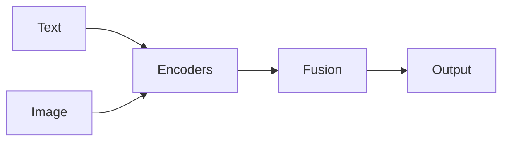

# IA multimodal

## Definición

La IA multimodal maneja múltiples modalidades de entrada (y a veces salida) en un sistema: por ej. vision-language models (VLMs) for image QA, captioning, or embodied agents that use vision y lenguaje.

Extiende [NLP](/docs/nlp) and [computer vision](/docs/cv) by aligning or fusing modalities (text, image, audio, video). CLIP-style models learn a shared embedding space for recuperación and zero-shot classification; generative VLMs (por ej. LLaVA, GPT-4V) do captioning, QA, and razonamiento over images. Used in [agents](/docs/agents), [RAG](/docs/rag) with images, and accessibility tools.

## Cómo funciona

Cada modalidad (**texto**, **imagen** y opcionalmente otras) pasa por **codificadores** (separados o compartidos). **Fusión** can be a shared embedding space (por ej. CLIP: contrastive loss so igualaring text-image pairs are close) or a unified [transformer](/docs/transformers) that attends over all modalities. **Output** can be a classification, caption, answer, or next token. Alignment is learned via contrastive (CLIP) or generative (captioning, VLM) objectives on paired data. Inference: embed or encode all inputs, then run the fusion model to get the output.

## Casos de uso

Multimodal models fit when the task combines two or more modalities (por ej. text and image) in input or output.

- Image captioning, visual QA, and document understanding (text + image)
- Cross-modal recuperación (por ej. search images by text, or vice versa)
- Embodied agents and robots that use vision y lenguaje

## Documentación externa

- [CLIP (Radford et al.)](https://arxiv.org/abs/2103.00020)
- [Hugging Face – Multimodal](https://huggingface.co/docs/transformers/main_classes/processing_automatic)

## Ver también

- [LLMs](/docs/llms)
- [Computer vision](/docs/cv)
- [NLP](/docs/nlp)
- [Local inference](/docs/local-inference) — Running multimodal models on-device
- [Edge razonamiento](/docs/edge-reasoning) — Multimodal at the edge
