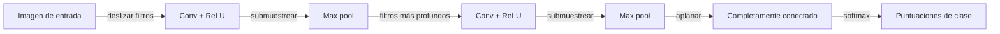

# Redes neuronales convolucionales (CNN)

## Definición

Las CNNs usan capas convolucionales para capturar patrones locales (bordes, texturas) y construir características jerárquicas. Son la columna vertebral estándar para clasificación de imágenes, detección y segmentación.

A diferencia de las [redes neuronales](/docs/neural-networks) densas, las convoluciones comparten pesos a lo largo del espacio, por lo que son equivariantes a la traslación y eficientes para imágenes y otros datos en cuadrícula. Forman la columna vertebral de la mayoría de los sistemas de [visión computacional](/docs/cv) y también se usan en [transformers](/docs/transformers) para incrustación de parches.

La idea clave detrás de las CNNs es el **compartido de pesos**: el mismo filtro se aplica en cada ubicación espacial, reduciendo drásticamente el número de parámetros comparado con las capas completamente conectadas, mientras captura la estructura local. Las capas tempranas aprenden características de bajo nivel (bordes, manchas de color); las capas más profundas combinan estas en patrones de nivel progresivamente más alto (texturas, partes de objetos, objetos completos). Este aprendizaje jerárquico de características, combinado con la agrupación para el submuestreo espacial, hace que las CNNs sean extremadamente efectivas para cualquier dato donde los valores cercanos comparten significado semántico — imágenes, video, espectrogramas de audio y más.

## Cómo funciona



### Capas convolucionales

La **imagen** (o mapa de características) se alimenta en capas **convolucionales**: cada filtro (kernel) desliza sobre la entrada y calcula un producto punto, produciendo mapas de activación que resaltan patrones locales. Múltiples filtros aprenden diferentes patrones en paralelo. Una no-linealidad (ReLU) sigue a cada convolución.

### Agrupación

La **agrupación** (p. ej. max pooling) submuestrea espacialmente, reduciendo el tamaño y añadiendo ligera invarianza a la traslación. Las convoluciones con stride son una alternativa moderna que logra un submuestreo similar manteniendo más información.

### Cabeza de clasificación

Las capas **conv** más profundas ven campos receptivos más grandes y capturan características más abstractas (partes, objetos). La cabeza final de **clase** (o detección/segmentación) suele ser una o más capas densas aplicadas a las características aplanadas o agrupadas globalmente. El entrenamiento usa retropropagación y descenso de gradiente como en otros modelos de [aprendizaje profundo](/docs/fundamentals/deep-learning).

## Cuándo usar / Cuándo NO usar

| Escenario | ¿Usar CNN? | Notas |
|---|---|---|
| Clasificación / reconocimiento de imágenes | Sí | Las CNNs son el estándar probado |
| Detección y segmentación de objetos | Sí | Columnas vertebrales como ResNet impulsan YOLO, Mask R-CNN |
| Comprensión de video | Sí | Las convoluciones 3D se extienden a la dimensión temporal |
| Secuencias de texto de longitud variable | No | Los Transformers lo manejan mejor |
| Dependencias de largo alcance en secuencias | No | Los mecanismos de atención son más efectivos |
| Datos de nube de puntos o grafos | Con precaución | Se necesitan variantes especializadas de grafos/3D |

## Comparaciones

| Aspecto | CNN | RNN | Transformer |
|---|---|---|---|
| Caso de uso principal | Imágenes, cuadrículas | Secuencias | Texto, multimodal |
| Maneja dependencias de largo alcance | Pobremente (campo receptivo limitado) | Moderadamente (con LSTM/GRU) | Bien (atención global) |
| Entrenamiento paralelizable | Sí | No (secuencial) | Sí |
| Invarianza espacial | Alta (compartido de pesos) | N/A | Aprendida (codificación posicional) |
| Coste computacional (inferencia) | Bajo a moderado | Moderado | Alto con contexto largo |

## Pros y contras

| Pros | Contras |
|---|---|
| Eficiencia de parámetros vía compartido de pesos | Limitado a datos estructurados en cuadrícula |
| Equivarianza a la traslación incorporada | El campo receptivo grande requiere muchas capas |
| Ecosistema muy maduro (ResNet, EfficientNet) | Menos efectivo para tareas secuenciales/textuales |
| Inferencia rápida, fácil de cuantizar | Requiere grandes conjuntos de datos etiquetados |

## Ejemplos de código

```python
# CNN for image classification with PyTorch (CIFAR-10 style)
import torch
import torch.nn as nn
import torch.optim as optim
from torchvision import datasets, transforms
from torch.utils.data import DataLoader

# Data
transform = transforms.Compose([
    transforms.ToTensor(),
    transforms.Normalize((0.5, 0.5, 0.5), (0.5, 0.5, 0.5)),
])
train_data = datasets.CIFAR10('.', train=True, download=True, transform=transform)
train_loader = DataLoader(train_data, batch_size=64, shuffle=True)

# Model
class SimpleCNN(nn.Module):
    def __init__(self, num_classes: int = 10):
        super().__init__()
        self.features = nn.Sequential(
            nn.Conv2d(3, 32, kernel_size=3, padding=1), nn.ReLU(),
            nn.MaxPool2d(2),
            nn.Conv2d(32, 64, kernel_size=3, padding=1), nn.ReLU(),
            nn.MaxPool2d(2),
            nn.Conv2d(64, 128, kernel_size=3, padding=1), nn.ReLU(),
            nn.AdaptiveAvgPool2d((4, 4)),
        )
        self.classifier = nn.Sequential(
            nn.Flatten(),
            nn.Linear(128 * 4 * 4, 256), nn.ReLU(), nn.Dropout(0.5),
            nn.Linear(256, num_classes),
        )

    def forward(self, x: torch.Tensor) -> torch.Tensor:
        return self.classifier(self.features(x))

device = "cuda" if torch.cuda.is_available() else "cpu"
model  = SimpleCNN().to(device)
opt    = optim.Adam(model.parameters(), lr=1e-3)
loss_fn = nn.CrossEntropyLoss()

# One training epoch
model.train()
for X, y in train_loader:
    X, y = X.to(device), y.to(device)
    opt.zero_grad()
    loss_fn(model(X), y).backward()
    opt.step()

print("Training step complete.")
```

## Recursos prácticos

- [CS231n – CNNs para Reconocimiento Visual](https://cs231n.github.io/convolutional-networks/) — Notas del curso de Stanford con explicaciones visuales claras
- [PyTorch – Redes neuronales convolucionales](https://pytorch.org/tutorials/beginner/blitz/neural_networks_tutorial.html#convolutional-nets) — Tutorial oficial práctico
- [Papers With Code – Clasificación de imágenes](https://paperswithcode.com/task/image-classification) — Tablas de clasificación de referencia y código reproducible

## Ver también

- [Visión computacional](/docs/cv)
- [Redes neuronales](/docs/neural-networks)
- [RNN](/docs/neural-networks/rnn)
