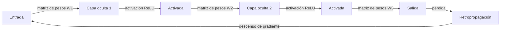

# Redes neuronales

## Definición

Las redes neuronales son aproximadores de funciones construidos a partir de capas de unidades (neuronas) con pesos aprendibles y activaciones no lineales. Pueden aproximar mapeos complejos de entradas a salidas cuando se entrenan con datos.

Son los bloques constructores del [aprendizaje profundo](/docs/fundamentals/deep-learning). Variantes como las [CNNs](/docs/neural-networks/cnn) y [RNNs](/docs/neural-networks/rnn) agregan sesgos inductivos (p. ej. localidad, recurrencia) para tipos de datos específicos; la misma maquinaria de entrenamiento (retropropagación, descenso de gradiente) se aplica.

El teorema de aproximación universal garantiza que una red suficientemente amplia de una sola capa oculta puede aproximar cualquier función continua — pero en la práctica, la **profundidad** (apilar muchas capas) es mucho más eficiente en parámetros que la amplitud sola. Cada capa adicional aumenta la capacidad del modelo para componer características más simples en otras más complejas. Las redes neuronales modernas van desde unos pocos cientos de parámetros (modelos edge diminutos) hasta cientos de miles de millones (LLMs de frontera), todos compartiendo los mismos bloques constructores fundamentales: transformaciones lineales, funciones de activación y optimización basada en gradientes.

## Cómo funciona



### Paso forward

La **entrada** se pasa a la primera capa. Cada **capa** calcula una combinación lineal de sus entradas (pesos + sesgo) y luego una activación no lineal (p. ej. ReLU, sigmoide, GELU). La salida de una capa se convierte en la entrada de la siguiente; apilar capas permite a la red aprender características jerárquicas.

### Pérdida y retropropagación

La capa de **salida** final mapea a predicciones (p. ej. puntuaciones de clase o un escalar). Una **función de pérdida** (p. ej. entropía cruzada para clasificación, MSE para regresión) mide qué tan lejos están las predicciones de los objetivos. La **retropropagación** calcula gradientes a través de la regla de la cadena desde la salida hasta la entrada.

### Descenso de gradiente y regularización

El **descenso de gradiente** (o sus variantes estocásticas: SGD, Adam, AdamW) actualiza los pesos para minimizar la pérdida. La profundidad y anchura determinan la capacidad; la regularización (dropout, decaimiento de pesos, normalización por lotes) y el tamaño de los datos controlan el sobreajuste.

## Cuándo usar / Cuándo NO usar

| Escenario | ¿Usar redes neuronales? | Notas |
|---|---|---|
| Datos no estructurados (imágenes, texto, audio) | Sí | Las RNs aprenden características automáticamente |
| Conjuntos de datos tabulares pequeños | No | El gradient boosting suele superar a las RNs |
| Se necesita modelo interpretable | No | Las RNs son en gran medida cajas negras |
| Datos etiquetados abundantes + cómputo | Sí | Las RNs escalan bien con ambos |
| Inferencia en tiempo real en hardware restringido | Con precaución | Cuantizar o usar arquitecturas más pequeñas |
| Aprendizaje por transferencia disponible para tu dominio | Sí | Ajustar una RN preentrenada supera al entrenamiento desde cero |

## Comparaciones

| Arquitectura | Sesgo inductivo | Mejor para | Limitación clave |
|---|---|---|---|
| Feedforward (MLP) | Ninguno | Tabular, general | Ignora estructura espacial/temporal |
| CNN | Localidad espacial | Imágenes, cuadrículas | Menos efectivo para secuencias largas |
| RNN / LSTM | Orden temporal | Secuencias, series temporales | Lento de entrenar, gradientes que desaparecen |
| Transformer | Atención global | Texto, multimodal | Alta memoria con contexto largo |

## Pros y contras

| Pros | Contras |
|---|---|
| Aproximación universal de funciones | Requiere datos significativos |
| Escala con datos y cómputo | Computacionalmente costoso |
| El aprendizaje por transferencia reduce las necesidades de datos etiquetados | Difícil de interpretar |
| Diseño de arquitectura flexible | Sensible a hiperparámetros |

## Ejemplos de código

```python
# Basic feedforward neural network with PyTorch
import torch
import torch.nn as nn

# Define a simple two-hidden-layer network
class FeedForward(nn.Module):
    def __init__(self, input_dim: int, hidden_dim: int, output_dim: int):
        super().__init__()
        self.layers = nn.Sequential(
            nn.Linear(input_dim, hidden_dim),
            nn.ReLU(),
            nn.Dropout(0.2),
            nn.Linear(hidden_dim, hidden_dim),
            nn.ReLU(),
            nn.Linear(hidden_dim, output_dim),
        )

    def forward(self, x: torch.Tensor) -> torch.Tensor:
        return self.layers(x)

# Instantiate, pass a dummy batch, inspect output shape
model = FeedForward(input_dim=20, hidden_dim=64, output_dim=3)
x = torch.randn(32, 20)          # batch of 32 samples, 20 features
logits = model(x)
print(f"Output shape: {logits.shape}")  # (32, 3)

# Count parameters
n_params = sum(p.numel() for p in model.parameters() if p.requires_grad)
print(f"Trainable parameters: {n_params:,}")
```

## Recursos prácticos

- [Redes Neuronales y Aprendizaje Profundo (Nielsen)](http://neuralnetworksanddeeplearning.com/) — Libro en línea gratuito con profundidad matemática
- [3Blue1Brown – Redes neuronales](https://www.youtube.com/playlist?list=PLZHQObOWTQDNU6R1_67000Dx_ZCJB-3pi) — Introducción visual e intuitiva
- [Tutoriales de PyTorch](https://pytorch.org/tutorials/) — Tutoriales oficiales prácticos de simple a avanzado

## Ver también

- [CNN](/docs/neural-networks/cnn)
- [RNN](/docs/neural-networks/rnn)
- [Aprendizaje profundo](/docs/fundamentals/deep-learning)
