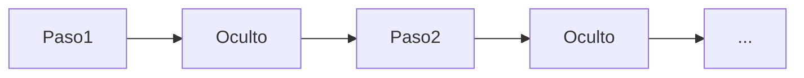

# Redes neuronales recurrentes (RNN)

## Definición

Las RNN procesan secuencias manteniendo un estado oculto que se actualiza en cada paso. Ellas (y variantes como LSTM) eran el estándar para modelado de secuencias antes de los Transformers.

Son una opción natural para [NLP](/docs/nlp), series temporales y cualquier dato ordenado donde el contexto del pasado importa. Los [Transformers](/docs/transformers) las han reemplazado en gran medida en modelado de lenguaje debido a la paralelización y el manejo de dependencias de largo alcance, pero las RNN aún aparecen en escenarios de streaming o baja latencia.

## Cómo funciona

En cada **paso**, el modelo recibe la entrada actual (p. ej., un token o frame) y el **estado oculto** anterior. Calcula una salida (p. ej., una predicción o la siguiente representación oculta) y actualiza el estado oculto para el siguiente paso. La recurrencia se despliega en el tiempo para el entrenamiento (retropropagación a través del tiempo); en la inferencia, el estado oculto se pasa paso a paso. Las variantes **LSTM** y **GRU** añaden puertas para mitigar los gradientes que desaparecen. Las entradas y salidas pueden ser uno-a-uno, uno-a-muchos o muchos-a-uno según la tarea (p. ej., etiquetado de secuencias vs. secuencia a secuencia).

## Casos de uso

Las RNN se ajustan a problemas con entrada o salida secuencial donde el orden y el contexto temporal importan.

- Etiquetado de secuencias (p. ej., reconocimiento de entidades nombradas, etiquetado POS)
- Pronóstico de series temporales y detección de anomalías
- Modelado de secuencias de voz y texto (antes de que los Transformers dominaran)

## Documentación externa

- [Comprendiendo las redes LSTM (Olah)](https://colah.github.io/posts/2015-08-Understanding-LSTMs/)
- [PyTorch – Modelos de secuencia y RNNs](https://pytorch.org/tutorials/beginner/sequence_models_tutorial.html)

## Ver también

- [Transformers](/docs/transformers)
- [NLP](/docs/nlp)
