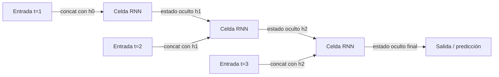

# Redes neuronales recurrentes (RNN)

## Definición

Las RNNs procesan secuencias manteniendo un estado oculto que se actualiza en cada paso. Ellas (y variantes como LSTM) eran el estándar para el modelado de secuencias antes de los Transformers.

Son un ajuste natural para [NLP](/docs/nlp), series temporales y cualquier dato ordenado donde el contexto del pasado importa. Los [Transformers](/docs/transformers) las han reemplazado en gran medida en el modelado del lenguaje debido a la paralelización y el manejo de dependencias de largo alcance, pero las RNNs todavía aparecen en configuraciones de streaming o baja latencia.

La idea fundamental es compartir parámetros a lo largo del tiempo: las mismas matrices de pesos se usan en cada paso, haciendo que el modelo sea equivariante a la longitud de la entrada. Las variantes **LSTM** (Long Short-Term Memory) y **GRU** (Gated Recurrent Unit) abordan el problema del gradiente que desaparece en las RNNs simples con mecanismos de compuerta que controlan qué información se almacena, olvida o pasa hacia adelante. Estas arquitecturas siguen siendo competitivas en configuraciones con recursos limitados, escenarios de aprendizaje en línea y cualquier caso de uso donde un modelo secuencial compacto con memoria acotada sea preferible a la atención cuadrática de los transformers.

## Cómo funciona



### Cómputo recurrente

En cada **paso**, el modelo recibe la entrada actual (p. ej. un token o fotograma) y el **estado oculto** anterior. Calcula un nuevo estado oculto: `h_t = tanh(W_h * h_{t-1} + W_x * x_t + b)`. El estado oculto resume toda la información desde el inicio de la secuencia hasta el paso t.

### Compuertas LSTM

Las variantes **LSTM** y **GRU** reemplazan la celda tanh simple con unidades de compuerta. La compuerta de olvido decide qué descartar del estado de la celda; la compuerta de entrada controla qué nueva información almacenar; la compuerta de salida determina qué exponer como estado oculto. Esto permite a la red aprender dependencias de largo alcance que las RNNs simples no pueden.

### Entrenamiento: retropropagación a través del tiempo

La recurrencia se desenrolla en el tiempo para el entrenamiento (**retropropagación a través del tiempo**, BPTT). En la inferencia, el estado oculto se pasa hacia adelante paso a paso. Las entradas y salidas pueden ser uno-a-uno, uno-a-muchos o muchos-a-uno dependiendo de la tarea (p. ej. etiquetado de secuencia vs. clasificación).

## Cuándo usar / Cuándo NO usar

| Escenario | ¿Usar RNN? | Notas |
|---|---|---|
| Inferencia de streaming con poca memoria | Sí | Las RNNs procesan paso a paso con estado acotado |
| Secuencias muy largas con contexto global | No | Los Transformers lo manejan mejor |
| Pronóstico de series temporales (longitud moderada) | Sí | Las LSTMs son competitivas con menor cómputo |
| Se requiere entrenamiento paralelizable | No | Las RNNs son inherentemente secuenciales |
| Tareas de NLP a escala | No | Los Transformers dominan el NLP moderno |
| Dispositivos embebidos / edge | Sí | Los modelos pequeños LSTM/GRU son eficientes en inferencia |

## Comparaciones

| Aspecto | RNN / LSTM | CNN | Transformer |
|---|---|---|---|
| Caso de uso principal | Secuencias, series temporales | Imágenes, cuadrículas | Texto, multimodal |
| Entrenamiento paralelizable | No (secuencial) | Sí | Sí |
| Dependencias de largo alcance | Moderadas (con LSTM) | Pobres | Excelentes |
| Huella de memoria (inferencia) | Muy baja (estado fijo) | Baja | Alta (caché KV) |
| Inferencia de streaming / en línea | Excelente | N/A | Difícil |
| Rendimiento NLP estado-del-arte | No | No | Sí |

## Pros y contras

| Pros | Contras |
|---|---|
| Ajuste natural para datos secuenciales | No se puede paralelizar durante el entrenamiento |
| Huella de memoria fija en inferencia | Tiene dificultades con dependencias muy largas |
| Eficiente para casos de uso de streaming / en línea | En gran medida superado por transformers para NLP |
| Modelos compactos para implementación edge | Gradiente que desaparece (mitigado por LSTM/GRU) |

## Ejemplos de código

```python
# LSTM for sentiment classification with PyTorch
import torch
import torch.nn as nn

class LSTMClassifier(nn.Module):
    def __init__(self, vocab_size: int, embed_dim: int, hidden_dim: int, num_classes: int):
        super().__init__()
        self.embedding = nn.Embedding(vocab_size, embed_dim, padding_idx=0)
        self.lstm = nn.LSTM(embed_dim, hidden_dim, batch_first=True, num_layers=2, dropout=0.3)
        self.classifier = nn.Linear(hidden_dim, num_classes)

    def forward(self, token_ids: torch.Tensor) -> torch.Tensor:
        x = self.embedding(token_ids)           # (batch, seq_len, embed_dim)
        _, (h_n, _) = self.lstm(x)              # h_n: (num_layers, batch, hidden_dim)
        return self.classifier(h_n[-1])         # use last layer's final hidden state

# Dummy batch: 8 sequences, each 20 tokens, vocab of 5000
model   = LSTMClassifier(vocab_size=5000, embed_dim=64, hidden_dim=128, num_classes=2)
tokens  = torch.randint(0, 5000, (8, 20))
logits  = model(tokens)
print(f"Output shape: {logits.shape}")          # (8, 2)

n_params = sum(p.numel() for p in model.parameters() if p.requires_grad)
print(f"Trainable parameters: {n_params:,}")
```

## Recursos prácticos

- [Entendiendo las redes LSTM (Olah)](https://colah.github.io/posts/2015-08-Understanding-LSTMs/) — Explicación visual clara de las compuertas LSTM
- [PyTorch – Modelos de secuencia y RNNs](https://pytorch.org/tutorials/beginner/sequence_models_tutorial.html) — Tutorial oficial con un ejemplo de etiquetado POS
- [La Efectividad Sin Razón de las Redes Neuronales Recurrentes (Karpathy)](http://karpathy.github.io/2015/05/21/rnn-effectiveness/) — Publicación de blog clásica con ejemplos de RNN a nivel de caracteres

## Ver también

- [Transformers](/docs/transformers)
- [NLP](/docs/nlp)
- [CNN](/docs/neural-networks/cnn)
