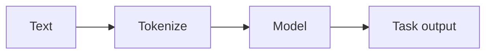

# Procesamiento de lenguaje natural (PLN)

## Definición

El NLP abarca tareas sobre texto: clasificación, NER, QA, resumen, traducción y generación. Modern NLP is dominated by pretrained [transformers](/docs/transformers) (BERT, GPT, etc.) and [LLMs](/docs/llms).

Inputs son discretas (tokens); los modelos aprenden de grandes corpus y luego se adaptan mediante [fine-tuning](/docs/llms/fine-tuning) or [prompting](/docs/prompt-engineering). [RAG](/docs/rag) and [agents](/docs/agents) add recuperación and tools on top of NLP models for grounded QA and task completion.

## Cómo funciona

**Text** is **tokenized** (dividido en subpalabras o palabras) and optionally normalized. The **model** (por ej. BERT, GPT) processes token IDs through embeddings and [transformer](/docs/transformers) layers to produce contextual representations. A **task output** head (por ej. classifier, span predictor, or next-token decoder) maps those to the final prediction. Models se preentrenan en large corpora (masked LM or predicción del siguiente token), then fine-tuned or prompted for downstream tasks. Pipelines often combine tokenization, embedding, and task-specific heads; [LLMs](/docs/llms) can do many tasks with a single model and the right prompt.

## Casos de uso

NLP applies to any product or pipeline that needs to understand or generate text at scale.

- Machine translation, summarization, and question answering
- Named entity recognition, sentiment analysis, and text classification
- Chatbots, code generation, and document understanding

## Documentación externa

- [Hugging Face – NLP course](https://huggingface.co/learn/nlp-course/)
- [Stanford CS224N – NLP with Deep Learning](http://web.stanford.edu/class/cs224n/)

## Ver también

- [Transformers](/docs/transformers)
- [LLMs](/docs/llms)
- [RAG](/docs/rag)
