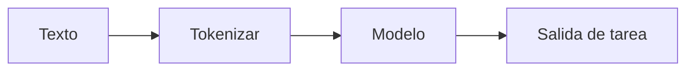

# Procesamiento de lenguaje natural (PLN)

## Definición

El NLP abarca tareas sobre texto: clasificación, reconocimiento de entidades nombradas, QA, resumen, traducción y generación. El NLP moderno está dominado por [transformers](/docs/transformers) preentrenados (BERT, GPT, etc.) y [LLMs](/docs/llms).

Las entradas son discretas (tokens); los modelos aprenden de grandes corpus y luego se adaptan mediante [ajuste fino](/docs/llms/fine-tuning) o [indicaciones](/docs/prompt-engineering). El [RAG](/docs/rag) y los [agentes](/docs/agents) agregan recuperación y herramientas encima de los modelos de NLP para QA fundamentado y completar tareas.

## Cómo funciona

El **texto** se **tokeniza** (dividido en subpalabras o palabras) y opcionalmente se normaliza. El **modelo** (como BERT, GPT) procesa los IDs de tokens a través de embeddings y capas de [transformer](/docs/transformers) para producir representaciones contextuales. Una cabeza de **salida de tarea** (como clasificador, predictor de tramos o decodificador del siguiente token) mapea esas a la predicción final. Los modelos se preentrenan en grandes corpus (LM enmascarado o predicción del siguiente token), luego se ajustan finamente o se indican para tareas posteriores. Los pipelines a menudo combinan tokenización, embedding y cabezas específicas de la tarea; los [LLMs](/docs/llms) pueden hacer muchas tareas con un solo modelo y la indicación correcta.

## Casos de uso

El NLP aplica a cualquier producto o pipeline que necesite comprender o generar texto a escala.

- Traducción automática, resumen y respuesta a preguntas
- Reconocimiento de entidades nombradas, análisis de sentimientos y clasificación de texto
- Chatbots, generación de código y comprensión de documentos

## Recursos prácticos

- [Hugging Face – Curso de NLP](https://huggingface.co/learn/nlp-course/)
- [Stanford CS224N – NLP con Deep Learning](http://web.stanford.edu/class/cs224n/)

## Ver también

- [Transformers](/docs/transformers)
- [LLMs](/docs/llms)
- [RAG](/docs/rag)
