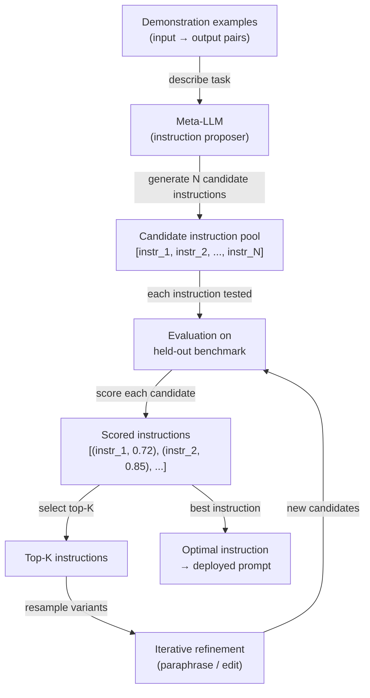

# Ingeniería automática de prompts (APE)

## Definición

La ingeniería automática de prompts (APE) es la práctica de utilizar un modelo de lenguaje para generar y optimizar instrucciones de prompts en lugar de escribirlas a mano. Introducida por Zhou et al. (2022) en el artículo *Large Language Models Are Human-Level Prompt Engineers*, la APE enmarca el diseño de prompts como un problema de síntesis de programas: dado un conjunto de pares de demostración entrada-salida, encontrar la instrucción en lenguaje natural que, cuando se antepone a un prompt, maximiza el rendimiento de la tarea en un conjunto de evaluación reservado. La búsqueda, puntuación y refinamiento de instrucciones candidatas se realizan de forma programática —el rol del humano pasa de ser autor de prompts a definidor de tareas y diseñador de métricas.

La motivación para automatizar el diseño de prompts es práctica. La ingeniería manual de prompts es laboriosa, frágil y sesgada por las intuiciones del ingeniero humano sobre cómo los modelos de lenguaje procesan el texto. Pequeños cambios en la redacción —"Piensa paso a paso" vs "Pensemos cuidadosamente paso a paso"— producen diferencias de precisión medibles que son imposibles de predecir sin pruebas empíricas. La APE reemplaza estas conjeturas con una búsqueda sistemática: generar un gran grupo de instrucciones candidatas, evaluar cada una en un benchmark y conservar los mejores resultados. Esta es la misma filosofía de diseño detrás de la búsqueda de hiperparámetros en ML clásico —los humanos especifican el objetivo, las máquinas hacen la búsqueda.

La APE se distingue del ajuste suave de prompts (que optimiza incrustaciones continuas de tokens mediante descenso de gradiente) y del ajuste fino (que actualiza los pesos del modelo). La APE opera completamente en el espacio del lenguaje natural usando modelos congelados. Esto la hace agnóstica al modelo, interpretable —se puede leer y entender la instrucción ganadora— y desplegable sin ninguna infraestructura de entrenamiento. La compensación es que el espacio de búsqueda discreto del lenguaje natural es vasto y no diferenciable, por lo que la APE se basa en muestreo, heurísticas de puntuación y refinamiento iterativo en lugar de la optimización basada en gradientes.

## Cómo funciona



### Generación de candidatos

El bucle APE comienza con un conjunto de ejemplos de demostración —pares entrada-salida que ilustran la tarea objetivo. Estos ejemplos se pasan a un meta-LLM (el mismo u otro modelo) con un meta-prompt que le pide inferir la instrucción que produciría las salidas dadas a partir de las entradas dadas. Los meta-prompts típicos se ven así: *"Aquí hay pares entrada-salida. ¿Cuál es la instrucción que produce estas salidas? Genera 10 instrucciones candidatas diversas."* Al muestrear con temperatura \> 0, el meta-LLM produce un grupo diverso de instrucciones candidatas que difieren en redacción, encuadre y especificidad. La calidad y diversidad de este grupo inicial determina directamente el techo de la optimización.

### Puntuación

Cada instrucción candidata se instancia como un prefijo en el prompt (o como el mensaje del sistema) y se evalúa contra un benchmark reservado. La función de puntuación es específica de la tarea: precisión para clasificación, corrección de ejecución para generación de código, ROUGE o BERTScore para resumen, o un juez LLM secundario para tareas de extremo abierto. La decisión de diseño clave es si la puntuación se calcula con el propio meta-LLM (usando estimaciones de log-probabilidad de las salidas correctas) o con un evaluador separado específico de la tarea. La puntuación por log-probabilidad es más rápida pero puede sobreajustarse a la calibración del meta-LLM. La puntuación con un evaluador separado es más fiable pero requiere datos etiquetados.

### Refinamiento iterativo

Después de la puntuación inicial, las instrucciones candidatas top-K se seleccionan para refinamiento. El meta-LLM recibe un prompt para parafrasear, extender o combinar los mejores candidatos, produciendo un nuevo grupo de variantes que están semánticamente relacionadas pero textualmente distintas. Este bucle de refinamiento se ejecuta durante un número fijo de iteraciones o hasta que se alcanza un umbral de puntuación objetivo. Cada iteración estrecha la búsqueda alrededor de regiones prometedoras del espacio de instrucciones, análogo a la búsqueda evolutiva o escalada de colinas sobre un paisaje discreto. En la práctica, una o dos rondas de refinamiento después de un gran grupo inicial (N ≥ 50) tiende a recuperar la mayor parte de la ganancia alcanzable.

## Comparaciones

| Criterio | APE | Ingeniería manual de prompts | Ajuste fino |
|----------|-----|------------------------------|-------------|
| Esfuerzo humano | Bajo — definir tarea y métrica | Alto — autoría iterativa y pruebas | Alto — recolección de datos y ejecuciones de entrenamiento |
| Requiere datos etiquetados | Sí — para puntuación | No — se puede hacer empíricamente | Sí — típicamente miles de ejemplos |
| Pesos del modelo actualizados | No | No | Sí |
| Salida interpretable | Sí — instrucción en lenguaje natural | Sí | No — los cambios de pesos son opacos |
| Generaliza entre modelos | Sí — volver a ejecutar la búsqueda por modelo | Parcialmente | No — vinculado al modelo base |
| Latencia en inferencia | Ninguna — sin sobrecarga en tiempo de ejecución | Ninguna | Ninguna |
| Costo | Medio — N × M llamadas de evaluación | Bajo | Alto — tiempo de GPU |
| Mejor para | Tareas con una métrica clara y ≥ 50 ejemplos | Tareas novedosas sin una métrica | Tareas de alto volumen donde las ganancias de precisión justifican el entrenamiento |

## Cuándo usar / Cuándo NO usar

| Usar cuando | Evitar cuando |
|-------------|---------------|
| Tienes un conjunto de evaluación etiquetado y puedes definir una métrica de puntuación clara | La tarea no tiene una métrica automatizada fiable — la APE no puede buscar sin una señal |
| La iteración manual de prompts está tomando más de un día y la precisión sigue en meseta | Necesitas un resultado de inmediato — la APE requiere múltiples llamadas a la API del LLM para evaluación |
| Estás desplegando el mismo prompt para muchos usuarios y incluso ganancias de precisión del 1–2% importan | Tu grupo de demostración es demasiado pequeño (\< 10 ejemplos) — la puntuación será ruidosa |
| Quieres auditar la instrucción mejor encontrada por seguridad antes del despliegue | La tarea requiere creatividad o juicio subjetivo donde una sola métrica es engañosa |
| Estás usando DSPy o un framework similar donde la optimización de prompts está integrada | El ajuste fino ya está planeado — la APE optimiza prompts, no pesos |

## Ejemplos de código

### Bucle APE básico con OpenAI

```python
# Minimal APE implementation: generate instructions, score, return best
# pip install openai

import os
import re
from openai import OpenAI

client = OpenAI(api_key=os.environ["OPENAI_API_KEY"])

# ----- Task definition --------------------------------------------------------
# Demonstrations: pairs of (input, expected_output)
DEMOS = [
    ("The movie was absolutely fantastic, I loved every minute.", "positive"),
    ("Terrible film, waste of time and money.", "negative"),
    ("It was okay, nothing special but not bad either.", "neutral"),
    ("A masterpiece of modern cinema.", "positive"),
    ("I walked out after 20 minutes.", "negative"),
]

# Held-out evaluation set for scoring
EVAL_SET = [
    ("A stunning visual experience with weak writing.", "positive"),  # debatable but positive
    ("Boring, predictable, and too long.", "negative"),
    ("I enjoyed it more than I expected.", "positive"),
    ("Neither good nor bad — forgettable.", "neutral"),
    ("One of the best films of the decade.", "positive"),
]


# ----- Step 1: Generate candidate instructions --------------------------------
def generate_instructions(demos: list[tuple[str, str]], n: int = 10) -> list[str]:
    """Ask a meta-LLM to infer N candidate instructions from demo pairs."""
    demo_text = "\n".join(f'Input: "{inp}"\nOutput: "{out}"' for inp, out in demos)
    meta_prompt = (
        f"Here are input-output example pairs for a text classification task:\n\n"
        f"{demo_text}\n\n"
        f"Generate {n} diverse natural-language instructions that, when prepended to "
        f"an input text, would cause a language model to produce the correct output. "
        f"Return one instruction per line, numbered."
    )
    resp = client.chat.completions.create(
        model="gpt-4o-mini",
        messages=[{"role": "user", "content": meta_prompt}],
        temperature=0.9,
        max_tokens=800,
    )
    raw = resp.choices[0].message.content
    lines = [re.sub(r"^\d+[\.\)]\s*", "", l).strip() for l in raw.splitlines()]
    return [l for l in lines if len(l) > 20]  # filter out empty / too-short lines


# ----- Step 2: Score an instruction on the eval set --------------------------
def score_instruction(instruction: str, eval_set: list[tuple[str, str]]) -> float:
    """Return accuracy of the instruction on the eval set."""
    correct = 0
    for text, expected in eval_set:
        prompt = f"{instruction}\n\nText: {text}\nLabel:"
        resp = client.chat.completions.create(
            model="gpt-4o-mini",
            messages=[{"role": "user", "content": prompt}],
            temperature=0,
            max_tokens=5,
        )
        prediction = resp.choices[0].message.content.strip().lower()
        if expected.lower() in prediction:
            correct += 1
    return correct / len(eval_set)


# ----- Step 3: Iterative refinement of top-K instructions --------------------
def refine_instructions(top_instructions: list[str], n_variants: int = 5) -> list[str]:
    """Ask the meta-LLM to paraphrase the top instructions to get variants."""
    instr_text = "\n".join(f"- {i}" for i in top_instructions)
    refine_prompt = (
        f"Here are high-performing instructions for a sentiment classification task:\n"
        f"{instr_text}\n\n"
        f"Generate {n_variants} new instructions that paraphrase or combine the above "
        f"to potentially improve performance. Return one per line."
    )
    resp = client.chat.completions.create(
        model="gpt-4o-mini",
        messages=[{"role": "user", "content": refine_prompt}],
        temperature=0.7,
        max_tokens=500,
    )
    raw = resp.choices[0].message.content
    lines = [l.strip().lstrip("- ") for l in raw.splitlines()]
    return [l for l in lines if len(l) > 20]


# ----- APE main loop ---------------------------------------------------------
def run_ape(
    demos: list[tuple[str, str]],
    eval_set: list[tuple[str, str]],
    n_candidates: int = 10,
    top_k: int = 3,
    n_refinement_rounds: int = 1,
) -> dict:
    print("=== APE: Generating initial candidates ===")
    candidates = generate_instructions(demos, n=n_candidates)
    print(f"Generated {len(candidates)} candidates.\n")

    all_scored: list[tuple[str, float]] = []

    for round_num in range(n_refinement_rounds + 1):
        print(f"--- Round {round_num + 1}: Scoring {len(candidates)} instructions ---")
        round_scores = []
        for instr in candidates:
            score = score_instruction(instr, eval_set)
            round_scores.append((instr, score))
            print(f"  [{score:.0%}] {instr[:80]}{'...' if len(instr) > 80 else ''}")
        all_scored.extend(round_scores)

        if round_num < n_refinement_rounds:
            top = [i for i, _ in sorted(round_scores, key=lambda x: -x[1])[:top_k]]
            candidates = refine_instructions(top, n_variants=n_candidates // 2)
            print()

    best_instr, best_score = max(all_scored, key=lambda x: x[1])
    return {"instruction": best_instr, "score": best_score, "all_scored": all_scored}


if __name__ == "__main__":
    result = run_ape(DEMOS, EVAL_SET, n_candidates=8, top_k=3, n_refinement_rounds=1)
    print(f"\n=== Best instruction (accuracy {result['score']:.0%}) ===")
    print(result["instruction"])
```

### Uso de DSPy para APE estructurada

```python
# DSPy provides a higher-level abstraction for automatic prompt optimization.
# pip install dspy-ai

import dspy

# Configure DSPy with your LLM backend
lm = dspy.LM("openai/gpt-4o-mini", api_key=os.environ["OPENAI_API_KEY"])
dspy.configure(lm=lm)


# Define the task as a DSPy signature
class SentimentClassifier(dspy.Signature):
    """Classify the sentiment of a movie review as positive, negative, or neutral."""
    review: str = dspy.InputField(desc="A movie review text")
    sentiment: str = dspy.OutputField(desc="One of: positive, negative, neutral")


# Wrap in a module
class SentimentModule(dspy.Module):
    def __init__(self):
        self.classify = dspy.Predict(SentimentClassifier)

    def forward(self, review: str) -> dspy.Prediction:
        return self.classify(review=review)


# Training examples
trainset = [
    dspy.Example(review=inp, sentiment=out).with_inputs("review")
    for inp, out in [
        ("Absolutely loved it!", "positive"),
        ("Worst movie ever.", "negative"),
        ("It was fine, nothing memorable.", "neutral"),
    ]
]


# Use MIPROv2 optimizer to automatically engineer the prompt
def optimize_with_dspy():
    module = SentimentModule()
    optimizer = dspy.MIPROv2(metric=dspy.evaluate.answer_exact_match, auto="light")
    optimized = optimizer.compile(module, trainset=trainset)
    print(optimized.classify.extended_signature)  # shows the optimized instruction
    return optimized


if __name__ == "__main__":
    optimized_module = optimize_with_dspy()
    result = optimized_module(review="A surprisingly moving and well-acted drama.")
    print(result.sentiment)
```

## Recursos prácticos

- [Large Language Models Are Human-Level Prompt Engineers (Zhou et al., 2022)](https://arxiv.org/abs/2211.01910) — El artículo APE original; introduce la formulación de inducción de instrucciones, la búsqueda iterativa de Monte Carlo y los resultados de benchmarks en 24 tareas de NLP.
- [DSPy: Compiling Declarative Language Model Calls into Self-Improving Pipelines (Khattab et al., 2023)](https://arxiv.org/abs/2310.03714) — El framework que pone en práctica la optimización estilo APE como abstracción de primera clase; ver también [dspy.ai](https://dspy.ai).
- [Automatic Prompt Optimization with "Gradient Descent" and Beam Search (Pryzant et al., 2023)](https://arxiv.org/abs/2305.03495) — Extiende la APE con un enfoque de "gradiente textual" que utiliza retroalimentación generada por LLM como señal de gradiente proxy.
- [PromptBreeder: Self-Referential Self-Improvement Via Prompt Evolution (Fernando et al., 2023)](https://arxiv.org/abs/2309.16797) — Un enfoque APE evolutivo que también evoluciona los meta-prompts utilizados para la generación de instrucciones.

## Ver también

- [Ingeniería de prompts](/docs/prompt-engineering)
- [Autoevaluación y calibración](/docs/prompt-engineering/self-evaluation-calibration)
- [Ajuste fino](/docs/llms/fine-tuning)
