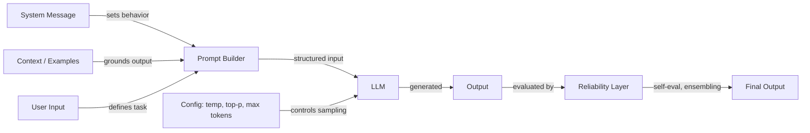

# Ingeniería de prompts

## Definición

La ingeniería de prompts es la práctica de elaborar texto de entrada —instrucciones, ejemplos, restricciones y contexto— para controlar el comportamiento de los grandes modelos de lenguaje sin modificar sus pesos. Es la interfaz principal entre la intención humana y la salida del modelo, abarcando desde la formulación de instrucciones simples hasta sofisticadas estrategias de razonamiento en múltiples pasos.

La disciplina abarca tres áreas interconectadas. La **configuración** incluye los parámetros de muestreo (temperatura, Top-K, Top-P) y los controles de generación (máximo de tokens, secuencias de parada) que determinan cómo el modelo produce tokens. Las **técnicas** comprenden enfoques estructurados como cadena de pensamiento, autoconsistencia, prompting de paso atrás y prompting de sistema/rol que guían el proceso de razonamiento del modelo. La **fiabilidad** aborda métodos para hacer los resultados más confiables: eliminación de sesgos, conjuntos de prompts y autoevaluación.

A medida que los LLM se incorporan a sistemas de producción, la ingeniería de prompts ha evolucionado de la experimentación ad hoc a una práctica sistemática. Herramientas como [DSPy](https://dspy-docs.vercel.app/) y la [Ingeniería automática de prompts](/docs/prompt-engineering/automatic-prompt-engineering) incluso automatizan partes del proceso. Ya sea que esté construyendo un chatbot, un asistente de código o un pipeline de extracción de datos, la ingeniería de prompts es el primer y más accesible mecanismo para mejorar la calidad de los resultados.

## Cómo funciona

### El pipeline de prompts

Toda interacción con un LLM comienza con un prompt —una entrada estructurada que puede incluir un mensaje del sistema, instrucciones del usuario, ejemplos y contexto recuperado. El modelo procesa esta entrada y genera la salida token a token, moldeada tanto por el contenido del prompt como por la configuración de muestreo.

### Configuración vs. técnica

Los parámetros de configuración (temperatura, Top-K, Top-P, máximo de tokens) operan al nivel de muestreo de tokens —afectan *cómo* el modelo selecciona cada token. Las técnicas (cadena de pensamiento, autoconsistencia, paso atrás) operan al nivel del diseño del prompt —afectan *sobre qué* razona el modelo. Ambas capas interactúan: la autoconsistencia requiere alta temperatura para generar caminos de razonamiento diversos, mientras que la extracción de salidas estructuradas funciona mejor con baja temperatura para el determinismo.

### La capa de fiabilidad

La ingeniería de prompts avanzada añade una capa de fiabilidad sobre el prompting básico. Esto incluye ejecutar múltiples prompts en paralelo (conjuntos), hacer que el modelo critique su propia salida (autoevaluación) y aplicar estrategias de eliminación de sesgos para reducir errores sistemáticos. Estos métodos intercambian costo computacional por calidad de salida y son especialmente importantes en aplicaciones de alto riesgo.

## Recursos prácticos

- [OpenAI — Guía de ingeniería de prompts](https://platform.openai.com/docs/guides/prompt-engineering) — Guía completa con mejores prácticas y estrategias
- [Anthropic — Diseño de prompts](https://docs.anthropic.com/en/docs/build-with-claude/prompt-engineering/overview) — Documentación oficial de prompting de Anthropic
- [Learn Prompting](https://learnprompting.org/) — Curso de código abierto sobre técnicas de ingeniería de prompts
- [Prompt Engineering Guide (DAIR.AI)](https://www.promptingguide.ai/) — Guía mantenida por la comunidad con artículos y técnicas
- [Documentación de DSPy](https://dspy-docs.vercel.app/) — Framework para optimización programática de prompts

## Ver también

- [Temperatura, Top-K, Top-P](/docs/prompt-engineering/temperature-top-k-top-p)
- [Máximo de tokens y secuencias de parada](/docs/prompt-engineering/max-tokens-stop-sequences)
- [Salidas estructuradas](/docs/prompt-engineering/structured-outputs)
- [Prompting de sistema, rol y contextual](/docs/prompt-engineering/system-role-contextual-prompting)
- [Autoconsistencia](/docs/prompt-engineering/self-consistency)
- [Prompting de paso atrás](/docs/prompt-engineering/step-back-prompting)
- [Ingeniería automática de prompts (APE)](/docs/prompt-engineering/automatic-prompt-engineering)
- [Técnicas de eliminación de sesgos](/docs/prompt-engineering/debiasing-techniques)
- [Conjuntos de prompts](/docs/prompt-engineering/prompt-ensembling)
- [Autoevaluación y calibración](/docs/prompt-engineering/self-evaluation-calibration)
- [LLMs](/docs/llms)
- [Cadena de pensamiento](/docs/reasoning-patterns/cot)
- [RAG](/docs/rag)
- [Agentes de IA](/docs/agents)
