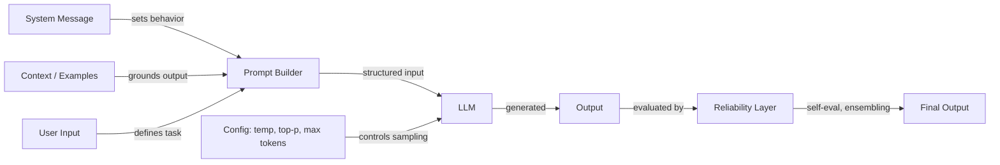

# Ingeniería de prompts

## Definición

La ingeniería de prompts es la práctica de elaborar texto de entrada — instrucciones, ejemplos, restricciones y contexto — para controlar el comportamiento de los modelos de lenguaje de gran escala sin modificar sus pesos. Es la interfaz principal entre la intención humana y la salida del modelo, y abarca desde la formulación simple de instrucciones hasta sofisticadas estrategias de razonamiento en múltiples pasos.

La disciplina abarca tres áreas interconectadas. La **configuración** cubre los parámetros de muestreo (temperature, Top-K, Top-P) y los controles de generación (max tokens, stop sequences) que determinan cómo el modelo produce tokens. Las **técnicas** incluyen enfoques estructurados como chain-of-thought, self-consistency, step-back prompting y prompting de sistema/rol que guían el proceso de razonamiento del modelo. La **fiabilidad** aborda los métodos para hacer las salidas más confiables — debiasing, prompt ensembling y auto-evaluación.

A medida que los LLMs se integran en sistemas de producción, la ingeniería de prompts ha evolucionado de la experimentación ad hoc a una práctica sistemática. Herramientas como [DSPy](https://dspy-docs.vercel.app/) y la [Ingeniería Automática de Prompts](/docs/prompt-engineering/automatic-prompt-engineering) incluso automatizan partes del proceso. Ya sea que estés construyendo un chatbot, un asistente de código o un pipeline de extracción de datos, la ingeniería de prompts es la primera y más accesible palanca para mejorar la calidad de las salidas.

## Cómo funciona

### El pipeline de prompts

Cada interacción con un LLM comienza con un prompt — una entrada estructurada que puede incluir un mensaje de sistema, instrucciones del usuario, ejemplos y contexto recuperado. El modelo procesa esta entrada y genera la salida token por token, moldeada tanto por el contenido del prompt como por la configuración de muestreo.

### Configuración vs. técnica

Los parámetros de configuración (temperature, Top-K, Top-P, max tokens) operan a nivel de muestreo de tokens — afectan *cómo* el modelo selecciona cada token. Las técnicas (chain-of-thought, self-consistency, step-back) operan a nivel de diseño del prompt — afectan *sobre qué* razona el modelo. Ambas capas interactúan: la self-consistency requiere alta temperature para generar caminos de razonamiento diversos, mientras que la extracción de salidas estructuradas funciona mejor con baja temperature para obtener determinismo.

### La capa de fiabilidad

La ingeniería de prompts avanzada añade una capa de fiabilidad sobre el prompting básico. Esto incluye ejecutar múltiples prompts en paralelo (ensembling), hacer que el modelo critique su propia salida (auto-evaluación) y aplicar estrategias de debiasing para reducir errores sistemáticos. Estos métodos intercambian coste computacional por calidad de salida y son especialmente importantes en aplicaciones de alto riesgo.

## Recursos prácticos

- [OpenAI — Guía de ingeniería de prompts](https://platform.openai.com/docs/guides/prompt-engineering) — Guía completa con mejores prácticas y estrategias
- [Anthropic — Diseño de prompts](https://docs.anthropic.com/en/docs/build-with-claude/prompt-engineering/overview) — Documentación oficial de prompting de Anthropic
- [Learn Prompting](https://learnprompting.org/) — Curso de código abierto sobre técnicas de ingeniería de prompts
- [Prompt Engineering Guide (DAIR.AI)](https://www.promptingguide.ai/) — Guía mantenida por la comunidad con papers y técnicas
- [Documentación de DSPy](https://dspy-docs.vercel.app/) — Framework para optimización programática de prompts

## Ver también

- [Temperature, Top-K, Top-P](/docs/prompt-engineering/temperature-top-k-top-p)
- [Max tokens y stop sequences](/docs/prompt-engineering/max-tokens-stop-sequences)
- [Salidas estructuradas](/docs/prompt-engineering/structured-outputs)
- [Prompting de sistema, rol y contextual](/docs/prompt-engineering/system-role-contextual-prompting)
- [Self-consistency](/docs/prompt-engineering/self-consistency)
- [Step-back prompting](/docs/prompt-engineering/step-back-prompting)
- [Ingeniería Automática de Prompts (APE)](/docs/prompt-engineering/automatic-prompt-engineering)
- [Técnicas de debiasing](/docs/prompt-engineering/debiasing-techniques)
- [Prompt ensembling](/docs/prompt-engineering/prompt-ensembling)
- [Auto-evaluación y calibración](/docs/prompt-engineering/self-evaluation-calibration)
- [LLMs](/docs/llms)
- [Chain-of-thought](/docs/reasoning-patterns/cot)
- [RAG](/docs/rag)
- [Agentes de IA](/docs/agents)
