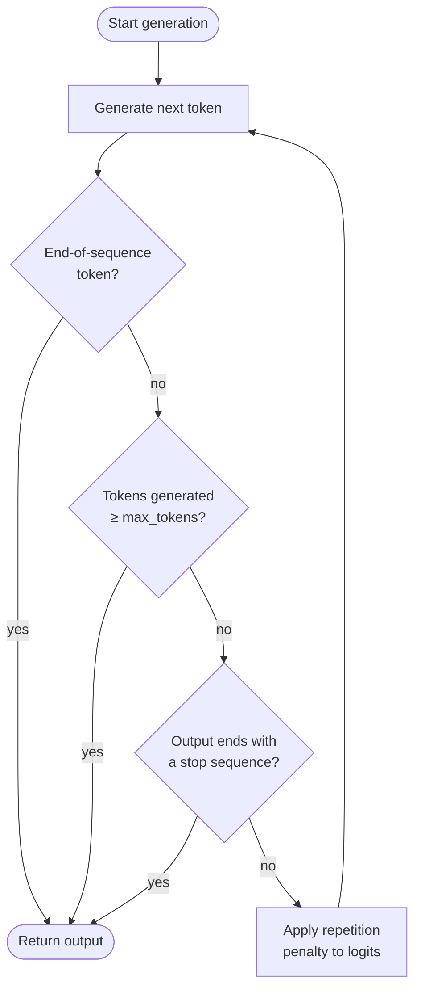

# Max tokens y stop sequences

## Definición

Max tokens, stop sequences y penalizaciones de repetición son parámetros de control de generación que determinan cuándo el modelo deja de generar y cómo maneja el contenido repetido. Mientras que los parámetros de muestreo como la temperature determinan *qué* dice el modelo, los parámetros de control de generación determinan *cuánto* dice, *dónde* se detiene y *cuán variado* permanece a lo largo de una respuesta larga. Cada API de LLM expone alguna versión de estos controles, y entenderlos es esencial para construir pipelines fiables y eficientes en costes.

**Max tokens** establece un límite superior estricto sobre el número de tokens que el modelo puede generar en una sola respuesta. Actúa como un techo de seguridad: el modelo se detiene en el momento en que emitiría un token que supera este presupuesto. No es una longitud objetivo — el modelo puede detenerse antes si genera un token de fin de secuencia de forma natural. Elegir un valor apropiado de max tokens importa tanto por el coste (generalmente se factura por token de salida) como por la corrección (una respuesta truncada puede dejar objetos JSON abiertos, cortar una cadena de razonamiento a mitad, o entregar resultados parciales a sistemas posteriores).

**Stop sequences** proporcionan condiciones de parada semánticas: una o más cadenas que, cuando se generan, hacen que el modelo se detenga de inmediato (la propia cadena de parada se excluye de la salida). Son indispensables para la generación estructurada — envolver la salida del LLM en un delimitador conocido y usar el delimitador de cierre como stop sequence hace que la extracción sea trivial y robusta. Las **penalizaciones de repetición** (frequency penalty y presence penalty en OpenAI; no expuestas de forma nativa en la API de mensajes de Anthropic) reducen la probabilidad de regenerar tokens que ya han aparecido, desalentando el bucle y el texto de relleno que puede surgir en generaciones largas.

## Cómo funciona



Cada token generado pasa por tres puntos de control en secuencia: detección de fin de secuencia, aplicación del presupuesto de max tokens y comparación con stop sequences. Si ninguna de las condiciones de parada se activa, la penalización de repetición se aplica a los logits para el siguiente token antes de que el muestreo se reanude.

### Max tokens

El parámetro `max_tokens` (llamado `max_tokens_to_sample` en SDKs más antiguos de Anthropic, ahora `max_tokens`) es un campo requerido o fuertemente recomendado en la mayoría de las APIs de LLM. Establecerlo demasiado bajo arriesga truncar la salida; establecerlo innecesariamente alto desperdicia cómputo y aumenta la latencia en endpoints de streaming. Una heurística práctica: estima la longitud esperada de la salida, luego establece `max_tokens` a 1.5–2× ese estimado como techo seguro. Para salidas estructuradas como JSON, perfila el recuento de tokens en el peor caso de tu esquema y agrega un 20% de margen.

### Stop sequences

Las stop sequences se definen como una lista de cadenas. El modelo escanea su salida después de cada token y se detiene tan pronto como el texto generado termina con cualquier entrada de la lista. Los patrones comunes incluyen `["###", "\n\n", "</answer>", "```"]` para plantillas de prompts estructurados, `["\nHuman:", "\nUser:"]` para simuladores de chat que no deben generar el siguiente turno del usuario, y delimitadores de cierre como `["</json>"]` para extracción etiquetada. Las stop sequences se comparan con el texto generado sin procesar, no con límites tokenizados, por lo que las cadenas de múltiples tokens funcionan correctamente. Un gotcha clave: la stop sequence *no* se incluye en el texto devuelto, por lo que tu lógica de análisis debe tener en cuenta su ausencia.

### Penalizaciones de repetición

La API de OpenAI expone dos parámetros de penalización distintos. **Frequency penalty** (`frequency_penalty`, rango −2.0 a 2.0) reduce el logit de un token en proporción a cuántas veces ya ha aparecido en el texto generado — desalentando la repetición de palabras usadas con frecuencia. **Presence penalty** (`presence_penalty`, rango −2.0 a 2.0) aplica una reducción de logit plana a cualquier token que haya aparecido al menos una vez, independientemente de la frecuencia — desalentando la reutilización de cualquier token ya visto. Los valores positivos reducen la repetición; los valores negativos la fomentan. Los valores en el rango 0.1–0.5 suelen ser suficientes para suprimir el bucle sin degradar significativamente la calidad de la salida. Los valores superiores a 1.0 pueden hacer que el modelo evite palabras de conexión útiles y degrade la coherencia.

## Cuándo usar / Cuándo NO usar

| Escenario | Configuración recomendada | Evitar |
|-----------|---------------------------|--------|
| Respuestas factuales cortas o clasificaciones | `max_tokens=50–150`; no se necesitan stop sequences | `max_tokens` muy alto; desperdicia presupuesto y puede invitar a relleno |
| Extracción estructurada JSON o etiquetada | Detener en delimitador de cierre (por ejemplo, `["</json>"]`); `max_tokens` ajustado al peor caso del esquema | Omitir stop sequences; el modelo puede añadir prosa después de la llave de cierre |
| Simulación de chat multi-turno | Stop sequences `["\nHuman:", "\nUser:"]` para evitar que el modelo genere el siguiente turno del usuario | Sin stop sequences; el modelo alucinará el siguiente turno de la conversación |
| Generación de formato largo (ensayos, informes) | `max_tokens` alto (2048–4096+); leve `frequency_penalty=0.2` para evitar frases repetitivas | `frequency_penalty > 1.0`; rompe la coherencia estilística y evita términos legítimamente repetidos |
| Generación de código | Detener en delimitadores apropiados al lenguaje (por ejemplo, triple backtick); `max_tokens` ajustado a la longitud de la función | `presence_penalty > 0.5`; los nombres de variables y palabras clave necesitan repetirse — las penalizaciones perjudican la corrección |
| Inferencia por lotes sensible a costes | Ajustar `max_tokens` al percentil 95 de la longitud de salida esperada | Dejar `max_tokens` en el máximo de la API (por ejemplo, 4096) cuando la salida típica es de 100 tokens |

## Ejemplos de código

### OpenAI — max_tokens, stop y frequency_penalty

```python
# OpenAI SDK: max_tokens, stop sequences, and repetition penalties
# pip install openai

import os
from openai import OpenAI

client = OpenAI(api_key=os.environ["OPENAI_API_KEY"])


def extract_with_controls(
    text: str,
    max_tokens: int = 512,
    stop: list[str] | None = None,
    frequency_penalty: float = 0.0,
    presence_penalty: float = 0.0,
) -> str:
    """Call the chat API with full generation-control parameters."""
    response = client.chat.completions.create(
        model="gpt-4o",
        messages=[
            {
                "role": "system",
                "content": (
                    "You are a structured data extractor. "
                    "Output only valid JSON between <json> and </json> tags."
                ),
            },
            {"role": "user", "content": f"Extract key facts from:\n\n{text}"},
        ],
        max_tokens=max_tokens,
        stop=stop or ["</json>"],
        frequency_penalty=frequency_penalty,
        presence_penalty=presence_penalty,
        temperature=0,
    )
    raw = response.choices[0].message.content
    # Strip the opening tag; closing tag was consumed by stop sequence
    return raw.replace("<json>", "").strip()


if __name__ == "__main__":
    article = (
        "SpaceX launched its Starship rocket on March 14, 2024. "
        "The vehicle reached an altitude of 210 km before completing a controlled reentry. "
        "It was the third integrated flight test of the system."
    )

    # Tight budget extraction
    result = extract_with_controls(
        article,
        max_tokens=256,
        stop=["</json>"],
        frequency_penalty=0.1,
    )
    print(result)

    # Long-form summary with anti-repetition penalty
    summary_resp = client.chat.completions.create(
        model="gpt-4o",
        messages=[{"role": "user", "content": f"Write a 3-paragraph summary of: {article}"}],
        max_tokens=600,
        frequency_penalty=0.4,
        presence_penalty=0.1,
        temperature=0.6,
    )
    print(summary_resp.choices[0].message.content)
```

### Anthropic — max_tokens y stop_sequences

```python
# Anthropic SDK: max_tokens and stop_sequences
# pip install anthropic

import os
import anthropic

client = anthropic.Anthropic(api_key=os.environ["ANTHROPIC_API_KEY"])


def generate_with_controls(
    prompt: str,
    max_tokens: int = 512,
    stop_sequences: list[str] | None = None,
) -> tuple[str, str]:
    """
    Returns (text_content, stop_reason).
    stop_reason is 'end_turn', 'max_tokens', or 'stop_sequence'.
    """
    message = client.messages.create(
        model="claude-opus-4-5",
        max_tokens=max_tokens,
        stop_sequences=stop_sequences or [],
        messages=[{"role": "user", "content": prompt}],
        temperature=0,
    )
    text = "".join(block.text for block in message.content if hasattr(block, "text"))
    return text, message.stop_reason


if __name__ == "__main__":
    # JSON extraction with stop sequence on closing delimiter
    json_prompt = (
        "Extract the event name, date, and location from the following text as JSON "
        "between <json> and </json> tags:\n\n"
        "The annual PyCon US conference will be held in Pittsburgh, PA on May 14-22, 2025."
    )
    output, reason = generate_with_controls(
        json_prompt,
        max_tokens=256,
        stop_sequences=["</json>"],
    )
    print(f"Stop reason: {reason}")
    print(output)

    # Constrained generation — stop before model generates a second answer
    answer_prompt = "Answer in one sentence: What is gradient descent?"
    answer, reason = generate_with_controls(
        answer_prompt,
        max_tokens=100,
        stop_sequences=["\n\n"],
    )
    print(f"Stop reason: {reason}")
    print(answer)
```

## Recursos prácticos

- [OpenAI — Referencia de API: chat completions](https://platform.openai.com/docs/api-reference/chat/create) — Referencia completa de parámetros para `max_tokens`, `stop`, `frequency_penalty` y `presence_penalty`
- [Anthropic — Referencia de API: messages](https://docs.anthropic.com/en/api/messages) — Referencia para `max_tokens` y `stop_sequences` en la API de Mensajes
- [OpenAI — Gestión de tokens](https://platform.openai.com/docs/guides/text-generation/managing-tokens) — Guía para contar tokens, entender ventanas de contexto y ajustar `max_tokens` apropiadamente
- [Hugging Face — Control de generación de texto](https://huggingface.co/docs/transformers/main_classes/text_generation) — Documentación de bajo nivel sobre `max_new_tokens`, `eos_token_id`, `repetition_penalty` y parámetros relacionados en la librería Transformers
- [tiktoken (tokenizador de OpenAI)](https://github.com/openai/tiktoken) — Librería de recuento de tokens para estimar presupuestos de tokens de salida antes de hacer llamadas a la API

## Ver también

- [Ingeniería de prompts](/docs/prompt-engineering)
- [Temperature, Top-K, Top-P](/docs/prompt-engineering/temperature-top-k-top-p)
- [Salidas estructuradas](/docs/prompt-engineering/structured-outputs)
- [Self-consistency](/docs/prompt-engineering/self-consistency)
- [LLMs](/docs/llms)
- [Chain-of-thought](/docs/reasoning-patterns/cot)
