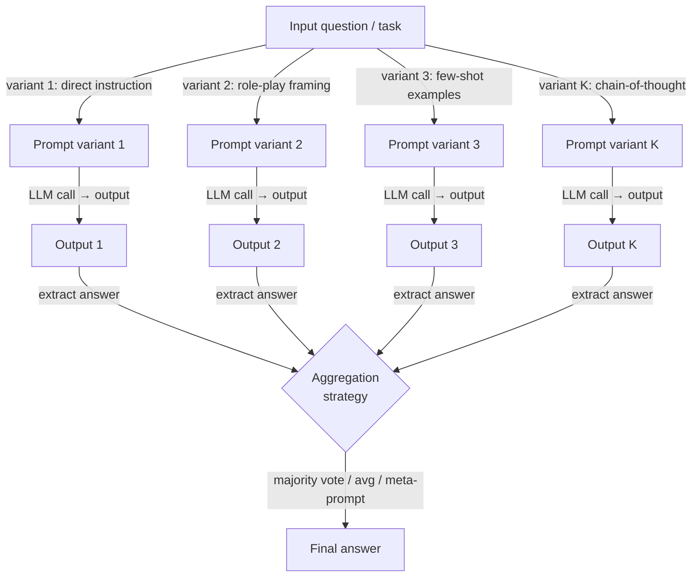

# Conjuntos de prompts

## Definición

Los conjuntos de prompts son una técnica de prompting que genera múltiples formulaciones estructuralmente diferentes de la misma pregunta o tarea, las envía todas a un modelo de lenguaje y luego combina los resultados en una sola respuesta final. La intuición central se toma prestada de los conjuntos de aprendizaje automático clásico (bagging, boosting, stacking): ningún predictor individual es perfecto, pero un comité diverso de predictores imperfectos tiende a ser más fiable que cualquier miembro individual, porque sus errores son parcialmente no correlacionados y por tanto se cancelan en la agregación.

La distinción crítica entre los conjuntos de prompts y la autoconsistencia es la fuente de diversidad. En la autoconsistencia, ejecutas el *mismo* prompt N veces con temperatura \> 0 y confías en el muestreo estocástico para producir caminos de razonamiento diversos. En los conjuntos de prompts, deliberadamente elaboras *diferentes* prompts —variando el encuadre, la asignación de rol, la formulación de la instrucción, los ejemplos de pocos disparos, o el formato de salida— y ejecutas cada uno (típicamente con temperatura 0 o baja) para producir resultados diversos pero deterministas. La autoconsistencia explota la varianza introducida por el muestreo; los conjuntos de prompts explotan la varianza introducida por el diseño del prompt. En la práctica, los dos enfoques son complementarios y pueden combinarse.

Los conjuntos de prompts son especialmente valiosos en dos escenarios. Primero, cuando no estás seguro de qué formulación de prompt es óptima para una tarea y no puedes evaluar alternativas a escala —ejecutar múltiples candidatos y votar sobre sus resultados te da el beneficio del mejor prompt sin tener que identificarlo de antemano. Segundo, cuando una tarea es de alto riesgo y el modo de falla de un solo prompt es inaceptable —un conjunto proporciona un rastro de auditoría suave, porque la distribución de votos entre diferentes respuestas es una señal directa de la incertidumbre del modelo. El costo principal es la latencia y los tokens: K variantes de prompts requieren K llamadas de inferencia, que pueden paralelizarse pero no eliminarse.

## Cómo funciona



### Estrategias de variación de prompts

La calidad de un conjunto depende en gran medida de la *diversidad* de las variantes del prompt. Si todas las variantes son superficialmente diferentes pero estructuralmente idénticas, el conjunto degenera hacia el muestreo repetido. Las estrategias de variación efectivas incluyen:

**Variación de rol y persona.** Asignar diferentes personas expertas (p. ej., "Eres un médico cauteloso", "Eres un científico de datos", "Eres un ingeniero pragmático") desplaza el conocimiento previo del modelo sobre respuestas plausibles y activa diferentes registros de conocimiento. La variación de roles es especialmente efectiva para tareas con múltiples encuadres válidos.

**Variación en la formulación de la instrucción.** La misma tarea puede formularse como una pregunta ("¿Cuál es el nivel de riesgo de...?"), un comando ("Evalúa el nivel de riesgo de..."), o una completación ("El nivel de riesgo de ... es"), y estas diferencias superficiales cambian mensurablemente la distribución de salida del modelo. Parafrasear la instrucción central es la forma de variación de menor esfuerzo.

**Variación de ejemplos de pocos disparos.** Usar diferentes conjuntos de ejemplos en contexto cambia qué parte del conocimiento del modelo activa el contexto de pocos disparos. Rotar a través de conjuntos de ejemplos extraídos de diferentes subdominios de la distribución de entrenamiento aumenta sustancialmente la diversidad del conjunto, especialmente para tareas de clasificación.

**Variación de cadena de pensamiento vs. respuesta directa.** Incluir una o más variantes de CoT junto con variantes de respuesta directa combina los beneficios de calidad de razonamiento de CoT con los beneficios de velocidad del prompting directo. Las variantes de CoT típicamente reciben más peso en la agregación porque son más fiables, pero las variantes directas pueden anular en casos donde CoT lleva al modelo a sobre-pensar preguntas simples.

**Variación del formato de salida.** Pedir la respuesta como un objeto JSON, como una lista numerada, o como una oración de texto libre puede generar diferentes niveles de precisión. Las variantes de salida estructurada son más fáciles de analizar y agregar programáticamente.

### Métodos de agregación

Una vez que tienes K resultados, necesitas reducirlos a una sola respuesta. La elección del método de agregación debe coincidir con el tipo de salida:

**El voto por mayoría** funciona mejor para salidas discretas (etiquetas de clasificación, respuestas factuales cortas, selecciones de opción múltiple). Es robusto ante variantes adversariales o confusas, no requiere llamadas adicionales al modelo, y refleja directamente cómo opera la autoconsistencia. Los empates pueden romperse por log-probabilidad o deferiendo a una variante "de confianza" designada.

**El promedio de puntuaciones** es apropiado cuando cada variante devuelve una puntuación numérica o probabilidad en lugar de una etiqueta. El promedio es sensible a los valores atípicos; la agregación por mediana es más robusta cuando las variantes individuales pueden producir valores extremos.

**La agregación por meta-prompt (LLM como juez)** envía todos los K resultados a una segunda llamada al LLM que recibe instrucciones para sintetizar o seleccionar la mejor respuesta. Este es el método más poderoso pero más costoso, e introduce un segundo punto de falla del LLM. Es más útil cuando la tarea requiere generación de extremo abierto (resúmenes, código, ensayos) donde el voto por mayoría no es aplicable.

**El voto ponderado** asigna diferentes pesos a diferentes variantes basándose en su precisión histórica en un conjunto de validación reservado. Si tienes datos etiquetados y puedes medir qué variantes se desempeñan mejor, la ponderación supera significativamente al voto uniforme —pero requiere esfuerzo de calibración por adelantado.

## Cuándo usar / Cuándo NO usar

| Usar cuando | Evitar cuando |
|-------------|---------------|
| No estás seguro de qué formulación de prompt funciona mejor y no puedes evaluarlas individualmente a escala | La latencia es una restricción estricta — K llamadas paralelas aún tienen la latencia de la llamada más lenta |
| La tarea es de alto riesgo y el modo de falla de un solo prompt es inaceptable | El presupuesto de tokens está severamente limitado y no puedes permitirte K completaciones |
| Los resultados de diferentes encuadres de prompts proporcionan perspectivas complementarias (p. ej., diagnóstico médico desde múltiples ángulos especializados) | El modelo ya alcanza la precisión máxima con un solo prompt bien ajustado — rendimientos decrecientes |
| Quieres una señal de incertidumbre incorporada (distribución de votos = desacuerdo del modelo) | El espacio de salida es continuo o de extremo abierto de una manera que hace que votar o promediar no tenga sentido |
| Estás construyendo un pipeline de producción donde la sensibilidad al prompt debe amortiguarse | Careces de la infraestructura de ingeniería para ejecutar y agregar llamadas LLM paralelas |

## Comparaciones

| Criterio | Conjuntos de prompts | Autoconsistencia | Prompt único |
|----------|---------------------|-----------------|--------------|
| Fuente de diversidad | Diferentes diseños de prompts | Muestreo estocástico de un prompt | Ninguna |
| Número de llamadas al LLM | K (número de variantes, típicamente 3–10) | N (típicamente 10–40) | 1 |
| Temperatura | Baja (0–0.3) por variante | Alta (0.5–0.8) | Dependiente de la tarea |
| Mejora de precisión | Alta para tareas sensibles a la formulación del prompt | Alta para razonamiento de múltiples pasos | Línea base |
| Requiere esfuerzo de ingeniería de prompts | Sí — diseñar variantes diversas | No — solo se necesita un prompt | Moderado |
| Maneja salida de extremo abierto | Sí, mediante agregación de meta-prompt | No — el voto por mayoría requiere respuestas discretas | Sí |
| Mejor caso de uso | Tareas con sensibilidad al prompt o múltiples encuadres válidos | Matemáticas, razonamiento simbólico, QA factual | Tareas simples y bien definidas con un buen prompt conocido |

## Ejemplos de código

### Conjuntos de prompts con múltiples plantillas usando OpenAI

```python
# Prompt ensembling: run K prompt variants and aggregate by majority vote
# pip install openai

import os
from collections import Counter
from openai import OpenAI

client = OpenAI(api_key=os.environ["OPENAI_API_KEY"])

# Five structurally different prompt variants for the same classification task
PROMPT_VARIANTS = [
    # 1. Direct instruction
    "Is the following customer review positive, negative, or neutral? "
    "Reply with exactly one word.\n\nReview: {review}",

    # 2. Role-play framing
    "You are a sentiment analysis expert. Classify the sentiment of the "
    "review below as positive, negative, or neutral. Output only the label.\n\nReview: {review}",

    # 3. Few-shot examples
    "Review: 'The product broke in two days.' → negative\n"
    "Review: 'Decent quality for the price.' → neutral\n"
    "Review: 'Absolutely love it, will buy again!' → positive\n"
    "Review: '{review}' →",

    # 4. Chain-of-thought variant
    "Analyze the sentiment of this review step by step, then state the "
    "final label (positive / negative / neutral) on the last line.\n\nReview: {review}",

    # 5. Completion framing
    "The overall sentiment expressed in the review '{review}' is",
]


def call_variant(prompt: str, model: str = "gpt-4o-mini") -> str:
    """Call the LLM with a single prompt variant and return the raw response."""
    resp = client.chat.completions.create(
        model=model,
        messages=[{"role": "user", "content": prompt}],
        temperature=0.0,
        max_tokens=80,
    )
    return resp.choices[0].message.content.strip()


def extract_label(text: str) -> str | None:
    """Extract a sentiment label from raw model output."""
    text_lower = text.lower()
    for label in ("positive", "negative", "neutral"):
        if label in text_lower:
            return label
    return None


def ensemble_sentiment(review: str) -> dict:
    """Run all prompt variants and aggregate by majority vote."""
    raw_outputs, labels = [], []

    for i, template in enumerate(PROMPT_VARIANTS):
        prompt = template.format(review=review)
        raw = call_variant(prompt)
        label = extract_label(raw)
        raw_outputs.append(raw)
        if label:
            labels.append(label)
        print(f"  Variant {i + 1}: {label!r}  (raw: {raw[:60]!r})")

    if not labels:
        return {"answer": None, "votes": {}}

    counts = Counter(labels)
    winner, top_votes = counts.most_common(1)[0]
    return {
        "answer": winner,
        "confidence": top_votes / len(labels),
        "votes": dict(counts),
        "raw_outputs": raw_outputs,
    }


if __name__ == "__main__":
    review = (
        "The delivery was fast but the item looks nothing like the photos. "
        "I'm disappointed and won't order again."
    )
    result = ensemble_sentiment(review)
    print(f"\nFinal answer : {result['answer']}")
    print(f"Confidence   : {result['confidence']:.0%}")
    print(f"Vote counts  : {result['votes']}")
```

### Conjunto ponderado con un conjunto de validación reservado

```python
# Weighted prompt ensembling: calibrate variant weights from a validation set
# pip install openai scikit-learn

import os
from collections import defaultdict
from openai import OpenAI
from sklearn.metrics import accuracy_score

client = OpenAI(api_key=os.environ["OPENAI_API_KEY"])


def evaluate_variant(template: str, examples: list[dict]) -> float:
    """Return accuracy of a single prompt variant on a labeled dataset."""
    preds = []
    for ex in examples:
        prompt = template.format(review=ex["text"])
        raw = call_variant(prompt)   # reuse function from above
        preds.append(extract_label(raw) or "neutral")
    return accuracy_score([ex["label"] for ex in examples], preds)


def weighted_ensemble(review: str, templates: list[str], weights: list[float]) -> str:
    """Aggregate variant outputs with per-variant weights."""
    scores: dict[str, float] = defaultdict(float)
    for template, weight in zip(templates, weights):
        raw = call_variant(template.format(review=review))
        label = extract_label(raw)
        if label:
            scores[label] += weight
    return max(scores, key=scores.__getitem__) if scores else "neutral"


if __name__ == "__main__":
    # Dummy validation set — replace with real labeled examples
    val_set = [
        {"text": "Great product!", "label": "positive"},
        {"text": "Terrible quality.", "label": "negative"},
        {"text": "It's okay I guess.", "label": "neutral"},
    ]
    # Calibrate weights (accuracy on val set)
    weights = [evaluate_variant(t, val_set) for t in PROMPT_VARIANTS]
    print("Variant weights:", [f"{w:.2f}" for w in weights])

    review = "Arrived on time but packaging was damaged."
    answer = weighted_ensemble(review, PROMPT_VARIANTS, weights)
    print("Weighted ensemble answer:", answer)
```

## Recursos prácticos

- [Diverse Demonstrations Improve In-context Compositional Generalization (Levy et al., 2022)](https://arxiv.org/abs/2212.06800) — Muestra que los ejemplos de pocos disparos diversos, la columna vertebral de la variación de prompts, mejoran significativamente la generalización sobre demostraciones muestreadas aleatoriamente.
- [Self-Consistency Improves Chain of Thought Reasoning in Language Models (Wang et al., 2022)](https://arxiv.org/abs/2203.11171) — El pariente más cercano de los conjuntos de prompts; fondo esencial para comprender la agregación sobre múltiples salidas de LLM.
- [Prompt Sensitivity and Prompt Ensembling for LLMs (Mizrahi et al., 2024)](https://arxiv.org/abs/2401.00595) — Estudia directamente cuánto varía la precisión de los LLM entre prompts parafraseados y demuestra que los conjuntos sobre paráfrasis cierran la mayor parte de la brecha.
- [Universal Self-Consistency for Large Language Model Generation (Chen et al., 2023)](https://arxiv.org/abs/2311.17311) — Extiende la autoconsistencia a la generación de extremo abierto mediante agregación de meta-prompt, cerrando la brecha entre los conjuntos de voto por mayoría y las salidas de forma libre.

## Ver también

- [Ingeniería de prompts](/docs/prompt-engineering)
- [Autoconsistencia](/docs/prompt-engineering/self-consistency)
- [Ingeniería automática de prompts](/docs/prompt-engineering/automatic-prompt-engineering)
