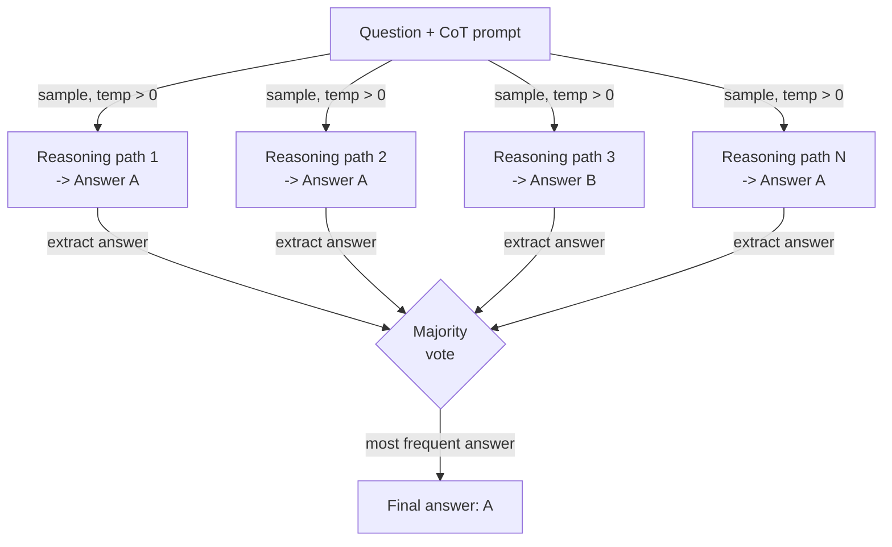

# Autoconsistencia

## Definición

La autoconsistencia es una técnica de prompting introducida por Wang et al. (2022) que aborda una debilidad fundamental del prompting de cadena de pensamiento (CoT): un solo camino de razonamiento puede llevar a una respuesta segura pero incorrecta. La idea es que las respuestas correctas tienden a ser robustas —múltiples caminos de razonamiento independientes que abordan un problema desde diferentes ángulos deben converger en la misma respuesta— mientras que las respuestas incorrectas tienden a ser frágiles e inconsistentes entre caminos. Al muestrear muchas cadenas de razonamiento con temperatura \> 0 y tomando el voto mayoritario sobre sus respuestas finales, la autoconsistencia actúa como un método de conjunto débil pero práctico que reduce significativamente los errores de razonamiento sin ningún ajuste fino del modelo.

La relación con CoT es directa: la autoconsistencia es CoT con muestreo repetido. Un prompt estándar de CoT produce una cadena de razonamiento y una respuesta; la autoconsistencia produce N cadenas (típicamente 10–40) y N respuestas, luego agrega. La configuración de temperatura es crítica: necesitas diversidad en los caminos de razonamiento, por lo que la decodificación codiciosa (temperatura=0) derrota el propósito. Una temperatura en el rango de 0.5–0.8 generalmente proporciona suficiente diversidad para una votación efectiva mientras mantiene cada cadena individual coherente. En benchmarks como GSM8K (problemas matemáticos de palabras), AQuA (razonamiento algebraico) y SVAMP, la autoconsistencia mejora la precisión de CoT en 10–20 puntos porcentuales al costo de N veces más llamadas de inferencia.

Lo que hace que la autoconsistencia sea prácticamente útil —y distinta de simplemente agregar un paso de autoevaluación— es que no requiere llamadas adicionales al modelo para "verificar" o "criticar". El mecanismo de votación es puramente estadístico: gana la respuesta que aparece con más frecuencia entre N muestras. Esto la hace simple de implementar, agnóstica al modelo, y directa de ajustar (simplemente varía N). La limitación principal es el costo: N completaciones cuestan N veces más. La autoconsistencia, por tanto, se aplica mejor a tareas donde la precisión vale el presupuesto de inferencia —matemáticas, razonamiento de múltiples pasos y clasificación de alto riesgo— en lugar de aplicaciones sensibles a la latencia o al costo de tokens.

## Cómo funciona



### Generación de caminos de razonamiento diversos

El primer paso es hacer un prompt al modelo con un prompt estándar de CoT de pocos disparos —un conjunto de triples de ejemplo (pregunta, razonamiento paso a paso, respuesta) seguido de la nueva pregunta. La diferencia clave respecto al CoT estándar es que llamas a la API N veces con temperatura \> 0 en lugar de una vez con temperatura 0. Cada llamada es estadísticamente independiente; el modelo explora una descomposición diferente del problema, puede usar diferentes variables intermedias u órdenes de cálculo, e incluso puede cometer diferentes errores intermedios —pero si la respuesta subyacente es correcta, la mayoría de los caminos aún llegarán a ella. El número de muestras N es un hiperparámetro: más muestras reducen la varianza pero aumentan el costo. En el artículo original, se usa N=40 para máxima precisión; en la práctica, N=10–20 a menudo recupera la mayor parte del beneficio a menor costo.

### Extracción y normalización de respuestas

Después de recopilar N completaciones, debes extraer la respuesta final de cada cadena de razonamiento. Para prompts de CoT bien estructurados, la respuesta típicamente está en la última oración después de una frase como "La respuesta es..." o "Por lo tanto, X." Para respuestas numéricas, la normalización importa: "3/4", "0.75" y "75%" son la misma respuesta y deben mapearse a la misma forma canónica antes de votar. Para tareas de clasificación o respuesta corta, la extracción es generalmente una coincidencia de subcadena o un análisis simple. La robustez de la extracción es la parte más frágil del pipeline —si el modelo produce una cadena que no termina con una respuesta claramente analizable, ese camino debe descartarse o asignarse a un cubo "desconocido".

### Voto por mayoría

El paso de agregación es un conteo de frecuencias sobre las respuestas extraídas. Gana la respuesta más común. Los empates pueden romperse eligiendo la respuesta del camino con la log-probabilidad más alta, o simplemente devolviendo las respuestas empatadas con sus recuentos de votos para revisión humana. La intuición estadística es que los errores son diversos (diferentes respuestas incorrectas por diferentes razones) mientras que las respuestas correctas están concentradas (la mayoría de los caminos llegan a la misma respuesta correcta). Esta propiedad se mantiene con más fuerza para tareas con una respuesta correcta única, como aritmética, razonamiento simbólico y QA basada en hechos. Para tareas de generación de extremo abierto —resumen, escritura creativa, código— la autoconsistencia es menos aplicable porque el voto mayoritario sobre ensayos no está bien definido.

## Cuándo usar / Cuándo NO usar

| Usar cuando | Evitar cuando |
|-------------|---------------|
| La tarea tiene una respuesta correcta única y la precisión de CoT es insuficiente | La latencia es una restricción estricta (N veces las llamadas de inferencia son inaceptables) |
| Razonamiento aritmético o algebraico de múltiples pasos con tasas de error conocidas | El costo de tokens es la preocupación principal y no puedes permitirte N completaciones |
| Clasificación de alto riesgo donde unos pocos puntos porcentuales de precisión importan | La tarea es generación de extremo abierto donde el voto mayoritario no es significativo |
| Quieres mejora de precisión sin ajuste fino o modelos adicionales | El modelo ya alcanza la precisión máxima en N=1 — rendimientos decrecientes |
| Los caminos de razonamiento necesitan ser auditables (puedes inspeccionar las N cadenas) | La extracción de respuestas es poco fiable debido a un formato de salida inconsistente |

## Comparaciones

| Criterio | Autoconsistencia | Cadena de pensamiento (CoT) | Autoevaluación |
|----------|-----------------|---------------------------|----------------|
| Número de llamadas al LLM | N (típicamente 10–40) | 1 | 2 (generar + criticar) |
| Mejora de precisión | Alta — 10–20pp en benchmarks de razonamiento | Moderada — sustancial sobre el prompting directo | Moderada — depende de la calidad de la autocrítica del modelo |
| Costo | Alto — lineal en N | Bajo | Bajo-moderado |
| Complejidad de implementación | Baja — muestrear N veces y votar | Muy baja | Moderada — requiere diseñar un prompt de crítica |
| Funciona sin retroalimentación externa | Sí | Sí | Sí |
| Mejor tipo de tarea | Matemáticas, razonamiento simbólico, QA factual | La mayoría de las tareas de razonamiento | Tareas donde el modelo puede detectar sus propios errores |
| Nota | Más fiable que CoT pero proporcionalmente más costoso | Línea base más simple — probar antes de la autoconsistencia | Complementario — puede combinarse para ganancias adicionales |

## Ejemplos de código

### Autoconsistencia con la API de OpenAI

```python
# Self-consistency: sample N CoT paths and take majority vote
# pip install openai

import os, re
from collections import Counter
from openai import OpenAI

client = OpenAI(api_key=os.environ["OPENAI_API_KEY"])

FEW_SHOT = """Q: Roger has 5 tennis balls. He buys 2 cans with 3 each. How many now?
A: 5 + (2 x 3) = 5 + 6 = 11. The answer is 11.

Q: Cafeteria had 23 apples, used 20, bought 6 more. How many now?
A: 23 - 20 = 3. 3 + 6 = 9. The answer is 9.

Q: {question}
A:"""


def extract_answer(text: str) -> str | None:
    m = re.search(r"[Tt]he answer is\s+([^.\n]+)", text)
    return m.group(1).strip().rstrip(".,;") if m else None


def self_consistency(question: str, n: int = 10, temp: float = 0.7) -> dict:
    """Sample n CoT paths and return majority vote answer with confidence."""
    answers, completions = [], []
    for i in range(n):
        resp = client.chat.completions.create(
            model="gpt-4o-mini",
            messages=[{"role": "user", "content": FEW_SHOT.format(question=question)}],
            temperature=temp,
            max_tokens=300,
        )
        text = resp.choices[0].message.content.strip()
        completions.append(text)
        ans = extract_answer(text)
        if ans:
            answers.append(ans)
        print(f"  Path {i+1:>2}: {ans!r}")

    if not answers:
        return {"answer": None, "votes": {}}
    counts = Counter(answers)
    winner, votes = counts.most_common(1)[0]
    return {"answer": winner, "confidence": votes / len(answers), "votes": dict(counts)}


if __name__ == "__main__":
    q = ("Janet's ducks lay 16 eggs per day. She eats 3 and bakes with 4. "
         "She sells the rest at $2/egg. How much does she make daily?")
    r = self_consistency(q, n=10)
    print(f"\nAnswer    : {r['answer']}")
    print(f"Confidence: {r['confidence']:.0%}")
    print(f"Votes     : {r['votes']}")
```

### Normalización de respuestas numéricas para votación robusta

```python
# Normalize numeric answers before majority voting
# Handles fractions, decimals, currency, and percentage strings

import re
from collections import Counter
from fractions import Fraction


def normalize_numeric(raw: str) -> str:
    """Canonicalize a raw answer string to a float string for voting."""
    raw = raw.strip().lower()
    raw = re.sub(r"[$%,]", "", raw)
    m = re.match(r"^(\d+)/(\d+)$", raw)
    if m:
        return str(float(Fraction(int(m.group(1)), int(m.group(2)))))
    try:
        return str(float(raw))
    except ValueError:
        return raw


def majority_vote(answers: list[str]) -> str | None:
    normalized = [normalize_numeric(a) for a in answers]
    return Counter(normalized).most_common(1)[0][0] if normalized else None


if __name__ == "__main__":
    raw = ["18", "18.0", "$18", "18", "17", "18", "18", "17", "18", "18"]
    print("Majority:", majority_vote(raw))  # -> "18.0"
```

## Recursos prácticos

- [Self-Consistency Improves Chain of Thought Reasoning in Language Models (Wang et al., 2022)](https://arxiv.org/abs/2203.11171) — Artículo original con benchmarks en GSM8K, AQuA, SVAMP, StrategyQA y ARC.
- [Chain-of-Thought Prompting Elicits Reasoning in Large Language Models (Wei et al., 2022)](https://arxiv.org/abs/2201.11903) — El artículo de CoT sobre el que se construye la autoconsistencia; fondo esencial.
- [OpenAI — Referencia de API de chat completions](https://platform.openai.com/docs/api-reference/chat/create) — Referencia para los parámetros `temperature`, `n` y `logprobs` utilizados en las implementaciones de autoconsistencia.
- [Anthropic — Visión general de ingeniería de prompts](https://docs.anthropic.com/en/docs/build-with-claude/prompt-engineering/overview) — Incluye orientación sobre muestreo y cadena de pensamiento para los modelos Claude.

## Ver también

- [Ingeniería de prompts](/docs/prompt-engineering)
- [Cadena de pensamiento (CoT)](/docs/reasoning-patterns/cot)
- [Conjuntos de prompts](/docs/prompt-engineering/prompt-ensembling)
