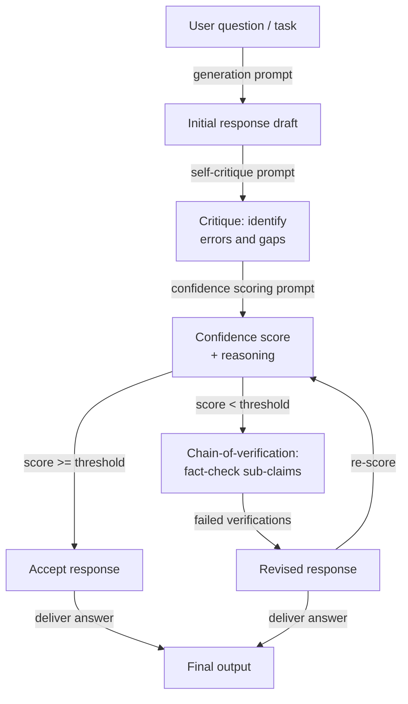

# Auto-evaluación y calibración

## Definición

La auto-evaluación se refiere a hacer un prompt a un modelo de lenguaje para que critique, verifique o puntúe su propia salida generada previamente. En lugar de tratar la primera respuesta del modelo como definitiva, un paso de auto-evaluación le pide al modelo que actúe como su propio revisor — verificando errores factuales, inconsistencias lógicas, razonamiento incompleto o fallo en seguir instrucciones — y luego ya sea para señalar problemas o para generar una respuesta mejorada. El modelo utiliza los mismos pesos y ventana de contexto para ambos roles, lo cual es tanto una fortaleza (no se necesita ningún modelo adicional) como una limitación fundamental (el modelo puede tener puntos ciegos sistemáticos que no puede auto-detectar).

La calibración es la dimensión más estrecha y cuantitativa de la auto-evaluación. Un modelo está *bien calibrado* si su confianza expresada coincide con su precisión empírica: cuando dice que está 80% seguro, debería ser correcto aproximadamente el 80% de las veces. La mayoría de los LLMs están mal calibrados por defecto — expresan alta confianza incluso en preguntas que responden incorrectamente, un fenómeno conocido como *sobreconfianza* o *exceso epistémico*. Las técnicas de calibración hacen un prompt al modelo para que produzca una puntuación de confianza numérica explícita junto con cada respuesta, y luego el sistema puede usar esa puntuación para enrutar respuestas inciertas a revisión humana, para activar pasos de verificación adicionales, o para abstenerse de responder por completo.

Juntas, la auto-evaluación y la calibración abordan dos modos de fallo distintos pero relacionados. La auto-evaluación aborda la *corrección*: el modelo produjo una respuesta, ¿pero es correcta? La calibración aborda la *conciencia de incertidumbre*: ¿sabe el modelo cuándo no sabe? Ambas son necesarias para desplegar LLMs en entornos de alto riesgo. Un modelo que detecta sus propios errores es más fiable; un modelo que sabe lo que no sabe es más confiable. Las técnicas aquí cubiertas — autocrítica, puntuación de confianza y chain-of-verification — son cada vez más componentes estándar de los pipelines de LLM en producción.

## Cómo funciona



### Autocrítica

La autocrítica es el método de auto-evaluación más simple. Después de generar una respuesta inicial, añades un segundo prompt que le pide al modelo que revise su propia salida según criterios explícitos. Los buenos prompts de autocrítica son *específicos* sobre qué verificar: precisión factual, consistencia lógica, completitud, adherencia a instrucciones, tono o seguridad. Los prompts vagos como "¿Es buena esta respuesta?" producen críticas superficiales. Los prompts específicos como "Lista cualquier afirmación factual en la respuesta sobre la que tengas menos del 90% de confianza, y explica por qué" producen retroalimentación accionable.

La calidad de la autocrítica mejora sustancialmente cuando le instruyes al modelo para que adopte una postura adversarial — buscar activamente problemas en lugar de confirmar que la respuesta está bien. Frases como "Cuestiona cada afirmación clave", "Encuentra al menos un defecto" y "¿A qué se opondría un escéptico?" sesgan al modelo hacia críticas útiles en lugar de validación. La IA Constitucional (Anthropic, 2022) sistematiza esto definiendo un conjunto de "principios" que el modelo debe verificar en la respuesta antes de revisarla — creando efectivamente una rúbrica de crítica estructurada que puede auditarse.

Un modo de fallo crítico de la autocrítica es la *validación sycophantic*: el modelo elogia su propia respuesta y no encuentra problemas, especialmente cuando la respuesta original ya sonaba plausible pero era incorrecta. Esto es más pronunciado en modelos más pequeños y menos pronunciado en modelos que han sido ajustados con datos de crítica. Las mitigaciones incluyen: usar una instancia de modelo separada para la crítica, inyectar errores deliberados en el borrador para probar si el paso de crítica los detecta, y requerir que la crítica sea una lista estructurada en lugar de prosa libre (haciendo "sin problemas" una afirmación más difícil de defender).

### Calibración y puntuación de confianza

Los prompts de puntuación de confianza le piden al modelo que produzca una probabilidad explícita o una calificación ordinal junto con cada respuesta. Una versión mínima es una simple solicitud añadida al prompt de respuesta: "Después de tu respuesta, indica tu confianza como un porcentaje del 0 al 100, donde 100 significa que estás seguro y 0 significa que estás adivinando." Las versiones más sofisticadas piden un desglose por afirmación: "Para cada declaración factual en tu respuesta, califica tu confianza (alta / media / baja) e identifica la fuente de incertidumbre."

Las puntuaciones de confianza numéricas de los LLMs deben tratarse con escepticismo. Las probabilidades verbalizadas crudas no están bien calibradas en el sentido estadístico — un modelo que dice "70% de confianza" no acierta sistemáticamente el 70% de las veces en esas preguntas. Sin embargo, son *monotónicamente útiles*: las preguntas donde el modelo reporta baja confianza tienden a ser más difíciles y propensas a errores que las preguntas donde reporta alta confianza. Esto significa que las puntuaciones de confianza verbalizadas son útiles para *clasificar* y *enrutar* (enviar respuestas de baja confianza a revisión) aunque no sean útiles para la estimación de probabilidad exacta.

La calibración puede mejorarse post-hoc mediante escalado de temperature o escalado de Platt aplicado a las log-probabilidades del modelo, pero estos requieren un conjunto de datos etiquetado. A nivel de prompt, puedes mejorar la calibración relativa pidiendo al modelo que compare su confianza con preguntas de referencia de dificultad conocida ("Tengo tanta confianza como tendría sobre la capital de Francia frente a una fecha histórica oscura").

### Chain-of-verification

El chain-of-verification (CoVe, Dhuliawala et al., 2023) estructura la auto-evaluación como un pipeline de verificación de múltiples pasos: genera una respuesta de línea base, luego planifica explícitamente un conjunto de preguntas de verificación que confirmarían o refutarían las afirmaciones clave en esa respuesta, responde esas preguntas de verificación de forma independiente (sin mirar la respuesta original para reducir el sesgo de confirmación) y finalmente produce una respuesta revisada informada por los resultados de la verificación. Esta descomposición es importante porque obliga al modelo a separar la *generación de afirmaciones* de la *verificación de afirmaciones*, reduciendo la probabilidad de que el mismo error de razonamiento se propague a través de ambos pasos.

Las preguntas de verificación deben ser atómicas — cada una debe probar una única subafirmación específica. Por ejemplo, si la respuesta de línea base afirma "Python 3.10 introdujo la coincidencia de patrones estructural y el operador walrus", las preguntas de verificación deben ser: "¿En qué versión de Python se introdujo la coincidencia de patrones estructural?" y "¿En qué versión de Python se introdujo el operador walrus?" Responder estas de forma independiente a menudo revela errores factuales que la respuesta original afirmó con confianza.

## Cuándo usar / Cuándo NO usar

| Usar cuando | Evitar cuando |
|-------------|---------------|
| La tarea es de alto riesgo y la corrección factual es crítica (médica, legal, financiera) | La latencia es una restricción dura — la auto-evaluación añade al menos un round-trip completo de inferencia |
| Quieres una señal de incertidumbre incorporada sin un modelo evaluador separado | El dominio del modelo es uno donde la auto-evaluación es sistemáticamente poco fiable (por ejemplo, eventos muy recientes más allá del corte de entrenamiento) |
| La calidad de la salida es muy variable entre ejecuciones y necesitas un mecanismo de filtrado | La tarea es simple y bien restringida — la sobrecarga de auto-evaluación supera el beneficio de precisión |
| Necesitas enrutar respuestas inciertas a revisión humana automáticamente | El modelo es demasiado pequeño para producir autocríticas fiables (< 7B parámetros típicamente produce auto-evaluación pobre) |
| Las respuestas contienen múltiples afirmaciones factuales independientes que pueden verificarse atómicamente | Necesitas calibración de probabilidad exacta — las puntuaciones de confianza verbalizadas no están estadísticamente calibradas |
| Construyendo un pipeline donde el modelo debe detectar sus propias alucinaciones | La generación original ya está en precisión de techo — la autocrítica añade coste sin ganancia de precisión |

## Comparaciones

| Criterio | Auto-evaluación | Self-consistency | Evaluación externa |
|----------|----------------|-----------------|---------------------|
| Llamadas adicionales al modelo | 1–3 (crítica, puntuación, verificación) | N (típicamente 10–40) | 1 (evaluador separado) |
| Requiere modelo separado | No — el mismo modelo se revisa a sí mismo | No | Sí — típicamente un modelo más fuerte o especializado |
| Detecta errores factuales | Sí, si la autocrítica está bien prompta | Parcialmente — los hechos inconsistentes pueden sobrevivir el voto mayoritario | Sí, más fiablemente |
| Proporciona puntuación de incertidumbre | Sí — calificación de confianza explícita | Implícita — la distribución de votos es un proxy de confianza | Sí — el evaluador puede producir una puntuación |
| Reduce la alucinación | Sí, especialmente con CoVe | Parcialmente — la votación reduce pero no elimina la alucinación | Más fiablemente, pero añade coste y latencia |
| Esfuerzo de implementación | Moderado — requiere diseño cuidadoso del prompt de crítica | Bajo — muestrea N veces y vota | Alto — requiere prompt del evaluador, llamada separada a la API, posiblemente un modelo separado |
| Mejor caso de uso | QA de alto riesgo de un solo turno, generación factual | Matemáticas y razonamiento en múltiples pasos | Pipelines empresariales con fuertes requisitos de corrección |

## Ejemplos de código

### Auto-evaluación con paso de crítica usando el SDK de Anthropic

```python
# Self-evaluation pipeline: generate → critique → score → revise
# pip install anthropic

import os
from anthropic import Anthropic

client = Anthropic(api_key=os.environ["ANTHROPIC_API_KEY"])
MODEL = "claude-opus-4-5"


def generate_initial(question: str) -> str:
    """Step 1: Generate an initial response."""
    response = client.messages.create(
        model=MODEL,
        max_tokens=512,
        messages=[{"role": "user", "content": question}],
    )
    return response.content[0].text.strip()


def critique_response(question: str, response: str) -> str:
    """Step 2: Critique the initial response for errors and gaps."""
    prompt = f"""You are a rigorous fact-checker and critic. Review the response below and identify:
1. Any factual claims you are less than fully confident about
2. Logical inconsistencies or gaps in reasoning
3. Missing context that would be important for the user

Question: {question}

Response to critique:
{response}

Provide a structured critique. If you find no issues, you must still explain why you believe the response is correct. Do not simply validate the response."""

    critique = client.messages.create(
        model=MODEL,
        max_tokens=512,
        messages=[{"role": "user", "content": prompt}],
    )
    return critique.content[0].text.strip()


def score_confidence(question: str, response: str, critique: str) -> dict:
    """Step 3: Produce an explicit confidence score based on the critique."""
    prompt = f"""Given the question, the response, and the critique below, assign a confidence score.

Question: {question}

Response:
{response}

Critique:
{critique}

Output in this exact format:
CONFIDENCE: [integer 0-100]
REASONING: [one sentence explaining the score]
SHOULD_REVISE: [yes/no]"""

    result = client.messages.create(
        model=MODEL,
        max_tokens=128,
        messages=[{"role": "user", "content": prompt}],
    )
    text = result.content[0].text.strip()

    # Parse structured output
    confidence, reasoning, should_revise = None, "", False
    for line in text.splitlines():
        if line.startswith("CONFIDENCE:"):
            try:
                confidence = int(line.split(":", 1)[1].strip())
            except ValueError:
                pass
        elif line.startswith("REASONING:"):
            reasoning = line.split(":", 1)[1].strip()
        elif line.startswith("SHOULD_REVISE:"):
            should_revise = "yes" in line.lower()

    return {"confidence": confidence, "reasoning": reasoning, "should_revise": should_revise}


def revise_response(question: str, initial: str, critique: str) -> str:
    """Step 4: Produce a revised response informed by the critique."""
    prompt = f"""Revise the response below to address the issues identified in the critique.
Preserve correct information. Be explicit about any remaining uncertainty.

Question: {question}

Original response:
{initial}

Critique to address:
{critique}

Revised response:"""

    revised = client.messages.create(
        model=MODEL,
        max_tokens=512,
        messages=[{"role": "user", "content": prompt}],
    )
    return revised.content[0].text.strip()


def self_evaluate(question: str, confidence_threshold: int = 75) -> dict:
    """Full self-evaluation pipeline: generate, critique, score, conditionally revise."""
    print("=== Step 1: Generating initial response ===")
    initial = generate_initial(question)
    print(initial[:200], "...\n" if len(initial) > 200 else "\n")

    print("=== Step 2: Critiquing response ===")
    critique = critique_response(question, initial)
    print(critique[:200], "...\n" if len(critique) > 200 else "\n")

    print("=== Step 3: Scoring confidence ===")
    score = score_confidence(question, initial, critique)
    print(f"Confidence : {score['confidence']}")
    print(f"Reasoning  : {score['reasoning']}")
    print(f"Revise?    : {score['should_revise']}\n")

    final = initial
    if score["should_revise"] or (score["confidence"] is not None and score["confidence"] < confidence_threshold):
        print("=== Step 4: Revising response ===")
        final = revise_response(question, initial, critique)
        print(final[:200], "...\n" if len(final) > 200 else "\n")
    else:
        print("=== Step 4: Skipped — confidence above threshold ===\n")

    return {
        "question": question,
        "initial_response": initial,
        "critique": critique,
        "confidence_score": score,
        "final_response": final,
        "was_revised": final != initial,
    }


if __name__ == "__main__":
    q = ("What were the main causes of the 2008 financial crisis, "
         "and which regulatory changes were enacted in response?")
    result = self_evaluate(q, confidence_threshold=80)
    print("=== Final answer ===")
    print(result["final_response"])
    print(f"\nRevised: {result['was_revised']}")
    print(f"Confidence: {result['confidence_score']['confidence']}")
```

### Chain-of-verification para afirmaciones factuales

```python
# Chain-of-Verification (CoVe): decompose claims, verify independently, revise
# pip install anthropic

import os
from anthropic import Anthropic

client = Anthropic(api_key=os.environ["ANTHROPIC_API_KEY"])
MODEL = "claude-opus-4-5"


def extract_verification_questions(response: str) -> list[str]:
    """Generate atomic verification questions for each factual claim."""
    prompt = f"""Read the response below and generate a list of atomic verification questions
— one per distinct factual claim. Each question should be answerable independently
without referring to the original response.

Response:
{response}

Output as a numbered list of questions only. No preamble."""

    result = client.messages.create(
        model=MODEL,
        max_tokens=400,
        messages=[{"role": "user", "content": prompt}],
    )
    text = result.content[0].text.strip()
    questions = []
    for line in text.splitlines():
        line = line.strip()
        if line and line[0].isdigit():
            # Strip leading number and punctuation
            q = line.lstrip("0123456789.)- ").strip()
            if q:
                questions.append(q)
    return questions


def verify_claim(question: str) -> dict:
    """Answer a single verification question independently."""
    prompt = f"""Answer the following question as accurately as possible.
If you are uncertain, say so explicitly and explain why.

Question: {question}

Answer:"""

    result = client.messages.create(
        model=MODEL,
        max_tokens=150,
        messages=[{"role": "user", "content": prompt}],
    )
    answer = result.content[0].text.strip()
    uncertain = any(w in answer.lower() for w in ("uncertain", "unsure", "not sure", "don't know", "unclear"))
    return {"question": question, "answer": answer, "uncertain": uncertain}


def revise_with_verifications(original_response: str, verifications: list[dict]) -> str:
    """Produce a revised response informed by independent verification results."""
    verification_block = "\n".join(
        f"Q: {v['question']}\nA: {v['answer']}\n" for v in verifications
    )
    prompt = f"""Revise the response below using the independent verification answers provided.
Correct any inaccuracies. Where verifications indicate uncertainty, acknowledge that uncertainty explicitly.

Original response:
{original_response}

Independent verifications:
{verification_block}

Revised response:"""

    result = client.messages.create(
        model=MODEL,
        max_tokens=600,
        messages=[{"role": "user", "content": prompt}],
    )
    return result.content[0].text.strip()


def chain_of_verification(question: str) -> dict:
    """Full CoVe pipeline for a factual question."""
    # Step 1: Baseline response
    baseline = client.messages.create(
        model=MODEL,
        max_tokens=400,
        messages=[{"role": "user", "content": question}],
    ).content[0].text.strip()

    # Step 2: Plan verification questions
    vqs = extract_verification_questions(baseline)
    print(f"Generated {len(vqs)} verification questions.")

    # Step 3: Answer each verification question independently
    verifications = [verify_claim(q) for q in vqs]
    uncertain_count = sum(1 for v in verifications if v["uncertain"])
    print(f"Uncertain claims: {uncertain_count}/{len(verifications)}")

    # Step 4: Revise using verification results
    revised = revise_with_verifications(baseline, verifications)

    return {
        "question": question,
        "baseline": baseline,
        "verification_questions": vqs,
        "verifications": verifications,
        "revised": revised,
        "uncertain_claims": uncertain_count,
    }


if __name__ == "__main__":
    q = "Summarize the key milestones in the development of transformer models from 2017 to 2023."
    result = chain_of_verification(q)
    print("\n=== Baseline ===")
    print(result["baseline"])
    print("\n=== Revised (after CoVe) ===")
    print(result["revised"])
    print(f"\nUncertain claims flagged: {result['uncertain_claims']}/{len(result['verifications'])}")
```

## Recursos prácticos

- [Self-Refine: Iterative Refinement with Self-Feedback (Madaan et al., 2023)](https://arxiv.org/abs/2303.17651) — Introduce y evalúa la autocrítica iterativa y la revisión en siete tareas diversas de generación de texto; la referencia fundacional para los pipelines de auto-evaluación.
- [Chain-of-Verification Reduces Hallucination in Large Language Models (Dhuliawala et al., 2023)](https://arxiv.org/abs/2309.11495) — Propone CoVe, el enfoque de planificación de verificación estructurada descrito en este artículo, con experimentos en QA basado en listas y generación de formato largo.
- [Constitutional AI: Harmlessness from AI Feedback (Bai et al., 2022)](https://arxiv.org/abs/2212.08073) — Demuestra la autocrítica sistemática contra un conjunto definido de principios a escala; el precedente de producción para rúbricas de auto-evaluación estructuradas.
- [Language Models (Mostly) Know What They Know (Kadavath et al., 2022)](https://arxiv.org/abs/2207.05221) — Estudia si los LLMs pueden informar con precisión su propia incertidumbre; muestra que la calibración es posible pero imperfecta, proporcionando la base empírica para las técnicas de puntuación de confianza.
- [Calibration of Large Language Models Using Their Generations (Kapoor et al., 2024)](https://arxiv.org/abs/2403.07221) — Revisa los métodos de calibración post-hoc incluyendo la confianza verbalizada y los compara con las líneas base de log-probabilidad en las familias GPT-4 y Claude.

## Ver también

- [Ingeniería de prompts](/docs/prompt-engineering)
- [Self-consistency](/docs/prompt-engineering/self-consistency)
- [Técnicas de debiasing](/docs/prompt-engineering/debiasing-techniques)
- [Métricas de evaluación](/docs/evaluation-metrics)
