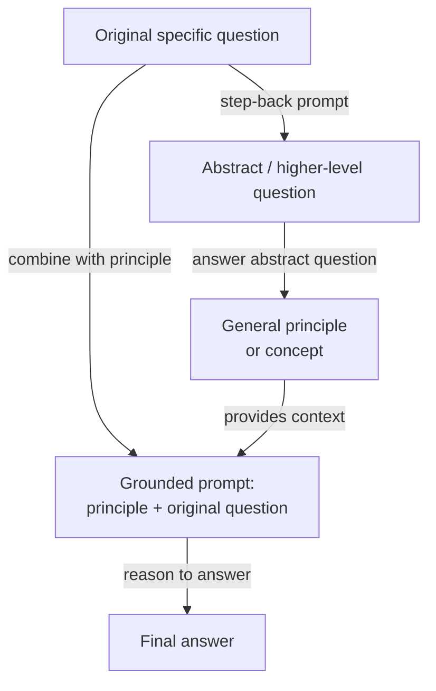

# Step-back prompting

## Definición

El step-back prompting es una técnica de prompting en dos pasos introducida por Zheng et al. (2023) en Google DeepMind. La idea central es engañosamente simple: antes de pedirle al modelo que responda una pregunta específica, potencialmente difícil, primero hazle una versión más abstracta y de nivel superior de la misma pregunta — y luego usa la respuesta del modelo a esa pregunta abstracta como contexto al responder la original. La técnica se basa en la observación de que los LLMs a menudo fallan en preguntas factuales o de razonamiento específicas no porque les falte el conocimiento relevante, sino porque la especificidad de la pregunta activa el "contexto de recuperación" incorrecto en las representaciones internas del modelo. Retroceder a un nivel de abstracción más alto activa conocimiento más amplio y confiable, que luego fundamenta la respuesta final.

La intuición detrás del step-back prompting se basa en cómo los expertos abordan los problemas difíciles. Un físico al que le preguntan "¿Qué ocurre con la presión de un gas si se aumenta la temperatura a volumen constante?" podría primero recordar la ley del gas ideal (PV = nRT) como trasfondo general antes de aplicarla al caso específico — en lugar de saltar directamente a una respuesta que arriesga mezclar variables. El step-back prompting instruye al modelo para hacer lo mismo: generar un principio o concepto general que subyace a la pregunta específica, luego razonar desde ese principio hasta la respuesta. Esto efectivamente añade un paso de andamiaje conceptual que reduce la probabilidad de que la coincidencia de patrones superficiales lleve a una respuesta incorrecta.

En el paper original, el step-back prompting se demuestra con ejemplos few-shot que enseñan al modelo cómo "retroceder" apropiadamente para un dominio dado. Para preguntas de física, la pregunta abstracta típicamente pide la ley o principio físico relevante. Para preguntas de historia, pide el contexto histórico más amplio. Para preguntas médicas, pide la fisiología relevante. La técnica es agnóstica al modelo y no requiere fine-tuning — es puramente una intervención a nivel de prompt. En los benchmarks MMLU y TimeQA, el step-back prompting supera tanto al chain-of-thought estándar como a las líneas base de recuperación aumentada en preguntas difíciles e intensivas en conocimiento.

## Cómo funciona



### Paso 1 — Generar la pregunta abstracta

El primer paso es hacer un prompt al modelo para que identifique una pregunta de nivel superior que comprende la original. Esto se hace típicamente con un prompt few-shot que contiene ejemplos específicos del dominio de pares (pregunta específica, pregunta abstracta). Por ejemplo, si la pregunta original es "¿Cuál es el punto de fusión del arseniuro de galio?", la pregunta abstracta podría ser "¿Cuáles son las propiedades termodinámicas y cristalográficas de los semiconductores III-V?". La pregunta abstracta debe ser lo suficientemente general para activar conocimiento relevante amplio, pero no tan general como para ser poco informativa. Obtener el nivel correcto de abstracción es el principal desafío de ingeniería de prompts, y los ejemplos few-shot son esenciales para dirigir al modelo al nivel de abstracción apropiado para un dominio dado.

### Paso 2 — Responder la pregunta abstracta

Con la pregunta abstracta generada, el modelo la responde. Esta respuesta típicamente toma la forma de un principio general, una definición, una ley física o un resumen del contexto de trasfondo relevante. La propiedad clave de este paso es que la pregunta abstracta suele ser más fácil de responder de forma fiable para el modelo que la pregunta específica original — activa representaciones bien aprendidas y factualmente fundamentadas en lugar de casos extremos o hechos numéricos específicos que son más propensos a la alucinación. La respuesta a la pregunta abstracta se convierte en un bloque de contexto que restringe e informa el paso de razonamiento final.

### Paso 3 — Responder la pregunta original usando la abstracción como contexto

El paso final combina el principio abstracto con la pregunta específica original en un único prompt: "Dado este trasfondo: [respuesta abstracta], responde la pregunta específica: [pregunta original]." El modelo ahora razona desde una base conceptual sólida en lugar de intentar la recuperación directa de un hecho específico. Esto reduce el riesgo de alucinación en preguntas intensivas en hechos y mejora la consistencia lógica del razonamiento en múltiples pasos. En el paper original, este paso final también usa chain-of-thought, haciendo que el step-back prompting sea composable con CoT: el paso de abstracción fundamenta el razonamiento, y CoT lo hace explícito.

## Cuándo usar / Cuándo NO usar

| Usar cuando | Evitar cuando |
|-------------|---------------|
| La pregunta requiere conocimiento factual específico donde el modelo es propenso a la alucinación | Preguntas simples donde el prompting directo ya funciona de forma fiable |
| El dominio tiene una jerarquía clara de principios generales a instancias específicas (física, química, historia) | La pregunta abstracta es difícil de definir — tareas sin una distinción natural general/específica |
| El modelo responde preguntas específicas de forma inconsistente pero es fiable en principios generales | La latencia es crítica — dos llamadas al LLM duplican el tiempo de respuesta |
| Quieres reducir la alucinación en benchmarks intensivos en conocimiento sin RAG | La pregunta es puramente matemática o simbólica — CoT solo suele ser suficiente |
| Hay ejemplos few-shot disponibles para el dominio para enseñar al modelo cómo retroceder | El presupuesto de tokens es ajustado — la respuesta abstracta añade tokens al prompt final |

## Comparaciones

| Criterio | Step-back prompting | Chain-of-thought (CoT) | Self-consistency |
|----------|--------------------|-----------------------|-----------------|
| Número de llamadas al LLM | 2 (abstracta + final) | 1 | N (típicamente 10–40) |
| Mecanismo central | Abstracción a fundamentación a razonamiento | Razonamiento explícito paso a paso | Múltiples caminos independientes + voto mayoritario |
| Beneficio principal | Reduce la alucinación en preguntas intensivas en conocimiento | Mejora el razonamiento lógico en múltiples pasos | Reduce la varianza en los resultados de razonamiento |
| Coste | 2x la línea base | 1x la línea base | Nx la línea base |
| Requiere ejemplos few-shot | Sí — para enseñar el comportamiento de retroceso | Sí — para mejores resultados | Sí — prompt CoT few-shot como base |
| Mejor tipo de tarea | QA intensivo en conocimiento, ciencia, historia | Matemáticas, lógica, código | Matemáticas, razonamiento simbólico, QA factual |
| Composable con CoT | Sí — recomendado combinar ambos | N/A | Sí — el prompt base usa CoT |
| Nota | Complementario a la self-consistency; ambos pueden apilarse para ganancias adicionales | Línea base más simple — prueba antes del step-back | Más caro; usar cuando la alta precisión justifica el coste Nx |

## Ejemplos de código

### Step-back prompting con OpenAI — implementación con dos llamadas

```python
# Step-back prompting: abstraction-then-answer, two API calls
# pip install openai

import os
from openai import OpenAI

client = OpenAI(api_key=os.environ["OPENAI_API_KEY"])

STEP_BACK_FEW_SHOT = """Help identify a broader abstract question underpinning a specific one.

Original: At what temperature does gallium arsenide melt?
Step-back: What are the thermodynamic properties of III-V semiconductors?

Original: What was the immediate cause of the US entering World War I?
Step-back: What geopolitical tensions shaped US foreign policy before WWI?

Original: Patient has peripheral edema, elevated JVP, orthopnea. Diagnosis?
Step-back: What are the hallmark signs of right-sided and left-sided heart failure?

Original: {question}
Step-back:"""

GROUNDED = """Using the background context below, answer the specific question step by step.

Background (general principles):
{background}

Specific question:
{question}

Let's think step by step:"""


def generate_step_back(question: str) -> str:
    resp = client.chat.completions.create(
        model="gpt-4o",
        messages=[{"role": "user", "content": STEP_BACK_FEW_SHOT.format(question=question)}],
        temperature=0, max_tokens=150,
    )
    return resp.choices[0].message.content.strip()


def answer_abstract(abstract_q: str) -> str:
    resp = client.chat.completions.create(
        model="gpt-4o",
        messages=[
            {"role": "system", "content": "Answer with accurate background principles (3-5 sentences)."},
            {"role": "user", "content": abstract_q},
        ],
        temperature=0, max_tokens=300,
    )
    return resp.choices[0].message.content.strip()


def answer_with_step_back(question: str) -> str:
    abstract_q = generate_step_back(question)
    background  = answer_abstract(abstract_q)
    resp = client.chat.completions.create(
        model="gpt-4o",
        messages=[{"role": "user", "content": GROUNDED.format(
            background=background, question=question)}],
        temperature=0, max_tokens=500,
    )
    return resp.choices[0].message.content.strip()


if __name__ == "__main__":
    q = "Why did Soviet collectivization in the early 1930s lead to famine in Ukraine?"
    print(answer_with_step_back(q))
```

### Step-back prompting con Anthropic — una sola llamada con salida estructurada

```python
# Step-back prompting in one Anthropic call: structured three-part format
# pip install anthropic

import os
import anthropic

client = anthropic.Anthropic(api_key=os.environ["ANTHROPIC_API_KEY"])

SYSTEM = """You are an expert reasoning assistant. For each question, respond in three parts:

## Abstract question:
A broader, general question capturing the underlying principle.

## Background context:
Answer the abstract question with relevant principles and definitions (3-5 sentences).

## Final answer:
Use the background to reason step-by-step to the specific answer."""

EXAMPLE = [
    {"role": "user", "content": "Ideal gas: 2 mol, 300 K, 0.05 m^3. What is the pressure?"},
    {"role": "assistant", "content": """## Abstract question:
What is the ideal gas law and how does it relate P, V, n, and T?

## Background context:
PV = nRT, where P is pressure (Pa), V is volume (m^3), n is moles, R = 8.314 J/mol/K, T is Kelvin. Rearranged: P = nRT / V.

## Final answer:
P = (2 x 8.314 x 300) / 0.05 = 99,768 Pa (about 0.985 atm)."""},
]


def step_back(question: str) -> str:
    response = client.messages.create(
        model="claude-opus-4-5",
        max_tokens=800,
        system=SYSTEM,
        messages=EXAMPLE + [{"role": "user", "content": question}],
    )
    return response.content[0].text


if __name__ == "__main__":
    q = "A patient is given furosemide. How does it cause hypokalemia?"
    print(step_back(q))
```

## Recursos prácticos

- [Take a Step Back: Evoking Reasoning via Abstraction in Large Language Models (Zheng et al., 2023)](https://arxiv.org/abs/2310.06117) — Paper original de Google DeepMind con benchmarks en MMLU, TimeQA y MedQA.
- [Chain-of-Thought Prompting Elicits Reasoning in Large Language Models (Wei et al., 2022)](https://arxiv.org/abs/2201.11903) — El paper de CoT sobre el que se construye el step-back prompting y contra el que se evalúa.
- [Anthropic — Resumen de ingeniería de prompts](https://docs.anthropic.com/en/docs/build-with-claude/prompt-engineering/overview) — Cubre la estructuración del prompt de sistema y el diseño de ejemplos few-shot.
- [OpenAI — Guía de ingeniería de prompts](https://platform.openai.com/docs/guides/prompt-engineering) — Guía práctica sobre prompting few-shot, estrategias de razonamiento y estructura de salida.

## Ver también

- [Ingeniería de prompts](/docs/prompt-engineering)
- [Chain-of-thought (CoT)](/docs/reasoning-patterns/cot)
- [Self-consistency](/docs/prompt-engineering/self-consistency)
