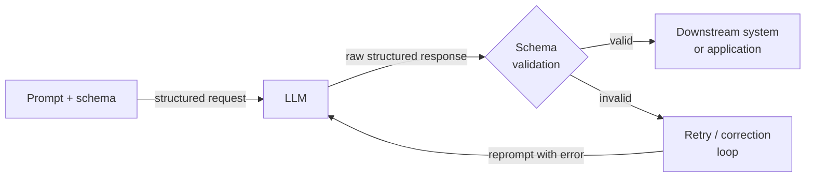

# Salidas estructuradas

## Definición

Las salidas estructuradas se refieren a la práctica de restringir o guiar a un LLM para que produzca datos legibles por máquina — más comúnmente JSON — en lugar de prosa de forma libre. En un pipeline de producción, la diferencia entre un LLM que devuelve una respuesta correcta y uno que devuelve una respuesta correcta en un formato analizable es la diferencia entre una demo de juguete y un sistema desplegable. Un servicio posterior que necesita extraer un nombre de producto, una etiqueta de sentimiento o una lista de acciones no puede operar de forma fiable en texto no estructurado; necesita una forma garantizada que pueda deserializar, validar y enrutar.

La evolución de las técnicas de salida estructurada sigue la maduración de las APIs de LLM. Los primeros sistemas se basaban en instrucciones de prompts frágiles ("responde solo con JSON válido") combinadas con análisis con regex y bucles de reintento. Este enfoque fallaba cuando el modelo añadía un preámbulo explicativo, envolvía el JSON en un bloque de código markdown o violaba sutilmente el esquema en casos extremos. La siguiente generación introdujo la llamada a funciones (OpenAI, mediados de 2023) y el uso de herramientas (Anthropic), que mueven la definición del esquema fuera del prompt y hacia un parámetro de API de primer nivel, permitiendo que el modelo sea entrenado y restringido explícitamente sobre el contrato de salida. Más recientemente, los proveedores introdujeron la decodificación restringida por gramática estricta que hace que el cumplimiento del esquema sea una garantía dura a nivel de token, no una instrucción de prompt suave.

Entender qué técnica aplicar — y por qué — importa para cualquier persona que construya pipelines que dependan de la salida de los LLMs. El modo JSON es el punto de entrada más simple pero no proporciona validación de esquema. La llamada a funciones / uso de herramientas proporciona un esquema tipado y análisis estructurado en la respuesta de la API, pero requiere definir esquemas de herramientas de antemano. Las bibliotecas de extracción basadas en Pydantic (Instructor, analizadores de salida de LangChain) se sitúan por encima de la capa de API y añaden validación a nivel de Python, reintentos automáticos en violaciones del esquema y definición ergonómica del modelo. La elección correcta depende de la complejidad del esquema objetivo, la criticidad de la validación y cuánta lógica de reintento/corrección quieres que maneje la biblioteca por ti.

## Cómo funciona



### Modo JSON

El modo JSON es el mecanismo de salida estructurada más básico. Cuando está habilitado, el modelo está restringido a producir solo JSON válido como su salida de nivel superior. En la API de OpenAI se activa configurando `response_format={"type": "json_object"}` en la solicitud; en la API de Anthropic se puede lograr un efecto similar rellenando previamente el turno del asistente con `{`. El modo JSON garantiza la validez sintáctica (la salida siempre puede analizarse con `json.loads`), pero no valida contra ningún esquema — el modelo podría devolver `{"result": "yes"}` cuando esperabas `{"score": 0.87, "label": "positive", "confidence": 0.92}`. Debes añadir la validación del esquema (por ejemplo, con Pydantic o `jsonschema`) como paso separado e implementar lógica de reintento para desajustes del esquema. El modo JSON es más adecuado para estructuras simples y planas donde el riesgo de desviación del esquema es bajo.

### Llamada a funciones y uso de herramientas

La llamada a funciones (OpenAI) y el uso de herramientas (Anthropic) representan un paso cualitativo adelante. En lugar de incrustar el esquema de salida en el prompt del sistema, lo declaras como una definición de herramienta o función con un objeto JSON Schema. La API devuelve la salida del modelo como un bloque `tool_use` estructurado con un dict `input` analizado, separado de cualquier contenido de texto. Este desacoplamiento es significativo: el texto y los datos estructurados viven en diferentes partes de la respuesta, y la API misma maneja el análisis JSON. Obtienes anotaciones de tipo para cada campo, semántica de campos requeridos vs. opcionales, restricciones de enumeración y soporte de objetos anidados — todo aplicado por el esquema a nivel de API. El modo estricto de OpenAI (2024) va más allá al habilitar la decodificación restringida, haciendo que la adherencia al esquema sea una garantía dura. El uso de herramientas es la elección correcta para extraer datos estructurados de documentos, poblar registros de bases de datos o impulsar llamadas a APIs posteriores con argumentos tipados.

### Extracción basada en esquema con Pydantic

Bibliotecas como [Instructor](https://github.com/jxnl/instructor) y los analizadores de salida de LangChain envuelven la API de llamada a funciones / uso de herramientas con una interfaz orientada a Pydantic. Defines tu esquema de salida como una subclase de `pydantic.BaseModel` y pasas la clase del modelo a la biblioteca; automáticamente genera el JSON Schema para la definición de la herramienta, llama a la API, valida la respuesta contra tu modelo y reintenta con retroalimentación de error de validación si el esquema es violado. Este enfoque es el más ergonómico para los practicantes de Python porque la salida es un objeto Python completamente tipado — no un dict crudo — con validación de campos, valores por defecto y soporte de modelos anidados. El reintento automático con contexto de error reduce drásticamente la tasa de violaciones silenciosas del esquema. El coste es una dependencia de biblioteca adicional y un uso de tokens ligeramente mayor cuando los errores de validación activan mensajes de reintento.

## Cuándo usar / Cuándo NO usar

| Usar cuando | Evitar cuando |
|-------------|---------------|
| La salida del LLM debe consumirse programáticamente (respuesta de API, inserción en BD, activación de flujo de trabajo) | La salida es leída solo por humanos y no se necesita análisis posterior |
| Necesitas un objeto Python tipado y validado en lugar de una cadena cruda | El esquema es tan simple (cadena o número únicos) que el texto plano es más fácil de analizar |
| Construyendo pipelines donde las violaciones del esquema causarían corrupción silenciosa de datos | La latencia es extremadamente ajustada y no puedes permitirte la sobrecarga de los bucles de reintento |
| La extracción involucra estructuras anidadas, arrays o campos con restricciones de enumeración | Estás en prototipado temprano y el esquema de salida aún no está estable |
| Necesitas comportamiento de extracción reproducible y testeable entre versiones del modelo | El modelo que estás usando tiene soporte deficiente para uso de herramientas / llamada a funciones |

## Ejemplos de código

### OpenAI — Modo JSON con validación Pydantic

```python
# Structured extraction with OpenAI JSON mode + Pydantic validation
# pip install openai pydantic

import json, os
from pydantic import BaseModel, ValidationError
from openai import OpenAI

client = OpenAI(api_key=os.environ["OPENAI_API_KEY"])


class SentimentResult(BaseModel):
    label: str       # "positive" | "negative" | "neutral"
    score: float     # 0.0 - 1.0
    key_phrases: list[str]


def extract_sentiment(text: str, max_retries: int = 3) -> SentimentResult:
    system = (
        "You are a sentiment analysis engine. Respond ONLY with valid JSON: "
        '{"label": "positive"|"negative"|"neutral", "score": <float>, "key_phrases": [...]}'
    )
    for attempt in range(max_retries):
        resp = client.chat.completions.create(
            model="gpt-4o-mini",
            response_format={"type": "json_object"},
            messages=[{"role": "system", "content": system},
                      {"role": "user", "content": f"Analyze: {text}"}],
            temperature=0,
        )
        try:
            return SentimentResult(**json.loads(resp.choices[0].message.content))
        except (json.JSONDecodeError, ValidationError) as e:
            if attempt == max_retries - 1:
                raise RuntimeError(f"Validation failed: {e}") from e
    raise RuntimeError("Unreachable")


if __name__ == "__main__":
    r = extract_sentiment("The model is fast, but docs leave much to be desired.")
    print(r.label, r.score, r.key_phrases)
```

### OpenAI — Llamada a funciones con esquema estricto

```python
# Structured extraction with OpenAI function calling (strict mode)
# pip install openai

import os, json
from openai import OpenAI

client = OpenAI(api_key=os.environ["OPENAI_API_KEY"])

TOOL = {
    "type": "function",
    "function": {
        "name": "extract_product_info",
        "description": "Extract structured product info from a description.",
        "strict": True,
        "parameters": {
            "type": "object",
            "properties": {
                "product_name": {"type": "string"},
                "price_usd":    {"type": "number"},
                "features":     {"type": "array", "items": {"type": "string"}},
                "in_stock":     {"type": "boolean"},
            },
            "required": ["product_name", "price_usd", "features", "in_stock"],
            "additionalProperties": False,
        },
    },
}


def extract_product(description: str) -> dict:
    resp = client.chat.completions.create(
        model="gpt-4o",
        tools=[TOOL],
        tool_choice={"type": "function", "function": {"name": "extract_product_info"}},
        messages=[{"role": "system", "content": "Extract product information."},
                  {"role": "user", "content": description}],
        temperature=0,
    )
    return json.loads(resp.choices[0].message.tool_calls[0].function.arguments)


if __name__ == "__main__":
    desc = ("AcmePro X200 headphones — ships now at $149.99. "
            "Features: 40-hour battery, ANC, USB-C charging.")
    print(json.dumps(extract_product(desc), indent=2))
```

### Anthropic — Uso de herramientas para extracción estructurada

```python
# Structured extraction with Anthropic tool use
# pip install anthropic pydantic

import os
from pydantic import BaseModel
import anthropic

client = anthropic.Anthropic(api_key=os.environ["ANTHROPIC_API_KEY"])

TOOL = {
    "name": "extract_meeting_notes",
    "description": "Extract structured meeting notes. Always call this tool.",
    "input_schema": {
        "type": "object",
        "properties": {
            "summary": {"type": "string"},
            "action_items": {
                "type": "array",
                "items": {
                    "type": "object",
                    "properties": {
                        "owner":    {"type": "string"},
                        "task":     {"type": "string"},
                        "due_date": {"type": "string"},
                    },
                    "required": ["owner", "task", "due_date"],
                },
            },
            "decisions": {"type": "array", "items": {"type": "string"}},
        },
        "required": ["summary", "action_items", "decisions"],
    },
}


class ActionItem(BaseModel):
    owner: str
    task: str
    due_date: str | None


class MeetingNotes(BaseModel):
    summary: str
    action_items: list[ActionItem]
    decisions: list[str]


def extract_meeting_notes(transcript: str) -> MeetingNotes:
    resp = client.messages.create(
        model="claude-opus-4-5",
        max_tokens=1024,
        tools=[TOOL],
        tool_choice={"type": "tool", "name": "extract_meeting_notes"},
        messages=[{"role": "user", "content": f"Extract notes:\n\n{transcript}"}],
    )
    for block in resp.content:
        if block.type == "tool_use":
            return MeetingNotes(**block.input)
    raise RuntimeError("No tool_use block")


if __name__ == "__main__":
    notes = extract_meeting_notes("""
        Alice: New pricing model starts Q3. Bob: I'll update the pricing page by June 15.
        Carol: I'll brief legal by end of week. Alice: We dropped the free tier.
    """)
    print("Summary:", notes.summary)
    print("Decisions:", notes.decisions)
    for item in notes.action_items:
        print(f"  [{item.owner}] {item.task} — due {item.due_date}")
```

## Comparaciones

| Criterio | Modo JSON | Llamada a funciones / Uso de herramientas | Basado en Pydantic (Instructor) |
|----------|-----------|-------------------------------------------|---------------------------------|
| Aplicación del esquema | Solo sintáctica (JSON válido, sin esquema) | Estructural (campos, tipos, requeridos) | Estructural + semántica (validadores, restricciones de campo) |
| Superficie de API | Parámetro `response_format` | Parámetros `tools` + `tool_choice` | Wrapper de biblioteca sobre herramientas |
| Tipo de salida | Cadena cruda que requiere `json.loads` | Dict analizado en argumentos de la llamada a herramienta | Instancia de modelo Pydantic tipada |
| Reintento en fallo | Manual — debes implementarlo tú mismo | Manual | Automático — la biblioteca maneja el reintento con contexto de error |
| Esquemas anidados | Posible pero propenso a errores | Bien soportado mediante JSON Schema | Nativo mediante BaseModel anidado |
| Mejor para | Estructuras simples y planas; prototipado rápido | Extracción en producción y despacho de API tipado | Esquemas complejos con necesidades de validación a nivel de Python |

## Recursos prácticos

- [OpenAI — Guía de salidas estructuradas](https://platform.openai.com/docs/guides/structured-outputs) — Guía oficial que cubre modo JSON, llamada a funciones y modo estricto con decodificación restringida.
- [Anthropic — Documentación de uso de herramientas](https://docs.anthropic.com/en/docs/build-with-claude/tool-use) — Referencia completa para definir esquemas de herramientas y manejar bloques tool_use en respuestas de Claude.
- [Biblioteca Instructor (jxnl/instructor)](https://github.com/jxnl/instructor) — La biblioteca más ampliamente usada para extracción estructurada orientada a Pydantic; soporta OpenAI, Anthropic y otros backends.
- [Documentación de Pydantic](https://docs.pydantic.dev/) — Referencia esencial para definir esquemas, validadores y modelos anidados usados en pipelines de extracción.

## Ver también

- [Ingeniería de prompts](/docs/prompt-engineering)
- [LLMs](/docs/llms)
- [Agentes](/docs/agents)
