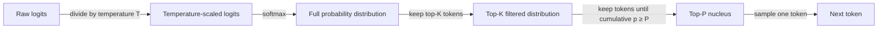

# Temperatura, Top-K, Top-P

## Definición

La temperatura, Top-K y Top-P son parámetros de muestreo que controlan cómo un LLM selecciona el siguiente token durante la generación de texto. Después de que el modelo calcula una distribución de probabilidad sobre todo su vocabulario (mediante softmax sobre los logits), estos parámetros determinan qué tokens son candidatos para la selección y qué tan probable es que cada candidato sea elegido. En conjunto, gobiernan el equilibrio entre determinismo y diversidad: los valores bajos hacen al modelo predecible y enfocado, los valores altos lo hacen creativo y variado.

La **temperatura** reescala los logits crudos antes del paso de softmax, aplanando o agudizando efectivamente la distribución de probabilidad. Una temperatura de 1.0 deja la distribución sin cambios. Los valores por debajo de 1.0 hacen la distribución más pronunciada —el modelo casi siempre elige el token de mayor probabilidad. Los valores por encima de 1.0 aplanan la distribución —más tokens se convierten en candidatos plausibles, produciendo resultados más sorprendentes y variados. A temperatura 0, la generación se vuelve determinista (decodificación argmax).

**Top-K** y **Top-P** son estrategias de truncamiento aplicadas después del escalado de temperatura. Top-K mantiene solo los K tokens más probables y redistribuye la masa de probabilidad entre ellos, descartando todos los demás. Top-P (también llamado muestreo de núcleo) selecciona dinámicamente el conjunto más pequeño de tokens cuya masa de probabilidad acumulada alcanza un umbral P, luego muestrea de ese conjunto. Top-P generalmente se prefiere sobre Top-K porque el tamaño del conjunto de candidatos se adapta a la forma de la distribución: cuando el modelo es seguro, el núcleo es pequeño; cuando el modelo es incierto, el núcleo se expande para incluir más alternativas.

## Cómo funciona



Los parámetros se aplican secuencialmente: primero el escalado de temperatura, luego el truncamiento Top-K, luego la selección del núcleo Top-P, luego el muestreo. En la práctica, la mayoría de las APIs aplican solo temperatura + Top-P (el predeterminado de OpenAI) o temperatura + Top-K (el predeterminado de Anthropic); aplicar tanto Top-K como Top-P juntos es posible pero inusual.

### Temperatura

La temperatura `T` divide cada logit crudo `z_i` antes del softmax: `p_i = softmax(z / T)`. Cuando `T < 1`, las diferencias de logits se amplían —el token de mayor probabilidad obtiene una porción aún mayor de la masa de probabilidad. Cuando `T > 1`, las diferencias de logits se reducen —la masa de probabilidad se distribuye más uniformemente. Preajustes comunes: `T = 0` para tareas de extracción determinista, `T = 0.2–0.4` para preguntas y respuestas factuales, `T = 0.7–1.0` para escritura creativa, `T > 1.0` para máxima diversidad (aunque la calidad se degrada en valores extremos).

### Top-K

El muestreo Top-K restringe el grupo de candidatos a los K tokens con mayor probabilidad después del escalado de temperatura. A todos los tokens fuera del top K se les asigna probabilidad cero antes de la renormalización. La limitación clave es que K es fijo independientemente de cómo luzca la distribución: cuando el modelo es muy seguro, incluso K=50 podría incluir muchos tokens de probabilidad casi nula que introducen ruido; cuando el modelo es incierto, un K pequeño podría cortar alternativas razonables. La API de Anthropic expone `top_k` como parámetro directo; la API de OpenAI no lo soporta de forma nativa.

### Top-P (muestreo de núcleo)

El muestreo Top-P construye el conjunto de candidatos dinámicamente. Comenzando por el token más probable y avanzando hacia abajo, los tokens se agregan al núcleo hasta que su probabilidad acumulada alcanza el umbral P. Solo los tokens en el núcleo se consideran para el muestreo. Con `P = 0.9`, el modelo muestrea de los tokens que juntos representan el 90% de la masa de probabilidad. Debido a que el núcleo se contrae cuando el modelo es seguro (unos pocos tokens dominan) y se expande cuando es incierto (la masa de probabilidad está repartida), Top-P se adapta naturalmente al estado interno del modelo. Top-P es compatible con las APIs de OpenAI (`top_p`) y Anthropic (`top_p`).

## Cuándo usar / Cuándo NO usar

| Escenario | Configuración recomendada | Evitar |
|-----------|---------------------------|--------|
| Preguntas y respuestas factuales, extracción de datos, clasificación | `temperature=0–0.2`, `top_p=1.0` para salida casi determinista | Temperatura alta; introduce alucinaciones y errores de formato |
| Escritura creativa, lluvia de ideas, ideación | `temperature=0.8–1.0`, `top_p=0.95` para salidas diversas y novedosas | Temperature=0; produce texto repetitivo y predecible |
| Generación de código | `temperature=0.2–0.4`, `top_p=0.95`; algo de variación ayuda a evitar óptimos locales | Temperatura \> 0.8; aumentan los errores de sintaxis y la deriva lógica |
| Autoconsistencia (múltiples caminos de razonamiento) | `temperature=0.6–1.0`; la diversidad es intencional | Temperature=0; todos los caminos serían idénticos, anulando el propósito |
| Extracción de salida estructurada (JSON, tablas) | `temperature=0`, `top_p=1.0` para estricta adherencia al esquema | Top-P \< 0.9 combinado con temperatura alta; aumentan las violaciones del esquema |
| Diálogo / chatbots | `temperature=0.5–0.7`, `top_p=0.9`; equilibra coherencia con naturalidad | Temperatura extrema en cualquier dirección; demasiado robótico o demasiado incoherente |

## Ejemplos de código

### OpenAI — temperatura y Top-P

```python
# OpenAI API call with temperature and top_p
# pip install openai

import os
from openai import OpenAI

client = OpenAI(api_key=os.environ["OPENAI_API_KEY"])


def generate(prompt: str, temperature: float = 0.7, top_p: float = 0.95) -> str:
    """Generate text with configurable sampling parameters."""
    response = client.chat.completions.create(
        model="gpt-4o",
        messages=[{"role": "user", "content": prompt}],
        temperature=temperature,
        top_p=top_p,
        max_tokens=512,
    )
    return response.choices[0].message.content


if __name__ == "__main__":
    # Deterministic factual extraction
    factual = generate(
        "List the three primary colors.",
        temperature=0.0,
        top_p=1.0,
    )
    print("Factual:", factual)

    # Creative brainstorming
    creative = generate(
        "Suggest five unusual names for a café that serves only breakfast.",
        temperature=0.9,
        top_p=0.95,
    )
    print("Creative:", creative)
```

### Anthropic — temperatura y Top-K

```python
# Anthropic API call with temperature and top_k
# pip install anthropic

import os
import anthropic

client = anthropic.Anthropic(api_key=os.environ["ANTHROPIC_API_KEY"])


def generate(prompt: str, temperature: float = 0.7, top_k: int = 50) -> str:
    """Generate text with configurable temperature and top-k sampling."""
    message = client.messages.create(
        model="claude-opus-4-5",
        max_tokens=512,
        temperature=temperature,
        top_k=top_k,
        messages=[{"role": "user", "content": prompt}],
    )
    return message.content[0].text


if __name__ == "__main__":
    # Near-deterministic output for structured tasks
    deterministic = generate(
        "Translate 'hello world' into French, German, and Japanese.",
        temperature=0.0,
        top_k=1,
    )
    print("Deterministic:", deterministic)

    # Creative output with broader candidate pool
    creative = generate(
        "Write the opening sentence of a science fiction novel set on Europa.",
        temperature=1.0,
        top_k=250,
    )
    print("Creative:", creative)
```

## Recursos prácticos

- [OpenAI — Referencia de API: temperatura y top_p](https://platform.openai.com/docs/api-reference/chat/create) — Documentación oficial de parámetros con rangos válidos y valores predeterminados
- [Anthropic — Referencia de API: temperatura, top_k, top_p](https://docs.anthropic.com/en/api/messages) — Referencia de parámetros de Anthropic incluyendo top_k (no disponible en OpenAI)
- [El artículo de Nucleus Sampling (Holtzman et al., 2020)](https://arxiv.org/abs/1904.09751) — Artículo original que introduce el muestreo Top-P / de núcleo con motivación y resultados empíricos
- [Hugging Face — Estrategias de generación de texto](https://huggingface.co/docs/transformers/generation_strategies) — Guía completa de estrategias de muestreo incluyendo greedy, beam search, temperatura, Top-K y Top-P
- [Lilian Weng — Generación de texto controlable](https://lilianweng.github.io/posts/2021-01-02-controllable-text-generation/) — Entrada de blog en profundidad sobre métodos de muestreo en el contexto de generación controlable

## Ver también

- [Ingeniería de prompts](/docs/prompt-engineering)
- [Máximo de tokens y secuencias de parada](/docs/prompt-engineering/max-tokens-stop-sequences)
- [Salidas estructuradas](/docs/prompt-engineering/structured-outputs)
- [Autoconsistencia](/docs/prompt-engineering/self-consistency)
- [Cadena de pensamiento](/docs/reasoning-patterns/cot)
- [LLMs](/docs/llms)
