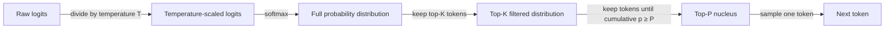

# Temperature, Top-K, Top-P

## Definición

Temperature, Top-K y Top-P son parámetros de muestreo que controlan cómo un LLM selecciona el siguiente token durante la generación de texto. Después de que el modelo calcula una distribución de probabilidad sobre todo su vocabulario (mediante softmax sobre los logits), estos parámetros dan forma a qué tokens son candidatos para la selección y qué tan probable es que se elija cada candidato. En conjunto gobiernan el equilibrio entre determinismo y diversidad: los valores bajos hacen que el modelo sea predecible y enfocado, los valores altos lo hacen creativo y variado.

**Temperature** reescala los logits crudos antes del paso de softmax, aplanando o agudizando efectivamente la distribución de probabilidad. Una temperature de 1.0 deja la distribución sin cambios. Los valores por debajo de 1.0 hacen que la distribución sea más pronunciada — el modelo casi siempre elige el token de mayor probabilidad. Los valores por encima de 1.0 aplanan la distribución — más tokens se convierten en candidatos plausibles, produciendo salidas más sorprendentes y variadas. Con temperature 0, la generación se vuelve determinista (decodificación argmax).

**Top-K** y **Top-P** son estrategias de truncamiento aplicadas después del escalado de temperature. Top-K conserva solo los K tokens más probables y redistribuye la masa de probabilidad entre ellos, descartando todos los demás. Top-P (también llamado nucleus sampling) selecciona dinámicamente el conjunto más pequeño de tokens cuya masa de probabilidad acumulada alcanza un umbral P, luego muestrea de ese conjunto. Top-P generalmente se prefiere sobre Top-K porque el tamaño del conjunto de candidatos se adapta a la forma de la distribución: cuando el modelo tiene confianza, el núcleo es pequeño; cuando el modelo es incierto, el núcleo se expande para incluir más alternativas.

## Cómo funciona



Los parámetros se aplican secuencialmente: escalado de temperature primero, luego truncamiento Top-K, luego selección de núcleo Top-P, luego muestreo. En la práctica, la mayoría de las APIs aplican solo temperature + Top-P (el valor predeterminado de OpenAI) o temperature + Top-K (el valor predeterminado de Anthropic); aplicar tanto Top-K como Top-P juntos es posible pero inusual.

### Temperature

La temperature `T` divide cada logit crudo `z_i` antes de la softmax: `p_i = softmax(z / T)`. Cuando `T < 1`, las diferencias de logit se amplifican — el token de mayor probabilidad obtiene una parte aún mayor de la masa de probabilidad. Cuando `T > 1`, las diferencias de logit se reducen — la masa de probabilidad se distribuye de forma más uniforme. Valores comunes predefinidos: `T = 0` para tareas de extracción deterministas, `T = 0.2–0.4` para QA factual, `T = 0.7–1.0` para escritura creativa, `T > 1.0` para máxima diversidad (aunque la calidad se degrada con valores extremos).

### Top-K

El muestreo Top-K restringe el conjunto de candidatos a los K tokens con mayor probabilidad después del escalado de temperature. A todos los tokens fuera del top K se les asigna probabilidad cero antes de la renormalización. La limitación clave es que K es fijo independientemente de cómo luzca la distribución: cuando el modelo tiene mucha confianza, incluso K=50 podría incluir muchos tokens de probabilidad casi cero que introducen ruido; cuando el modelo es incierto, un K pequeño podría eliminar alternativas razonables. La API de Anthropic expone `top_k` como parámetro directo; la API de OpenAI no lo soporta de forma nativa.

### Top-P (nucleus sampling)

El muestreo Top-P construye el conjunto de candidatos dinámicamente. Comenzando desde el token más probable y avanzando hacia abajo, los tokens se añaden al núcleo hasta que su probabilidad acumulada alcanza el umbral P. Solo los tokens en el núcleo se consideran para el muestreo. Con `P = 0.9`, el modelo muestrea de los tokens que juntos representan el 90% de la masa de probabilidad. Debido a que el núcleo se contrae cuando el modelo tiene confianza (pocos tokens dominan) y se expande cuando es incierto (la masa de probabilidad está distribuida), Top-P se adapta naturalmente al estado interno del modelo. Top-P es soportado tanto por las APIs de OpenAI (`top_p`) como de Anthropic (`top_p`).

## Cuándo usar / Cuándo NO usar

| Escenario | Configuración recomendada | Evitar |
|-----------|---------------------------|--------|
| QA factual, extracción de datos, clasificación | `temperature=0–0.2`, `top_p=1.0` para salida casi determinista | Temperature alta; introduce alucinaciones y errores de formato |
| Escritura creativa, lluvia de ideas, ideación | `temperature=0.8–1.0`, `top_p=0.95` para salidas diversas y novedosas | Temperature=0; produce texto repetitivo y predecible |
| Generación de código | `temperature=0.2–0.4`, `top_p=0.95`; algo de variación ayuda a evitar óptimos locales | Temperature > 0.8; los errores de sintaxis y la deriva lógica aumentan |
| Self-consistency (múltiples caminos de razonamiento) | `temperature=0.6–1.0`; la diversidad es intencional | Temperature=0; todos los caminos serían idénticos, derrotando el propósito |
| Extracción de salida estructurada (JSON, tablas) | `temperature=0`, `top_p=1.0` para adherencia estricta al esquema | Top-P < 0.9 combinado con temperature alta; las violaciones del esquema aumentan |
| Diálogo / chatbots | `temperature=0.5–0.7`, `top_p=0.9`; equilibra coherencia con naturalidad | Temperature extrema en cualquier dirección; demasiado robótico o demasiado incoherente |

## Ejemplos de código

### OpenAI — temperature y Top-P

```python
# OpenAI API call with temperature and top_p
# pip install openai

import os
from openai import OpenAI

client = OpenAI(api_key=os.environ["OPENAI_API_KEY"])


def generate(prompt: str, temperature: float = 0.7, top_p: float = 0.95) -> str:
    """Generate text with configurable sampling parameters."""
    response = client.chat.completions.create(
        model="gpt-4o",
        messages=[{"role": "user", "content": prompt}],
        temperature=temperature,
        top_p=top_p,
        max_tokens=512,
    )
    return response.choices[0].message.content


if __name__ == "__main__":
    # Deterministic factual extraction
    factual = generate(
        "List the three primary colors.",
        temperature=0.0,
        top_p=1.0,
    )
    print("Factual:", factual)

    # Creative brainstorming
    creative = generate(
        "Suggest five unusual names for a café that serves only breakfast.",
        temperature=0.9,
        top_p=0.95,
    )
    print("Creative:", creative)
```

### Anthropic — temperature y Top-K

```python
# Anthropic API call with temperature and top_k
# pip install anthropic

import os
import anthropic

client = anthropic.Anthropic(api_key=os.environ["ANTHROPIC_API_KEY"])


def generate(prompt: str, temperature: float = 0.7, top_k: int = 50) -> str:
    """Generate text with configurable temperature and top-k sampling."""
    message = client.messages.create(
        model="claude-opus-4-5",
        max_tokens=512,
        temperature=temperature,
        top_k=top_k,
        messages=[{"role": "user", "content": prompt}],
    )
    return message.content[0].text


if __name__ == "__main__":
    # Near-deterministic output for structured tasks
    deterministic = generate(
        "Translate 'hello world' into French, German, and Japanese.",
        temperature=0.0,
        top_k=1,
    )
    print("Deterministic:", deterministic)

    # Creative output with broader candidate pool
    creative = generate(
        "Write the opening sentence of a science fiction novel set on Europa.",
        temperature=1.0,
        top_k=250,
    )
    print("Creative:", creative)
```

## Recursos prácticos

- [OpenAI — Referencia de API: temperature y top_p](https://platform.openai.com/docs/api-reference/chat/create) — Documentación oficial de parámetros con rangos válidos y valores por defecto
- [Anthropic — Referencia de API: temperature, top_k, top_p](https://docs.anthropic.com/en/api/messages) — Referencia de parámetros de Anthropic incluyendo top_k (no disponible en OpenAI)
- [El paper de Nucleus Sampling (Holtzman et al., 2020)](https://arxiv.org/abs/1904.09751) — Paper original que introduce el muestreo Top-P / nucleus con motivación y resultados empíricos
- [Hugging Face — Estrategias de generación de texto](https://huggingface.co/docs/transformers/generation_strategies) — Guía completa sobre estrategias de muestreo incluyendo voraz, búsqueda de haz, temperature, Top-K y Top-P
- [Lilian Weng — Generación de texto controlable](https://lilianweng.github.io/posts/2021-01-02-controllable-text-generation/) — Post de blog en profundidad que cubre los métodos de muestreo en el contexto de la generación controlable

## Ver también

- [Ingeniería de prompts](/docs/prompt-engineering)
- [Max tokens y stop sequences](/docs/prompt-engineering/max-tokens-stop-sequences)
- [Salidas estructuradas](/docs/prompt-engineering/structured-outputs)
- [Self-consistency](/docs/prompt-engineering/self-consistency)
- [Chain-of-thought](/docs/reasoning-patterns/cot)
- [LLMs](/docs/llms)
