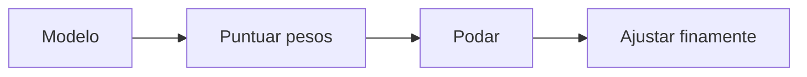

# Poda (Pruning)

## Definición

La poda elimina pesos redundantes o de bajo impacto (o neuronas/cabezas) de un modelo. La poda no estructurada elimina pesos individuales; la poda estructurada elimina canales o capas completos para una ejecución eficiente.

Es parte de la [compresión de modelos](/docs/model-compression); a menudo se usa con [cuantización](/docs/quantization) o [destilación de conocimiento](/docs/knowledge-distillation) para modelos más pequeños y rápidos. La poda no estructurada ahorra parámetros pero puede no acelerar mucho en hardware estándar; la poda estructurada (como canales) produce aceleraciones reales.

## Cómo funciona

Comience desde un **modelo** entrenado. **Puntúe** los pesos (o canales/cabezas) por importancia (como magnitud, gradiente o máscara aprendida). **Pode**: ponga a cero o elimine los parámetros con menor puntuación (no estructurado) o canales/capas completos (estructurado). **Ajuste finamente** el modelo podado para recuperar la precisión. La poda puede ser de una sola pasada (después del entrenamiento) o iterativa (entrenar → podar → ajustar finamente, repetir). La dispersidad a menudo se aplica con regularizadores L1 u otros durante el entrenamiento para que el modelo se adapte a la poda. El modelo final tiene menos pesos distintos de cero y, con la poda estructurada, inferencia más rápida.

## Casos de uso

La poda ayuda cuando se desea un modelo más pequeño o rápido eliminando pesos o estructuras de baja importancia.

- Reducir modelos para el despliegue en el borde o móvil
- Reducir el cómputo y la memoria con poda estructurada (como canales)
- Combinar con cuantización para modelos más pequeños y rápidos

## Recursos prácticos

- [TensorFlow – Poda](https://www.tensorflow.org/model_optimization/guide/pruning)
- [PyTorch – Tutorial de poda](https://pytorch.org/tutorials/intermediate/pruning_tutorial.html)

## Ver también

- [Compresión de modelos](/docs/model-compression)
- [Destilación de conocimiento](/docs/knowledge-distillation)
