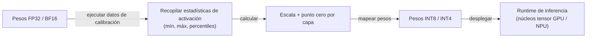
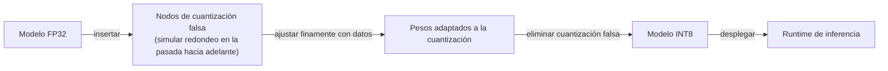

# Cuantización

## Definición

La cuantización es el proceso de representar los pesos de las redes neuronales — y opcionalmente las activaciones — en menor precisión numérica que el formato de entrenamiento original (típicamente FP32 o BF16). Al mapear valores de punto flotante a un rango entero discreto (INT8, INT4, INT2), la cuantización reduce la memoria del modelo 2–8 veces y permite una inferencia más rápida en hardware con unidades de cómputo entero como núcleos tensor de GPU, NPUs y aceleradores de inferencia dedicados.

En la práctica, la cuantización es la técnica de [compresión de modelos](/docs/model-compression) más comúnmente aplicada para los [LLMs](/docs/llms) porque no requiere cambios en la arquitectura, funciona después del entrenamiento y ofrece reducciones de memoria suficientemente grandes para trasladar un modelo del hardware de nivel servidor al hardware de consumidor. Un modelo de 70B parámetros en FP16 requiere aproximadamente 140 GB de VRAM; el mismo modelo cuantizado a INT4 cabe en alrededor de 35 GB, haciéndolo ejecutable en una estación de trabajo con GPU dual. El costo de precisión es típicamente pequeño (1–3% en benchmarks posteriores) para INT8, y manejable para INT4 con métodos conscientes de la calibración.

La cuantización existe en un espectro de enfoques: la **cuantización post-entrenamiento (PTQ)** aplica la conversión después del entrenamiento usando un pequeño conjunto de datos de calibración, mientras que el **entrenamiento consciente de cuantización (QAT)** ajusta finamente el modelo con cuantización simulada para que los pesos aprendan a ser robustos a la reducción de precisión. Los esquemas modernos de cuantización de LLM como GPTQ, AWQ y GGUF integran estrategias de calibración y empaquetado que van más allá de la redondez naïve de pesos, preservando la precisión incluso en precisión INT4.

## Cómo funciona

### Cuantización post-entrenamiento (PTQ)



### Entrenamiento consciente de cuantización (QAT)



### Esquemas de cuantización comunes

| Esquema | Precisión | Método | Mejor para |
|--------|-----------|--------|---------|
| INT8 dinámico | INT8 | Cuantizar activaciones en tiempo de ejecución | Inferencia CPU, NLP |
| INT8 estático | INT8 | Calibrar activaciones offline | Servicio GPU de baja latencia |
| GPTQ | INT4 | Cuantización de pesos de segundo orden | Servicio LLM en GPUs de consumidor |
| AWQ | INT4 | Cuantización de pesos consciente de activaciones | Servicio LLM, baja pérdida de precisión |
| GGUF (llama.cpp) | INT2–INT8 | Precisión mixta por tensor | Inferencia local en CPU / Apple Silicon |
| QAT | INT8 | Entrenar con cuantización simulada | Máxima precisión en INT8 |

## Cuándo usar / Cuándo NO usar

| Escenario | Usar cuantización | NO usar cuantización |
|----------|-----------------|------------------------|
| Ejecutar un LLM grande en una GPU de consumidor | Sí — INT4 corta la memoria 4–8 veces | |
| Reducir la latencia de inferencia en producción | Sí — INT8 acelera el rendimiento en hardware moderno | |
| Desplegar modelos en hardware móvil o de borde | Sí — TFLite y ONNX admiten INT8 de forma nativa | |
| Máxima precisión en un servidor bien equipado | | Sirva FP16 o BF16 si la memoria y el costo lo permiten |
| Modelos muy pequeños donde la pérdida de precisión es significativa | | La destilación o la poda pueden ser más apropiadas |
| Modelos con distribuciones de activación inusuales | | El PTQ estándar puede fallar; se necesitan métodos QAT o conscientes de activaciones |

## Ventajas y desventajas

| Ventajas | Desventajas |
|------|------|
| Gran reducción de memoria (2–8 veces) con mínima pérdida de precisión | La degradación de precisión aumenta en precisiones agresivas (INT2/INT3) |
| PTQ no requiere reentrenamiento — rápido de aplicar | La calidad de calibración afecta la precisión; necesita datos representativos |
| Ampliamente compatible con runtimes (TFLite, ONNX, vLLM) | Requiere soporte de hardware para ops enteras para ver aceleraciones |
| Habilita el despliegue de LLM en hardware de consumidor y borde | La cuantización de activaciones es más difícil que solo la cuantización de pesos |

## Ejemplos de código

```python
# Cuantización post-entrenamiento estática INT8 con PyTorch
import torch
import torch.quantization

model = MyModel()
model.load_state_dict(torch.load("model.pt"))
model.eval()  # establecer en modo de inferencia

# Fusionar BatchNorm y Conv para la eficiencia de cuantización
model_fused = torch.quantization.fuse_modules(model, [["conv", "bn", "relu"]])

# Establecer la configuración de cuantización (fbgemm para x86, qnnpack para ARM/móvil)
model_fused.qconfig = torch.quantization.get_default_qconfig("fbgemm")
torch.quantization.prepare(model_fused, inplace=True)

# Pasada de calibración — ejecutar datos representativos para recopilar estadísticas de activación
with torch.no_grad():
    for x_batch, _ in calibration_loader:
        model_fused(x_batch)

# Convertir pesos y activaciones a INT8
quantized_model = torch.quantization.convert(model_fused, inplace=True)

# Verificar reducción de tamaño
original_params = sum(p.numel() for p in model.parameters())
quantized_params = sum(p.numel() for p in quantized_model.parameters())
print(f"Conteo de parámetros: {original_params:,} (igual; la precisión cambió, no el conteo)")
print("Modelo INT8 listo — huella de memoria reducida ~4 veces respecto a FP32")

# Guardar modelo cuantizado
torch.save(quantized_model.state_dict(), "model_int8.pt")
```

## Recursos prácticos

- [PyTorch — Cuantización](https://pytorch.org/docs/stable/quantization.html) — PTQ, QAT y API de cuantización dinámica
- [TensorFlow Lite — Guía de cuantización](https://www.tensorflow.org/lite/performance/quantization) — Post-entrenamiento y QAT para móvil
- [Artículo GPTQ](https://arxiv.org/abs/2210.17323) — Cuantización post-entrenamiento precisa para transformers generativos preentrenados
- [Artículo AWQ](https://arxiv.org/abs/2306.00978) — Cuantización de pesos consciente de activaciones para LLMs en el dispositivo
- [Formato GGUF de llama.cpp](https://github.com/ggerganov/llama.cpp) — Inferencia local con precisión mixta flexible por tensor

## Ver también

- [Compresión de modelos](/docs/model-compression)
- [Poda](/docs/pruning)
- [Destilación de conocimiento](/docs/knowledge-distillation)
- [Inferencia local](/docs/local-inference)
- [Razonamiento en el borde](/docs/edge-reasoning)
- [Infraestructura](/docs/infrastructure)
