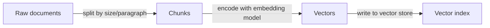
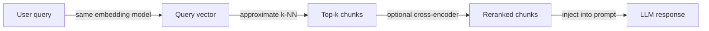

# Arquitectura RAG

## Definición

La arquitectura RAG (Retrieval-Augmented Generation) define cómo los documentos en bruto se transforman en conocimiento recuperable y cómo ese conocimiento se inyecta en un LLM en el momento de la inferencia. La pipeline tiene dos fases principales: una fase de **indexación** sin conexión que procesa y almacena documentos, y una fase de **recuperación** en línea que obtiene contexto relevante para cada consulta del usuario.

Las decisiones de diseño en esta arquitectura afectan directamente la calidad, la latencia y el costo del sistema final. El tamaño del fragmento controla cuánto contexto lleva cada segmento recuperado — los fragmentos más pequeños son más precisos pero pueden carecer de contexto, mientras que los fragmentos más grandes reducen el recall de recuperación. La elección del modelo de [embedding](/docs/rag/embeddings) determina qué tan semánticamente significativo es el espacio vectorial, y si se usa recuperación densa, dispersa o híbrida afecta la cobertura para consultas tanto semánticas como basadas en palabras clave.

Las configuraciones avanzadas extienden la pipeline base con reescritura de consultas (reformulación antes del embedding), recuperación multi-hop (encadenamiento de múltiples recuperaciones), reranking (un cross-encoder que vuelve a puntuar los candidatos top-k) y extracción de citas (atribución de respuestas a fragmentos de origen). Cada extensión agrega latencia y complejidad pero puede mejorar significativamente la calidad de las respuestas para casos de uso exigentes. Ver [bases de datos vectoriales](/docs/rag/vector-databases) para opciones de indexación.

## Cómo funciona

### Fase de indexación

Los documentos se ingieren, dividen en fragmentos y se almacenan en un índice vectorial.



### Fase de recuperación

En el momento de la consulta, la consulta se convierte en embedding, y los fragmentos similares se recuperan y opcionalmente se reordenan.



**Fragmento:** Los documentos se dividen en segmentos (por párrafo, oración o recuento fijo de tokens); se pueden añadir solapamiento y metadatos a cada fragmento. **Incrustar e indexar:** Los fragmentos se codifican en vectores mediante un modelo de [embedding](/docs/rag/embeddings) y se almacenan en una [base de datos vectorial](/docs/rag/vector-databases). **Consulta:** La consulta del usuario se incrusta con el mismo codificador; **recuperar** obtiene los k fragmentos más similares mediante búsqueda densa o híbrida. **Clasificar:** Un reranker opcional (p. ej. cross-encoder) vuelve a puntuar los mejores candidatos antes de que sean formateados en el prompt del LLM.

## Cuándo usar / Cuándo NO usar

| Escenario | Usar | No usar |
|---|---|---|
| La base de conocimiento es grande y se actualiza frecuentemente | Sí — el chunking + indexación maneja la escala | No — el ajuste fino es costoso de reentrenar |
| Las respuestas necesitan atribución de fuentes | Sí — los fragmentos llevan metadatos de procedencia | No — la generación vanilla del LLM pierde la atribución |
| Las consultas son muy específicas por palabras clave | Sí — la recuperación híbrida combina densa + dispersa | No — la recuperación puramente densa puede perder coincidencias exactas |
| El conocimiento cabe en la ventana de contexto | Quizás — más simple rellenar el prompt directamente | Sí — no se necesita una capa de recuperación |
| La latencia en tiempo real es crítica | Con optimizaciones — caché, modelos más pequeños | Evitar reranking + multi-hop con presupuestos de latencia muy bajos |

## Comparaciones

| Enfoque | Tamaño del fragmento | Tipo de recuperación | Reranker | Uso típico |
|---|---|---|---|---|
| RAG ingenuo | 512 tokens fijos | Solo densa | Ninguno | Prototipado |
| RAG avanzado | Semántico / solapado | Híbrido (densa + BM25) | Cross-encoder | Q&A de producción |
| RAG modular | Variable, con metadatos | Híbrido + filtros | Reranker aprendido | Búsqueda empresarial |
| RAG multi-hop | Pequeño para precisión | Densa por hop | Opcional | Razonamiento complejo |

## Pros y contras

| Pros | Contras |
|---|---|
| Mantiene el conocimiento actualizado sin reentrenar | Agrega latencia de indexación y recuperación |
| Proporciona atribución de fuentes para las respuestas | La estrategia de fragmentación impacta significativamente la calidad |
| Escala a millones de documentos | Requiere mantener un índice vectorial |
| Componible con reranking y filtrado | El desajuste consulta-documento puede afectar el recall |

## Ejemplos de código

```python
from langchain_openai import OpenAIEmbeddings, ChatOpenAI
from langchain_community.vectorstores import Chroma
from langchain.text_splitter import RecursiveCharacterTextSplitter
from langchain.chains import RetrievalQA

# --- Indexing ---
splitter = RecursiveCharacterTextSplitter(chunk_size=512, chunk_overlap=64)
docs = splitter.create_documents([open("document.txt").read()])

embeddings = OpenAIEmbeddings()
vectorstore = Chroma.from_documents(docs, embeddings)

# --- Retrieval + Generation ---
retriever = vectorstore.as_retriever(search_kwargs={"k": 4})
qa_chain = RetrievalQA.from_chain_type(
    llm=ChatOpenAI(model="gpt-4o-mini"),
    retriever=retriever,
    return_source_documents=True,
)

result = qa_chain.invoke({"query": "What does the document say about X?"})
print(result["result"])
```

## Recursos prácticos

- [LangChain – RAG architecture](https://python.langchain.com/docs/use_cases/question_answering/) — Recorrido RAG de extremo a extremo con componentes LangChain
- [LlamaIndex – Document processing and indexing](https://docs.llamaindex.ai/en/stable/module_guides/loading/) — Pipelines de ingesta, fragmentación e indexación
- [Anthropic – RAG best practices](https://docs.anthropic.com/en/docs/build-with-claude/retrieval-augmented-generation) — Guía RAG específica para Claude y consejos

## Ver también

- [RAG](/docs/rag)
- [Bases de datos vectoriales](/docs/rag/vector-databases)
- [Embeddings](/docs/rag/embeddings)
