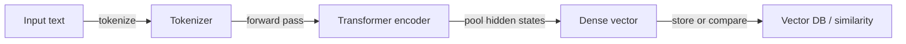
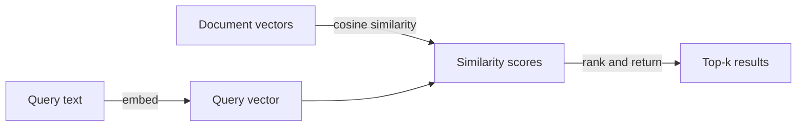

# Embeddings

## Definición

Los embeddings son vectores numéricos densos de tamaño fijo que codifican el significado semántico del texto (u otras modalidades de datos como imágenes y audio). Cuando el texto se pasa a través de un modelo codificador, el contenido semánticamente similar produce vectores que están geométricamente cercanos en el espacio de alta dimensión — de modo que frases como "soporte al cliente" y "mesa de ayuda" tendrán vectores cercanos si se entrenaron con datos similares.

Son el puente entre el texto sin procesar y las [bases de datos vectoriales](/docs/rag/vector-databases). Tanto los documentos como las consultas deben incrustarse con el **mismo codificador** para que sus vectores vivan en el mismo espacio y se puedan hacer comparaciones de similitud significativas. La métrica de similitud más común es la **similitud del coseno**, aunque también se usan el producto punto y la distancia euclidiana según la configuración del índice.

La elección del modelo de embedding es una de las decisiones de mayor impacto en un sistema [RAG](/docs/rag). Los factores incluyen la dimensionalidad vectorial (mayor = más expresivo pero más almacenamiento), la ventana de contexto (cuánto texto procesa el codificador a la vez), la especificidad del dominio (un modelo legal o biomédico puede superar a uno de propósito general), el soporte multilingüe y el costo (API vs. auto-alojado). Las opciones populares incluyen OpenAI `text-embedding-3-large`, Cohere Embed y el `sentence-transformers` de código abierto. Ver [arquitectura RAG](/docs/rag/architecture) para cómo encajan los embeddings en la pipeline completa.

## Cómo funciona

### Pipeline de codificación



### Búsqueda de similitud



**El texto** (una oración, párrafo o fragmento) se introduce en un **codificador** (p. ej. embeddings de OpenAI, Cohere o sentence-transformers de código abierto). El codificador produce un **vector** de tamaño fijo (p. ej. 768 o 1536 dimensiones). El entrenamiento usa objetivos contrastivos o similares para que los textos semánticamente relacionados obtengan vectores cercanos. En el momento de la consulta, la similitud se calcula como el coseno o el producto punto entre el vector de consulta y los vectores de documentos almacenados. Los modelos pueden ser multilingües o específicos del dominio. Para [RAG](/docs/rag), siempre usar el mismo codificador para documentos y consultas para que las distancias sean significativas.

## Cuándo usar / Cuándo NO usar

| Escenario | Usar embeddings | No usar embeddings |
|---|---|---|
| Búsqueda semántica ("encontrar significado similar") | Sí — los embeddings capturan la intención semántica | No — búsqueda por palabras clave si se necesita coincidencia exacta de cadena |
| Recuperación multilingüe | Sí — los codificadores multilingües mapean idiomas al mismo espacio | No — BM25 específico del idioma si solo se tiene un idioma |
| Consultas cortas contra documentos largos | Sí — incrustar consulta y documentos fragmentados | No — incrustar documentos largos completos sin fragmentar pierde precisión |
| Búsqueda exacta por ID o campo estructurado | No — usar una BD relacional o filtro de metadatos | Sí — no se necesitan embeddings para coincidencia exacta |
| Baja latencia, cómputo limitado | Considerar modelos más pequeños (p. ej. MiniLM) | Evitar grandes modelos basados en API para cada solicitud |

## Comparaciones

| Modelo | Dimensiones | Contexto | Multilingüe | Costo | Mejor para |
|---|---|---|---|---|---|
| OpenAI `text-embedding-3-large` | 3072 | 8191 tokens | Sí | API (de pago) | RAG de producción de alta precisión |
| OpenAI `text-embedding-3-small` | 1536 | 8191 tokens | Sí | API (bajo costo) | Apps sensibles al costo |
| Cohere Embed v3 | 1024 | 512 tokens | Sí | API (de pago) | Reranking + recuperación |
| `sentence-transformers/all-MiniLM-L6-v2` | 384 | 256 tokens | No | Auto-alojado (gratis) | Baja latencia o sin conexión |
| `BAAI/bge-large-en-v1.5` | 1024 | 512 tokens | No | Auto-alojado (gratis) | Código abierto de alta calidad |

## Pros y contras

| Pros | Contras |
|---|---|
| Captura el significado semántico, no solo palabras clave | El espacio vectorial varía según el modelo; no se pueden mezclar codificadores |
| Permite recuperación multilingüe con modelos multilingüe | La dimensionalidad aumenta el costo de almacenamiento y cómputo |
| Reutilizable: los mismos vectores sirven para búsqueda, clustering, deduplicación | La calidad depende en gran medida de la elección del modelo y la adecuación al dominio |
| Rápido en tiempo de consulta con índices ANN | Sin interpretabilidad — difícil depurar por qué se devolvió un fragmento |

## Ejemplos de código

```python
from openai import OpenAI

client = OpenAI()

def embed(text: str) -> list[float]:
    response = client.embeddings.create(
        model="text-embedding-3-small",
        input=text,
    )
    return response.data[0].embedding

# Embed a document chunk and a query
doc_vec = embed("The refund policy allows returns within 30 days.")
query_vec = embed("How long do I have to return a product?")

# Cosine similarity (manual)
import numpy as np
def cosine_sim(a, b):
    a, b = np.array(a), np.array(b)
    return float(np.dot(a, b) / (np.linalg.norm(a) * np.linalg.norm(b)))

print(f"Similarity: {cosine_sim(doc_vec, query_vec):.4f}")
```

## Recursos prácticos

- [OpenAI – Embeddings guide](https://platform.openai.com/docs/guides/embeddings) — Uso de la API, comparación de modelos y mejores prácticas
- [Hugging Face – Sentence Transformers](https://www.sbert.net/) — Modelos de embedding de código abierto y benchmarks de evaluación
- [MTEB leaderboard](https://huggingface.co/spaces/mteb/leaderboard) — Massive Text Embedding Benchmark para comparar modelos en tareas
- [Cohere – Embed API](https://docs.cohere.com/docs/embeddings) — Modelos de embedding de Cohere con variantes optimizadas para recuperación

## Ver también

- [RAG](/docs/rag)
- [Bases de datos vectoriales](/docs/rag/vector-databases)
- [Arquitectura RAG](/docs/rag/architecture)
- [Búsqueda semántica](/docs/semantic-search)
