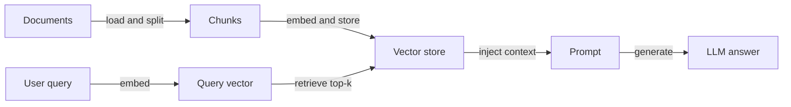
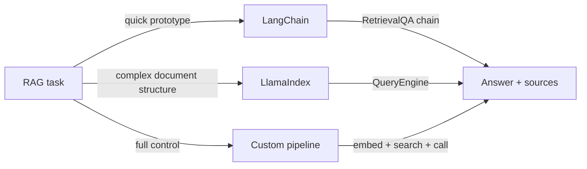

# Ejemplos de RAG

## Definición

Esta página recopila ejemplos concretos de RAG: Q&A simple, Q&A de documentos y búsqueda híbrida con código que puedes adaptar. Cada ejemplo demuestra un flujo completo y ejecutable desde la ingesta de documentos hasta la generación de respuestas.

Cada ejemplo sigue el mismo flujo [RAG](/docs/rag) — indexar documentos, incrustar consulta, recuperar, generar — pero con diferentes frameworks u opciones. El objetivo es proporcionar puntos de partida que puedes integrar en tu propio proyecto y extender. Ajusta el [chunking](/docs/rag/architecture), los [embeddings](/docs/rag/embeddings) y el [almacén vectorial](/docs/rag/vector-databases) para que coincidan con tu volumen de datos, dominio y requisitos de latencia.

Elegir el ejemplo correcto depende de tu stack: LangChain es ideal para prototipos rápidos con muchas integraciones integradas; LlamaIndex sobresale en la ingesta estructurada de documentos y consultas multi-índice; una pipeline personalizada brinda máximo control al costo de más código repetitivo. Los tres enfoques producen la misma salida conceptual — contexto recuperado alimentado a una llamada de LLM.

## Cómo funciona

### Resumen de la pipeline



### Selección de framework



## Cuándo usar / Cuándo NO usar

| Escenario | Usar estos ejemplos | No usar |
|---|---|---|
| Prototipado rápido de un bot de Q&A | Sí — el ejemplo de LangChain es mínimo | No — construir una pipeline personalizada desde cero agrega tiempo innecesario |
| App de producción con chunking personalizado | Sí — ejemplo de pipeline personalizada | No — los valores predeterminados del framework pueden no coincidir con tu estrategia de chunking |
| Investigación multi-documento sobre datos estructurados | Sí — ejemplo de LlamaIndex | No — la cadena genérica de LangChain puede perder la estructura del documento |
| Un solo documento que cabe en la ventana de contexto | No — pasar el documento directamente | Sí — la pipeline de recuperación es un overhead innecesario |
| Búsqueda híbrida (semántica + palabras clave) | Sí — usar Chroma o Weaviate con BM25 | No — la búsqueda de vector único puede perder consultas críticas por palabras clave |

## Ejemplos de código

### Ejemplo 1: RAG mínimo con LangChain

```python
from langchain_openai import OpenAIEmbeddings, ChatOpenAI
from langchain_community.vectorstores import Chroma
from langchain.text_splitter import RecursiveCharacterTextSplitter
from langchain.chains import RetrievalQA
from langchain_community.document_loaders import TextLoader

# Load and chunk
loader = TextLoader("my_document.txt")
docs = loader.load()
splitter = RecursiveCharacterTextSplitter(chunk_size=500, chunk_overlap=50)
chunks = splitter.split_documents(docs)

# Index
vectorstore = Chroma.from_documents(chunks, OpenAIEmbeddings())

# Retrieve and generate
qa = RetrievalQA.from_chain_type(
    llm=ChatOpenAI(model="gpt-4o-mini"),
    retriever=vectorstore.as_retriever(search_kwargs={"k": 4}),
    return_source_documents=True,
)

result = qa.invoke({"query": "Summarize the main points."})
print(result["result"])
for doc in result["source_documents"]:
    print("Source:", doc.metadata)
```

### Ejemplo 2: Q&A de documentos con LlamaIndex

```python
from llama_index.core import VectorStoreIndex, SimpleDirectoryReader

# Load all documents from a folder
documents = SimpleDirectoryReader("./docs_folder").load_data()

# Build index (embeds and stores automatically)
index = VectorStoreIndex.from_documents(documents)

# Query
query_engine = index.as_query_engine()
response = query_engine.query("What is the refund policy?")
print(response)
```

### Ejemplo 3: búsqueda híbrida (densa + palabras clave)

```python
from langchain_community.retrievers import BM25Retriever
from langchain.retrievers import EnsembleRetriever
from langchain_community.vectorstores import Chroma
from langchain_openai import OpenAIEmbeddings

# Dense retriever
vectorstore = Chroma.from_documents(chunks, OpenAIEmbeddings())
dense_retriever = vectorstore.as_retriever(search_kwargs={"k": 4})

# Sparse (BM25) retriever
bm25_retriever = BM25Retriever.from_documents(chunks)
bm25_retriever.k = 4

# Hybrid: combine both with equal weight
hybrid_retriever = EnsembleRetriever(
    retrievers=[bm25_retriever, dense_retriever],
    weights=[0.5, 0.5],
)

results = hybrid_retriever.invoke("product return window")
for r in results:
    print(r.page_content[:200])
```

## Recursos prácticos

- [LangChain – Question answering](https://python.langchain.com/docs/use_cases/question_answering/) — Recorrido completo de RAG con componentes LangChain
- [LlamaIndex – RAG tutorial](https://docs.llamaindex.ai/en/stable/getting_started/starter_example/) — Ejemplo inicial para indexación y consulta de documentos
- [Chroma – Quickstart](https://docs.trychroma.com/getting-started) — Configurar un almacén vectorial local para desarrollo
- [OpenAI Cookbook – RAG](https://cookbook.openai.com/examples/question_answering_using_embeddings) — Ejemplo RAG paso a paso con embeddings de OpenAI

## Ver también

- [RAG](/docs/rag)
- [Arquitectura RAG](/docs/rag/architecture)
- [Tools: LangChain](/docs/tools/langchain)
- [Tools: LlamaIndex](/docs/tools/llamaindex)
