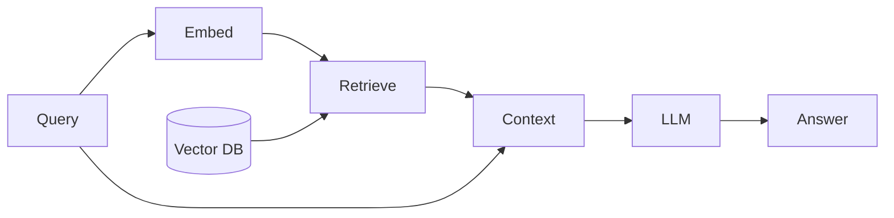

# Generación aumentada por recuperación (RAG)

## Definición

La **generación aumentada por recuperación (RAG)** amplía un gran modelo de lenguaje con un paso de recuperación: given a query, you retrieve relevant documents (from a vector store or search index), then pass them as context to the LLM to generate an answer. Esto reduce las alucinaciones y mantiene las respuestas fundamentadas en tus datos.

RAG a menudo se prefiere al fine-tuning cuando necesitas **actualizar el conocimiento frecuentemente** (por ej. documentos internos, artículos de soporte) sin reentrenar, when you have **domain-specific or private data** that shouldn't be baked into weights, or when you want to **cite sources** in the model's answer. Fine-tuning is better when the desired behavior or style is stable and you can afford training and hosting.

## Cómo funciona

1. **Index:** Documents are chunked and embedded; vectors are stored in a [vector database](/docs/rag/vector-databases).
2. **Consulta:** La consulta del usuario se incorpora; el sistema recupera los top-k fragmentos más similares (ver [embeddings](/docs/rag/embeddings) and [RAG architecture](/docs/rag/architecture)).
3. **Generate:** The LLM receives the query plus retrieved text and produce the final answer.

El diagrama a continuación muestra the query-time flow: **query** and **vector DB** alimentan **embed** and **retrieve**; retrieved text becomes **context** and is passed with the query to the **LLM** to produce the **answer**. Indexing (chunking, embedding, storing) is done offline or incrementally; recuperación and generation run at query time. Quality depends on chunking, [embedding](/docs/rag/embeddings) choice, and how the prompt includes context.



### Simple RAG pipeline (Python)

```python
from langchain_community.vectorstores import Chroma
from langchain_openai import OpenAIEmbeddings, ChatOpenAI
from langchain_core.prompts import ChatPromptTemplate

# Index documents (one-time or incremental)
embeddings = OpenAIEmbeddings()
vectorstore = Chroma.from_documents(documents, embeddings)

# Query
query = "What is RAG?"
docs = vectorstore.similarity_search(query, k=4)
context = "\n\n".join(d.page_content for d in docs)

prompt = ChatPromptTemplate.from_messages([
    ("system", "Answer using only the context below.\n\n{context}"),
    ("human", "{question}"),
])
llm = ChatOpenAI(model="gpt-4")
chain = prompt | llm
answer = chain.invoke({"context": context, "question": query})
```

## Casos de uso

RAG fits any application where answers must be grounded in up-to-date or private documents rather than the model’s training data.

- Customer support chatbots that answer from a knowledge base
- Internal wiki and document Q&A
- Legal or contract search and summarization
- Product and FAQ search with cited answers

## Ventajas y desventajas

| Pros | Cons |
|------|------|
| Reduces hallucination | Retrieval quality depends on chunks and embeddings |
| No need to retrain for new docs | Latency from recuperación + generation |
| Easy to update knowledge | Need good chunking and indexing strategy |

## Documentación externa

- [RAG paper (Lewis et al.)](https://arxiv.org/abs/2005.11401) — Original recuperación-augmented generation
- [LangChain – Question answering / RAG](https://python.langchain.com/docs/use_cases/question_answering/)
- [LlamaIndex – RAG](https://docs.llamaindex.ai/en/stable/module_guides/deploying/rag/)
- [Vertex AI – RAG and grounding](https://cloud.google.com/vertex-ai/docs/generative-ai/grounding/overview) — RAG on Google Cloud

## Ver también

- [RAG architecture](/docs/rag/architecture)
- [Vector databases](/docs/rag/vector-databases)
- [Embeddings](/docs/rag/embeddings)
- [LLMs](/docs/llms)
