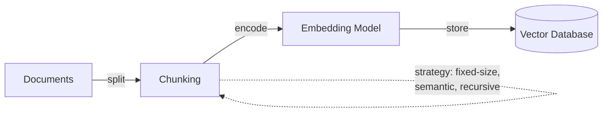
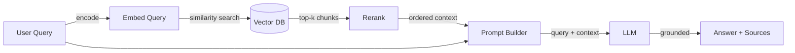

# Retrieval-augmented generation (RAG)

## Definición

La **generación aumentada por recuperación (RAG)** es una técnica que aumenta un modelo de lenguaje grande con un paso de recuperación externo: dada una consulta del usuario, el sistema primero recupera documentos relevantes de una fuente de conocimiento (típicamente un almacén vectorial o índice de búsqueda), luego pasa esos documentos como contexto al LLM para generar una respuesta fundamentada. Este enfoque reduce las alucinaciones al anclar la salida del modelo en datos reales y verificables, en lugar de depender únicamente del conocimiento codificado durante el preentrenamiento.

RAG surgió como un punto medio práctico entre dos extremos: usar un LLM de propósito general sin conocimiento del dominio y ajustar finamente un modelo con datos específicos del dominio. La arquitectura RAG original fue propuesta por [Lewis et al. (2020)](https://arxiv.org/abs/2005.11401) en Facebook AI, combinando un recuperador (basado en Dense Passage Retrieval) con un generador secuencia a secuencia (BART). Desde entonces, el patrón ha evolucionado hacia un patrón arquitectónico ampliamente adoptado con muchas variaciones en estrategias de fragmentación, métodos de recuperación y técnicas de generación.

RAG es particularmente importante en entornos empresariales y de producción porque permite a las organizaciones aprovechar datos propietarios o que cambian frecuentemente sin el costo y la complejidad del ajuste fino del modelo. También permite la **citación de fuentes** — el sistema puede señalar los documentos exactos que informaron su respuesta, lo cual es fundamental para la confianza, el cumplimiento y la auditabilidad en dominios como el legal, la atención médica y las finanzas.

## Cómo funciona

### Indexación (sin conexión)

Antes de que RAG pueda responder consultas, su base de conocimiento debe ser indexada. Los documentos se dividen en fragmentos (párrafos, secciones o ventanas deslizantes), cada fragmento se convierte en un vector denso usando un [modelo de embeddings](/docs/rag/embeddings), y los vectores resultantes se almacenan en una [base de datos vectorial](/docs/rag/vector-databases). La estrategia de fragmentación impacta significativamente la calidad de la recuperación — los fragmentos demasiado grandes diluyen la relevancia, los demasiado pequeños pierden contexto.



### Recuperación (en tiempo de consulta)

Cuando un usuario envía una consulta, se convierte en embedding usando el mismo modelo, y el sistema realiza una búsqueda de similitud (coseno o producto punto) contra la base de datos vectorial para recuperar los k fragmentos más relevantes. Las pipelines RAG avanzadas agregan un paso de **reranking** después de la recuperación inicial para mejorar la precisión — un modelo cross-encoder puntúa cada fragmento recuperado contra la consulta y los reordena.

### Generación (en tiempo de consulta)

Los fragmentos recuperados se inyectan en el prompt del LLM como contexto, junto con la consulta original. El LLM genera una respuesta fundamentada en este contexto. El diseño del prompt importa aquí — instrucciones como "Responde usando solo el contexto proporcionado" ayudan a reducir las alucinaciones, mientras que "Si el contexto no contiene la respuesta, dilo" previene la fabricación.



## Cuándo usar / Cuándo NO usar

| Usar cuando | Evitar cuando |
|----------|------------|
| El conocimiento cambia frecuentemente (documentos, FAQs, políticas) y reentrenar no es práctico | El conocimiento es estático y suficientemente pequeño para caber en la ventana de contexto del prompt |
| Se necesitan respuestas fundamentadas en datos privados o específicos del dominio | Se necesita que el modelo aprenda un nuevo comportamiento o estilo (el ajuste fino es mejor) |
| La citación de fuentes y la auditabilidad son requisitos | La latencia es extremadamente crítica y el paso de recuperación agrega un retraso inaceptable |
| Se quieren mantener costos bajos — no se necesita cómputo de entrenamiento | El dominio requiere razonamiento sobre el corpus completo, no solo fragmentos recuperados |
| Múltiples fuentes de datos necesitan ser consultadas (RAG multi-índice) | Los datos son principalmente estructurados/tabulares (SQL o consultas estructuradas pueden ser más apropiadas) |

## Comparaciones

| Criterio | RAG | Ajuste fino |
|----------|-----|-------------|
| Velocidad de actualización del conocimiento | Instantánea (actualizar índice) | Lenta (reentrenar modelo) |
| Costo | Bajo (inferencia + embedding) | Alto (cómputo de entrenamiento + hosting) |
| Control de alucinaciones | Fuerte (fundamentado en documentos recuperados) | Moderado (depende de la calidad de los datos de entrenamiento) |
| Citación de fuentes | Nativa (los fragmentos recuperados son rastreables) | No soportado |
| Comportamiento/estilo personalizado | Limitado | Fuerte |
| Complejidad de configuración | Moderada (fragmentación + BD vectorial + recuperación) | Alta (curación de datos + pipeline de entrenamiento) |

## Pros y contras

| Pros | Contras |
|------|------|
| Reduce las alucinaciones al fundamentarse en datos reales | La calidad de recuperación depende en gran medida de las opciones de fragmentación y embedding |
| No es necesario reentrenar cuando cambia el conocimiento | Agrega latencia por el paso de recuperación |
| Permite citación de fuentes para confianza y cumplimiento | Requiere mantener una base de datos vectorial y pipeline de indexación |
| Funciona con cualquier LLM (API o autohospedado) | Los límites de la ventana de contexto restringen cuántos fragmentos se pueden pasar |
| Menor costo que el ajuste fino para la mayoría de los casos de uso | "Basura entra, basura sale" — la mala calidad de los documentos se propaga a las respuestas |

## Benchmarks

- [RAGAS](https://docs.ragas.io/) — Framework para evaluar pipelines RAG (fidelidad, relevancia de respuesta, precisión/recall del contexto)
- [MTEB Leaderboard](https://huggingface.co/spaces/mteb/leaderboard) — Benchmarks de modelos de embedding relevantes para la calidad de recuperación RAG
- [RGB Benchmark](https://arxiv.org/abs/2309.01431) — Evaluación de generación aumentada por recuperación en escenarios de ruido, rechazo, integración y contrafácticos

## Ejemplos de código

### Pipeline RAG básica con LangChain (Python)

```python
from langchain_community.vectorstores import Chroma
from langchain_openai import OpenAIEmbeddings, ChatOpenAI
from langchain_core.prompts import ChatPromptTemplate

# 1. Index documents (one-time or incremental)
embeddings = OpenAIEmbeddings(model="text-embedding-3-small")
vectorstore = Chroma.from_documents(documents, embeddings)

# 2. Retrieve relevant chunks
query = "What is retrieval-augmented generation?"
docs = vectorstore.similarity_search(query, k=4)
context = "\n\n".join(d.page_content for d in docs)

# 3. Generate grounded answer
prompt = ChatPromptTemplate.from_messages([
    ("system", "Answer using only the context below. If the context "
               "doesn't contain the answer, say 'I don't know'.\n\n{context}"),
    ("human", "{question}"),
])

llm = ChatOpenAI(model="gpt-4o")
chain = prompt | llm
answer = chain.invoke({"context": context, "question": query})
print(answer.content)
```

### RAG con LlamaIndex (Python)

```python
from llama_index.core import VectorStoreIndex, SimpleDirectoryReader

# 1. Load and index documents
documents = SimpleDirectoryReader("./data").load_data()
index = VectorStoreIndex.from_documents(documents)

# 2. Query with built-in retrieval + generation
query_engine = index.as_query_engine(similarity_top_k=4)
response = query_engine.query("What is RAG?")
print(response)

# Access source nodes for citation
for node in response.source_nodes:
    print(f"Source: {node.metadata['file_name']} (score: {node.score:.3f})")
```

## Recursos prácticos

- [RAG paper — Lewis et al. (2020)](https://arxiv.org/abs/2005.11401) — El artículo de investigación original que introduce la generación aumentada por recuperación
- [LangChain RAG tutorial](https://python.langchain.com/docs/tutorials/rag/) — Guía paso a paso para construir una pipeline RAG con LangChain
- [LlamaIndex RAG guide](https://docs.llamaindex.ai/en/stable/understanding/rag/) — Documentación oficial de LlamaIndex sobre conceptos e implementación de RAG
- [Vertex AI RAG and grounding](https://cloud.google.com/vertex-ai/docs/generative-ai/grounding/overview) — RAG en Google Cloud con Vertex AI
- [Pinecone RAG guide](https://www.pinecone.io/learn/retrieval-augmented-generation/) — Guía práctica sobre estrategias de fragmentación, embedding y recuperación

## Ver también

- [Arquitectura RAG](/docs/rag/architecture)
- [Bases de datos vectoriales](/docs/rag/vector-databases)
- [Embeddings](/docs/rag/embeddings)
- [Ejemplos RAG](/docs/rag/examples)
- [LLMs](/docs/llms)
- [LangChain](/docs/tools/langchain)
- [LlamaIndex](/docs/tools/llamaindex)
