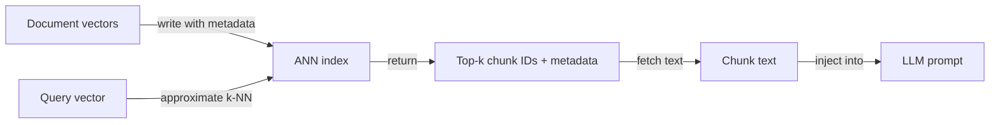
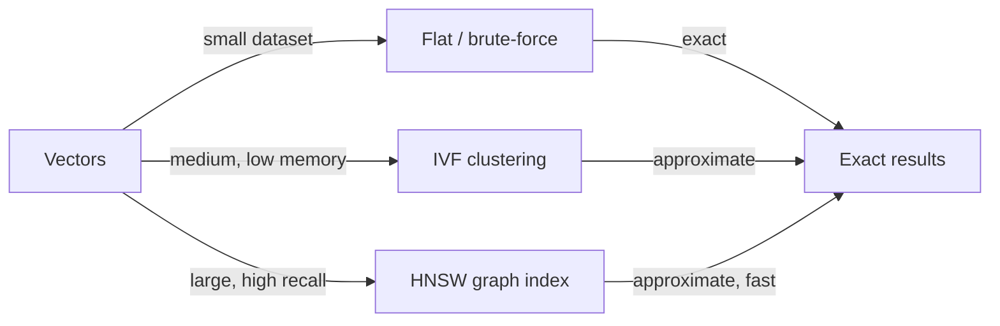

# Bases de datos vectoriales

## Definición

Las bases de datos vectoriales almacenan vectores de alta dimensión ([embeddings](/docs/rag/embeddings)) y soportan búsqueda rápida por similitud usando algoritmos como k-vecinos más cercanos (k-NN) y vecinos más cercanos aproximados (ANN). Son la columna vertebral de la capa de recuperación en sistemas [RAG](/docs/rag), permitiendo búsqueda semántica a escala sobre millones de fragmentos de documentos.

Se sitúan entre los [embeddings](/docs/rag/embeddings) (que producen los vectores) y el recuperador [RAG](/docs/rag) (que necesita los k fragmentos más relevantes para una consulta dada). A diferencia de las bases de datos tradicionales basadas en palabras clave, las bases de datos vectoriales miden la **distancia semántica**: "soporte al cliente" puede coincidir con "mesa de ayuda" si el modelo de embedding los coloca cerca. La mayoría de las bases de datos vectoriales también soportan filtrado de metadatos — puedes restringir la recuperación a documentos de una determinada fecha, categoría o fuente.

Elegir la base de datos vectorial correcta depende de tus requisitos: gestionada vs. auto-alojada, escala (miles vs. cientos de millones de vectores), capacidades de filtrado de metadatos, soporte de búsqueda híbrida (densa + dispersa) y si necesitas multi-tenancy o control de acceso. Ver [arquitectura RAG](/docs/rag/architecture) para cómo el índice encaja en la pipeline completa.

## Cómo funciona

### Indexación y consulta



### Tipos de índices



Los documentos son [incorporados](/docs/rag/embeddings) y sus vectores se escriben en un **índice** (p. ej. HNSW, IVF o plano para conjuntos de datos pequeños). En el momento de la consulta, el **vector de consulta** se compara contra el índice mediante **k-NN** (o k-NN aproximado para escala); el índice devuelve **top-k IDs** y opcionalmente metadatos almacenados. Luego se recuperan los fragmentos correspondientes y se pasan al LLM. HNSW (Hierarchical Navigable Small World) es el algoritmo ANN más popular — ofrece tiempo de consulta sub-lineal con alto recall. Los índices planos son exactos pero O(n) y solo adecuados para conjuntos de datos pequeños.

## Cuándo usar / Cuándo NO usar

| Escenario | Usar BD vectorial | No usar BD vectorial |
|---|---|---|
| Búsqueda semántica sobre grandes corpus de documentos | Sí — los índices ANN manejan la escala | No — búsqueda por palabras clave si solo se necesita coincidencia exacta de frase |
| RAG con millones de fragmentos | Sí — construido específicamente para escala vectorial | No — las BD relacionales con pgvector pueden ser suficientes por debajo de ~1M vectores |
| Búsqueda híbrida (semántica + BM25) | Sí — Weaviate, Qdrant soportan híbrido nativamente | No — puro densa si las consultas son siempre semánticas |
| SaaS multi-tenant con namespaces aislados | Sí — Pinecone y Weaviate soportan namespacing | No — FAISS auto-alojado no tiene multi-tenancy |
| Desarrollo offline, local | Sí — Chroma o FAISS sin infra | No — las BD cloud gestionadas añaden costo y latencia de red para desarrollo |

## Comparaciones

| Base de datos | Hosting | Escala | Búsqueda híbrida | Filtros de metadatos | Mejor para |
|---|---|---|---|---|---|
| **Pinecone** | Cloud gestionada | Muy grande (miles de millones) | Sí (dispersa + densa) | Sí | Producción a escala, sin gestión de infra |
| **Chroma** | Auto-alojado / embebido | Pequeño–mediano | No (solo densa) | Sí | Desarrollo local, prototipado, nativo de Python |
| **Weaviate** | Auto-alojado o cloud | Grande | Sí (BM25 + densa) | Sí | Producción con búsqueda híbrida |
| **FAISS** | Auto-alojado (biblioteca) | Grande | No | No | Investigación, búsqueda por lotes offline |
| **pgvector** | Extensión de PostgreSQL | Mediano | Parcial (con FTS) | Sí (SQL) | Equipos ya en Postgres |
| **Qdrant** | Auto-alojado o cloud | Grande | Sí | Sí | Baja latencia, basado en Rust, open-source |

## Pros y contras

| Pros | Contras |
|---|---|
| Tiempo de consulta sub-lineal con índices ANN | ANN introduce una compensación de recall vs. búsqueda exacta |
| Soporta similitud semántica out of the box | El almacenamiento vectorial es costoso a dimensiones muy altas |
| Los filtros de metadatos permiten combinar consultas semánticas + estructuradas | Los servicios gestionados añaden costo cloud continuo |
| Escala horizontalmente para grandes corpus | Sin comprensión nativa del texto — depende de la calidad del embedding |

## Ejemplos de código

```python
import chromadb
from openai import OpenAI

openai_client = OpenAI()
chroma_client = chromadb.Client()
collection = chroma_client.create_collection("my_docs")

# Helper: embed text
def embed(text: str) -> list[float]:
    return openai_client.embeddings.create(
        model="text-embedding-3-small",
        input=text,
    ).data[0].embedding

# Index documents
documents = [
    "Returns are accepted within 30 days of purchase.",
    "Shipping takes 3–5 business days.",
    "Contact support at support@example.com.",
]
collection.add(
    documents=documents,
    embeddings=[embed(d) for d in documents],
    ids=[f"doc_{i}" for i in range(len(documents))],
)

# Query
query = "What is the return window?"
results = collection.query(
    query_embeddings=[embed(query)],
    n_results=2,
)
for doc in results["documents"][0]:
    print(doc)
```

## Recursos prácticos

- [Chroma – Get started](https://docs.trychroma.com/getting-started) — Almacén vectorial embebido para Python, ideal para desarrollo local
- [Pinecone – Vector database docs](https://docs.pinecone.io/) — BD vectorial cloud gestionada con opciones serverless y basadas en pods
- [Weaviate – Documentation](https://weaviate.io/developers/weaviate) — BD vectorial open-source con búsqueda híbrida nativa
- [FAISS – GitHub](https://github.com/facebookresearch/faiss) — Biblioteca Facebook AI Similarity Search para indexación local de alto rendimiento
- [pgvector – GitHub](https://github.com/pgvector/pgvector) — Extensión de búsqueda de similitud vectorial para PostgreSQL

## Ver también

- [RAG](/docs/rag)
- [Embeddings](/docs/rag/embeddings)
- [Arquitectura RAG](/docs/rag/architecture)
- [Búsqueda semántica](/docs/semantic-search)
