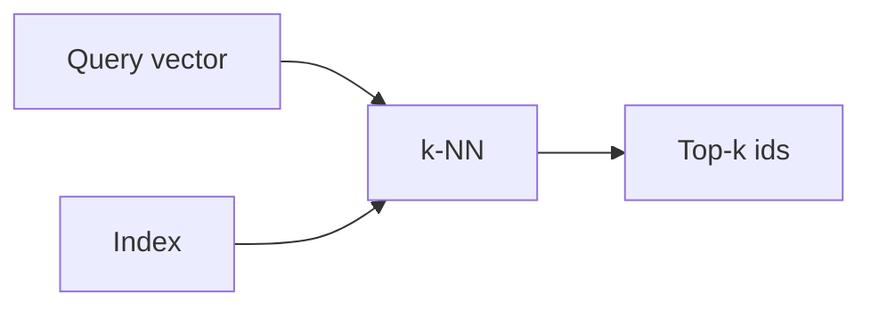

# Bases de datos vectoriales

## Definición

Las bases de datos vectoriales almacenan vectores de alta dimensión (embeddings) y soportan búsqueda rápida por similitud (por ej. k-NN, approximate nearest neighbor). Son the backbone of recuperación in RAG.

They se sitúan entre [embeddings](/docs/rag/embeddings) (que producen los vectores) and the [RAG](/docs/rag) retriever (que necesita los top-k fragmentos). A diferencia de keyword search, they support semantic similarity: “customer support” can igualar “help desk” if the [embedding](/docs/rag/embeddings) model maps them close together. See [RAG architecture](/docs/rag/architecture) for how the index fits into the full pipeline.

## Cómo funciona

Documents are [embedded](/docs/rag/embeddings) and their vectors se escriben en un **index** (por ej. HNSW, IVF, or flat for small datasets). At query time, the **query vector** is compared against the index via **k-NN** (or approximate k-NN for scale); the index returns **top-k ids** (and optionally the vectors or stored metadata). You then fetch the corresponding chunks and pass them to the LLM. Options include Pinecone, Weaviate, Chroma, pgvector, and others; choice depends on scale, latency, and whether you need metadata filtering.

## Casos de uso

Vector stores are used whenever you need fast similarity search over many embeddings (RAG, recommendations, dedup).

- Storing and querying document embeddings for RAG
- Real-time similarity search at scale (por ej. recommendations, dedup)
- Combining vector search with metadata filters (por ej. by date, category)

## Documentación externa

- [Chroma – Get started](https://docs.trychroma.com/getting-started)
- [Pinecone – Vector database docs](https://docs.pinecone.io/)
- [pgvector](https://github.com/pgvector/pgvector) — Vector similarity search in PostgreSQL

## Ver también

- [RAG](/docs/rag)
- [Embeddings](/docs/rag/embeddings)
- [Semantic search](/docs/semantic-search)
