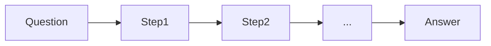

# Cadena de pensamiento (CoT)

## Definición

El prompting de cadena de pensamiento (CoT) pide al modelo que genere pasos intermedios de razonamiento before the final answer. This often improves accuracy on math, logic, and multi-step tasks.

Es one of the simplest [razonamiento patterns](/docs/reasoning-patterns): sin herramientas ni búsqueda, solo prompting. Úselo cuando the task benefits from explicit steps (por ej. arithmetic, deduction) and you want to avoid [fine-tuning](/docs/llms/fine-tuning). For exploring multiple solution paths, see [tree of thoughts](/docs/reasoning-patterns/tot); for tool-using agents, see [ReAct](/docs/reasoning-patterns/react).

## Cómo funciona

You give the model a **question** (or task) and ask it to reason paso a paso. The model produce **Step1**, **Step2**, … (intermediate razonamiento) and then the **answer**. **Zero-shot CoT**: add “Let’s think paso a paso” (or similar) to the prompt. **Few-shot CoT**: include example (question, steps, answer) triples so the model mimics the format. The model generates the sequence in one pass; you can optionally parse the steps and verify or score them. Quality depends on [prompt engineering](/docs/prompt-engineering) and model capability.

## Casos de uso

Chain-of-thought es más útil cuando la tarea se beneficia de pasos intermedios explícitos (matemáticas, lógica, código).

- Math and arithmetic where intermediate steps improve accuracy
- Logic puzzles and multi-step deduction
- Code or diseño razonamiento where showing steps aids debugging

## Documentación externa

- [Chain-of-Thought Prompting (Wei et al.)](https://arxiv.org/abs/2201.11903) — CoT paper
- [OpenAI – Prompt engineering](https://platform.openai.com/docs/guides/prompt-engineering) — Includes razonamiento and step-by-step guidance

## Ver también

- [Tree of thoughts](/docs/reasoning-patterns/tot)
- [Prompt engineering](/docs/prompt-engineering)
