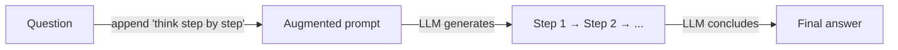
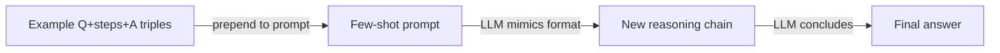

# Cadena de pensamiento (CoT)

## Definición

El prompting de cadena de pensamiento (CoT) pide al modelo que genere pasos intermedios de razonamiento antes de la respuesta final. Esto a menudo mejora la precisión en tareas de matemáticas, lógica y multi-paso al forzar al modelo a hacer su razonamiento explícito en lugar de saltar directamente a una conclusión.

CoT funciona porque los modelos de lenguaje son autorregresivos: cada token generado atiende a los tokens previos. Al generar primero una cadena de pasos de razonamiento, el modelo esencialmente condiciona su respuesta final en un contexto más estructurado y elaborado — reduciendo los errores causados por saltarse pasos o hacer suposiciones implícitas.

Es uno de los [patrones de razonamiento](/docs/reasoning-patterns) más simples: sin herramientas ni búsqueda, solo prompting. Úsalo cuando la tarea se beneficia de pasos explícitos (p. ej. aritmética, deducción) y quieres evitar el [ajuste fino](/docs/llms/fine-tuning). Para explorar múltiples caminos de solución, ver [árbol de pensamientos](/docs/reasoning-patterns/tot); para agentes que usan herramientas, ver [ReAct](/docs/reasoning-patterns/react).

## Cómo funciona

### CoT de cero disparos



### CoT de pocos disparos



Le das al modelo una **pregunta** (o tarea) y le pides que razone paso a paso. El modelo produce **Paso 1**, **Paso 2**, … (razonamiento intermedio) y luego la **respuesta**. **CoT de cero disparos**: añadir "Vamos a pensar paso a paso" (o similar) al prompt — no se necesitan ejemplos. **CoT de pocos disparos**: incluir ejemplos de tripletes (pregunta, pasos, respuesta) para que el modelo imite el formato. El modelo genera la secuencia completa en un paso; opcionalmente puedes parsear los pasos y verificarlos o puntuarlos. La calidad depende de la [ingeniería de prompts](/docs/prompt-engineering) y la capacidad del modelo.

## Cuándo usar / Cuándo NO usar

| Escenario | Usar CoT | No usar CoT |
|---|---|---|
| Aritmética o álgebra en varios pasos | Sí — los pasos intermedios previenen errores de cálculo | No — las matemáticas simples de un solo paso no lo necesitan |
| Deducción lógica o inferencia | Sí — los pasos explícitos hacen el razonamiento auditable | No — las tareas de recuperación de hechos no se benefician |
| Planificación de código o decisiones de diseño | Sí — escribir pasos antes del código reduce errores | No — generar boilerplate desde una plantilla |
| Inferencia de alto volumen y baja latencia | No — los tokens extra aumentan costo y latencia | Sí — evitar para clasificación o extracción simple |
| Modelo con razonamiento incorporado fuerte | Quizás — los modelos más nuevos razonan internamente (o1, o3) | Sí — forzar CoT explícito en modelos de pensamiento añade redundancia |

## Comparaciones

| Criterio | CoT | Auto-consistencia | Prompting de paso atrás |
|---|---|---|---|
| Idea central | Cadena de razonamiento única | Múltiples caminos CoT + votación mayoritaria | Pregunta abstracta primero, luego respuesta |
| Fiabilidad | Moderada — un camino puede errar | Alta — la votación filtra errores | Alta — la abstracción reduce la confusión |
| Costo (llamadas API) | 1 llamada | N llamadas (típicamente 5–20) | 2 llamadas |
| Mejor para | Matemáticas, lógica, tareas multi-paso | Tareas con respuestas verificables | Preguntas complejas con mucho conocimiento |
| Combinabilidad | Independiente o como bloque de construcción | Construye sobre CoT | Construye sobre CoT |

## Pros y contras

| Pros | Contras |
|---|---|
| Simple de implementar — solo ingeniería de prompts | Aumenta la longitud de salida y el costo en tokens |
| No se necesita ajuste fino ni entrenamiento especial | El modelo puede generar pasos plausibles pero incorrectos |
| Hace el razonamiento inspeccionable y depurable | No ayuda con tareas que necesitan información externa |
| Funciona en muchos dominios (matemáticas, lógica, código) | Menor beneficio en modelos pequeños vs. grandes |

## Ejemplos de código

```python
from openai import OpenAI

client = OpenAI()

SYSTEM_PROMPT = (
    "You are a careful reasoning assistant. "
    "When solving problems, always show your reasoning step by step "
    "before giving the final answer."
)

def cot_query(question: str) -> str:
    response = client.chat.completions.create(
        model="gpt-4o-mini",
        messages=[
            {"role": "system", "content": SYSTEM_PROMPT},
            {"role": "user", "content": question},
        ],
    )
    return response.choices[0].message.content

# Few-shot example
FEW_SHOT = """
Q: Roger has 5 tennis balls. He buys 2 more cans of tennis balls. Each can has 3 balls. How many does he have?
A: Roger starts with 5 balls. He buys 2 cans × 3 balls = 6 balls. Total: 5 + 6 = 11 balls.

Q: {question}
A:"""

def few_shot_cot(question: str) -> str:
    response = client.chat.completions.create(
        model="gpt-4o-mini",
        messages=[{"role": "user", "content": FEW_SHOT.format(question=question)}],
    )
    return response.choices[0].message.content

print(cot_query("A store has 40 apples. They sell 15 and receive 3 new shipments of 10. How many are left?"))
```

## Recursos prácticos

- [Chain-of-Thought Prompting (Wei et al.)](https://arxiv.org/abs/2201.11903) — Artículo original que introduce el prompting CoT
- [OpenAI – Prompt engineering](https://platform.openai.com/docs/guides/prompt-engineering) — Incluye guía de razonamiento y paso a paso
- [Self-consistency improves CoT (Wang et al.)](https://arxiv.org/abs/2203.11171) — Votación mayoritaria sobre múltiples caminos CoT para mayor fiabilidad

## Ver también

- [Patrones de razonamiento](/docs/reasoning-patterns)
- [Árbol de pensamientos](/docs/reasoning-patterns/tot)
- [Ingeniería de prompts](/docs/prompt-engineering)
- [Auto-consistencia](/docs/prompt-engineering/self-consistency)
- [Prompting de paso atrás](/docs/prompt-engineering/step-back-prompting)
