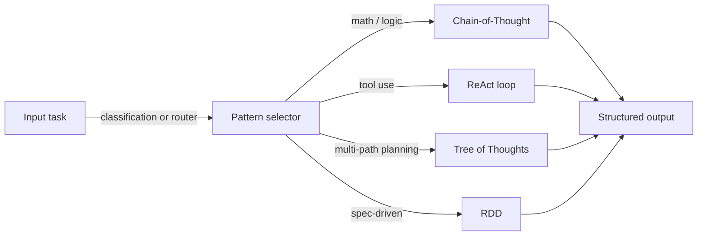
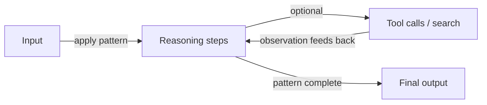

# Patrones de razonamiento

## Definición

Los patrones de razonamiento son formas estructuradas de provocar u organizar el razonamiento del modelo: cadena de pensamiento (paso a paso), árbol de pensamientos (explorar ramas), ReAct (razonar + actuar) y RDD (recuperación-decisión-diseño), entre otros. Usar un patrón claro mejora la **fiabilidad** (razonamiento más consistente) y la **capacidad de depuración** (puedes inspeccionar pasos o acciones).

Se utilizan en [ingeniería de prompts](/docs/prompt-engineering) (p. ej. CoT) y dentro de [agentes](/docs/agents) (p. ej. ReAct, RDD). Sin un patrón de razonamiento, los modelos tienden a producir respuestas planas y desestructuradas que omiten pasos — un patrón de razonamiento actúa como andamio que hace que el proceso de pensamiento del modelo sea explícito, inspeccionable y corregible. Los patrones también se pueden combinar: CoT puede ejecutarse dentro del paso de pensamiento de un agente ReAct, y ToT puede alimentar candidatos a un bucle de decisión RDD.

Elegir un patrón depende de la complejidad de la tarea, el cómputo disponible y si el sistema tiene acceso a herramientas externas o conocimiento. CoT es el punto de partida de menor costo; ReAct añade uso de herramientas; ToT añade búsqueda sobre múltiples rutas; RDD añade cumplimiento basado en especificaciones. La mayoría de los sistemas de producción combinan al menos dos patrones.

## Cómo funciona

### Selección de patrón



### Bucle de razonamiento genérico



Introduces **input** (pregunta, tarea) en un **patrón**: el patrón restringe cómo el modelo razona o actúa (p. ej. "piensa paso a paso", o bucles pensamiento–acción–observación). El modelo produce un **output** (respuesta, secuencia de acciones). Los prompts o el diseño del sistema animan al modelo a mostrar el razonamiento o a intercalar pensamiento y acción. Los patrones se pueden combinar (p. ej. [CoT](/docs/reasoning-patterns/cot) dentro de un bucle de [agente](/docs/agents)). Ver las páginas enlazadas para los detalles de cada patrón.

## Cuándo usar / Cuándo NO usar

| Escenario | Usar patrones de razonamiento | No usar |
|---|---|---|
| Matemáticas, lógica o programación en varios pasos | Sí — CoT mejora la precisión significativamente | No — el prompting de un solo intento a menudo falla en el razonamiento complejo |
| Agentes que usan herramientas | Sí — ReAct estructura cada acción con un pensamiento | No — las llamadas directas a herramientas sin razonamiento aumentan los errores |
| Planificación sobre muchas ramas de solución | Sí — ToT explora y puntúa alternativas | No — CoT es más barato si normalmente hay un camino correcto |
| Tareas que requieren cumplimiento de especificaciones | Sí — RDD hace cumplir las especificaciones recuperadas | No — generación libre para tareas creativas abiertas |
| Búsquedas fácticas simples | No — los patrones de razonamiento añaden costo innecesario | Sí — la recuperación o búsqueda directa es más rápida |

## Comparaciones

| Patrón | Mecanismo central | Costo | Mejor tipo de tarea | Combinable con |
|---|---|---|---|---|
| Chain-of-Thought (CoT) | Pasos de razonamiento secuenciales | Bajo (1 llamada) | Matemáticas, lógica, deducción | ReAct, ToT, RDD |
| Tree of Thoughts (ToT) | Ramificar, puntuar, expandir | Alto (N llamadas) | Planificación, búsqueda, creativo | CoT por rama |
| ReAct | Bucle pensamiento–acción–observación | Medio (1 llamada + herramientas) | Agentes con herramientas | CoT, RDD |
| RDD | Recuperar spec → decidir → generar → validar | Medio–alto | Cumplimiento, gen. basada en spec | ReAct, RAG |

## Pros y contras

| Pros | Contras |
|---|---|
| Hace el razonamiento del modelo explícito e inspeccionable | Añade tokens (costo y latencia) |
| Mejora significativamente la precisión en tareas estructuradas | El patrón de razonamiento incorrecto para la tarea puede perjudicar la calidad |
| Permite la depuración inspeccionando pasos intermedios | No todos los modelos siguen patrones de manera fiable |
| Componible — los patrones se pueden anidar o combinar | Las combinaciones complejas aumentan el esfuerzo de ingeniería de prompts |

## Ejemplos de código

```python
from openai import OpenAI

client = OpenAI()

def chain_of_thought(question: str) -> str:
    """Zero-shot CoT: append 'Let's think step by step' to elicit reasoning."""
    response = client.chat.completions.create(
        model="gpt-4o-mini",
        messages=[
            {
                "role": "user",
                "content": f"{question}\n\nLet's think step by step.",
            }
        ],
    )
    return response.choices[0].message.content

answer = chain_of_thought("If a train travels 60 km/h for 2.5 hours, how far does it go?")
print(answer)
```

## Recursos prácticos

- [Chain-of-Thought Prompting (Wei et al.)](https://arxiv.org/abs/2201.11903) — Artículo CoT original que establece el razonamiento paso a paso
- [ReAct: Synergizing Reasoning and Acting (Yao et al.)](https://arxiv.org/abs/2210.03629) — Artículo ReAct que introduce bucles pensamiento–acción–observación
- [Tree of Thoughts (Yao et al.)](https://arxiv.org/abs/2305.10601) — Artículo ToT sobre razonamiento multi-ruta y búsqueda
- [Anthropic – Prompt engineering overview](https://docs.anthropic.com/en/docs/build-with-claude/prompt-engineering/overview) — Guía práctica sobre CoT y razonamiento estructurado

## Ver también

- [Chain-of-thought](/docs/reasoning-patterns/cot)
- [Tree of thoughts](/docs/reasoning-patterns/tot)
- [ReAct](/docs/reasoning-patterns/react)
- [RDD](/docs/reasoning-patterns/rdd)
