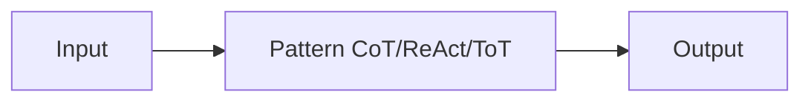

# Patrones de razonamiento

## Definición

Los patrones de razonamiento son formas estructuradas de provocar u organizar el razonamiento del modelo: chain-of-thought (step-by-step), tree-of-thoughts (explore branches), ReAct (reason + act), and RDD (recuperación-decisión-diseño), among others. Using a clear pattern improves **reliability** (more consistent razonamiento) and **debuggability** (you can inspect steps or actions).

Son used in [prompt engineering](/docs/prompt-engineering) (por ej. CoT) and inside [agents](/docs/agents) (por ej. ReAct, RDD). Choosing a pattern depends on the task: CoT for math/razonamiento, ReAct for tool use, ToT for search/planning, RDD for spec compliance.

## Cómo funciona

You feed **input** (question, task) into a **pattern**: the pattern constrains how the model reasons or acts (por ej. “think paso a paso”, or thought–action–observation loops). The model produce an **output** (answer, action sequence). Prompts or system diseño encourage the model to show razonamiento (por ej. “Think paso a paso”) or to interleave thought and action. Patterns can be combined (por ej. [CoT](/docs/reasoning-patterns/cot) inside an [agent](/docs/agents) loop). See the linked pages for each pattern’s details.

## Casos de uso

Different patterns suit different needs: CoT for stepwise razonamiento, ReAct for tool use, ToT for search and planning.

- CoT: math, logic, and multi-step razonamiento tasks
- ReAct: tool-using agents that reason before each action
- ToT: search and planning over multiple solution branches

## Documentación externa

- [Chain-of-Thought Prompting (Wei et al.)](https://arxiv.org/abs/2201.11903) — CoT paper
- [ReAct: Synergizing Reasoning and Acting (Yao et al.)](https://arxiv.org/abs/2210.03629) — ReAct paper
- [Tree of Thoughts (Yao et al.)](https://arxiv.org/abs/2305.10601) — ToT paper

## Ver también

- [Chain-of-thought](/docs/reasoning-patterns/cot)
- [Tree of thoughts](/docs/reasoning-patterns/tot)
- [ReAct](/docs/reasoning-patterns/react)
- [RDD](/docs/reasoning-patterns/rdd)
