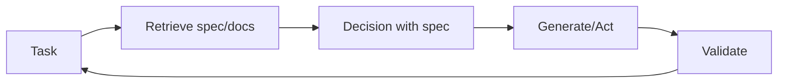

# Recuperación-decisión-diseño (RDD)

## Definición

**RDD (recuperación-decisión-diseño)** es un patrón de razonamiento that ties together **recuperación** (obtención de especificaciones, documentos o ejemplos relevantes), **decisión** (making choices aligned with specs or policies), and **diseño** (producing outputs that satisfy requirements). Es often used in spec-driven development: behavior is guided by explicit specifications that are retrieved and enforced during generation.

## Cómo funciona

1. **Retrieval:** Given the current task, retrieve relevant specification fragments, examples, or constraints (por ej. from a vector store or structured specs).
2. **Decision:** Use the retrieved context to decide next steps, allowed actions, or output format.
3. **Diseño:** Generar o ejecutar de acuerdo con la especificación; opcionalmente validar salidas contra la especificación.

Esto puede implementarse en un bucle de [agente](/docs/agents): recuperar especificación → razonar con la especificación en contexto → actuar o generar → validate → repeat. El diagrama a continuación muestra the cycle: **task** triggers **retrieve**; retrieved spec feeds **decisión**; **generate/act** produce output; **validate** checks against the spec and can loop back to the task (por ej. retry or refine).

## Casos de uso

RDD is a fit when outputs must align with retrievable specs (compliance, policy, or documented requirements).

- Spec-driven agents that retrieve requirements and validate outputs
- Compliance and policy-aware generation (por ej. legal, safety)
- Code or config generation aligned with documented specs

## Ventajas y desventajas

| Pros | Cons |
|------|------|
| Outputs align with specs | Requires good spec coverage and recuperación |
| Reduces drift and ad-hoc behavior | Extra recuperación and validation cost |
| Fits regulated or safety-critical flows | Spec diseño and maintenance overhead |

## Documentación externa

- [RAG paper (Lewis et al.)](https://arxiv.org/abs/2005.11401) — Retrieval component used in RDD
- [LangChain – Agents and tools](https://python.langchain.com/docs/concepts/agents/) — Orchestration patterns

## Ver también

- [Spec-driven development](/docs/spec-driven-development)
- [RAG](/docs/rag)
- [Agents](/docs/agents)
- [ReAct](/docs/reasoning-patterns/react)
