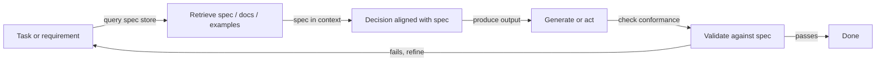
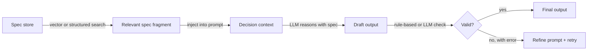

# Recuperación-decisión-diseño (RDD)

## Definición

**RDD (recuperación-decisión-diseño)** es un patrón de razonamiento que une **recuperación** (obtención de especificaciones, documentos o ejemplos relevantes), **decisión** (toma de decisiones alineadas con especificaciones o políticas) y **diseño** (producción de salidas que satisfacen requisitos). A menudo se usa en el desarrollo basado en especificaciones: el comportamiento es guiado por especificaciones explícitas que se recuperan y se aplican durante la generación.

A diferencia de [CoT](/docs/reasoning-patterns/cot), que genera razonamiento desde el conocimiento interno del modelo, o [ReAct](/docs/reasoning-patterns/react), que intercala razonamiento con llamadas arbitrarias a herramientas, RDD restringe cada decisión contra una fuente de verdad recuperada. Esto lo hace especialmente adecuado para dominios regulados (legal, compliance, seguridad) o flujos de trabajo de ingeniería donde el código o las configuraciones deben conformarse con las especificaciones documentadas.

RDD puede implementarse como una pipeline de un solo paso (recuperar → decidir → generar → validar) o como un bucle dentro de un [agente](/docs/agents), donde la validación fallida desencadena la re-recuperación y el refinamiento. El patrón es componible: el paso de recuperación de RDD puede ser impulsado por una pipeline [RAG](/docs/rag), y su bucle de agente puede usar [ReAct](/docs/reasoning-patterns/react) para el razonamiento a nivel de paso.

## Cómo funciona

### Ciclo RDD



### Pasos en detalle



1. **Recuperación:** Dada la tarea actual, recuperar fragmentos de especificación relevantes, ejemplos o restricciones (p. ej. desde un almacén vectorial o especificaciones estructuradas).
2. **Decisión:** Usar el contexto recuperado para decidir los próximos pasos, las acciones permitidas o el formato de salida — la especificación siempre está en contexto durante el razonamiento.
3. **Diseño:** Generar o ejecutar en línea con la especificación; opcionalmente validar las salidas contra la especificación antes de devolver.

Esto puede implementarse en un bucle de [agente](/docs/agents): recuperar especificación → razonar con la especificación en contexto → actuar o generar → validar → repetir. La validación fallida desencadena la re-recuperación (posiblemente con una consulta diferente) o el refinamiento del prompt.

## Cuándo usar / Cuándo NO usar

| Escenario | Usar RDD | No usar RDD |
|---|---|---|
| Generar código que debe conformarse a una especificación de API | Sí — recuperar la spec, generar, validar | No — codificación libre sin restricciones formales |
| Generación de documentos impulsada por cumplimiento | Sí — recuperar política, generar salida alineada | No — escritura creativa sin reglas estrictas |
| Agentes operando en dominios regulados (legal, seguridad) | Sí — cada decisión está fundamentada en la política recuperada | No — Q&A casual sin requisitos de cumplimiento |
| Ingeniería con documentos de diseño versionados | Sí — las specs cambian; RDD siempre recupera la más reciente | No — CRUD simple sin especificación formal |
| Inferencia en tiempo real con presupuestos de latencia ajustados | No — la recuperación + validación agrega latencia | Sí — la generación directa es más rápida para tareas sin restricciones |

## Comparaciones

| Patrón | Usa conocimiento recuperado | Valida salida | Basado en spec | Mejor para |
|---|---|---|---|---|
| CoT | No (conocimiento interno del modelo) | No | No | Matemáticas, lógica |
| ReAct | Via llamadas a herramientas | No | No | Agentes de uso general con herramientas |
| RAG | Sí (documentos) | No | No | Q&A de conocimiento |
| RDD | Sí (specs y documentos) | Sí | Sí | Cumplimiento, generación basada en spec |

## Pros y contras

| Pros | Contras |
|---|---|
| Las salidas se alinean con las specs explícitamente recuperadas | Requiere un almacén de specs bien mantenido y consultable |
| Reduce la deriva y el comportamiento ad-hoc | La recuperación extra y la validación agregan costo y latencia |
| Rastro de auditoría: los fragmentos de spec son rastreables en la salida | Las brechas en la cobertura de la spec llevan a decisiones sin suficientes restricciones |
| Componible con RAG y ReAct | El diseño y mantenimiento de specs es su propia carga de trabajo continua |
| Se adapta a flujos regulados o de seguridad crítica | La lógica de validación debe mantenerse sincronizada con las actualizaciones de la spec |

## Ejemplos de código

```python
from openai import OpenAI
from langchain_community.vectorstores import Chroma
from langchain_openai import OpenAIEmbeddings

client = OpenAI()
# Assume a Chroma vector store pre-loaded with spec fragments
spec_store = Chroma(
    collection_name="api_spec",
    embedding_function=OpenAIEmbeddings(),
)

def rdd_generate(task: str) -> str:
    # 1. Retrieve relevant spec fragments
    spec_docs = spec_store.similarity_search(task, k=3)
    spec_context = "\n\n".join(d.page_content for d in spec_docs)

    # 2. Decision + Design: generate with spec in context
    prompt = (
        f"You must follow the specifications below exactly.\n\n"
        f"SPECIFICATIONS:\n{spec_context}\n\n"
        f"TASK: {task}\n\n"
        f"Generate an output that strictly complies with the specifications."
    )
    response = client.chat.completions.create(
        model="gpt-4o-mini",
        messages=[{"role": "user", "content": prompt}],
    )
    draft = response.choices[0].message.content

    # 3. Validate (simple: ask model to check conformance)
    validation_prompt = (
        f"Check if the following output complies with the spec. "
        f"Reply with PASS or FAIL and a brief reason.\n\n"
        f"SPEC:\n{spec_context}\n\nOUTPUT:\n{draft}"
    )
    validation = client.chat.completions.create(
        model="gpt-4o-mini",
        messages=[{"role": "user", "content": validation_prompt}],
    ).choices[0].message.content

    if "FAIL" in validation.upper():
        return f"[Validation failed: {validation}]\nDraft:\n{draft}"
    return draft

result = rdd_generate("Generate a JSON API request to create a new user.")
print(result)
```

## Recursos prácticos

- [RAG paper (Lewis et al.)](https://arxiv.org/abs/2005.11401) — Componente de recuperación usado como base para el paso de recuperación de specs de RDD
- [LangChain – Agents and tools](https://python.langchain.com/docs/concepts/agents/) — Patrones de orquestación para construir bucles estilo RDD
- [Constitutional AI (Anthropic)](https://arxiv.org/abs/2212.08073) — Idea relacionada: usar principios recuperados para guiar y validar las salidas del modelo

## Ver también

- [Desarrollo basado en especificaciones](/docs/spec-driven-development)
- [RAG](/docs/rag)
- [Agentes](/docs/agents)
- [ReAct](/docs/reasoning-patterns/react)
